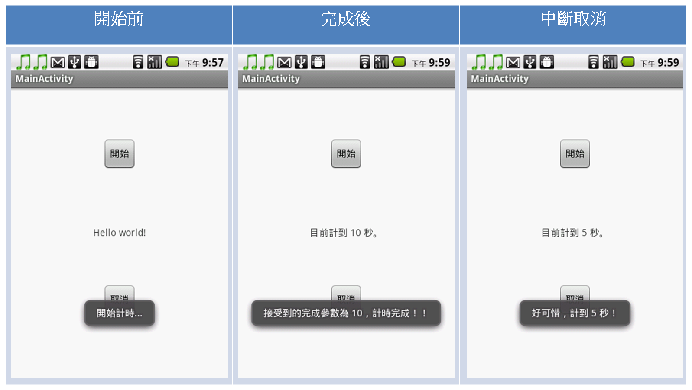

# [轉] Android 非同步任務 - AsyncTask

本篇來介紹"非同步任務" - AsyncTask，我個人認為他比 Thread 配合 Handler 好用很多，因為他已經幫我們定義好方法，讓我們再處理前、後、中都可以去更新 UI 介面，而且也定義在各狀態下傳送資料的參數。 如果能夠好好的使用 AsyncTask，可以讓我們程式的可讀性增加，也更好管理。 首先，我們先介紹他的架構，如下：
```
class GoodTask extends AsyncTask<Void, Integer, String> {
                // <傳入參數, 處理中更新介面參數, 處理後傳出參數>
    @Override
    protected String doInBackground(Void... arg0) {
        // TODO Auto-generated method stub

        // 再背景中處理的耗時工作

        return null; // 會傳給 onPostExecute(String result) 的 String result
    }

    @Override
    protected void onPreExecute() {
        // TODO Auto-generated method stub
        super.onPreExecute();

        // 背景工作處理"前"需作的事
    }

    @Override
    protected void onProgressUpdate(Integer... values) {
        // TODO Auto-generated method stub
        super.onProgressUpdate(values);

        // 背景工作處理"中"更新的事
    }

    @Override
    protected void onPostExecute(String result) {
        // TODO Auto-generated method stub
        super.onPostExecute(result);

        // 背景工作處理完"後"需作的事
    }

    @Override
    protected void onCancelled() {
        // TODO Auto-generated method stub
        super.onCancelled();

        // 背景工作被"取消"時作的事，此時不作 onPostExecute(String result)
    }
}
```

先看到 AsyncTask<Void, Integer, String>，將它想成"前"、"中"、"後"需要用到的參數而 Void 就代表不用輸入參數，待會再舉個例子，接下我們依照執行的順序排列在下方來一一介紹。
onPreExecute()：處理前的動作，例如初始化某些參數或是顯示提示告訴使用者。
doInBackground(Void... arg0)：實際背景處理的工作。
onProgressUpdate(Integer... values)：處理過程中需要更新的動作，例如下載進度，在 doInBackground(Void... arg0) 中調用的方法為 publishProgress(values)，其中參數 values 為整數陣列。
onPostExecute(String result)：處理完的動作，例如提示使用者完成的訊息，或是更新介面。
onCancelled()：當被取消時需要作的事，例如提示使用者任務取消，並更新介面。
那我們就來寫一個計算到 10 的計時器，但在開始算時要告訴使用者開始算了，再算的中途需要顯示目前算到幾秒，如果順利算到 10，我們就顯事任務完成，如果被取消中斷，我們就顯示好可惜，數到幾秒。
首先我們的介面設計一個顯示秒數的 TextView 及開始與取消任務的 Button。
```
<RelativeLayout xmlns:android="http://schemas.android.com/apk/res/android"
    xmlns:tools="http://schemas.android.com/tools"
    android:layout_width="fill_parent"
    android:layout_height="fill_parent" >

    <TextView
        android:id="@+id/txtCount"
        android:layout_width="wrap_content"
        android:layout_height="wrap_content"
        android:layout_centerHorizontal="true"
        android:layout_centerVertical="true"
        android:padding="@dimen/padding_medium"
        android:text="@string/hello_world"
        tools:context=".MainActivity" />

    <Button
        android:id="@+id/btnCancel"
        android:layout_width="wrap_content"
        android:layout_height="wrap_content"
        android:layout_below="@+id/txtCount"
        android:layout_centerHorizontal="true"
        android:layout_marginTop="60dp"
        android:text="取消" />

    <Button
        android:id="@+id/btnStart"
        android:layout_width="wrap_content"
        android:layout_height="wrap_content"
        android:layout_above="@+id/txtCount"
        android:layout_centerHorizontal="true"
        android:layout_marginBottom="73dp"
        android:text="開始" />

</RelativeLayout>
```

接下來的非同步任務就如下：
```
class GoodTask extends AsyncTask<Integer, Integer, String> {
                // <傳入參數, 處理中更新介面參數, 處理後傳出參數>
    int nowCount;
    @Override
    protected String doInBackground(Integer... countTo) {
        // TODO Auto-generated method stub
        // 再背景中處理的耗時工作
        try {
            for (int i = 0; i < countTo[0]; i++) {
                Thread.sleep(1000);

                nowCount = i + 1;
                publishProgress(nowCount);
            }
        } catch (Exception e) {
            e.printStackTrace();
        }
        return "10";
    }

    @Override
    protected void onPreExecute() {
        // TODO Auto-generated method stub
        super.onPreExecute();
        // 背景工作處理"前"需作的事
        Toast.makeText(getApplicationContext(),
        "開始計時...", Toast.LENGTH_SHORT).show();
    }

    @Override
    protected void onProgressUpdate(Integer... values) {
        // TODO Auto-generated method stub
        super.onProgressUpdate(values);
        // 背景工作處理"中"更新的事
        txtCount.setText("目前計到 " + values[0] + " 秒。");
    }

    @Override
    protected void onPostExecute(String result) {
        // TODO Auto-generated method stub
        super.onPostExecute(result);
        // 背景工作處理完"後"需作的事
        Toast.makeText(getApplicationContext(),
        "接受到的完成參數為 "+ result + "，計時完成！！", Toast.LENGTH_SHORT).show();
    }

    @Override
    protected void onCancelled() {
        // TODO Auto-generated method stub
        super.onCancelled();
        // 背景工作被"取消"時作的事，此時不作 onPostExecute(String result)
        Toast.makeText(getApplicationContext(),
        "好可惜，計到 " + nowCount + " 秒！",  Toast.LENGTH_SHORT).show();
    }
}
```
而針對介面我們在 onCreate() 撰寫如下：

```
@Override
public void onCreate(Bundle savedInstanceState) {
    super.onCreate(savedInstanceState);
    setContentView(R.layout.activity_main);

    txtCount = (TextView) findViewById(R.id.txtCount);
    btnCancel = (Button) findViewById(R.id.btnCancel);
    btnStart = (Button) findViewById(R.id.btnStart);

    btnStart.setOnClickListener(new OnClickListener() {
        public void onClick(View v) {
            // TODO Auto-generated method stub
            if (goodTask == null) {
                goodTask = new GoodTask();
                goodTask.execute(10);
            } else {
                if (goodTask.isCancelled()
                    || goodTask.getStatus().equals(AsyncTask.Status.FINISHED)) {
                    goodTask = new GoodTask();
                    goodTask.execute(10);
                }
            }
        }
   });

   btnCancel.setOnClickListener(new OnClickListener() {
       public void onClick(View v) {
           // TODO Auto-generated method stub
           if (goodTask != null) {
               if (!goodTask.isCancelled()
                   && goodTask.getStatus().equals(AsyncTask.Status.RUNNING)) {
                   goodTask.cancel(true);
               }
           }
       }
   });
}
```

可以留意再重新啟動時我都會檢查任務是否在執行中，因為我們不想有一大堆相同任務在執行，這將會造成混亂，而且我們在任務管理上也會造成不便。結果如下：
附上原始碼：http://webhd.xuite.net/_oops/u93240xx/28i



Ref : http://andcooker.blogspot.tw/2012/08/android-asynctask.html
