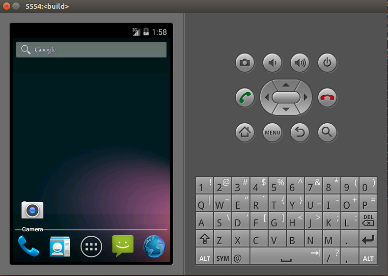
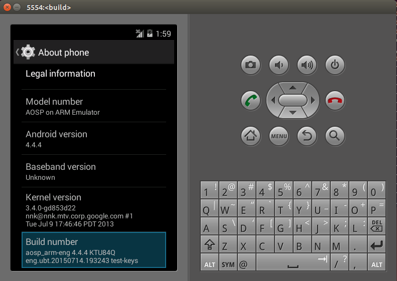

# 自己動手編譯android源碼


最近嘗試編譯android源碼，中間遇到一些問題，記錄一下。


0x01:

編譯之前，強烈建議先看看google的[官方文檔]，哪怕是使用翻譯工具也要看完。

其中提到的編譯環境是Ubuntu LTS (14.04)，check源碼需要100g空間，編譯一個版本需要150g空間，那麼我們建立虛擬機的時候就要滿足這些要求。

下面按照官方文檔的要求來操作。


0x02: 初始化環境

先考慮清楚你要編譯的版本，然後根據版本要求去配置環境，我選擇的是4.4.4的。

第一步：安裝jdk
```
Java 7: For the latest version of Android
Java 6: for Gingerbread through KitKat
Java 5: for Cupcake through Froyo
```
我是4.4.4（KitKat），所以安裝java6就好。

目前ubuntu已經不支持命令行安裝jdk了，故不採用google的文檔，自己去oracle的官網下載安裝包，我下載的是：jdk-6u45-linux-x64.bin

將文件copy到虛擬機的 /usr/lib/jvm/java 目錄，執行如下命令安裝：
```
sudo chmod u+x /usr/lib/jvm/java/jdk1.6.5_45.bin
/usr/lib/jvm/java/jdk1.6.5_45.bin
```

安裝完畢後在同級目錄下會產生jdk1.6.5xxx文件夾，下面配置環境變量：
```
gedit ~/.bashrc
```
在最下面添加：
```
JAVA_HOME=/usr/lib/jvm/java/jdk1.6.0_45
PATH=$PATH:${JAVA_HOME}/bin
CLASSPATH=$CLASSPATH:${JAVA_HOME}/lib
```
保存後執行：

source ~/.bashrc
然後運行：
```
java -version
```
輸出：
```
java version "1.6.0_45"
Java(TM) SE Runtime Environment (build 1.6.0_45-b06)
Java HotSpot(TM) 64-Bit Server VM (build 20.45-b01, mixed mode)
```
安裝成功。


第二步：安裝依賴包

按照官方文檔執行：
```
sudo apt-get install bison g++-multilib git gperf libxml2-utils make python-networkx zlib1g-dev:i386 zip
```
報錯：
```
g++-multilib : Depends: gcc-multilib (>= 4:4.8.2-1ubuntu6) but it is not going to be installed
```
是安裝包依賴問題，用如下分別安裝方式解決：
```
sudo apt-get install gcc
sudo apt-get install g++-multilib
sudo apt-get install git gnupg flex bison gperf build-essential zip curl libc6-dev libncurses5-dev:i386 libreadline6-dev:i386 g++-multilib mingw32 tofrodos python-markdown libxml2-utils xsltproc zlib1g-dev:i386 dpkg-dev
sudo apt-get install lzop
sudo apt-get install keychain
```
分別安裝後，再執官方文檔的命令，看看是否有遺漏：
```
sudo apt-get install bison g++-multilib git gperf libxml2-utils make python-networkx zlib1g-dev:i386 zip
```
此時應該能夠順利安裝完成。


官方文檔還有很多其他配置，可以參考著配置，我沒有再去配置其他。


0x03:下載源碼

這一步沒有啥好說的，按照[官方文檔]操作即可，其中我指定了下載android-4.4.4_r2：
```
repo init -u https://android.googlesource.com/platform/manifest -b android-4.4.4_r2
```


0x04:開始編譯

這一步也沒啥好說的，按照[官方文檔]操作即可。其中遇到make版本過高問題：
```
You are using version 4.0 of make.  Android can only be built by versions 3.81 and 3.82.
```
沒辦法，只能降級回來了，先remove掉4.0的make:

sudo apt-get remove make
從[這裡]去下載3.81的make安裝包,我下載是i386的deb包。

下載後執行命令安裝：
```
sudo dpkg -i make*.deb
```


最後執行:
```
make -j16
```
時，報如下錯：
```
android source Error: open CFI at the end of file; missing .cfi_endproc directive
```

改為執行：
```
make -j4
```


經過漫長的等待後，終於編譯成功：
```
Creating filesystem with parameters:
    Size: 576716800
    Block size: 4096
    Blocks per group: 32768
    Inodes per group: 7040
    Inode size: 256
    Journal blocks: 2200
    Label:
    Blocks: 140800
    Block groups: 5
    Reserved block group size: 39
Created filesystem with 1277/35200 inodes and 82233/140800 blocks
+ '[' 0 -ne 0 ']'
Install system fs image: out/target/product/generic/system.img
out/target/product/generic/system.img+ maxsize=588791808 blocksize=2112 total=576716800 reserve=5947392
```

題外話：

在第一次嘗試編譯時，報了磁盤不足，一開始以為是虛擬機空間不足（150g）,後面發現原來是主機的空間不足了。於是刪掉一些文件騰出空間後再嘗試編譯就成功了。最後虛擬機的磁盤使用情況如下：
```
Filesystem      Size  Used Avail Use% Mounted on
/dev/sda1       146G   76G   63G  55% /
none            4.0K     0  4.0K   0% /sys/fs/cgroup
udev            2.0G  4.0K  2.0G   1% /dev
tmpfs           394M  1.5M  393M   1% /run
none            5.0M     0  5.0M   0% /run/lock
none            2.0G  152K  2.0G   1% /run/shm
none            100M   60K  100M   1% /run/user
.host:/         183G  132G   51G  73% /mnt/hgfs
```
因此150g就足夠了。


0x05：運行編譯結果

在編譯的時候，默認輸出在out目錄下，編譯出來的幾個重要img文件如下：
```
$ ll out/target/product/generic/

total 575144
drwxrwxr-x 10 ubt ubt      4096 Jul 14 22:19 ./
drwxrwxr-x  3 ubt ubt      4096 Jul 14 19:33 ../
-rw-rw-r--  1 ubt ubt         7 Jul 14 19:38 android-info.txt
drwxrwxr-x  2 ubt ubt      4096 Jul 14 20:46 cache/
-rw-r--r--  1 ubt ubt  69206016 Jul 14 20:46 cache.img            //cache
-rw-rw-r--  1 ubt ubt     40349 Jul 14 19:33 clean_steps.mk
drwxrwxr-x  4 ubt ubt      4096 Jul 14 21:28 data/
drwxrwxr-x  3 ubt ubt      4096 Jul 14 20:51 dex_bootjars/
drwxrwxr-x  2 ubt ubt      4096 Jul 14 22:18 fake_packages/
-rw-rw-r--  1 ubt ubt     59052 Jul 14 22:19 installed-files.txt
drwxrwxr-x 14 ubt ubt      4096 Jul 14 22:19 obj/
-rw-rw-r--  1 ubt ubt       671 Jul 14 19:33 previous_build_config.mk
-rw-rw-r--  1 ubt ubt    322856 Jul 14 21:23 ramdisk.img         //ramdisk
drwxrwxr-x  8 ubt ubt      4096 Jul 14 21:23 root/
drwxrwxr-x  5 ubt ubt      4096 Jul 14 21:25 symbols/
drwxrwxr-x 13 ubt ubt      4096 Jul 14 21:42 system/
-rw-r--r--  1 ubt ubt 576716800 Jul 14 22:19 system.img         //system
-rw-r--r--  1 ubt ubt 209715200 Jul 14 21:39 userdata.img       //userdata
```
編譯結果中也包含了模擬器的執行腳本：
```
$ which emulator
  ~/AOSP/android-4.4.4_r2/out/host/linux-x86/bin/emulator
```
注意：假如你不是在編譯後就執行emulator而是重啟虛擬機後再執行的話，可能會報：

```
emulator: command not found
```
此時只要重新執行如下命令即可：
```
source build/envsetup.sh
lunch aosp_arm-eng
```
之後直接在命令行輸入emulator,即可使用前面編譯出來的img文件啟動模擬器（linux內核文件使用的是 prebuilts/qemu-kernel/arm/kernel-qemu），看看模擬器的運行結果：





這裡特意指出linux內核文件是使用AOSP的prebuilts目錄下已有的，即表示linux內核文件並不是在上面編譯出來的。下面會有[另外一篇文章]講述如何編譯linux內核文件。


至此，android源碼的編譯和運行算是差不多了，剩下的就是在這個基礎上，加入自己的代碼，再編譯再運行來深入瞭解android了。
