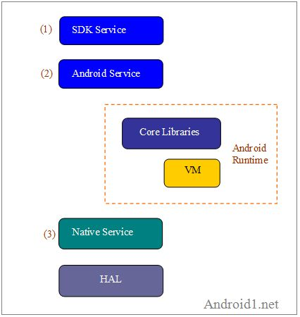
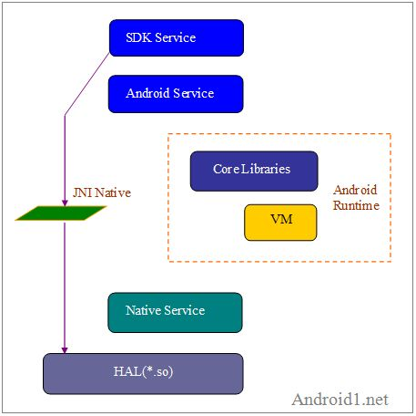
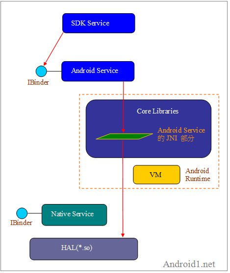

# Android Service與Native Service
### 前言

到底甚麼是Android Service呢? 幾乎人人所談都不盡相同。有人依據Java的套件而分，例如Android 2.1裡，SensorService.java和ActivityManagerService.java屬於不同的套件，有人說SensorService是一項Android Service；而ActivityManagerService則不是。另有人說兩者都屬於Android Service。本文就從HAL的角度來看Android Service與其他相關模組的關係，例如Android Service與JNI之關係。從這些關係裡，更能深刻掌握Android Service的定位和角色。

### 三種服務

只要一談到Android Service，幾乎人人所談都不盡相同了。更不用說又加上SDK Service了。例如，Android 專家Jollen寫道：

**
Android的Service分為二種：Android Service與Native Service**

### Android Service

AndroidService又稱為Java Service，是實作在框架層（framework）裡的「Server」。這裡所講的「Service」是System Service，又稱為Server，與應用程式設計上所討論的Service（android.app.Service）不同。Android Service以Java撰寫。

### Native Service
NativeService則是實作在Runtime層裡的Server。架構設計上，我們有二個選擇，一個是實作Android Service、再透過JNI與HAL stub溝通；另一個選擇是，跳過Android Service，讓Application（Manager API）直接與Native Service溝通。”

Jollen在這段話裡，明顯地提到兩種服務：Android Service和Native Service。然而，他又提到：“與應用程式設計上所討論的Service（android.app.Service）不同。”這種android.app.Service就是一般通稱的APP Service或SDK Service了。所以Jollen提到三種服務：1)SDK Service、2)Android Service和3)Native Service。其關係如下圖：

圖1、三種Service

### Ａndroid Service與　JNI等元素之關係
那麼，這些元素之間又有何關係呢? Jollen在其文章裡，寫道：

“採取Service架構的方式，是建議的做法，當然因為這是標準架構，也應該採用。

Service在Android框架裡的角色是「存取底層硬體」，往上層的話，可以和應用程式溝通。因此，採用標準的Service做法，好處是在資料存取（datacommunication）的處理較為系統化。這方面，Android提供了標準的處理架構，後續再進行討論。圖上的「corelibraries」即是Service程式碼的實作，也就是，Android應用程式透過JNI（Dalvik）來到Service這一層，再透過Service載入*.so檔；而非標準做法則是讓應用程式直接透過JNI來載入*.so檔。”

### 非標準做法
其中，非標準做法：讓應用程式直接透過JNI來載入*.so檔。其架構如下圖：

圖2、非標準做法
非標準做法也是可(執)行的途徑之一。

### 標準做法
至於Jollen所說的標準做法：
“Android應用程式透過JNI（Dalvik）來到Service這一層，再透過Service載入*.so檔；”
其架構如下圖：

圖3、標準做法

### Ｎative做法
以上兩種做法，都是可行的。此外，還有另一種更具彈性的做法，就是採取Native Service途徑。就如Jollen最近（2011/1/3）更進一步說明Native Service扮演更重要的角色：

“近期在進行 Android 2.3 的新框架程式碼研究，Android 2.3 在 Platform (Framework) 部份包含了許多重大的更新，其中一個部份就是 SensorService 改寫成 Native Service 形式。在 Android 2.2 以前的框架，SensorService 包含在 SystemServer 裡，實務上，可能也會對 SensorService 做小幅度改寫，以增進效能，或是將 SensorService 獨立成為一個 process。

在 Android2.3 裡的 SystemServer 已經找不到 SensorService 了，這個重要的 Android Service 被改寫成 Native Service。「如何將 AndroidService 改寫為 Native Service」，以及「Native Service」的開發，從 Android 2.3 開始，將成為重量級主題。由於本週即將進行「Android HAL & Framework: 軟硬整合實作訓練」課程，利用元旦假期，也順利完成課程以及教材的更新，將開始著重 Native Service 的講解，並透過實例解說 Native Service 的開發。”

將Java的SensorService 改寫成C++的 Native Service 形式，其新的架構將更改如下圖：

圖4、Native Service做法
此種Native Service做法並不是新做法，其實自從Android問市以來，MediaPlayerService和CameraService等即是採取Native Service做法了。無論哪一種做法，JNI Native Code都扮演重要角色

