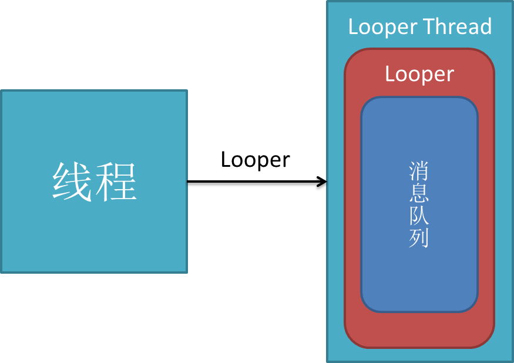
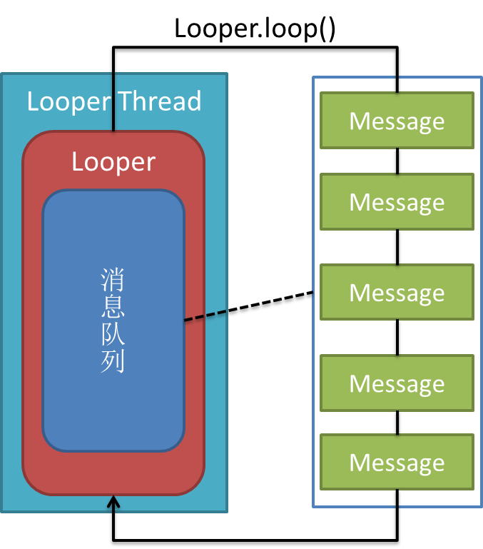
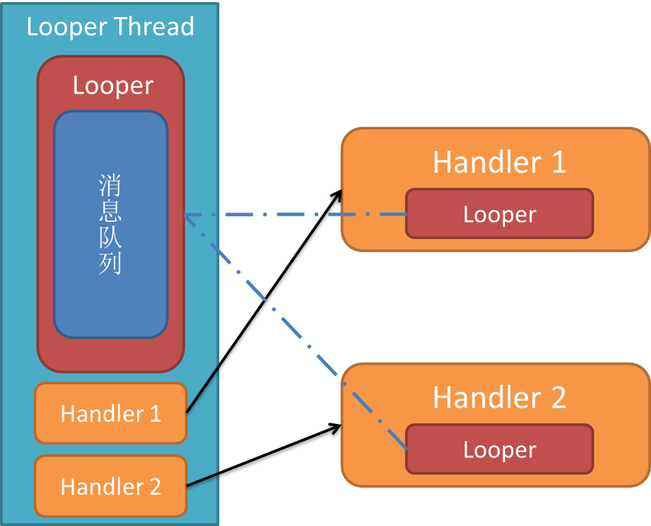
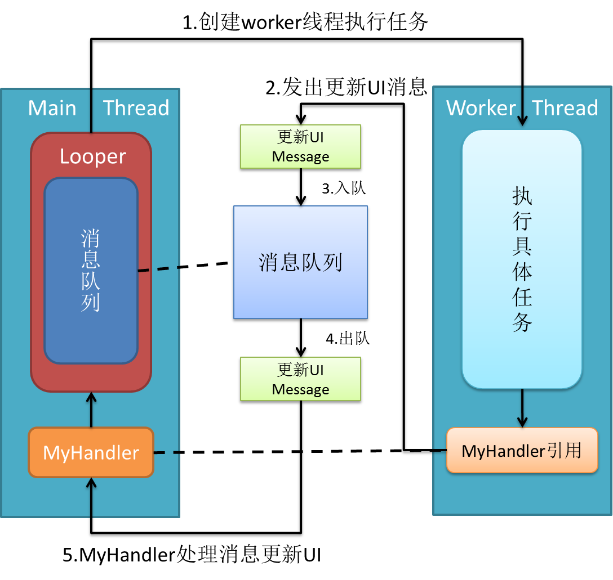

# android的消息處理機制（圖+源碼分析）——Looper,Handler,Message


作為一個大三的預備程序員，我學習android的一大樂趣是可以通過源碼學習google大牛們的設計思想。android源碼中包含了大量的設計模式，除此以外，android sdk還精心為我們設計了各種helper類，對於和我一樣渴望水平得到進階的人來說，都太值得一讀了。這不，前幾天為了瞭解android的消息處理機制，我看了**Looper，Handler，Message**這幾個類的源碼，結果又一次被googler的設計震撼了，特與大家分享。

android的消息處理有三個核心類：Looper,Handler和Message。其實還有一個Message Queue（消息隊列），但是MQ被封裝到Looper裡面了，我們不會直接與MQ打交道，因此我沒將其作為核心類。下面一一介紹：

### 線程的魔法師 Looper

Looper的字面意思是「循環者」，它被設計用來使一個普通線程變成**Looper線程**。所謂Looper線程就是循環工作的線程。在程序開發中（尤其是GUI開發中），我們經常會需要一個線程不斷循環，一旦有新任務則執行，執行完繼續等待下一個任務，這就是Looper線程。使用Looper類創建Looper線程很簡單：

```
public class LooperThread extends Thread {
    @Override
    public void run() {
        // 將當前線程初始化為Looper線程
        Looper.prepare();

        // ...其他處理，如實例化handler

        // 開始循環處理消息隊列
        Looper.loop();
    }
}
```

通過上面兩行核心代碼，你的線程就升級為Looper線程了！！！是不是很神奇？讓我們放慢鏡頭，看看這兩行代碼各自做了什麼。

1) Looper.prepare()



通過上圖可以看到，現在你的線程中有一個Looper對象，它的內部

```
public class Looper {
    // 每個線程中的Looper對象其實是一個ThreadLocal，即線程本地存儲(TLS)對象
    private static final ThreadLocal sThreadLocal = new ThreadLocal();
    // Looper內的消息隊列
    final MessageQueue mQueue;
    // 當前線程
    Thread mThread;
    // 。。。其他屬性

    // 每個Looper對象中有它的消息隊列，和它所屬的線程
    private Looper() {
        mQueue = new MessageQueue();
        mRun = true;
        mThread = Thread.currentThread();
    }

    // 我們調用該方法會在調用線程的TLS中創建Looper對象
    public static final void prepare() {
        if (sThreadLocal.get() != null) {
            // 試圖在有Looper的線程中再次創建Looper將拋出異常
            throw new RuntimeException("Only one Looper may be created per thread");
        }
        sThreadLocal.set(new Looper());
    }
    // 其他方法
}
```

通過源碼，prepare()背後的工作方式一目瞭然，其核心就是將looper對象定義為ThreadLocal。如果你還不清楚什麼是ThreadLocal，請參考《理解ThreadLocal》。

2）Looper.loop()


調用loop方法後，Looper線程就開始真正工作了，它不斷從自己的MQ中取出隊頭的消息(也叫任務)執行。其源碼分析如下：

```
public static final void loop() {
        Looper me = myLooper();  //得到當前線程Looper
        MessageQueue queue = me.mQueue;  //得到當前looper的MQ

        // 這兩行沒看懂= = 不過不影響理解
        Binder.clearCallingIdentity();
        final long ident = Binder.clearCallingIdentity();
        // 開始循環
        while (true) {
            Message msg = queue.next(); // 取出message
            if (msg != null) {
                if (msg.target == null) {
                    // message沒有target為結束信號，退出循環
                    return;
                }
                // 日誌。。。
                if (me.mLogging!= null) me.mLogging.println(
                        ">>>>> Dispatching to " + msg.target + " "
                        + msg.callback + ": " + msg.what
                        );
                // 非常重要！將真正的處理工作交給message的target，即後面要講的handler
                msg.target.dispatchMessage(msg);
                // 還是日誌。。。
                if (me.mLogging!= null) me.mLogging.println(
                        "<<<<< Finished to    " + msg.target + " "
                        + msg.callback);

                // 下面沒看懂，同樣不影響理解
                final long newIdent = Binder.clearCallingIdentity();
                if (ident != newIdent) {
                    Log.wtf("Looper", "Thread identity changed from 0x"
                            + Long.toHexString(ident) + " to 0x"
                            + Long.toHexString(newIdent) + " while dispatching to "
                            + msg.target.getClass().getName() + " "
                            + msg.callback + " what=" + msg.what);
                }
                // 回收message資源
                msg.recycle();
            }
        }
    }
```
除了prepare()和loop()方法，Looper類還提供了一些有用的方法，比如

Looper.myLooper()得到當前線程looper對象：
```
public static final Looper myLooper() {
    // 在任意線程調用Looper.myLooper()返回的都是那個線程的looper
    return (Looper)sThreadLocal.get();
}
```
getThread()得到looper對象所屬線程：
```
public Thread getThread() {
    return mThread;
}
```

quit()方法結束looper循環：
```
public void quit() {
    // 創建一個空的message，它的target為NULL，表示結束循環消息
    Message msg = Message.obtain();
    // 發出消息
    mQueue.enqueueMessage(msg, 0);
}
```

到此為止，你應該對Looper有了基本的瞭解，總結幾點：

1.每個線程有且最多只能有一個Looper對象，它是一個ThreadLocal

2.Looper內部有一個消息隊列，loop()方法調用後線程開始不斷從隊列中取出消息執行

3.Looper使一個線程變成Looper線程。

那麼，我們如何往MQ上添加消息呢？下面有請Handler！（掌聲~~~）


### 異步處理大師 Handler
什麼是handler？handler扮演了往MQ上添加消息和處理消息的角色（只處理由自己發出的消息），**即通知MQ它要執行一個任務(sendMessage)，並在loop到自己的時候執行該任務(handleMessage)，整個過程是異步的**。handler創建時會關聯一個looper，默認的構造方法將關聯當前線程的looper，不過這也是可以set的。默認的構造方法：

```
public class handler {

    final MessageQueue mQueue;  // 關聯的MQ
    final Looper mLooper;  // 關聯的looper
    final Callback mCallback;
    // 其他屬性

    public Handler() {
        // 沒看懂，直接略過，，，
        if (FIND_POTENTIAL_LEAKS) {
            final Class<? extends Handler> klass = getClass();
            if ((klass.isAnonymousClass() || klass.isMemberClass() || klass.isLocalClass()) &&
                    (klass.getModifiers() & Modifier.STATIC) == 0) {
                Log.w(TAG, "The following Handler class should be static or leaks might occur: " +
                    klass.getCanonicalName());
            }
        }
        // 默認將關聯當前線程的looper
        mLooper = Looper.myLooper();
        // looper不能為空，即該默認的構造方法只能在looper線程中使用
        if (mLooper == null) {
            throw new RuntimeException(
                "Can't create handler inside thread that has not called Looper.prepare()");
        }
        // 重要！！！直接把關聯looper的MQ作為自己的MQ，因此它的消息將發送到關聯looper的MQ上
        mQueue = mLooper.mQueue;
        mCallback = null;
    }

    // 其他方法
}
```

下面我們就可以為之前的LooperThread類加入Handler：
```
public class LooperThread extends Thread {
    private Handler handler1;
    private Handler handler2;

    @Override
    public void run() {
        // 將當前線程初始化為Looper線程
        Looper.prepare();

        // 實例化兩個handler
        handler1 = new Handler();
        handler2 = new Handler();

        // 開始循環處理消息隊列
        Looper.loop();
    }
}
```
加入handler後的效果如下圖：



可以看到，**一個線程可以有多個Handler，但是只能有一個Looper！**

### Handler發送消息

有了handler之後，我們就可以使用 post(Runnable), postAtTime(Runnable, long), postDelayed(Runnable, long), sendEmptyMessage(int), sendMessage(Message), sendMessageAtTime(Message, long)和 sendMessageDelayed(Message, long)這些方法向MQ上發送消息了。光看這些API你可能會覺得handler能發兩種消息，一種是Runnable對象，一種是message對象，這是直觀的理解，但其實post發出的Runnable對象最後都被封裝成message對象了，見源碼：

```
// 此方法用於向關聯的MQ上發送Runnable對象，它的run方法將在handler關聯的looper線程中執行
    public final boolean post(Runnable r)
    {
       // 注意getPostMessage(r)將runnable封裝成message
       return  sendMessageDelayed(getPostMessage(r), 0);
    }

    private final Message getPostMessage(Runnable r) {
        Message m = Message.obtain();  //得到空的message
        m.callback = r;  //將runnable設為message的callback，
        return m;
    }

    public boolean sendMessageAtTime(Message msg, long uptimeMillis)
    {
        boolean sent = false;
        MessageQueue queue = mQueue;
        if (queue != null) {
            msg.target = this;  // message的target必須設為該handler！
            sent = queue.enqueueMessage(msg, uptimeMillis);
        }
        else {
            RuntimeException e = new RuntimeException(
                this + " sendMessageAtTime() called with no mQueue");
            Log.w("Looper", e.getMessage(), e);
        }
        return sent;
    }
```
其他方法就不羅列了，總之通過handler發出的message有如下特點：

1.message.target為該handler對象，這確保了looper執行到該message時能找到處理它的handler，即loop()方法中的關鍵代碼

```
msg.target.dispatchMessage(msg);
```

2.post發出的message，其callback為Runnable對象

### Handler處理消息

說完了消息的發送，再來看下handler如何處理消息。消息的處理是通過核心方法dispatchMessage(Message msg)與鉤子方法handleMessage(Message msg)完成的，見源碼

```
// 處理消息，該方法由looper調用
    public void dispatchMessage(Message msg) {
        if (msg.callback != null) {
            // 如果message設置了callback，即runnable消息，處理callback！
            handleCallback(msg);
        } else {
            // 如果handler本身設置了callback，則執行callback
            if (mCallback != null) {
                 /* 這種方法允許讓activity等來實現Handler.Callback接口，避免了自己編寫handler重寫handleMessage方法。見http://alex-yang-xiansoftware-com.iteye.com/blog/850865 */
                if (mCallback.handleMessage(msg)) {
                    return;
                }
            }
            // 如果message沒有callback，則調用handler的鉤子方法handleMessage
            handleMessage(msg);
        }
    }

    // 處理runnable消息
    private final void handleCallback(Message message) {
        message.callback.run();  //直接調用run方法！
    }
    // 由子類實現的鉤子方法
    public void handleMessage(Message msg) {
    }
```

可以看到，除了handleMessage(Message msg)和Runnable對象的run方法由開發者實現外（實現具體邏輯），handler的內部工作機制對開發者是透明的。這正是handler API設計的精妙之處！

### Handler的用處

我在小標題中將handler描述為「異步處理大師」，這歸功於Handler擁有下面兩個重要的特點：

1.handler可以在**任意線程發送消息**，這些消息會被添加到關聯的MQ上。


2.**handler是在它關聯的looper線程中處理消息的。**


這就解決了android最經典的不能在其他非主線程中更新UI的問題。android的主線程也是一個looper線程(looper在android中運用很廣)，我們在其中創建的handler默認將關聯主線程MQ。因此，利用handler的一個solution就是在activity中創建handler並將其引用傳遞給worker thread，worker thread執行完任務後使用handler發送消息通知activity更新UI。(過程如圖)



下面給出sample代碼，僅供參考：
```
public class TestDriverActivity extends Activity {
    private TextView textview;

    @Override
    protected void onCreate(Bundle savedInstanceState) {
        super.onCreate(savedInstanceState);
        setContentView(R.layout.main);
        textview = (TextView) findViewById(R.id.textview);
        // 創建並啟動工作線程
        Thread workerThread = new Thread(new SampleTask(new MyHandler()));
        workerThread.start();
    }

    public void appendText(String msg) {
        textview.setText(textview.getText() + "\n" + msg);
    }

    class MyHandler extends Handler {
        @Override
        public void handleMessage(Message msg) {
            String result = msg.getData().getString("message");
            // 更新UI
            appendText(result);
        }
    }
}
```
```
public class SampleTask implements Runnable {
    private static final String TAG = SampleTask.class.getSimpleName();
    Handler handler;

    public SampleTask(Handler handler) {
        super();
        this.handler = handler;
    }

    @Override
    public void run() {
        try {  // 模擬執行某項任務，下載等
            Thread.sleep(5000);
            // 任務完成後通知activity更新UI
            Message msg = prepareMessage("task completed!");
            // message將被添加到主線程的MQ中
            handler.sendMessage(msg);
        } catch (InterruptedException e) {
            Log.d(TAG, "interrupted!");
        }

    }

    private Message prepareMessage(String str) {
        Message result = handler.obtainMessage();
        Bundle data = new Bundle();
        data.putString("message", str);
        result.setData(data);
        return result;
    }

}
```
當然，handler能做的遠遠不僅如此，由於它能post Runnable對象，它還能與Looper配合實現經典的Pipeline Thread(流水線線程)模式。請參考此文《Android Guts: Intro to Loopers and Handlers》

### 封裝任務 Message
在整個消息處理機制中，message又叫task，封裝了任務攜帶的信息和處理該任務的handler。message的用法比較簡單，這裡不做總結了。但是有這麼幾點需要注意（待補充）：

1.儘管Message有public的默認構造方法，但是你應該通過Message.obtain()來從消息池中獲得空消息對象，以節省資源。

2.如果你的message只需要攜帶簡單的int信息，請優先使用Message.arg1和Message.arg2來傳遞信息，這比用Bundle更省內存

3.擅用message.what來標識信息，以便用不同方式處理message。

（完） PS：寫了好久啊，覺得還不錯的話給個推薦哦親


