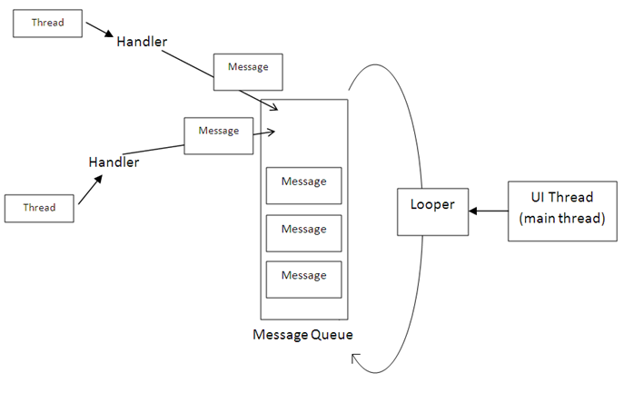

# Android中Handler Runnable與Thread的區別詳解


Android中Handler可以異步控制Runnable，那麼這樣做於Android中的Thread有什麼區別呢？本文將通過多個角度來講解這個問題，讀完此文，相信你會對Android中的Handler Runnable與Thread有一個非常全面的瞭解。

在java中可有兩種方式實現多線程，一種是繼承Thread類，一種是實現Runnable接口；Thread類是在java.lang包中定義的。一個類只要繼承了Thread類同時覆寫了本類中的run()方法就可以實現多線程操作了，但是一個類只能繼承一個父類，這是此方法的侷限。

```
package org.thread.demo;
class MyThread extends Thread
{
    private String name;
    public MyThread(String name)
    {
        super();
        this.name = name;
    }
    public void run()
    {
        for (int i = 0; i < 10; i++) {
            System.out.println("線程開始：" + this.name + ",i=" + i);
        }
    }
}
package org.thread.demo;
public class ThreadDemo01
{
    public static void main(String[] args)
    {
        MyThread mt1 = new MyThread("線程a");
        MyThread mt2 = new MyThread("線程b");
        mt1.run();
        mt2.run();
    }
}
```

但是，此時結果很有規律，先第一個對象執行，然後第二個對象執行，並沒有相互運行。在JDK的文檔中可以發現，一旦調用start()方法，則會通過JVM找到run()方法。下面啟動start()方法啟動線程：

```
package org.thread.demo;
public class ThreadDemo01
{
    public static void main(String[] args)
    {
        MyThread mt1 = new MyThread("線程a");
        MyThread mt2 = new MyThread("線程b");
        mt1.start();
        mt2.start();
    }
};

```
這樣程序可以正常完成交互式運行。那麼為啥非要使用start();方法啟動多線程呢？

在JDK的安裝路徑下，src.zip是全部的java源程序，通過此代碼找到Thread中的start()方法的定義，可以發現此方法中使用了private native void start0();其中native關鍵字表示可以調用操作系統的底層函數，那麼這樣的技術成為JNI技術（java Native Interface）

### Runnable接口
在實際開發中一個多線程的操作很少使用Thread類，而是通過Runnable接口完成。

```
public interface Runnable{
    public void run();
}

package org.runnable.demo;
class MyThread implements Runnable
{
    private String name;
    public MyThread(String name)
    {
        this.name = name;
    }
    public void run()
    {
        for (int i = 0; i < 100; i++) {
            System.out.println("線程開始：" + this.name + ",i=" + i);
        }
    }
};

```

但是在使用Runnable定義的子類中沒有start()方法，只有Thread類中纔有。此時觀察Thread類，有一個構造方法：public Thread(Runnable targer)此構造方法接受Runnable的子類實例，也就是說可以通過Thread類來啟動Runnable實現的多線程。（start()可以協調系統的資源）：

```
package org.runnable.demo;
import org.runnable.demo.MyThread;
public class ThreadDemo01
{
    public static void main(String[] args)
    {
        MyThread mt1 = new MyThread("線程a");
        MyThread mt2 = new MyThread("線程b");
        new Thread(mt1).start();
        new Thread(mt2).start();
    }
}
```

兩種實現方式的區別和聯繫：

在程序開發中只要是多線程肯定永遠以實現Runnable接口為主，因為實現Runnable接口相比繼承Thread類有如下好處：

避免點繼承的侷限，一個類可以繼承多個接口。
適合於資源的共享
以賣票程序為例，通過Thread類完成：

```
package org.demo.dff;
class MyThread extends Thread
{
    private int ticket = 10;
    public void run()
    {
        for (int i = 0; i < 20; i++) {
            if (this.ticket > 0) {
                System.out.println("賣票：ticket" + this.ticket--);
            }
        }
    }
};
```
下面通過三個線程對象，同時賣票：

```
package org.demo.dff;
public class ThreadTicket
{
    public static void main(String[] args)
    {
        MyThread mt1 = new MyThread();
        MyThread mt2 = new MyThread();
        MyThread mt3 = new MyThread();
        mt1.start();//每個線程都各賣了10張，共賣了30張票
        mt2.start();//但實際只有10張票，每個線程都賣自己的票
        mt3.start();//沒有達到資源共享
    }
}
```
如果用Runnable就可以實現資源共享，下面看例子：
```
package org.demo.runnable;
class MyThread implements Runnable
{
    private int ticket = 10;
    public void run()
    {
        for (int i = 0; i < 20; i++) {
            if (this.ticket > 0) {
                System.out.println("賣票：ticket" + this.ticket--);
            }
        }
    }
}

package org.demo.runnable;
public class RunnableTicket
{
    public static void main(String[] args)
    {
        MyThread mt = new MyThread();
        new Thread(
            mt).start();//同一個mt，但是在Thread中就不可以，如果用同一
        new Thread(mt).start();//個實例化對象mt，就會出現異常
        new Thread(mt).start();
    }
};
```
雖然現在程序中有三個線程，但是一共賣了10張票，也就是說使用Runnable實現多線程可以達到資源共享目的。
Runnable接口和Thread之間的聯繫：
```
public class Thread extends Object implements Runnable
```

發現Thread類也是Runnable接口的子類。

第二：

Thread是系統給你的資源，有了Thread你纔有從CPU那裡得到可執行時間片的權力， Thread並不認識你的程序，不知道有test 這樣的類，因為編序員有千千萬，每個人命名都不一樣，想要做的事都不一樣， 所以 Thread只認識一個！ 那就是Runnable 。 Thread認識Runnable 並且知道Runnable 裡面有一個run方法. 一旦調用Thread的start方法，Runnable 方法裡的run就會被Thread自動運行。 所以，當我們把我們的類繼承（這裡應該叫實現接口）自Runnable 的時候，我們的程序就是屬於Runnable 一個類型的了。 雖然是Runnable 的子類，但人家認識你爸爸，當然也知道了你。 Thread可以不管你內部有什麼情況，他只管你有run()方法就行了，他就調start讓你去運行run 所以我們在run裡面寫點東西，這樣就可以讓系統運行我們想要做的代碼了。 是不是很通俗很易懂呢？ 所以要運行線程的步驟是， 1。生成我們自己的類對象 2。從系統那裡得到Thread 3。讓Threa調我們的類對象，讓其start起來 代碼: test a=new test(); Thread thread=new Thread(a); //Thread需要一個參數，就是你編的線程類，這樣他就認識了你的線程，也有資格向系統申請拿到CPU時間片thread.start(); 你可以簡單點寫： new Thread(a).start();

第三：
Runnable 並不一定是新開一個線程，比如下面的調用方法就是運行在UI主線程中的：
```
Handler mHandler = new Handler();
mHandler.post(new Runnable()
{
    @Override public void run() {
        // TODO Auto-generated method stub
    }
});

```
官方對這個方法的解釋如下，注意其中的：「The runnable will be run on the user interface thread. 」

```
boolean android.view.View .post(Runnable action)
Causes the Runnable to be added to the message queue. The runnable will be run on the user interface thread.
Parameters:
action The Runnable that will be executed.
Returns:
Returns true if the Runnable was successfully placed in to the message queue. Returns false on failure, usually because the looper processing the message queue is exiting.
```
我們可以通過調用handler的post方法，把Runnable對象（一般是Runnable的子類）傳過去；handler會在looper中調用這個Runnable的Run方法執行。

Runnable是一個接口，不是一個線程，一般線程會實現Runnable。所以如果我們使用匿名內部類是運行在UI主線程的，如果我們使用實現這個Runnable接口的線程類，則是運行在對應線程的。

具體來說，這個函數的工作原理如下：

View.post(Runnable)方法。在post(Runnable action)方法裡，View獲得當前線程（即UI線程）的Handler，然後將action對象post到Handler裡。在Handler裡，它將傳遞過來的action對象包裝成一個Message（Message的callback為action），然後將其投入UI線程的消息循環中。在Handler再次處理該Message時，有一條分支（未解釋的那條）就是為它所設，直接調用runnable的run方法。而此時，已經路由到UI線程裡，因此，我們可以毫無顧慮的來更新UI。

如下圖，前面看到的代碼，我們這裡Message的callback為一個Runnable的匿名內部類

這種情況下，由於不是在新的線程中使用，所以千萬別做複雜的計算邏輯。


第四：在多線程編程這塊，我們經常要使用Handler，Thread和Runnable這三個類，那麼他們之間的關係你是否弄清楚了呢?
首先說明Android的CPU分配的最小單元是線程，Handler一般是在某個線程裡創建的，因而Handler和Thread就是相互綁定的，一一對應。

而Runnable是一個接口，Thread是Runnable的子類。所以說，他倆都算一個進程。

HandlerThread顧名思義就是可以處理消息循環的線程，他是一個擁有Looper的線程，可以處理消息循環。

與其說Handler和一個線程綁定，不如說Handler是和Looper一一對應的。

最後需要說明的是，在UI線程(主線程)中：


```
mHandler = new Handler();
mHandler.post(new Runnable()
{
    void run() {
        //執行代碼...

    }

});

　　這個線程其實是在UI線程之內運行的，並沒有新建線程。
　　常見的新建線程的方法是：
　　Thread thread = new Thread();
　　thread.start();
　　HandlerThread thread = new HandlerThread("string");
　　thread.start();

```
第五：Java Runnable接口在進行相關編寫的時候需要我們不斷的學習相關代碼。下面我們就來看炫如何才能使用相關的代碼。Runnable接口只有一個方法run()，我們聲明自己的類實現Runnable接 口並提供這一方法，將我們的線程代碼寫入其中，就完成了這一部分的任務。

但是Runnable接口並沒有任何對線程的支持，我們還必須創建Thread類 的實例，這一點通過Thread類的構造函數public Thread(Runnable target);來實現。下面是一個例子：

```
public class MyThread implements Runnable
{
    int count = 1, number;
    public MyThread(int num)
    {
        numnumber = num;
        System.out.println("創建線程 " + number);
    }
    public void run()
    {
        while (true) {
            System.out.println
            ("線程 " + number + ":計數 " + count);

            if (++count == 6) {
                return;
            }
        }
    }
    public static void main(String args[])
    {
        for (int i = 0; i 〈 5;
             i++) {
            new Thread(new MyThread(i + 1)).start();
        }
    }
}
```
嚴格地說，創建Thread子類的實例也是可行的，但是必須注意的是，該子類必須沒有覆蓋 Thread 類的 run 方法，否則該線程執行的將是子類的 run 方法，而不是我們用以實現Runnable 接口的類的 run 方法，對此大家不妨試驗一下。

使用 Java Runnable接口來實現多線程使得我們能夠在一個類中包容所有的代碼，有利於封裝，它的缺點在於，我們只能使用一套代碼，若想創建多個線程並使各個線程執行不同的代 碼，則仍必須額外創建類，如果這樣的話，在大多數情況下也許還不如直接用多個類分別繼承 Thread 來得緊湊。
