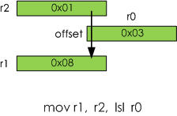
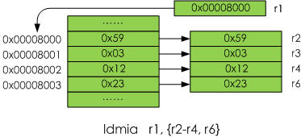

# ARM尋址方式

##3. ARM尋址方式

尋址方式是根據指令中給出的地址碼字段來實現尋找真實操作數地址的方式。ARM處理器具有9種基本尋址方式。

- 1.立即數尋址
- 2.寄存器尋址
- 3.寄存器間接尋址
- 4.基址尋址
- 5.寄存器移位尋址
- 6.堆棧尋址
- 7.多寄存器尋址
- 8.塊拷貝尋址
- 9.相對尋址

###3.1. 立即數尋址

###圖 5. 立即數尋址示例


立即數尋址指令中的操作碼字段後面的第一個操作數分即是操作數本身，也就是說，數據就包含在指令當中，取出指令也就取出了可以立即使用的操作數(這樣的數稱為立即數)。立即尋址指令舉例如下：
```c
mov  r1, #0x12  @將立即數0x12裝入r1寄存器
subs r1, r1, #1 @r1減1，結果放入r1，並且影響標誌位
```

注意:立即數要以”#”號為前綴。表示進制的前綴如下：

表 5. 進制前綴
<table summary="進制前綴" border="1"><colgroup><col><col></colgroup><thead><tr><th>進制類型</th><th>支持的前綴</th></tr></thead><tbody><tr><td>十進制</td><td>無</td></tr><tr><td>十六進制</td><td>0x/0X</td></tr><tr><td>八進制</td><td>0</td></tr><tr><td>二進制</td><td>0b/0B</td></tr></tbody></table>


##3.2. 寄存器尋址

###圖 6. 寄存器尋址示例


操作數的值在寄存器中，指令中的地址碼字段指出的是寄存器編號，指令執行時直接取出寄存器值來操作。寄存器尋址指令舉例如下：
```c
mov r1, r2      @將r2的值存入r1
sub r0, r1, r2  @將r1的值減去r2的值，結果保存到r0
```
##3.3. 寄存器間接尋址

###圖 7. 寄存器間接尋址示例


寄存器間接尋址指令中的地址碼給出的是一個通用寄存器的編號，所需的操作數保存在寄存器指定地址的存儲單元中，即寄存器為操作數的地址指針。寄存器間接尋址指令舉例如下：
```c
ldr	r1,[r2]	@將r2指向的存儲單元的數據讀出保存在r1中
str r1,[r2] @將r1的內容保存到r2指向的存儲單
```

##3.4. 基址尋址

###圖 8. 基址尋址示例


基址尋址是對寄存器間接尋址的擴展，它將基址寄存器的內容與指令中給出的偏移量相加，形成操作數的有效地址。基址尋址用於訪問基址附近的存儲單元，常用於查表、數組操作、功能部件寄存器訪問等。基址尋址指令舉例如下：

```c
ldr	r1,[r2, #0x08]	  @讀取r2+0x08地址上的存儲單元的內容，放入r1。
```

```c
/* 前索引尋址 */
ldr	r1,[r2, #0x08]	  @r1 <- [r2 + 0x08]
ldr	r1,[r2, #0x08]!	  @r1 <- [r2 + 0x08], r2 <- r2 + 0x08
```

```c
/* 後索引尋址 */
ldr r1, [r2], #0x08    @r1 <- r2, r2 <- r2 + 0x08
```

基址尋址根據數據傳送和基地址的變動順序又分為兩類：

- 前索引尋址是將基址與偏移量相加作為傳送數據的地址，傳送數據後自動將數據的地址傳送給基址寄存器。
- 後索引尋址是將基址作為傳送數據的地址，傳送數據後自動將基址的內容與偏移量相加傳送給基址寄存器。
##3.5. 寄存器移位尋址

###圖 9. 寄存器移位尋址示例



寄存器移位尋址是ARM指令集特有的尋址方式。當第2個操作數是寄存器移位方式時，第2個寄存器操作數在與第1個操作數結合之前，選擇進行移位操作。寄存器移位尋址指令舉例如下：
```c
mov	 r1, r2, lsl #r0   ;r2的值左移r0位，結果放入r1，即是r1 = r2 * 8
mov	 r1, r2, lsl #4    ;這裡的r2的值左移4位，結果放入r1
```
實際編譯過程中被轉化為移位指令：
```c
lsl	r1, r2, r0
lsl	r1, r2, #4
```
與上對應，不同的移位指令將對應不同的寄存器移位尋址方式：

- lsl邏輯左移操作：可完成對通用寄存器中的內容進行邏輯左移操作，按操作數所指定的數量向左移位，低位用零來填充。其中，操作數可以是通用寄存器，也可以是立即數。
- lsr邏輯右移操作：可完成對通用寄存器中的內容進行右移操作，按操作數所指定的數量向右移位，左端用零來填充。其中，操作數可以是通用寄存器，也可以是立即數
- asr算術右移操作：可完成對通用寄存器中的內容進行右移操作，按操作數所指定的數量向右移位，左端用第31位的值來填充。其中，操作數可以是通用寄存器，也可以是立即數。
- ror循環右移操作：可完成對通用寄存器中的內容進行循環右移操作，按操作數所指定的數量向右循環移位，左端用右端移出的位來填充。其中，操作數可以是通用寄存器，也可以是立即數。
- rrx帶擴展的循環右移操作：可完成對通用寄存器中的內容進行帶擴展的循環右移操作，向右循環移1位，左端用進位標誌位C來填充。

目前ARM支持的移位指令和它們的區別如下圖：

###圖 10. ARM移位運算

ARM移位運算


##3.6. 堆棧尋址

在2.3. 數據棧的使用中介紹了四種堆棧類型：

- 滿遞增：堆棧向上增長，堆棧指針指向內含有效數據項的最高地址。指令如ldmfa，stmfa等；
- 空遞增：堆棧向上增長，堆棧指針指向堆棧上的第一個空位置。指令如ldmea、stmea等；
- 滿遞減：堆棧向下增長，堆棧指針指向內含有效數據項的最低地址。指令如ldmfd、stmfd等；
- 空遞減：堆棧向下增長，堆棧指針指向堆棧下的第一個空位置。指令如ldmed、stmed等。

```
stmfd sp!, {r1-r7, lr} @將r1-r7， lr入棧, 滿遞減堆棧
ldmfd sp! ,{r1-r7, pc} @數據出棧，放入r1-r7，pc寄存器，滿遞減堆棧
```
sp即約定的r13寄存器，它總是指向棧頂地址，或者棧頂的下一地址。!號使數據出入棧後，sp自動調整到棧頂。

##3.7. 多寄存器尋址

多寄存器尋址一次可傳送幾個寄存器值，允許一條指令傳送16個寄存器的任何子集或所有寄存器。多寄存器尋址指令舉例如下：
```
ldmia	r1, {r2-r4, r6}   @將r1指向的單元中的數據讀出到r2-r4、r6中
```

注意寄存器的編號連續和不連續的情況。類似的指令還有ldmib，ldmda和ldmdb。
###圖 11. ldmia指令示例




ldmia指令示例

##3.8. 塊拷貝尋址

塊拷貝是將寄存器內容複製到基址寄存器的地址所指示的存儲器中,需要注意的是在存儲第一個值之後或之前存儲器地址是增加還是減少.增值類型如下:

- IA：每次傳送後,地址加4
- IB：每次傳送前,地址加4
- DA：每次傳送後,地址減4
- DB：每次傳送前,地址減4

其中I指Increment；A指After；D指Decrement；B指Before。
```c
stmia	r0!, {r1-r7}  @將r1～r7的數據保存到存儲器中,存儲指針在保存第一個值之後增加，增長方向為向上增長。
stmib	r0!, {r1-r7}  @將r1～r7的數據保存到存儲器中,存儲指針在保存第一個值之前增加，增長方向為向上增長。
stmda	r0!, {r1-r7}  @將R1～R7的數據保存到存儲器中,存儲指針在保存第一個值之後增加, 增長方向為向下增長。
stmdb	r0!, {r1-r7}  @將r1～r7的數據保存到存儲器中,存儲指針在保存第一個值之前增加，增長方向為向下增長。
```
##3.9. 相對尋址

相對尋址是基址尋址的一種變通。由程序計數器pc提供基準地址，指令中的地址碼字段作為偏移量，兩者相加後得到的地址即為操作數的有效地址。通常的adr偽指令中的操作數就是相對於當前pc的值。相對尋址指令舉例如下：
```
.section .data
msg: .asciz "hello"

.section .text
.align 2
.global _start
_start:
    mov r0, #10
    ......
    adr r0, msg
```
adr r0, msg對應的反彙編結果為sub r0, pc, #8。

總結：寄存器間接尋址和基址尋址通常用在ldr/str指令中，用來實現內存和寄存器間的數據搬移。堆棧尋址中的ldmfd/ldmed/stmfd/stm ed指令實現寄存器和數據棧的數據交互。多寄存器尋址實際上就是塊拷貝尋址的反操作。
