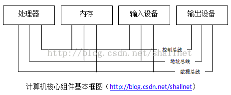

# 处理器指令码及IA-32平台了解

版权声明：尊重原创，转载请保留出处：blog.csdn.net/shallnet，文章仅供学习交流，请勿用于商业用途】
        在计算机操作的最底层，所有计算机处理器都按照制造厂商在处理器内部定义的二进制代码来操作数据，这些代码定义了处理器应该利用程序员提供的数据完成相应的功能，这些预置的代码被称为指令码。不同类型的处理器的指令码是不一样的，但处理指令码的方式是类似的。

当计算机处理器芯片运行时，他会读取存储在内存中的指令码，每个指令码包含不同长度字节的信息，这些信息指示处理器完成特定任务。每条指令码都是从内存读取，指令所需的操作数据也是从内存读取。

每条指令都必须包含至少一个字节的操作码，操作码定义处理器应该完成什么样的操作。每个处理器都有自己定义好的操作码。

Intel IA-32系列微处理器使用专门格式的指令码，了解一下这些指令格式对汇编语言程序设计会有所帮助。IA-32指令码格式有四个主要部分构成：
- 可选指令前缀
- 操作码
- 可选修饰符
- 可选数据元素
下图为IA-32指令码格式的布局。

如上图所示，IA-32指令格式中唯一必须的部分是操作码。每个指令码都必须包含操作码，其定义了指令执行的基本任务。

指令前缀可以包含0-4个修改操作码行为的1字节前缀。按照前缀功能，这些前缀被分成四个组，修改操作码时，每个组的前缀一次只能使用一个（最多4个）。四个前缀如下：
锁定前缀和重复前缀
段覆盖前缀和分支提示前缀
操作数长度覆盖前缀
地址长度覆盖前缀

一些操作码需要另外的修饰符来定义执行功能中涉及到的寄存器和内存地址。修饰符包含三部分：
（ModR/M）寻址方式字节
SIB（比例索引基址）字节
1、2或4个地址移位字节
ModR/M字节由三个字段的信息构成。如下图：

mod字段和r/m字段一起使用，用于定义指令使用的寄存器或寻址模式。
reg/opcode用于允许使用更多的三位进一步定义操作码功能，或用于定义寄存器的值。
SIB字段也由3个字段的信息构成。如下图

比例字段指定操作的比例因素，索引字段指定内存访问中用作索引寄存器的寄存器，基址字段指定用作内存访问的基址寄存器的寄存器。

地址移位字节用来指定对于ModR/M和SIB字节中定义的内存位置位置的偏移量。
数据元素在指令码的最后部分，一些指令码从内存位置或处理器寄存器读取数据，而一些指令码在其指令本身之内就有包含数据。

可以看到，使用处理器的指令码进行程序设计是十分困难的，所以才有了后面的高级语言。但处理器根本不知道如何处理高级语言，必须通过某种机制把高级语言代码转换为处理器能够处理的指令码才能处理。

使用汇编语言程序设计必须要先了解处理器环境，不同类型的处理器的指令码是不一样的。我们将以AI-32平台为例来讲述汇编语言。

虽然不同处理器系列结合了不同的指令集合和功能，但大多数处理器都使用了相同的核心组件集合。计算机一般包含如下四个组件：

处理器包含控制计算机操作的硬件和指令码，其通过3个单独的总线：控制总线、地址总线、数据总线，处理器被连接到计算机的其他元素（内存存储单元、输入设备和输出设备）。处理器由很多组件构成，在处理器处理数据的过程中，每个组件都有其作用，汇编语言程序有访问和控制所有这些组件的能力，所以了解这些组件很重要。处理器主要组件如下：

- 控制单元
- 执行单元
- 寄存器
- 标志

控制单元是处理器的中心，控制单元的主要作用时控制处理器在何时做何种操作。控制单元实现4个基本功能：
- 从内存获得指令。
- 对指令进行分析以便进行操作。
- 从内存获得所需结果。
- 有必要则存储结果。

执行单元负责执行处理器指令。执行单元由一个或多个算术逻辑单元构成（ALU）。
寄存器用于解决处理器从内存读取数据时需要等待的问题。在处理器访问数据元素时，请求被发送到处理器外部，通过控制总线进入存储单元，执行该过程时处理器处于等待状态。而寄存器能够存储要处理的数据元素，而无需访问内存单元。但是处理器芯片中内置的寄存器数量是有限的。IA-32平台具有不同长度的多组寄存器。通用寄存器用于临时存储数据；段寄存器用于引用内存位置；指令指针寄存器，又称为程序计数器（PC），跟踪要执行的下一条指令码；控制寄存器用于确定处理器的操作模式。

通用寄存器及其用处描述如下表：

<ul style="margin-top:0px; margin-bottom:0px; background-color:inherit">
<li style="background-color:inherit">控制单元</li><li style="background-color:inherit">执行单元</li><li style="background-color:inherit">寄存器</li><li style="background-color:inherit">标志</li></ul>

&nbsp; &nbsp; &nbsp; &nbsp; 控制单元是处理器的中心，控制单元的主要作用时控制处理器在何时做何种操作。控制单元实现4个基本功能：

<ol style="margin-top:0px; margin-bottom:0px; background-color:inherit">
<li style="background-color:inherit">从内存获得指令。</li><li style="background-color:inherit">对指令进行分析以便进行操作。</li><li style="background-color:inherit">从内存获得所需结果。</li><li style="background-color:inherit">有必要则存储结果。</li></ol>

&nbsp; &nbsp; &nbsp; &nbsp; 执行单元负责执行处理器指令。执行单元由一个或多个算术逻辑单元构成（ALU）。

&nbsp; &nbsp; &nbsp; &nbsp; 寄存器用于解决处理器从内存读取数据时需要等待的问题。在处理器访问数据元素时，请求被发送到处理器外部，通过控制总线进入存储单元，执行该过程时处理器处于等待状态。而寄存器能够存储要处理的数据元素，而无需访问内存单元。但是处理器芯片中内置的寄存器数量是有限的。IA-32平台具有不同长度的多组寄存器。通用寄存器用于临时存储数据；段寄存器用于引用内存位置；指令指针寄存器，又称为程序计数器（PC），跟踪要执行的下一条指令码；控制寄存器用于确定处理器的操作模式。

&nbsp; &nbsp; &nbsp; &nbsp; 通用寄存器及其用处描述如下表：

<table border="1" cellpadding="2" cellspacing="0" style="border-collapse:collapse; margin-top:10px; margin-bottom:10px; display:table; background-color:inherit">
<tbody style="background-color:inherit">
<tr style="background-color:inherit">
<td valign="top" style="word-break:break-all; border:1px solid rgb(153,153,153); padding:5px 16px 5px 12px; min-height:25px; min-width:25px; height:25px; background-color:inherit; width:279px">

EAX

</td>
<td valign="top" style="word-break:break-all; border:1px solid rgb(153,153,153); padding:5px 16px 5px 12px; min-height:25px; min-width:25px; height:25px; background-color:inherit; width:279px">

用于操作数和结果数据的累加器

</td>
</tr>
<tr style="background-color:inherit">
<td valign="top" style="word-break:break-all; border:1px solid rgb(153,153,153); padding:5px 16px 5px 12px; min-height:25px; min-width:25px; height:25px; background-color:inherit; width:279px">

EBX

</td>
<td valign="top" style="word-break:break-all; border:1px solid rgb(153,153,153); padding:5px 16px 5px 12px; min-height:25px; min-width:25px; height:25px; background-color:inherit; width:279px">

指向数据内存段中的数据指针

</td>
</tr>
<tr style="background-color:inherit">
<td valign="top" style="word-break:break-all; border:1px solid rgb(153,153,153); padding:5px 16px 5px 12px; min-height:25px; min-width:25px; height:25px; background-color:inherit; width:279px">

ECX

</td>
<td valign="top" style="word-break:break-all; border:1px solid rgb(153,153,153); padding:5px 16px 5px 12px; min-height:25px; min-width:25px; height:25px; background-color:inherit; width:279px">

字符串和循环操作的计数器

</td>
</tr>
<tr style="background-color:inherit">
<td valign="top" style="word-break:break-all; border:1px solid rgb(153,153,153); padding:5px 16px 5px 12px; min-height:25px; min-width:25px; height:28px; background-color:inherit; width:279px">

EDX

</td>
<td valign="top" style="word-break:break-all; border:1px solid rgb(153,153,153); padding:5px 16px 5px 12px; min-height:25px; min-width:25px; height:28px; background-color:inherit; width:279px">

I/O指针

</td>
</tr>
<tr style="background-color:inherit">
<td valign="top" style="word-break:break-all; border:1px solid rgb(153,153,153); padding:5px 16px 5px 12px; min-height:25px; min-width:25px; height:25px; background-color:inherit; width:279px">

EDI

</td>
<td valign="top" style="word-break:break-all; border:1px solid rgb(153,153,153); padding:5px 16px 5px 12px; min-height:25px; min-width:25px; height:25px; background-color:inherit; width:279px">

用于字符串操作的目标的数据指针

</td>
</tr>
<tr style="background-color:inherit">
<td valign="top" style="word-break:break-all; border:1px solid rgb(153,153,153); padding:5px 16px 5px 12px; min-height:25px; min-width:25px; height:25px; background-color:inherit; width:279px">

ESI

</td>
<td valign="top" style="word-break:break-all; border:1px solid rgb(153,153,153); padding:5px 16px 5px 12px; min-height:25px; min-width:25px; height:25px; background-color:inherit; width:279px">

用于字符串操作的源的数据指针

</td>
</tr>
<tr style="background-color:inherit">
<td valign="top" style="word-break:break-all; border:1px solid rgb(153,153,153); padding:5px 16px 5px 12px; min-height:25px; min-width:25px; height:25px; background-color:inherit; width:279px">
ESP</td>
<td valign="top" style="word-break:break-all; border:1px solid rgb(153,153,153); padding:5px 16px 5px 12px; min-height:25px; min-width:25px; height:25px; background-color:inherit; width:279px">

堆栈指针

</td>
</tr>
<tr style="background-color:inherit">
<td valign="top" style="word-break:break-all; border:1px solid rgb(153,153,153); padding:5px 16px 5px 12px; min-height:25px; min-width:25px; height:25px; background-color:inherit; width:279px">

EBP

</td>
<td valign="top" style="word-break:break-all; border:1px solid rgb(153,153,153); padding:5px 16px 5px 12px; min-height:25px; min-width:25px; height:25px; background-color:inherit; width:279px">

堆栈数据指针

</td>
</tr>
</tbody>
</table>
段寄存器及其描述：

<table border="1" cellpadding="2" cellspacing="0" style="font-size:undefined; border-collapse:collapse; margin-top:10px; margin-bottom:10px; display:table; background-color:inherit">
<tbody style="background-color:inherit">
<tr style="background-color:inherit">
<td valign="top" style="word-break:break-all; border:1px solid rgb(153,153,153); padding:5px 16px 5px 12px; min-height:25px; min-width:25px; height:25px; background-color:inherit; width:279px">

CS

</td>
<td valign="top" style="word-break:break-all; border:1px solid rgb(153,153,153); padding:5px 16px 5px 12px; min-height:25px; min-width:25px; height:25px; background-color:inherit; width:279px">

代码段

</td>
</tr>
<tr style="background-color:inherit">
<td valign="top" style="word-break:break-all; border:1px solid rgb(153,153,153); padding:5px 16px 5px 12px; min-height:25px; min-width:25px; height:25px; background-color:inherit; width:279px">

DS

</td>
<td valign="top" style="word-break:break-all; border:1px solid rgb(153,153,153); padding:5px 16px 5px 12px; min-height:25px; min-width:25px; height:25px; background-color:inherit; width:279px">

数据段

</td>
</tr>
<tr style="background-color:inherit">
<td valign="top" style="word-break:break-all; border:1px solid rgb(153,153,153); padding:5px 16px 5px 12px; min-height:25px; min-width:25px; height:25px; background-color:inherit; width:279px">

SS

</td>
<td valign="top" style="word-break:break-all; border:1px solid rgb(153,153,153); padding:5px 16px 5px 12px; min-height:25px; min-width:25px; height:25px; background-color:inherit; width:279px">

堆栈段

</td>
</tr>
<tr style="background-color:inherit">
<td valign="top" style="word-break:break-all; border:1px solid rgb(153,153,153); padding:5px 16px 5px 12px; min-height:25px; min-width:25px; height:25px; background-color:inherit; width:279px">

ES

</td>
<td valign="top" style="word-break:break-all; border:1px solid rgb(153,153,153); padding:5px 16px 5px 12px; min-height:25px; min-width:25px; height:25px; background-color:inherit; width:279px">

附加段指针

</td>
</tr>
<tr style="background-color:inherit">
<td valign="top" style="word-break:break-all; border:1px solid rgb(153,153,153); padding:5px 16px 5px 12px; min-height:25px; min-width:25px; height:25px; background-color:inherit; width:279px">

FS

</td>
<td valign="top" style="word-break:break-all; border:1px solid rgb(153,153,153); padding:5px 16px 5px 12px; min-height:25px; min-width:25px; height:25px; background-color:inherit; width:279px">

附加段指针

</td>
</tr>
<tr style="background-color:inherit">
<td valign="top" style="word-break:break-all; border:1px solid rgb(153,153,153); padding:5px 16px 5px 12px; min-height:25px; min-width:25px; height:25px; background-color:inherit; width:279px">

GS

</td>
<td valign="top" style="word-break:break-all; border:1px solid rgb(153,153,153); padding:5px 16px 5px 12px; min-height:25px; min-width:25px; height:25px; background-color:inherit; width:279px">

附加段指针

</td>
</tr>
</tbody>
</table>

&nbsp; &nbsp; &nbsp; &nbsp; 处理器标志确定处理器实现的每个操作是否成功。

