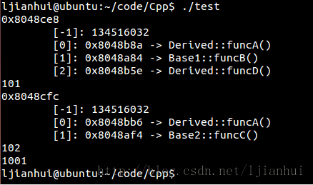
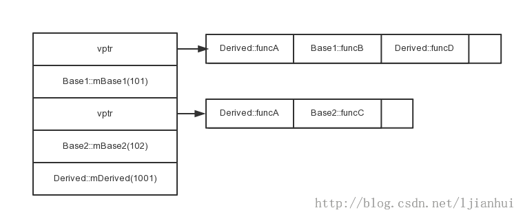
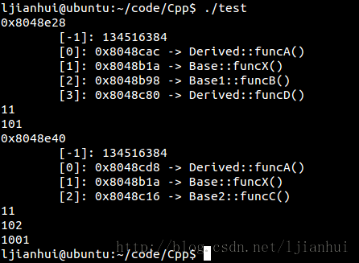
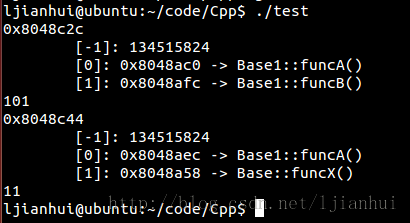
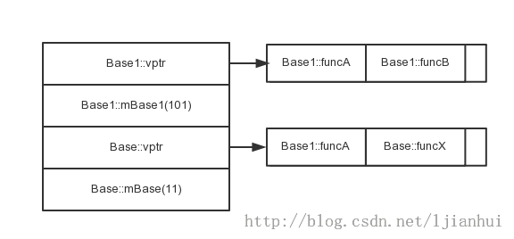
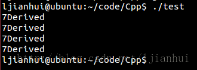

# [轉]C++對象模型之詳述C++對象的內存佈局

在**C++對象模型之簡述C++對象的內存佈局**一文中，詳細分析了各種成員變量和成員函數對一個類（沒有任何繼承的）對象的內存分佈的影響，及詳細講解了如何遍歷對象的內存，包括虛函數表。如果你在閱讀本文之前，還沒有看過C++對象模型之簡述C++對象的內存佈局一文，建議先閱讀一下。而本文主要討論繼承對於對象的內存分佈的影響，包括：繼承後類的對象的成員的佈局、繼承對於虛函數表的影響、virtual函數機制如何實現、運行時類型識別等。由於在C++中繼承的關係比較複雜，所以本文會討論如下的繼承情況：
```
1）單一繼承
2）多重繼承
3）重複繼承
4）單一虛擬繼承
5）鑽石型虛擬繼承
```

此外，當一個類作為一個基類時，它的析構函數應該是virtual函數，這樣下面的代碼才能正確地運行
```cpp
Base *p = new Derived;
...
delete p;
```
在本文的例子，為了驗證虛函數表的內容，會遍歷並調用虛函數表中的所有函數。但是當析構函數為virtual時，在遍歷的過程中就會調用到對象的析構函數，從而對對象進行析構的操作，導致接下來的調用出錯。但是本文的目的是分析和驗證C++對象的內存佈局，而不是設計一個軟件，析構函數為非virtual函數，並不會影響我們的分析和理解，因為virtual析構函數與其他的virtual函數是一樣的，只是做的事不一樣。所以在本文中的例子中，析構函數均不為virtual，特此說明一下。

同時為了調用的方便，所有的virtual的函數原型均為：返回值為void，參數也為void。

注：以下的例子中的測試環境為：32位Ubuntu 14.04 g++ 4.8.2，若在不同的環境中進行測試，結果可能有不同。

###1、根據指向虛函數表的指針（vptr）遍歷虛函數表
由於在訪問對象的內存時，都要遍歷虛函數表來確定虛函數表中的內容，所以對這部分的功能抽象出來，寫成一個函數，如下：
```cpp
void visitVtbl(int **vtbl, int count)
{
    cout << vtbl << endl;
    cout << "\t[-1]: " << (long)vtbl[-1] << endl;

    typedef void (*FuncPtr)();
    for (int i = 0; vtbl[i] && i < count; ++i)
    {
        cout << "\t[" << i << "]: " << vtbl[i] << " -> ";
        FuncPtr func = (FuncPtr)vtbl[i];
        func();
    }
}
```

代碼解釋：
參數vtbl為虛函數表的第一個元素的地址，也就是對象中的vptr的值。參數count指的是該虛函數表中虛函數的數量。由於虛函數表中保存的信息並不全是虛函數的地址，也不是所有的虛函數表中都以NULL表示虛函數表中的函數地址已經到了盡頭。所以為了讓測試程序更好地運行，所以加上這一參數。

虛函數表保存的是函數的指針，若把虛函數表當作一個數組，則要指向該數組需要一個雙指針，即參數中的int **vtbl，獲取函數指針的值，即獲取數組中元素的值，可以通過vtbl[i]來獲得。

虛函數表中還保存著對象的類型信息，通常為了便於查找對象的類型信息，使用虛函數表中的索引（下標）為-1的位置保存該類對應的類型信息對象（即類std::type_info的對象）的地址，即保存在第一個虛函數的地址之前。

###2、單一繼承
類的具體代碼如下：
```cpp
class Base
{
    public:
        Base()
        {
            mBase1 = 101;
            mBase2 = 102;
        }
        virtual void func1()
        {
            cout << "Base::func1()" << endl;
        }
        virtual void func2()
        {
            cout << "Base::func2()" << endl;
        }
    private:
        int mBase1;
        int mBase2;
};

class Derived : public Base
{
    public:
        Derived():
            Base()
        {
            mDerived1 = 1001;
            mDerived2 = 1002;
        }
        virtual void func2()
        {
            cout << "Derived::func2()" << endl;
        }
        virtual void func3()
        {
            cout << "Derived::func3()" << endl;
        }
    private:
        int mDerived1;
        int mDerived2;
};
```
使用如下的代碼進行測試：
```cpp
int main()
{
    Derived d;
    char *p = (char*)&d;
    visitVtbl((int**)*(int**)p, 3);
    p += sizeof(int**);

    cout << *(int*)p << endl;
    p += sizeof(int);

    cout << *(int*)p << endl;
    p += sizeof(int);

    cout << *(int*)p << endl;
    p += sizeof(int);

    cout << *(int*)p << endl;

    return 0;
}
```
代碼解釋：
在測試代碼中，最難明白的就是以下語句中的參數：
visitVtbl((int**)*(int**)p, 3);
char指針p指向了對象中的vptr，由於vptr也是一個指針，所以p應該是一個雙指針，對其解引用（*p）可以獲得vptr的值。然而在同一個系統中，無論是什麼類型的指針，其佔用的內存大小都是相同的（一般在32位系統中為4字節，64位系統中為8字節），所以可以通過以下語句獲取vptr的值：
 (int**)*(int**)p;
該語句，進行了三件事：
```
1）把char指針p進行類型轉換，轉換成int**，即（int**)p;
2）通過解引用運行符“*”，獲得vptr的值，類型為int*。其實vptr本質是一個雙指針，但是所有的指針佔用的內存都是相等的，所以這個操作並不會導致地址值的截斷。即*(int**)p;
3）由於vptr本質是一個雙指針，所以再一次把vptr轉化成一個雙指針。即(int**)*(int**)p;
```

注：在不少的文章中，可以看到作者把虛函數表中的項的內容當做一個整數來對待，但是本文中，我並沒有這樣做。因為在不同的系統（32位或64位）中的指針的位數是不同的，為了讓代碼能兼容32位和64位的系統，這裡統一把虛函數表中的項當指針看待。

在以後的例子若中出現相似的代碼，都是相同的原理，不再解釋。

其運行結果如下：


根據測試的輸出的結果，可以得出類Derived的對象的內存佈局圖如下：


據此，針對單一繼承可以得出以下結論：
```
1）vptr位於對象的最前端。
2）非static的成員變量根據其繼承順序和聲明順序排在vptr的後面。
3）派生類繼承基類所聲明的虛函數，即基類的虛函數地址會被複制到派生類的虛函數表中的相應的項中。
4）派生類中新加入的virtual函數跟在其繼承而來的virtual的後面，如本例中，子類增加的virtual函數func3被添加到func2後面。
5）若子類重寫其父類的virtual函數，則子類的虛函數表中該virtual函數對應的項會更新為新函數的地址，如本例中，子類重寫了virtual函數func2，則虛函數表中func2的項更新為子類重寫的函數func2的地址。
```
###3、多重繼承
類的具體代碼如下：
```cpp
class Base1
{
    public:
        Base1()
        {
            mBase1 = 101;
        }
        virtual void funcA()
        {
            cout << "Base1::funcA()" << endl;
        }
        virtual void funcB()
        {
            cout << "Base1::funcB()" << endl;
        }
    private:
        int mBase1;
};

class Base2
{
    public:
        Base2()
        {
            mBase2 = 102;
        }
        virtual void funcA()
        {
            cout << "Base2::funcA()" << endl;
        }
        virtual void funcC()
        {
            cout << "Base2::funcC()" << endl;
        }
    private:
        int mBase2;
};

class Derived : public Base1, public Base2
{
    public:
        Derived():
            Base1(),
            Base2()
        {
            mDerived = 1001;
        }
        virtual void funcD()
        {
            cout << "Derived::funcD()" << endl;
        }
        virtual void funcA()
        {
            cout << "Derived::funcA()" << endl;
        }
    private:
        int mDerived;
};
```
使用如下代碼進行測試：
```cpp
int main()
{
    Derived d;
    char *p = (char*)&d;
    visitVtbl((int**)*(int**)p, 3);
    p += sizeof(int**);

    cout << *(int*)p << endl;
    p += sizeof(int);

    visitVtbl((int**)*(int**)p, 3);
    p += sizeof(int**);

    cout << *(int*)p << endl;
    p += sizeof(int);

    cout << *(int*)p << endl;

    return 0;
}
```
其運行結果如下：




根據測試的輸出的結果，可以得出類Derived的對象的內存佈局圖如下：



據此，針對多重繼承可以得出以下結論：
```
1）在多重繼承下，一個子類擁有n-1張額外的虛函數表，n表示其上一層的基類的個數。也就是說，在多重繼承下，一個派生類會有n個虛函數表。其中一個為主要實例，它與第一個基類（如本例中的Base1）共享，其他的為次要實例，與其他基類（如本例中的Base2）有關。
2）子類新聲明的virtual函數，放在主要實例的虛函數表中。如本例中，子類新聲明的與Base1共享的虛函數表中。
3）每一個父類的子對象在子類的對象保持原樣性，並依次按聲明次序排列。
4）若子類重寫virtual函數，則其所有父類中的簽名相同的virtual函數被會被改寫。如本例中，子類重寫了funcA函數，則兩個虛函數表中的funcA函數的項均被更新為子類重寫的函數的地址。這樣做的目的是為了解決不同的父類類型的指針指向同一個子類實例，而能夠調用到實際的函數。
```
###4、重複繼承
所謂的重複繼承，就是某個父類被間接地重複繼承了多次。

類的具體代碼如下：
```cpp
class Base
{
    public:
        Base()
        {
            mBase = 11;
        }
        virtual void funcA()
        {
            cout << "Base::funcA()" << endl;
        }
        virtual void funcX()
        {
            cout << "Base::funcX()" << endl;
        }
    protected:
        int mBase;
};
class Base1 : public Base
{
    public:
        Base1():
            Base()
        {
            mBase1 = 101;
        }
        virtual void funcA()
        {
            cout << "Base1::funcA()" << endl;
        }
        virtual void funcB()
        {
            cout << "Base1::funcB()" << endl;
        }
    private:
        int mBase1;
};
class Base2 : public Base
{
    public:
        Base2():
            Base()
        {
            mBase2 = 102;
        }
        virtual void funcA()
        {
            cout << "Base2::funcA()" << endl;
        }
        virtual void funcC()
        {
            cout << "Base2::funcC()" << endl;
        }
    private:
        int mBase2;
};
class Derived : public Base1, public Base2
{
    public:
        Derived():
            Base1(),
            Base2()
        {
            mDerived = 1001;
        }
        virtual void funcD()
        {
            cout << "Derived::funcD()" << endl;
        }
        virtual void funcA()
        {
            cout << "Derived::funcA()" << endl;
        }
    private:
        int mDerived;
};
```
使用如下代碼進行測試：
```cpp
int main()
{
    Derived d;
    char *p = (char*)&d;
    visitVtbl((int**)*(int**)p, 4);
    p += sizeof(int**);

    cout << *(int*)p << endl;
    p += sizeof(int);

    cout << *(int*)p << endl;
    p += sizeof(int);

    visitVtbl((int**)*(int**)p, 3);
    p += sizeof(int**);

    cout << *(int*)p << endl;
    p += sizeof(int);

    cout << *(int*)p << endl;
    p += sizeof(int);

    cout << *(int*)p << endl;
    return 0;
}
```
其運行結果如下：


根據測試的輸出的結果，可以得出類Derived的對象的內存佈局圖如下：


據此，針對重複繼承可以得出以下結論：
```
1）重複繼承後，位於繼承層次頂端的父類Base分別被子類Base1和Base2繼承，並被類Derived繼承。所以在D中有類的對象中，存在Base1的子對象，同時也存在Base2的子對象，這兩個子對象都擁有Base子對象，所以Base子對象（成員mBase）在Derived中存在兩份。

2）二義性的原因。由於在子類的對象中，存在兩份父類的成員，當在Derived類中使用如下語句：
mBase = 1;
就會產生歧義。因為在該對象中有兩處的變量的名字都叫mBase，所以編譯器不能判斷究竟該使用哪一個成員變量。所以在訪問Base中的成員時，需要加上域作用符來明確說明是哪一個子類的成員，如：
Base1::mBase = 1;

重複繼承可能並不是我們想要的，C++提供虛擬繼承來解決這個問題，下面詳細講解虛擬繼承。
```

### 5、單一虛擬繼承
具體代碼如下（類的實現與重複繼承中的代碼相同，只是Base1的繼承關係變為虛擬繼承）：
```cpp
class Base  { ...... };
class Base1 : virtual public Base  { ...... };
```
使用如下的代碼進行測試：
```cpp
int main()
{
    Base1 b1;
    char *p = (char*)&b1;
    visitVtbl((int**)*(int**)p, 3);
    p += sizeof(int**);

    cout << *(int*)p << endl;
    p += sizeof(int);

    visitVtbl((int**)*(int**)p, 3);
    p += sizeof(int**);

    cout << *(int*)p << endl;
    return 0;
}
```
其運行結果如下：



根據測試的輸出的結果，可以得出類B1的對象的內存佈局圖如下：



通過與普通的單一繼承比較可以知道，單一虛繼承與單一繼承的對象的內存佈局存在明顯的不同。表現為以下的方面
```
1）成員的順序問題。在普通的單一繼承中，基類的成員位於派生類的成員之前。而在單一虛繼承中，首先是其普通基類的成員，接著是派生類的成員，最後是虛基類的成員。
2）vptr的個數問題。在普通的單一繼承中，派生類只有一個虛函數表，所以其對象只有一個vptr。而在單一虛繼承中，派生類的虛函數表有n個（n為虛基類的個數）額外的虛數函數表，即總有n+1個虛函數表。
3）派生自虛基類的派生類的虛函數表中，並不含有虛基類中的virtual函數，但是派生類重寫的virtual函數會在所有虛函數表中得到更新。如本例中，第一個虛函數表中，並不含有Base::funcX的函數地址。
```

注：在測試代碼中，我把count傳遞的值為3，而結果卻只調用了2個函數，可見並不是count參數限制了虛函數表的遍歷。

一個類如果內含一個或多個虛基類子對象，像Base1那樣，將會被分割為兩部分：一個不變區域和一個共享區域。不變區域中的數據，不管後續如何變化，總是擁有固定的偏移量（從對象的開頭算起），所以這一部分可以被直接存取。共享區域所對應的就是虛基類子對象。

###6、鑽石型虛擬繼承
具體代碼如下（類的實現與重複繼承中的代碼相同，只是Base1和Base2的繼承關係變為虛擬繼承）：
```cpp
class Base  { ...... };
class Base1 : virtual public Base  { ...... };
class Base2 : virtual public Base  { ...... };
class Derived : public Base1, public Base2 { ...... };
```
使用如下的代碼對對象的內存佈局進行測試：
```cpp
int main()
{
    Derived d;
    char *p = (char*)&d;
    visitVtbl((int**)*(int**)p, 3);
    p += sizeof(int**);

    cout << *(int*)p << endl;
    p += sizeof(int);

    visitVtbl((int**)*(int**)p, 2);
    p += sizeof(int**);

    cout << *(int*)p << endl;
    p += sizeof(int);

    cout << *(int*)p << endl;
    p += sizeof(int);

    visitVtbl((int**)*(int**)p, 2);
    p += sizeof(int**);

    cout << *(int*)p << endl;
    return 0;
}
```
其運行結果如下：


根據測試的輸出的結果，可以得出類Derived的對象的內存佈局圖如下：


使用虛繼承後，在派生類的對象中只存在一份的Base子對象，從而避免了二義性。由於是多重繼承，且有一個虛基類（Base），所以Derived類擁有三個虛函數表，其對象存在三個vptr。如上圖所示，第一個虛函數表是由於多重繼承而與第一基類（Base1）共享的主要實例，第二個虛函數表是與其他基類（Base2）有關的次要實例，第三個是虛基類的虛函數表。

類Derived的成員與Base1中的成員排列順序相同，首先是以聲明順序排列其普通基類的成員，接著是派生類的成員，最後是虛基類的成員。

派生自虛基類的派生類的虛函數表中，也不含有虛基類中的virtual函數，派生類重寫的virtual函數會在所有虛函數表中得到更新。

在類Derived的對象中，Base（虛基類）子對象部分為共享區域，而其他部分為不變區域。

###7、關於虛析構函數的說明
上面的的例子中，為了讓測試程序正常的運行，我們都沒有定義一個virtual的析構函數，但是這並不表示它不是本文的討論內容。

若基類聲明瞭一個virtual析構函數，則其派生類的析構函數會更新其所有的虛函數表中的析構函數的項，把該項中的函數地址更新為派生類的析構函數的函數地址。因為當基類的析構函數為virtual時，若用戶不顯示提供一個析構函數，編譯器則會自動合成一個，所以若基類聲明瞭一個virtual析構函數，則其派生 類中必然存在一個virtual的析構函數，並用這個virutal析構函數更新虛函數表。

###8、類型信息
在C++中，可以使用關鍵字typeid來獲得一個對象所對應的類型信息，例如，以下代碼：
Base *p;
......
cout << typeid(*p).name() << endl;

由於p是一個指針，它可以指向一個Base的對象，若者是Base的派生類，那麼我們如何知道p所指的對象是什麼類型呢？

通過觀察2-6節中的例子的輸出，可以發現，無論一個類有多少個虛函數，其下標為-1的項的值（即type_info對象的地址）都是相等的，即它們都指向相同的type_info對象。所以無論使用基類還是派生類的指針指向一個對象，都能根據對象的vptr指向的虛函數表正確地獲得該對象所屬的類的type_info對象，從而分辨出指針所指對象的真實類型。例如對於如下的測試代碼（類的關係和實現是第6節中的鑽石型虛擬繼承）：
```cpp
int main()
{
    Derived d;
    Base *basePtr = &d;
    Base1 *base1Ptr = &d;
    Base2 *base2Ptr = &d;
    Derived *derivedPtr = &d;
    cout << typeid(*basePtr).name() << endl;
    cout << typeid(*base1Ptr).name() << endl;
    cout << typeid(*base2Ptr).name() << endl;
    cout << typeid(*derivedPtr).name() << endl;
    return 0;
}
```
其輸出結果如下



從上面的運行可以看出，一個派生類的對象，無論被其任何基類的指針指向，都能通過typeid正確地獲得其所指的對象的真實類型。

運行結果解釋：
要理解運行的結果，就要理解當把一個派生類對象指針賦值給其基類指針時會發生什麼樣的行為。當使用基類的指針指向一個派生類的對象時，編譯器會安插相應的代碼，調整指針的指向，使基類的指針指向派生類對象中其對應的基類子對象的起始處。

所以通過測試代碼中的指針賦值，產生如下的結果：
```
basePtr 指向了對象d中的Base子對象的地址起始處，即指向了Base::vptr
base1Ptr 指向了對象d中的Base1子對象的地址起始處，即指向了Base1::vptr
base2Ptr 指向了對象d中的Base2子對象的地址起始處，即指向了Base2::vptr
derivedPtr 指向了對象d的地址起始處，即指向了Base1::vptr
```

即現在這些指針都指向了對應的類型的子對象，且其都包括一個vptr，所以就可以通過虛函數表中的第-1項的type_info對象的地址來獲取type_info對象，從而獲得類型信息。而這些地址值都是相同的，即指向同一個type_info對象，且該type_info對象顯示該對象的類型為Derived，也就能正確地輸出其類型信息。


### 9、虛函數調用的原理
我們知道，在C++中使用指向對象的指針或引用才能觸發虛函數的調用，產生多態的結果。例如對於如下的代碼片斷：

```cpp
Base *p;
......
p->vfunc(); // vfunc是Base中聲明的virtual函數
```
由於指針p可以指向一個Base的對象，也可以指向Base的派生類的對象，而編譯器在編譯時並不知道p所指向的真實對象到底是什麼，那麼究竟如何判斷呢？

從各種的C++對象的內存分佈中可以看到，儘管虛函數表中的虛函數地址可能被更新（派生類重寫基類的virtual函數）或添加新的項（派生類聲明新的virtual函數），但是一個相同簽名的虛函數在虛函數表中的索引值卻是不變的。所以無論p指向的是Base的對象，還是Base的派生類的對象，其virtual函數vfunc在虛函數表中的索引是不變的（均為1）。

在瞭解了C++對象的內存佈局後，就能輕鬆地回答這個問題了。因為在編譯時，編譯器根本無需判斷p所指向的具體對象是什麼，而是根據指針p所指向的對象的Base子對象中的虛函數表來實現函數調用的。編譯器可能會把virtual函數調用的代碼修改為如下的偽代碼：
(*p->vptr[1])(p); // 假設vfunc函數在虛函數表中的索引值為1，參數p為this指針

若p指向的是一個Base的對象，則調Base的虛函數表中索引值為1的函數。若p指向的是一個Base的派生類的對象，則調用Base的派生類對象的Base子對象的虛函數表中的索引值為1的函數。這樣便實現了多態 。這種函數調用是根據指針p所指的對象的虛函數表來實現的，在編譯時由於無法確定指針p所指的真實對象，所以無法確定真實要調用哪一個函數，只有在運行時根據指針p所指的對象來動態決定。所以說，虛函數是在運行時動態綁定的，而不是在編譯時靜態綁定的。
