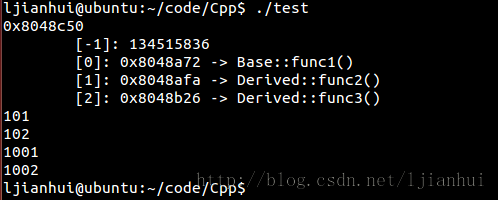
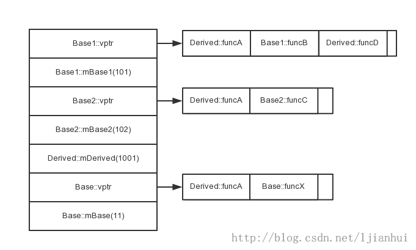

# [轉]C++对象模型之详述C++对象的内存布局

在**C++对象模型之简述C++对象的内存布局**一文中，详细分析了各种成员变量和成员函数对一个类（没有任何继承的）对象的内存分布的影响，及详细讲解了如何遍历对象的内存，包括虚函数表。如果你在阅读本文之前，还没有看过C++对象模型之简述C++对象的内存布局一文，建议先阅读一下。而本文主要讨论继承对于对象的内存分布的影响，包括：继承后类的对象的成员的布局、继承对于虚函数表的影响、virtual函数机制如何实现、运行时类型识别等。由于在C++中继承的关系比较复杂，所以本文会讨论如下的继承情况：
```
1）单一继承
2）多重继承
3）重复继承
4）单一虚拟继承
5）钻石型虚拟继承
```

此外，当一个类作为一个基类时，它的析构函数应该是virtual函数，这样下面的代码才能正确地运行
```cpp
Base *p = new Derived;
...
delete p;
```
在本文的例子，为了验证虚函数表的内容，会遍历并调用虚函数表中的所有函数。但是当析构函数为virtual时，在遍历的过程中就会调用到对象的析构函数，从而对对象进行析构的操作，导致接下来的调用出错。但是本文的目的是分析和验证C++对象的内存布局，而不是设计一个软件，析构函数为非virtual函数，并不会影响我们的分析和理解，因为virtual析构函数与其他的virtual函数是一样的，只是做的事不一样。所以在本文中的例子中，析构函数均不为virtual，特此说明一下。

同时为了调用的方便，所有的virtual的函数原型均为：返回值为void，参数也为void。

注：以下的例子中的测试环境为：32位Ubuntu 14.04 g++ 4.8.2，若在不同的环境中进行测试，结果可能有不同。

###1、根据指向虚函数表的指针（vptr）遍历虚函数表
由于在访问对象的内存时，都要遍历虚函数表来确定虚函数表中的内容，所以对这部分的功能抽象出来，写成一个函数，如下：
```cpp
void visitVtbl(int **vtbl, int count)
{
    cout << vtbl << endl;
    cout << "\t[-1]: " << (long)vtbl[-1] << endl;

    typedef void (*FuncPtr)();
    for (int i = 0; vtbl[i] && i < count; ++i)
    {
        cout << "\t[" << i << "]: " << vtbl[i] << " -> ";
        FuncPtr func = (FuncPtr)vtbl[i];
        func();
    }
}
```

代码解释：
参数vtbl为虚函数表的第一个元素的地址，也就是对象中的vptr的值。参数count指的是该虚函数表中虚函数的数量。由于虚函数表中保存的信息并不全是虚函数的地址，也不是所有的虚函数表中都以NULL表示虚函数表中的函数地址已经到了尽头。所以为了让测试程序更好地运行，所以加上这一参数。

虚函数表保存的是函数的指针，若把虚函数表当作一个数组，则要指向该数组需要一个双指针，即参数中的int **vtbl，获取函数指针的值，即获取数组中元素的值，可以通过vtbl[i]来获得。

虚函数表中还保存着对象的类型信息，通常为了便于查找对象的类型信息，使用虚函数表中的索引（下标）为-1的位置保存该类对应的类型信息对象（即类std::type_info的对象）的地址，即保存在第一个虚函数的地址之前。

###2、单一继承
类的具体代码如下：
```cpp
class Base
{
    public:
        Base()
        {
            mBase1 = 101;
            mBase2 = 102;
        }
        virtual void func1()
        {
            cout << "Base::func1()" << endl;
        }
        virtual void func2()
        {
            cout << "Base::func2()" << endl;
        }
    private:
        int mBase1;
        int mBase2;
};

class Derived : public Base
{
    public:
        Derived():
            Base()
        {
            mDerived1 = 1001;
            mDerived2 = 1002;
        }
        virtual void func2()
        {
            cout << "Derived::func2()" << endl;
        }
        virtual void func3()
        {
            cout << "Derived::func3()" << endl;
        }
    private:
        int mDerived1;
        int mDerived2;
};
```
使用如下的代码进行测试：
```cpp
int main()
{
    Derived d;
    char *p = (char*)&d;
    visitVtbl((int**)*(int**)p, 3);
    p += sizeof(int**);

    cout << *(int*)p << endl;
    p += sizeof(int);

    cout << *(int*)p << endl;
    p += sizeof(int);

    cout << *(int*)p << endl;
    p += sizeof(int);

    cout << *(int*)p << endl;

    return 0;
}
```
代码解释：
在测试代码中，最难明白的就是以下语句中的参数：
visitVtbl((int**)*(int**)p, 3);
char指针p指向了对象中的vptr，由于vptr也是一个指针，所以p应该是一个双指针，对其解引用（*p）可以获得vptr的值。然而在同一个系统中，无论是什么类型的指针，其占用的内存大小都是相同的（一般在32位系统中为4字节，64位系统中为8字节），所以可以通过以下语句获取vptr的值：
 (int**)*(int**)p;
该语句，进行了三件事：
```
1）把char指针p进行类型转换，转换成int**，即（int**)p;
2）通过解引用运行符“*”，获得vptr的值，类型为int*。其实vptr本质是一个双指针，但是所有的指针占用的内存都是相等的，所以这个操作并不会导致地址值的截断。即*(int**)p;
3）由于vptr本质是一个双指针，所以再一次把vptr转化成一个双指针。即(int**)*(int**)p;
```

注：在不少的文章中，可以看到作者把虚函数表中的项的内容当做一个整数来对待，但是本文中，我并没有这样做。因为在不同的系统（32位或64位）中的指针的位数是不同的，为了让代码能兼容32位和64位的系统，这里统一把虚函数表中的项当指针看待。

在以后的例子若中出现相似的代码，都是相同的原理，不再解释。

其运行结果如下：




根据测试的输出的结果，可以得出类Derived的对象的内存布局图如下：


据此，针对单一继承可以得出以下结论：
```
1）vptr位于对象的最前端。
2）非static的成员变量根据其继承顺序和声明顺序排在vptr的后面。
3）派生类继承基类所声明的虚函数，即基类的虚函数地址会被复制到派生类的虚函数表中的相应的项中。
4）派生类中新加入的virtual函数跟在其继承而来的virtual的后面，如本例中，子类增加的virtual函数func3被添加到func2后面。
5）若子类重写其父类的virtual函数，则子类的虚函数表中该virtual函数对应的项会更新为新函数的地址，如本例中，子类重写了virtual函数func2，则虚函数表中func2的项更新为子类重写的函数func2的地址。
```
###3、多重继承
类的具体代码如下：
```cpp
class Base1
{
    public:
        Base1()
        {
            mBase1 = 101;
        }
        virtual void funcA()
        {
            cout << "Base1::funcA()" << endl;
        }
        virtual void funcB()
        {
            cout << "Base1::funcB()" << endl;
        }
    private:
        int mBase1;
};

class Base2
{
    public:
        Base2()
        {
            mBase2 = 102;
        }
        virtual void funcA()
        {
            cout << "Base2::funcA()" << endl;
        }
        virtual void funcC()
        {
            cout << "Base2::funcC()" << endl;
        }
    private:
        int mBase2;
};

class Derived : public Base1, public Base2
{
    public:
        Derived():
            Base1(),
            Base2()
        {
            mDerived = 1001;
        }
        virtual void funcD()
        {
            cout << "Derived::funcD()" << endl;
        }
        virtual void funcA()
        {
            cout << "Derived::funcA()" << endl;
        }
    private:
        int mDerived;
};
```
使用如下代码进行测试：
```cpp
int main()
{
    Derived d;
    char *p = (char*)&d;
    visitVtbl((int**)*(int**)p, 3);
    p += sizeof(int**);

    cout << *(int*)p << endl;
    p += sizeof(int);

    visitVtbl((int**)*(int**)p, 3);
    p += sizeof(int**);

    cout << *(int*)p << endl;
    p += sizeof(int);

    cout << *(int*)p << endl;

    return 0;
}
```
其运行结果如下：


根据测试的输出的结果，可以得出类Derived的对象的内存布局图如下：


据此，针对多重继承可以得出以下结论：
```
1）在多重继承下，一个子类拥有n-1张额外的虚函数表，n表示其上一层的基类的个数。也就是说，在多重继承下，一个派生类会有n个虚函数表。其中一个为主要实例，它与第一个基类（如本例中的Base1）共享，其他的为次要实例，与其他基类（如本例中的Base2）有关。
2）子类新声明的virtual函数，放在主要实例的虚函数表中。如本例中，子类新声明的与Base1共享的虚函数表中。
3）每一个父类的子对象在子类的对象保持原样性，并依次按声明次序排列。
4）若子类重写virtual函数，则其所有父类中的签名相同的virtual函数被会被改写。如本例中，子类重写了funcA函数，则两个虚函数表中的funcA函数的项均被更新为子类重写的函数的地址。这样做的目的是为了解决不同的父类类型的指针指向同一个子类实例，而能够调用到实际的函数。
```
###4、重复继承
所谓的重复继承，就是某个父类被间接地重复继承了多次。

类的具体代码如下：
```cpp
class Base
{
    public:
        Base()
        {
            mBase = 11;
        }
        virtual void funcA()
        {
            cout << "Base::funcA()" << endl;
        }
        virtual void funcX()
        {
            cout << "Base::funcX()" << endl;
        }
    protected:
        int mBase;
};
class Base1 : public Base
{
    public:
        Base1():
            Base()
        {
            mBase1 = 101;
        }
        virtual void funcA()
        {
            cout << "Base1::funcA()" << endl;
        }
        virtual void funcB()
        {
            cout << "Base1::funcB()" << endl;
        }
    private:
        int mBase1;
};
class Base2 : public Base
{
    public:
        Base2():
            Base()
        {
            mBase2 = 102;
        }
        virtual void funcA()
        {
            cout << "Base2::funcA()" << endl;
        }
        virtual void funcC()
        {
            cout << "Base2::funcC()" << endl;
        }
    private:
        int mBase2;
};
class Derived : public Base1, public Base2
{
    public:
        Derived():
            Base1(),
            Base2()
        {
            mDerived = 1001;
        }
        virtual void funcD()
        {
            cout << "Derived::funcD()" << endl;
        }
        virtual void funcA()
        {
            cout << "Derived::funcA()" << endl;
        }
    private:
        int mDerived;
};
```
使用如下代码进行测试：
```cpp
int main()
{
    Derived d;
    char *p = (char*)&d;
    visitVtbl((int**)*(int**)p, 4);
    p += sizeof(int**);

    cout << *(int*)p << endl;
    p += sizeof(int);

    cout << *(int*)p << endl;
    p += sizeof(int);

    visitVtbl((int**)*(int**)p, 3);
    p += sizeof(int**);

    cout << *(int*)p << endl;
    p += sizeof(int);

    cout << *(int*)p << endl;
    p += sizeof(int);

    cout << *(int*)p << endl;
    return 0;
}
```
其运行结果如下：


根据测试的输出的结果，可以得出类Derived的对象的内存布局图如下：


据此，针对重复继承可以得出以下结论：
```
1）重复继承后，位于继承层次顶端的父类Base分别被子类Base1和Base2继承，并被类Derived继承。所以在D中有类的对象中，存在Base1的子对象，同时也存在Base2的子对象，这两个子对象都拥有Base子对象，所以Base子对象（成员mBase）在Derived中存在两份。

2）二义性的原因。由于在子类的对象中，存在两份父类的成员，当在Derived类中使用如下语句：
mBase = 1;
就会产生歧义。因为在该对象中有两处的变量的名字都叫mBase，所以编译器不能判断究竟该使用哪一个成员变量。所以在访问Base中的成员时，需要加上域作用符来明确说明是哪一个子类的成员，如：
Base1::mBase = 1;

重复继承可能并不是我们想要的，C++提供虚拟继承来解决这个问题，下面详细讲解虚拟继承。
```

### 5、单一虚拟继承
具体代码如下（类的实现与重复继承中的代码相同，只是Base1的继承关系变为虚拟继承）：
```cpp
class Base  { ...... };
class Base1 : virtual public Base  { ...... };
```
使用如下的代码进行测试：
```cpp
int main()
{
    Base1 b1;
    char *p = (char*)&b1;
    visitVtbl((int**)*(int**)p, 3);
    p += sizeof(int**);

    cout << *(int*)p << endl;
    p += sizeof(int);

    visitVtbl((int**)*(int**)p, 3);
    p += sizeof(int**);

    cout << *(int*)p << endl;
    return 0;
}
```
其运行结果如下：


根据测试的输出的结果，可以得出类B1的对象的内存布局图如下：


通过与普通的单一继承比较可以知道，单一虚继承与单一继承的对象的内存布局存在明显的不同。表现为以下的方面
```
1）成员的顺序问题。在普通的单一继承中，基类的成员位于派生类的成员之前。而在单一虚继承中，首先是其普通基类的成员，接着是派生类的成员，最后是虚基类的成员。
2）vptr的个数问题。在普通的单一继承中，派生类只有一个虚函数表，所以其对象只有一个vptr。而在单一虚继承中，派生类的虚函数表有n个（n为虚基类的个数）额外的虚数函数表，即总有n+1个虚函数表。
3）派生自虚基类的派生类的虚函数表中，并不含有虚基类中的virtual函数，但是派生类重写的virtual函数会在所有虚函数表中得到更新。如本例中，第一个虚函数表中，并不含有Base::funcX的函数地址。
```

注：在测试代码中，我把count传递的值为3，而结果却只调用了2个函数，可见并不是count参数限制了虚函数表的遍历。

一个类如果内含一个或多个虚基类子对象，像Base1那样，将会被分割为两部分：一个不变区域和一个共享区域。不变区域中的数据，不管后续如何变化，总是拥有固定的偏移量（从对象的开头算起），所以这一部分可以被直接存取。共享区域所对应的就是虚基类子对象。

###6、钻石型虚拟继承
具体代码如下（类的实现与重复继承中的代码相同，只是Base1和Base2的继承关系变为虚拟继承）：
```cpp
class Base  { ...... };
class Base1 : virtual public Base  { ...... };
class Base2 : virtual public Base  { ...... };
class Derived : public Base1, public Base2 { ...... };
```
使用如下的代码对对象的内存布局进行测试：
```cpp
int main()
{
    Derived d;
    char *p = (char*)&d;
    visitVtbl((int**)*(int**)p, 3);
    p += sizeof(int**);

    cout << *(int*)p << endl;
    p += sizeof(int);

    visitVtbl((int**)*(int**)p, 2);
    p += sizeof(int**);

    cout << *(int*)p << endl;
    p += sizeof(int);

    cout << *(int*)p << endl;
    p += sizeof(int);

    visitVtbl((int**)*(int**)p, 2);
    p += sizeof(int**);

    cout << *(int*)p << endl;
    return 0;
}
```
其运行结果如下：


根据测试的输出的结果，可以得出类Derived的对象的内存布局图如下：



使用虚继承后，在派生类的对象中只存在一份的Base子对象，从而避免了二义性。由于是多重继承，且有一个虚基类（Base），所以Derived类拥有三个虚函数表，其对象存在三个vptr。如上图所示，第一个虚函数表是由于多重继承而与第一基类（Base1）共享的主要实例，第二个虚函数表是与其他基类（Base2）有关的次要实例，第三个是虚基类的虚函数表。

类Derived的成员与Base1中的成员排列顺序相同，首先是以声明顺序排列其普通基类的成员，接着是派生类的成员，最后是虚基类的成员。

派生自虚基类的派生类的虚函数表中，也不含有虚基类中的virtual函数，派生类重写的virtual函数会在所有虚函数表中得到更新。

在类Derived的对象中，Base（虚基类）子对象部分为共享区域，而其他部分为不变区域。

###7、关于虚析构函数的说明
上面的的例子中，为了让测试程序正常的运行，我们都没有定义一个virtual的析构函数，但是这并不表示它不是本文的讨论内容。

若基类声明了一个virtual析构函数，则其派生类的析构函数会更新其所有的虚函数表中的析构函数的项，把该项中的函数地址更新为派生类的析构函数的函数地址。因为当基类的析构函数为virtual时，若用户不显示提供一个析构函数，编译器则会自动合成一个，所以若基类声明了一个virtual析构函数，则其派生 类中必然存在一个virtual的析构函数，并用这个virutal析构函数更新虚函数表。

###8、类型信息
在C++中，可以使用关键字typeid来获得一个对象所对应的类型信息，例如，以下代码：
Base *p;
......
cout << typeid(*p).name() << endl;

由于p是一个指针，它可以指向一个Base的对象，若者是Base的派生类，那么我们如何知道p所指的对象是什么类型呢？

通过观察2-6节中的例子的输出，可以发现，无论一个类有多少个虚函数，其下标为-1的项的值（即type_info对象的地址）都是相等的，即它们都指向相同的type_info对象。所以无论使用基类还是派生类的指针指向一个对象，都能根据对象的vptr指向的虚函数表正确地获得该对象所属的类的type_info对象，从而分辨出指针所指对象的真实类型。例如对于如下的测试代码（类的关系和实现是第6节中的钻石型虚拟继承）：
```cpp
int main()
{
    Derived d;
    Base *basePtr = &d;
    Base1 *base1Ptr = &d;
    Base2 *base2Ptr = &d;
    Derived *derivedPtr = &d;
    cout << typeid(*basePtr).name() << endl;
    cout << typeid(*base1Ptr).name() << endl;
    cout << typeid(*base2Ptr).name() << endl;
    cout << typeid(*derivedPtr).name() << endl;
    return 0;
}
```
其输出结果如下


从上面的运行可以看出，一个派生类的对象，无论被其任何基类的指针指向，都能通过typeid正确地获得其所指的对象的真实类型。

运行结果解释：
要理解运行的结果，就要理解当把一个派生类对象指针赋值给其基类指针时会发生什么样的行为。当使用基类的指针指向一个派生类的对象时，编译器会安插相应的代码，调整指针的指向，使基类的指针指向派生类对象中其对应的基类子对象的起始处。

所以通过测试代码中的指针赋值，产生如下的结果：
```
basePtr 指向了对象d中的Base子对象的地址起始处，即指向了Base::vptr
base1Ptr 指向了对象d中的Base1子对象的地址起始处，即指向了Base1::vptr
base2Ptr 指向了对象d中的Base2子对象的地址起始处，即指向了Base2::vptr
derivedPtr 指向了对象d的地址起始处，即指向了Base1::vptr
```

即现在这些指针都指向了对应的类型的子对象，且其都包括一个vptr，所以就可以通过虚函数表中的第-1项的type_info对象的地址来获取type_info对象，从而获得类型信息。而这些地址值都是相同的，即指向同一个type_info对象，且该type_info对象显示该对象的类型为Derived，也就能正确地输出其类型信息。


### 9、虚函数调用的原理
我们知道，在C++中使用指向对象的指针或引用才能触发虚函数的调用，产生多态的结果。例如对于如下的代码片断：

```cpp
Base *p;
......
p->vfunc(); // vfunc是Base中声明的virtual函数
```
由于指针p可以指向一个Base的对象，也可以指向Base的派生类的对象，而编译器在编译时并不知道p所指向的真实对象到底是什么，那么究竟如何判断呢？

从各种的C++对象的内存分布中可以看到，尽管虚函数表中的虚函数地址可能被更新（派生类重写基类的virtual函数）或添加新的项（派生类声明新的virtual函数），但是一个相同签名的虚函数在虚函数表中的索引值却是不变的。所以无论p指向的是Base的对象，还是Base的派生类的对象，其virtual函数vfunc在虚函数表中的索引是不变的（均为1）。

在了解了C++对象的内存布局后，就能轻松地回答这个问题了。因为在编译时，编译器根本无需判断p所指向的具体对象是什么，而是根据指针p所指向的对象的Base子对象中的虚函数表来实现函数调用的。编译器可能会把virtual函数调用的代码修改为如下的伪代码：
(*p->vptr[1])(p); // 假设vfunc函数在虚函数表中的索引值为1，参数p为this指针

若p指向的是一个Base的对象，则调Base的虚函数表中索引值为1的函数。若p指向的是一个Base的派生类的对象，则调用Base的派生类对象的Base子对象的虚函数表中的索引值为1的函数。这样便实现了多态 。这种函数调用是根据指针p所指的对象的虚函数表来实现的，在编译时由于无法确定指针p所指的真实对象，所以无法确定真实要调用哪一个函数，只有在运行时根据指针p所指的对象来动态决定。所以说，虚函数是在运行时动态绑定的，而不是在编译时静态绑定的。
