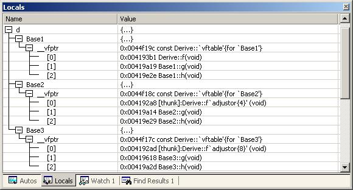

# C++ 虛函數表解析

http://blog.csdn.net/haoel/article/details/1948051

###前言

C++中的虛函數的作用主要是實現了多態的機制。關於多態，簡而言之就是用父類型別的指針指向其子類的實例，然後通過父類的指針調用實際子類的成員函數。這種技術可以讓父類的指針有“多種形態”，這是一種泛型技術。所謂泛型技術，說白了就是試圖使用不變的代碼來實現可變的算法。比如：模板技術，RTTI技術，虛函數技術，要麼是試圖做到在編譯時決議，要麼試圖做到運行時決議。


關於虛函數的使用方法，我在這裡不做過多的闡述。大家可以看看相關的C++的書籍。在這篇文章中，我只想從虛函數的實現機制上面為大家 一個清晰的剖析。

當然，相同的文章在網上也出現過一些了，但我總感覺這些文章不是很容易閱讀，大段大段的代碼，沒有圖片，沒有詳細的說明，沒有比較，沒有舉一反三。不利於學習和閱讀，所以這是我想寫下這篇文章的原因。也希望大家多給我提意見。

言歸正傳，讓我們一起進入虛函數的世界。


###虛函數表

對C++ 瞭解的人都應該知道虛函數（Virtual Function）是通過一張虛函數表（Virtual Table）來實現的。簡稱為V-Table。在這個表中，主是要一個類的虛函數的地址表，這張表解決了繼承、覆蓋的問題，保證其容真實反應實際的函數。這樣，在有虛函數的類的實例中這個表被分配在了這個實例的內存中，所以，當我們用父類的指針來操作一個子類的時候，這張虛函數表就顯得由為重要了，它就像一個地圖一樣，指明瞭實際所應該調用的函數。

這裡我們著重看一下這張虛函數表。C++的編譯器應該是保證虛函數表的指針存在於對象實例中最前面的位置（這是為了保證取到虛函數表的有最高的性能——如果有多層繼承或是多重繼承的情況下）。 這意味著我們通過對象實例的地址得到這張虛函數表，然後就可以遍歷其中函數指針，並調用相應的函數。

聽我扯了那麼多，我可以感覺出來你現在可能比以前更加暈頭轉向了。 沒關係，下面就是實際的例子，相信聰明的你一看就明白了。

假設我們有這樣的一個類：
```cpp
class Base {
    public:
        virtual void f() { cout << "Base::f" << endl; }
        virtual void g() { cout << "Base::g" << endl; }
        virtual void h() { cout << "Base::h" << endl; }

};
```
按照上面的說法，我們可以通過Base的實例來得到虛函數表。 下面是實際例程：
```cpp
typedef void(*Fun)(void);

Base b;

Fun pFun = NULL;

cout << "虛函數表地址：" << (int*)(&b) << endl;
cout << "虛函數表 — 第一個函數地址：" << (int*)*(int*)(&b) << endl;

// Invoke the first virtual function
pFun = (Fun)*((int*)*(int*)(&b));
pFun();
```
實際運行經果如下：(Windows XP+VS2003,  Linux 2.6.22 + GCC 4.1.3)

虛函數表地址：0012FED4
虛函數表 — 第一個函數地址：0044F148
```cpp
Base::f
```

通過這個示例，我們可以看到，我們可以通過強行把&b轉成int *，取得虛函數表的地址，然後，再次取址就可以得到第一個虛函數的地址了，也就是Base::f()，這在上面的程序中得到了驗證（把int* 強制轉成了函數指針）。通過這個示例，我們就可以知道如果要調用Base::g()和Base::h()，其代碼如下：
```cpp
(Fun)*((int*)*(int*)(&b)+0);  // Base::f()
(Fun)*((int*)*(int*)(&b)+1);  // Base::g()
(Fun)*((int*)*(int*)(&b)+2);  // Base::h()
```
這個時候你應該懂了吧。什麼？還是有點暈。也是，這樣的代碼看著太亂了。沒問題，讓我畫個圖解釋一下。如下所示：


注意：在上面這個圖中，我在虛函數表的最後多加了一個結點，這是虛函數表的結束結點，就像字符串的結束符“/0”一樣，其標誌了虛函數表的結束。這個結束標誌的值在不同的編譯器下是不同的。在WinXP+VS2003下，這個值是NULL。而在Ubuntu 7.10 + Linux 2.6.22 + GCC 4.1.3下，這個值是如果1，表示還有下一個虛函數表，如果值是0，表示是最後一個虛函數表。


下面，我將分別說明“無覆蓋”和“有覆蓋”時的虛函數表的樣子。沒有覆蓋父類的虛函數是毫無意義的。我之所以要講述沒有覆蓋的情況，主要目的是為了給一個對比。在比較之下，我們可以更加清楚地知道其內部的具體實現。

###一般繼承（無虛函數覆蓋）

下面，再讓我們來看看繼承時的虛函數表是什麼樣的。假設有如下所示的一個繼承關係：


請注意，在這個繼承關係中，子類沒有重載任何父類的函數。那麼，在派生類的實例中，其虛函數表如下所示：

對於實例：Derive d; 的虛函數表如下：


我們可以看到下面幾點：
```
1）虛函數按照其聲明順序放於表中。
2）父類的虛函數在子類的虛函數前面。
```
我相信聰明的你一定可以參考前面的那個程序，來編寫一段程序來驗證。


###一般繼承（有虛函數覆蓋）

覆蓋父類的虛函數是很顯然的事情，不然，虛函數就變得毫無意義。下面，我們來看一下，如果子類中有虛函數重載了父類的虛函數，會是一個什麼樣子？假設，我們有下面這樣的一個繼承關係。


為了讓大家看到被繼承過後的效果，在這個類的設計中，我只覆蓋了父類的一個函數：f()。那麼，對於派生類的實例，其虛函數表會是下面的一個樣子：


我們從表中可以看到下面幾點，
1）覆蓋的f()函數被放到了虛表中原來父類虛函數的位置。
2）沒有被覆蓋的函數依舊。

這樣，我們就可以看到對於下面這樣的程序，
```cpp
Base *b = new Derive();
b->f();
```

由b所指的內存中的虛函數表的f()的位置已經被Derive::f()函數地址所取代，於是在實際調用發生時，是Derive::f()被調用了。這就實現了多態。


###多重繼承（無虛函數覆蓋）

下面，再讓我們來看看多重繼承中的情況，假設有下面這樣一個類的繼承關係。注意：子類並沒有覆蓋父類的函數。


對於子類實例中的虛函數表，是下面這個樣子：


我們可以看到：
```
1）  每個父類都有自己的虛表。
2）  子類的成員函數被放到了第一個父類的表中。（所謂的第一個父類是按照聲明順序來判斷的）
```

這樣做就是為了解決不同的父類類型的指針指向同一個子類實例，而能夠調用到實際的函數。


###多重繼承（有虛函數覆蓋）

下面我們再來看看，如果發生虛函數覆蓋的情況。

下圖中，我們在子類中覆蓋了父類的f()函數。


下面是對於子類實例中的虛函數表的圖：


我們可以看見，三個父類虛函數表中的f()的位置被替換成了子類的函數指針。這樣，我們就可以任一靜態類型的父類來指向子類，並調用子類的f()了。如：

```cpp
Derive d;
Base1 *b1 = &d;
Base2 *b2 = &d;
    Base3 *b3 = &d;
b1->f(); //Derive::f()
b2->f(); //Derive::f()
b3->f(); //Derive::f()

b1->g(); //Base1::g()
b2->g(); //Base2::g()
b3->g(); //Base3::g()
```

### 安全性

每次寫C++的文章，總免不了要批判一下C++。這篇文章也不例外。通過上面的講述，相信我們對虛函數表有一個比較細緻的瞭解了。水可載舟，亦可覆舟。下面，讓我們來看看我們可以用虛函數表來乾點什麼壞事吧。

###一、通過父類型的指針訪問子類自己的虛函數
我們知道，子類沒有重載父類的虛函數是一件毫無意義的事情。因為多態也是要基於函數重載的。雖然在上面的圖中我們可以看到Base1的虛表中有Derive的虛函數，但我們根本不可能使用下面的語句來調用子類的自有虛函數：

```cpp
Base1 *b1 = new Derive();
b1->f1();  //編譯出錯
```

任何妄圖使用父類指針想調用子類中的未覆蓋父類的成員函數的行為都會被編譯器視為非法，所以，這樣的程序根本無法編譯通過。但在運行時，我們可以通過指針的方式訪問虛函數表來達到違反C++語義的行為。（關於這方面的嘗試，通過閱讀後面附錄的代碼，相信你可以做到這一點）


###二、訪問non-public的虛函數
另外，如果父類的虛函數是private或是protected的，但這些非public的虛函數同樣會存在於虛函數表中，所以，我們同樣可以使用訪問虛函數表的方式來訪問這些non-public的虛函數，這是很容易做到的。

如：
```cpp
class Base {
    private:
        virtual void f() { cout << "Base::f" << endl; }
};

class Derive : public Base{

};

typedef void(*Fun)(void);

void main() {
    Derive d;
    Fun  pFun = (Fun)*((int*)*(int*)(&d)+0);
    pFun();
}
```

###結束語
C++這門語言是一門Magic的語言，對於程序員來說，我們似乎永遠摸不清楚這門語言揹著我們在幹了什麼。需要熟悉這門語言，我們就必需要了解C++裡面的那些東西，需要去了解C++中那些危險的東西。不然，這是一種搬起石頭砸自己腳的編程語言。

在文章束之前還是介紹一下自己吧。我從事軟件研發有十個年頭了，目前是軟件開發技術主管，技術方面，主攻Unix/C/C++，比較喜歡網絡上的技術，比如分佈式計算，網格計算，P2P，Ajax等一切和互聯網相關的東西。管理方面比較擅長於團隊建設，技術趨勢分析，項目管理。歡迎大家和我交流，我的MSN和Email是：haoel@hotmail.com

###附錄一：VC中查看虛函數表

我們可以在VC的IDE環境中的Debug狀態下展開類的實例就可以看到虛函數表了（並不是很完整的）



###附錄 二：例程
下面是一個關於多重繼承的虛函數表訪問的例程：
```cpp
#include <iostream>
using namespace std;

class Base1 {
public:
            virtual void f() { cout << "Base1::f" << endl; }
            virtual void g() { cout << "Base1::g" << endl; }
            virtual void h() { cout << "Base1::h" << endl; }

};

class Base2 {
public:
            virtual void f() { cout << "Base2::f" << endl; }
            virtual void g() { cout << "Base2::g" << endl; }
            virtual void h() { cout << "Base2::h" << endl; }
};

class Base3 {
public:
            virtual void f() { cout << "Base3::f" << endl; }
            virtual void g() { cout << "Base3::g" << endl; }
            virtual void h() { cout << "Base3::h" << endl; }
};


class Derive : public Base1, public Base2, public Base3 {
public:
            virtual void f() { cout << "Derive::f" << endl; }
            virtual void g1() { cout << "Derive::g1" << endl; }
};


typedef void(*Fun)(void);

int main()
{
            Fun pFun = NULL;

            Derive d;
            int** pVtab = (int**)&d;

            //Base1's vtable
            //pFun = (Fun)*((int*)*(int*)((int*)&d+0)+0);
            pFun = (Fun)pVtab[0][0];
            pFun();

            //pFun = (Fun)*((int*)*(int*)((int*)&d+0)+1);
            pFun = (Fun)pVtab[0][1];
            pFun();

            //pFun = (Fun)*((int*)*(int*)((int*)&d+0)+2);
            pFun = (Fun)pVtab[0][2];
            pFun();

            //Derive's vtable
            //pFun = (Fun)*((int*)*(int*)((int*)&d+0)+3);
            pFun = (Fun)pVtab[0][3];
            pFun();

            //The tail of the vtable
            pFun = (Fun)pVtab[0][4];
            cout<<pFun<<endl;


            //Base2's vtable
            //pFun = (Fun)*((int*)*(int*)((int*)&d+1)+0);
            pFun = (Fun)pVtab[1][0];
            pFun();

            //pFun = (Fun)*((int*)*(int*)((int*)&d+1)+1);
            pFun = (Fun)pVtab[1][1];
            pFun();

            pFun = (Fun)pVtab[1][2];
            pFun();

            //The tail of the vtable
            pFun = (Fun)pVtab[1][3];
            cout<<pFun<<endl;


            //Base3's vtable
            //pFun = (Fun)*((int*)*(int*)((int*)&d+1)+0);
            pFun = (Fun)pVtab[2][0];
            pFun();

            //pFun = (Fun)*((int*)*(int*)((int*)&d+1)+1);
            pFun = (Fun)pVtab[2][1];
            pFun();

            pFun = (Fun)pVtab[2][2];
            pFun();

            //The tail of the vtable
            pFun = (Fun)pVtab[2][3];
            cout<<pFun<<endl;

            return 0;
}
```
