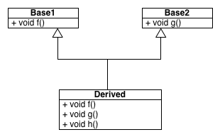
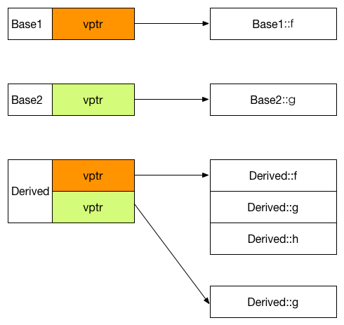

# 探索C++虛函數在g++中的實現


本文是我在追查一個詭異core問題的過程中收穫的一點心得，把公司項目相關的背景和特定條件去掉後，僅取其中通用的C++虛函數實現部分知識記錄於此。

在開始之前，原諒我先借用一張圖黑一下C++：


如果你也在寫C++，請一定小心…至少，你要先有所瞭解：當你在寫虛函數的時候，g++在寫什麼？


##先寫個例子

為了探索C++虛函數的實現，我們首先編寫幾個用來測試的類，代碼如下：

```cpp
#include <iostream>
using namespace std;

class Base1
{
public:
    virtual void f()
    {
        cout << "Base1::f()" << endl;
    }
};

class Base2
{
public:
    virtual void g()
    {
        cout << "Base2::g()" << endl;
    }
};

class Derived : public Base1, public Base2
{
public:
    virtual void f()
    {
        cout << "Derived::f()" << endl;
    }

    virtual void g()
    {
        cout << "Derived::g()" << endl;
    }

    virtual void h()
    {
        cout << "Derived::h()" << endl;
    }
};

int main(int argc, char* argv[])
{
    Derived ins;
    Base1& b1 = ins;
    Base2& b2 = ins;
    Derived& d = ins;

    b1.f();
    b2.g();
    d.f();
    d.g();
    d.h();

    return 0;
}
```




代碼的輸出結果和預期的一致，C++實現了虛函數覆蓋功能，代碼輸出如下：


```cpp
Derived::f()
Derived::g()
Derived::f()
Derived::g()
Derived::h()
```

##開始分析！

我寫這篇文章的重點是嘗試解釋g++編譯在底層是如何實現虛函數覆蓋和動態綁定的，因此我假定你已經明白基本的虛函數概念以及虛函數表（vtbl）和虛函數表指針（vptr）的概念和在繼承實現中所承擔的作用，如果你還不清楚這些概念，建議你在繼續閱讀下面的分析前先補習一下相關知識，`陳皓的《C++虛函數表解析》系列`是一個不錯的選擇。

通過本文，我將嘗試解答下面這三個問題：

- g++如何實現虛函數的動態綁定？
- vtbl在何時被創建？vptr又是在何時被初始化？
- 在Linux中運行的C++程序虛擬存儲器中，vptr、vtbl存放在虛擬存儲的什麼位置？

###g++如何實現虛函數的動態綁定？

這個問題乍看簡單，大家都知道是通過vptr和vtbl實現的，那就讓我們刨根問底的看一看，g++是如何利用vptr和vtbl實現的。

第一步，使用 `-fdump-class-hierarchy` 參數導出g++生成的類內存結構：

```sh
Vtable for Base1
Base1::_ZTV5Base1: 3u entries
0     (int (*)(...))0
4     (int (*)(...))(& _ZTI5Base1)
8     Base1::f
 
Class Base1
   size=4 align=4
   base size=4 base align=4
Base1 (0xb6acb438) 0 nearly-empty
    vptr=((& Base1::_ZTV5Base1) + 8u)
 
Vtable for Base2
Base2::_ZTV5Base2: 3u entries
0     (int (*)(...))0
4     (int (*)(...))(& _ZTI5Base2)
8     Base2::g
 
Class Base2
   size=4 align=4
   base size=4 base align=4
Base2 (0xb6acb474) 0 nearly-empty
    vptr=((& Base2::_ZTV5Base2) + 8u)
 
Vtable for Derived
Derived::_ZTV7Derived: 8u entries
0     (int (*)(...))0
4     (int (*)(...))(& _ZTI7Derived)
8     Derived::f
12    Derived::g
16    Derived::h
20    (int (*)(...))-0x000000004
24    (int (*)(...))(& _ZTI7Derived)
28    Derived::_ZThn4_N7Derived1gEv
 
Class Derived
   size=8 align=4
   base size=8 base align=4
Derived (0xb6b12780) 0
    vptr=((& Derived::_ZTV7Derived) + 8u)
  Base1 (0xb6acb4b0) 0 nearly-empty
      primary-for Derived (0xb6b12780)
  Base2 (0xb6acb4ec) 4 nearly-empty
      vptr=((& Derived::_ZTV7Derived) + 28u)
```



其中有幾點尤其值得注意：

- 我用來測試的機器是32位機，所有vptr佔4個字節，每個vtbl中的函數指針也是4個字節

- 每個類的主要（primal）vptr放在類內存空間的起始位置（由於我沒有聲明任何成員變量，可能看不清楚）

- 在多繼承中，對應各個基類的vptr按繼承順序依次放置在類內存空間中，且子類與第一個基類共用同一個vptr

- 子類中聲明的虛函數除了覆蓋各個基類對應函數的指針外，還額外添加一份到第一個基類的vptr中（體現了共用的意義）
有了內存佈局後，接下來觀察g++是如何在這樣的內存佈局上進行動態綁定的。

`g++對每個類的指針或引用對象，如果是其類聲明中虛函數，使用位於其內存空間首地址上的vptr尋找找到vtbl進而得到函數地址。如果是父類聲明而子類未覆蓋的虛函數，使用對應父類的vptr進行尋址`。

先來驗證一下，使用 objdump -S 得到 `b1.f()` 的彙編指令：

```sh
 b1.f();
 8048734:       8b 44 24 24             mov    0x24(%esp),%eax    # 得到Base1對象的地址
 8048738:       8b 00                   mov    (%eax),%eax        # 對對象首地址上的vptr進行解引用，得到vtbl地址
 804873a:       8b 10                   mov    (%eax),%edx        # 解引用vtbl上第一個虛函數的地址
 804873c:       8b 44 24 24             mov    0x24(%esp),%eax
 8048740:       89 04 24                mov    %eax,(%esp)
 8048743:       ff d2                   call   *%edx              # 調用函數
 ```
 
 其過程和我們的分析完全一致，聰明的你可能發現了，b2怎麼辦呢？Derived類的實例內存首地址上的vptr並不是Base2類的啊！答案實際上是因為g++在引用賦值語句 Base2 &b2 = ins 上動了手腳：
 
 ```sh
 Derived ins;
 804870d:       8d 44 24 1c             lea    0x1c(%esp),%eax
 8048711:       89 04 24                mov    %eax,(%esp)
 8048714:       e8 c3 01 00 00          call   80488dc <_ZN7DerivedC1Ev>
    Base1 &b1 = ins;
 8048719:       8d 44 24 1c             lea    0x1c(%esp),%eax
 804871d:       89 44 24 24             mov    %eax,0x24(%esp)
    Base2 &b2 = ins;
 8048721:       8d 44 24 1c             lea    0x1c(%esp),%eax   # 獲得ins實例地址
 8048725:       83 c0 04                add    $0x4,%eax         # 添加一個指針的偏移量
 8048728:       89 44 24 28             mov    %eax,0x28(%esp)   # 初始化引用
    Derived &d = ins;
 804872c:       8d 44 24 1c             lea    0x1c(%esp),%eax
 8048730:       89 44 24 2c             mov    %eax,0x2c(%esp)
 ```


`雖然是指向同一個實例的引用，根據引用類型的不同，g++編譯器會為不同的引用賦予不同的地址。`例如b2就獲得一個指針的偏移量，因此才保證了vptr的正確性。

PS：我們順便也證明了C++中的引用的真實身份就是指針…

接下來進入第二個問題：


###vtbl在何時被創建？vptr又是在何時被初始化？

既然我們已經知道了g++是如何通過vptr和vtbl來實現虛函數魔法的，那麼vptr和vtbl又是在什麼時候被創建的呢？

vptr是一個相對容易思考的問題，因為vptr明確的屬於一個實例，所以vptr的賦值理應放在類的構造函數中。`g++為每個有虛函數的類在構造函數末尾中隱式的添加了為vptr賦值的操作`。

同樣通過生成的彙編代碼驗證：


```sh
class Derived : public Base1, public Base2
{
 80488dc:       55                      push   %ebp
 80488dd:       89 e5                   mov    %esp,%ebp
 80488df:       83 ec 18                sub    $0x18,%esp
 80488e2:       8b 45 08                mov    0x8(%ebp),%eax
 80488e5:       89 04 24                mov    %eax,(%esp)
 80488e8:       e8 d3 ff ff ff          call   80488c0 <_ZN5Base1C1Ev>
 80488ed:       8b 45 08                mov    0x8(%ebp),%eax
 80488f0:       83 c0 04                add    $0x4,%eax
 80488f3:       89 04 24                mov    %eax,(%esp)
 80488f6:       e8 d3 ff ff ff          call   80488ce <_ZN5Base2C1Ev>
 80488fb:       8b 45 08                mov    0x8(%ebp),%eax
 80488fe:       c7 00 48 8a 04 08       movl   $0x8048a48,(%eax)
 8048904:       8b 45 08                mov    0x8(%ebp),%eax
 8048907:       c7 40 04 5c 8a 04 08    movl   $0x8048a5c,0x4(%eax)
 804890e:       c9                      leave
 804890f:       c3                      ret
 ```
 
 可以看到在代碼中，Derived類的構造函數為實例的兩個vptr賦初值，可是，這兩個初值居然是立即數！立即數！立即數！`這說明了vtbl的生成並不是運行時的，而是在編譯期就已經確定了存放在這兩個地址上的！`

這個地址不出意料的屬於.rodata（只讀數據段），使用 `objdump -s -j .rodata`
提取出對應的內存觀察：


```sh
80489e0 03000000 01000200 00000000 42617365  ............Base
 80489f0 313a3a66 28290042 61736532 3a3a6728  1::f().Base2::g(
 8048a00 29004465 72697665 643a3a66 28290044  ).Derived::f().D
 8048a10 65726976 65643a3a 67282900 44657269  erived::g().Deri
 8048a20 7665643a 3a682829 00000000 00000000  ved::h()........
 8048a30 00000000 00000000 00000000 00000000  ................
 8048a40 00000000 a08a0408 34880408 68880408  ........4...h...
 8048a50 94880408 fcffffff a08a0408 60880408  ............`...
 8048a60 00000000 c88a0408 08880408 00000000  ................
 8048a70 00000000 d88a0408 dc870408 37446572  ............7Der
 8048a80 69766564 00000000 00000000 00000000  ived............
 8048a90 00000000 00000000 00000000 00000000  ................
 8048aa0 889f0408 7c8a0408 00000000 02000000  ....|...........
 8048ab0 d88a0408 02000000 c88a0408 02040000  ................
 8048ac0 35426173 65320000 a89e0408 c08a0408  5Base2..........
 8048ad0 35426173 65310000 a89e0408 d08a0408  5Base1..........
 ```
 
 由於程序運行的機器是小端機，經過簡單的轉換就可以得到第一個vptr所指向的內存中的第一條數據為0x80488834，如果把這個數據解釋為函數地址到彙編文件中查找，會得到：

```sh
08048834 <_ZN7Derived1fEv>:
};
 
class Derived : public Base1, public Base2
{
public:
    virtual void f() {
 8048834:       55                      push   %ebp
 8048835:       89 e5                   mov    %esp,%ebp
 8048837:       83 ec 18                sub    $0x18,%esp
 ```
 
 Bingo！`g++在編譯期就為每個類確定了vtbl的內容，並且在構造函數中添加相應代碼使vptr能夠指向已經填好的vtbl的地址`。

這也同時為我們解答了第三個問題：

###在Linux中運行的C++程序虛擬存儲器中，vptr、vtbl存放在虛擬存儲的什麼位置？

直接看圖：


圖中灰色部分應該是你已經熟悉的，彩色部分內容和相關聯的箭頭描述了虛函數調用的過程（圖中展示的是通過new在堆區創建實例的情況，與示例代碼有所區別，小失誤，不要在意）：`當調用虛函數時，首先通過位於棧區的實例的指針找到位於堆區中的實例地址，然後通過實例內存開頭處的vptr找到位於.rodata段的vtbl，再根據偏移量找到想要調用的函數地址，最後跳轉到代碼段中的函數地址執行目標函數。`


##總結

研究這些問題的起因是因為公司代碼出現了非常奇葩的行為，經過追查定位到虛函數表出了問題，因此才有機會腳踏實地的對虛函數實現進行一番探索。

也許你會想，即使我不明白這些底層原理，也一樣可以正常的使用虛函數，也一樣可以寫出很好的面相對象的代碼啊？

這一點兒也沒有錯，但是，C++作為全宇宙最複雜的程序設計語言，它提供的功能異常強大，無異於武俠小說中鋒利無比的屠龍寶刀。但武功不好的菜鳥如果胡亂舞弄寶刀，卻很容易反被其所傷。只有瞭解了C++底層的原理和機制，才能讓我們把C++這把屠龍寶刀使用的更加得心應手，變化出更加華麗的招式，成為真正的武林高手。