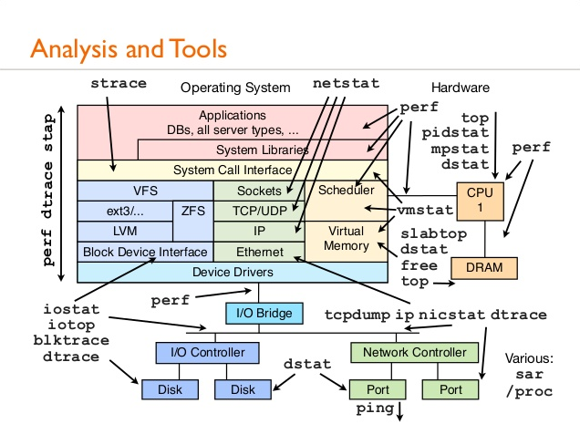

# [轉]在 Linux 下開發 C/C++ 的新手指南


新加入一個專案，最先面對的課題是如何正確地編譯和執行專案，可從 "It works on my machine" 如此地風行，印證這件事的困難性；再來則是閱讀負責工作相關的程式碼。至於發揮程式語言的特性，運用高階設計模式等，都是另開新專案或熟悉狀況後才有機會發揮。

過去數年沉浸在愉快的 scripting language 和開發新專案中，一直沒踏入這殘酷的世界。這篇記錄在這樣的情境下，可能需要的技能，結算一下這一個多月的心得，全都是血淚談啊 ...。

**系統工具**

熟悉作業系統的安裝套件是首要之務，這樣才知道如何補足需要的 header、library，或是安裝含 debug symbol 版的函式庫以執行 gdb 觀察程式或除錯。參見《**自行編譯含 debug symbol 的套件 (package)**》了解 Ubuntu/Debian 下的套件命名規則。

在未安裝套件的情況下，可用

```
aptitude search SUBSTRING # 找套件
aptitude show PACKAGE # 顯示套件用途
apt-file search X # 找出 X 包在那個套件裡，找 header 時很有用。
```

注意在用 apt-file 前要先跑 sudo apt-file update，不然搜不出東西來。

對於已安裝套件，可用

```
dpkg --search SUBSTRING # 找出安裝在那個套件，已知 header 時，適合用來找 library
dpkg -L PACKAGE # 列出套件內容，可用來找 header、library
locate SUBSTRING # 我比較常用它找 header 的位置，再觀看 header 內容執行 locate 前記得先執行 sudo updatedb，原因同 apt-file。
```

其它參考資料: How To Manage Packages Using apt-get, apt-cache, apt-file and dpkg Commands ( With 13 Practical Examples )

**編譯**
- 參考《解決 undefined symbol / reference》了解整個編譯的流程，先有觀念才清楚問題的環節，才能選對工具檢查問題。

- 另在《從 C 呼叫 C++ 函式的過程理解程式編譯、連結的原理》以一個小個案，從另一個角度描述編譯的流程來除錯。

- 《debug info 和 optimization》提到 -O 和 -g 可同時用，以及注意事項。

- 《讀懂函式庫的 man page》 說明使用系統函式庫時，如何從 man page 得知該定義的 feature test macro 和連結用的參數。

**連結**

這一塊讓我卡了一陣子。一些粗淺心得:

- 《列出用到的 shared library》。
- 《加速 linking time》
- 《ld, ld.so 和 ldconfig 的行為》

**執行**

光只是讀程式碼就像大海撈針一樣，不太有效率。可從動態執行過程找出主要執行的路徑，再專注相關的程式碼。

1. strace 和 ltrace

srace 是分析執行行為的強大工具，google 一下會看到很多別人的個案心得，看看再自己試一試，很快能上手，不知能發揮它多少功能。這裡列自己用的兩個小案例:

- 《善用 strace、debugger 從執行期間找出問題根源》
- 《熟悉系統工具好處多多》
- 《用 strace 找出 Ubuntu 如何提示未安裝的指令》
反而是 ltrace 一直都想不到使用它的時機，也沒找到好的個案心得文。

2. gdb

gdb 的重要性不需多說明，之前的幾則心得:

- 《gdb 初步心得》
- 《打開 core dump 和使用 cgdb 檢查程式掛點原因》
- 《追踪 glibc 裡的程式》
強烈建議使用 **cgdb**，簡易安裝 + 無痛上手，瞬間省下大量操作和讀碼的時間。

3. 打開除錯功能

依照開發者的習性，一定會留後門讓自己方便除錯，從這角度下手也可省下不少時間:

- 《C/C++ 檢查和打開 debug 功能的小技巧》

4. 載入函式庫

- 若在編譯、連結時無法解決相依問題，可考慮偷吃步**在載入程式時用 LD_PRELOAD 換掉部份函式**。

- 另外備忘用 LD_LIBRARY_PATH 補充載入 shared library 的位置，目前仍沒用過它。

除以上所言外，我另外有找過畫出程式流程的靜態和動態分析工具，像是畫 call graph 或是 C 的 cflow。不過 C++ 的靜態分析效果很糟，就沒花太多時間研究。目前用 strace 和 gdb 覺得已夠用了，不知用工具產生 call graph、class 相依圖或其它東西，是否會更有幫助。待有需求看整體的程式時再來試試。
閱讀程式碼
聽了大家的建議後，做了一些實際操作，而有些心得:

**《閱讀 C/C++ 原始碼的好幫手》**
- 《用 Eclipse CDT 讀 C/C++ 原始碼》

Eclipse CDT 雖然方便，後來我還是用 gj 居多。原因有幾點:

- 我已很習慣用 vim + screen 做事，gj 最合這個情境
- id-utils 真的是超級快
- 我針對自己的需求更新 gj 多次，愈用愈順手

另外 ack 也滿方便的，懶得建 index 或是想比對子字串時，可直接使用。當然 id-utils 也支援子字串比對，只是暫時懶得為此修改 gj 的程式，目前大部份需求是找完整的 symbol。

**熟悉 Linux 系統程式**
在基本工具都上手後，打算每天抽一點時間加減讀一點相關知識。一兩年下來應該會有不錯的成果。目前打算讀**《The Linux Programming Interface》**，年假時試看看效果如何。

這一個月的心得以了解 /proc 為主，對觀察 CPU 用量、RAM 用量、載入那些函式庫、multi-thread、程式執行狀態等都很有幫助:

- 《透過 /proc/PID/task/ 觀察 multi-thread 狀態》
- 《列出用到的 shared library》

**結論**

即使大概知道有那些東西，還是需要實際動手的經驗，才會真的學進去。一個月下來進步了不少，不過對於要面對的戰役，還有一大段路要趕上，還有很多很多要學的。

**2012-01-29 更新**
補上一些後來新寫的連結。此外，《The Linux Programming Interface》 相當實用，讀 ch1 ~ 3 讓我補足不少基礎知識。ch41、42 講解 shared library 也相當值得一看。相關心得見《The Linux Programming Interface 讀書心得》。

2013-07-13 更新
備忘效能分析相關的工具：




出處：Linux Performance Analysis and Tools

2013-07-20 更新
將後半部份內容抽出來，另寫了一篇比較完整的文章：**《了解 C/C++ 程式行為的技巧**》。
