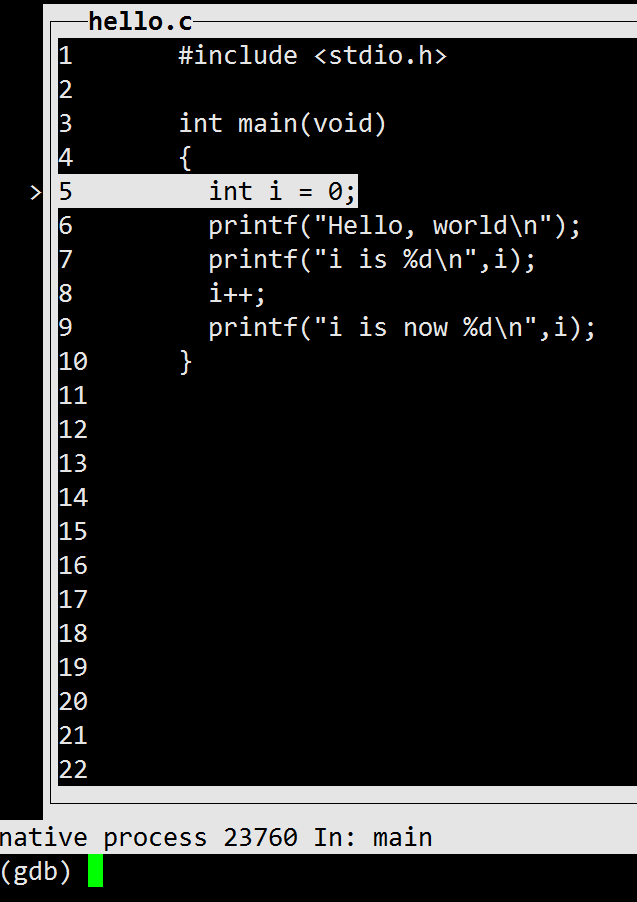
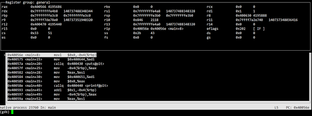
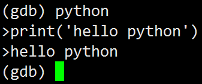

# GDB實用教學：自動化你的debug


如果不曉得什麼是GDB，建議從「`Linux 除錯利器 - GDB 簡介」`開始學習，此篇是給知道什麼是GDB，但總覺得GDB不是那麼好用的開發者，重新認識GDB，跟隨著影片的腳步，重現一次。


GDB也有GUI
雖然GDB是在終端機中使用，輸入l可以列出目前的程式碼，但大家一定還是覺得很難用，所以就有了tui的出現：

GDB也有GUI
雖然GDB是在終端機中使用，輸入l可以列出目前的程式碼，但大家一定還是覺得很難用，所以就有了tui的出現：

```sh
$ gdb -tui
or
$ gdbtui
```

都可以用指令的方式進入GDB的圖形介面。
但如果只以單純的
```
$ gdb
```

進入的話，只要按下ctrl + x +a 就可以了。




這邊以一個簡單的helloworld程式(hello.c)來說明：

```c
#include <stdio.h>

int main(void)
{
    int i = 0;
    printf("Hello, world\n");
    printf("i is %d\n", i);
    i++;
    printf("i is now %d\n", i);
}
```


接下來在終端機輸入： 
```
$ gcc -g -O0 -o hello hello.c
$ gdb ./hello
```

```
(gdb) start 
```
然後按下ctrl + x +a 後，就變成這樣了！


這時候，如果有遇到破圖，按下ctrl + L 就可以刷新畫面。
如要關閉tui，在按一次ctrl + x +a 即可
到這裡，大部份已知有tui可以用的人，都覺得沒什麼！
不過驚喜的就是：如果按ctrl + x + 2會出現組合語言(類似objdump出來的結果)的視窗！
再按一次相同的組合鍵，會跳出register的內容！
而且是以循環的方式呈現。




於gdbtui中，沒辦法使用 方向鍵上、方向鍵下 來使用之前使用過的指令，記得改用ctrl + p 和 ctrl +n來使用歷史指令。
或是透過ctrl + x + o 來切換active window，方向鍵上下，可能就會有你想要的功能了！


GDB也有python可以用
先來看個小示範，一樣是上面的hello.c

```sh
(gdb) r
(gdb) b hello.c:8
(gdb) c
(gdb) python
> print('hello python')
```

此時按下ctrl+D(或輸入end) 退出python，就可以看到輸出！



那更進一步呢：


GDB的物件可以與python互通：

試著輸入以下的指令，會有神奇的事情發生！ 
```sh
(gdb) python print (gdb.breakpoints())
(gdb) python print (gdb.breakpoints()[0].location)
(gdb) python gdb.Breakpoint('7')
```
這個功能，可以使GDB來輸出某些structure，使其格式漂漂亮亮。

##透過GDB自動化除錯
如果開發過程式的朋友都知道，有些memory/stack的問題，並非每次都會發生，但發生了又不知道問題在哪，這時候就是GDB出場救援的時刻了！


細節的部份，請參考影片，這裡僅以文字敘述：

```sh
$ while ./bug_program ; do echo OK; done
```


不斷測試，之後會出現segmentation fault(core dump)


輸入

```c
$ ls -lth core*
```
會出現某個紀錄最後stack的檔案
透過gdb -c 可以進行post mortem debugging，
原則上就是這個檔案會存有，當時該process的address space以及registers的值(包含general registers 和fault status registers)
這與我大四時，曾進行過的某個專案有點關係，有興趣可以看看。

ARM uVisor Debug Refinement Project(debugging facility improvements) from Jia-Rung(Jared) Chang

那麼該如何透過gdb利用這個core dump file呢?

```sh
$ gdb -c [core-dump-file]
```

會發現，即使輸入bt，因為stack已經被破壞了，GDB目前無法辨識。
所以只好利用自動化的GDB測試，重現問題點，並且透過reverse-gdb重現。

```sh
$ gdb ./bug_program
```

```sh
(gdb) b main
(gdb) b [program last line]
```
GDB會分別顯示對應的中斷點編號，或是透過

```sh
(gdb) info b
```

可以看到對應編號，然後透過command + 編號，可以指定當中斷發生時，要做的對應行為：(假設main是中斷點2)，每一行就是一個指令，然後結束輸入end即可。

```sh
(gdb) command 2
(gdb) record
(gdb) continue
(gdb) end
```

如果之後過程中，有要一直按enter顯示下一頁，可以透過
```sh
(gdb) set pagination off
```

來避免這個麻煩。

然後如果程式的最後一行假設是中斷點3：

```sh
(gdb) command 3
(gdb) run
(gdb) end
```

可以透過這些指令，讓程式不斷的在GDB中重複運行，接下來就可以準備開始了！

```sh
(gdb) run
```

就會不斷重複執行，直到問題發生！


問題發生後
```sh
(gdb) p $pc
```

可以看到pc的位置，輸出可能是：1 = (void (*))0x5e4c5d00
如果透過： 
```sh
(gdb) p/x *0x5e4c5d00
```

可能會出現
```sh
Cannot access memory at address 0x5e4c5d00
```

因為一般core dump就是因為存取到不合法的address(不屬於此address space的空間)所導致的。 
如果輸入
```sh
(gdb) bt
```

應該也只會得到一堆"?"的frame，無用的資訊。


這時候reverse GDB就要出場了
輸入
```sh
(gdb) reverse-stepi
```

就能看到程式最後執行到哪一行了！
那倒底怎麼回事了呢？
透過
```sh
(gdb) disassemble
```

可以發現，是最後的return發生問題，此時輸入：

```sh
(gdb) print $sp
```

可能會輸出：2 = (void *) 0x7fffffffdc98
```sh
(gdb) print *(long**)0x7fffffffdc98
```

這就是有bug的address !!(sp企圖存取的位置)

那這個位置是誰導致的問題呢？
透過watch point來觀察： 
```sh
(gdb) watch *(long**)0x7fffffffdc98
(gdb) reverse-continue
```
watch-point就會噴出到底是哪一行code搞的鬼！ 

##延伸指令
投影片的最後有列出一些好用的指令，這裏特別列出，我覺得很有用的部分：
```sh
(gdb) info line hello.c:6
(gdb) info line *$pc
```

列出該行程式碼，對應的組合語言

```sh
(gdb) save breakpoints breakpoints.record
```

將使用過的breakpoints儲存成breakpoints.record(檔案)

```sh
(gdb) dprintf location,template,expression [,expression ...]
```

參考這裡 

```sh
(gdb) break xxx if yyy
```

這個值得注意的是，GDB裡面可以呼叫程式內已有的function或一些標準的library function，[如這個stackoverflow的例子](http://stackoverflow.com/questions/4183871/how-do-i-set-a-conditional-breakpoint-in-gdb-when-char-x-points-to-a-string-wh)

```
(gdb) call [function]
```

類似(gdb) print [function]，可是不會顯示回傳值，但經過測試，兩者行為幾乎一樣 

```sh
(gdb) commands
```

所有中斷點，發生時，要做的指令清單，輸入end結束。

```sh
(gdb) commands
(gdb) [some commands]
(gdb) silent
(gdb) [some commands]
(gdb) end
```

silent是特殊的中斷點指令，會使silent之後的GDB提示都不顯示，如果commands後馬上接silent，連中斷發生的提示都不會顯示！ 


另外，GDB一樣有類似macro的機制可以使用，用來看大量structure還不錯用，可以參考我以前用過簡單的macro
