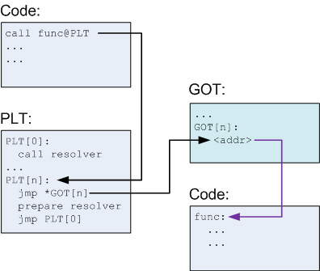
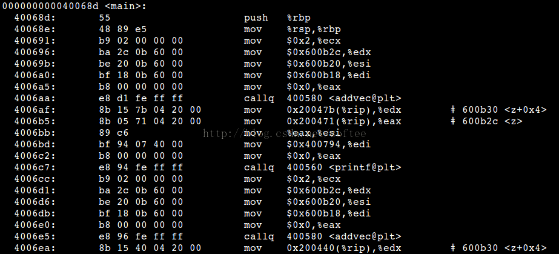
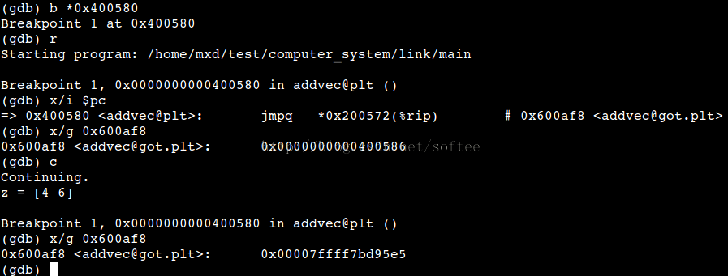

# GOT和PLT原理簡析




GOT(Global Offset Table)和PLT(Procedure Linkage Table)是Linux系統下面ELF格式的可執行文件中，用於定位全局變量和過程的數據信息。以C程序為例，一個程序可能會包含多個文件，可執行文件的生成過程通常由以下幾步組成。

1. 編譯器把每個.c文件編譯成彙編(.s)文件。

2. 彙編器把每個(.s)文件轉換為(.o)文件。

3. 鏈接器把多個.o文件鏈接為一個可執行文件（.out）。

.s文件是彙編文件的後綴，一般對此種類型文件的關注不多，不再討論，重點在.o文件和.out文件。

.c文件中通常有對變量和過程的使用，若是變量和過程定義在當前文件中，則可以使用相對偏移尋址來調用。若是定義在其他文件中，則在編譯當前文件時無法獲取其地址；若是定義在動態庫中，則直到程序被加載、運行時，才能夠確定。本文通過《深入理解計算機系統》中講動態鏈接一章中的例子，通過gdb的調試，研究調用動態庫中函數時的重定位過程。

### 1. 動態庫程序。

- addvec.c

```c
void addvec(int *x, int *y, int *z, int n){
  int i;

  for(i = 0; i < n; i++)
    z[i] = x[i] + y[i];
}
```

通過命令

```sh
gcc -fPIC -shared addvec.c -o libvec.so
```

可以把上面的程序轉換為動態庫libvec.so。

###2. 調用動態庫的主程序。

```c
#include <stdio.h>

int x[2] = {1, 2};
int y[2] = {3, 4};
int z[2];

int main(){
  addvec(x, y, z, 2);
  printf("z = [%d %d]\n", z[0], z[1]);
  addvec(x, y, z, 2);
  printf("z = [%d %d]\n", z[0], z[1]);

  return 0;
}
```


通過命令

```sh
gcc main.c -o main -L./ -lvec
```

生成可執行文件main。-L./ -lvec表示鏈接當前目錄下的動態鏈接庫libvec.so。

使用命令

```sh
objdump -ds main > main.dmp
```

反彙編main。

反彙編生成的文件中，主要有三個段與對動態庫函數addvec的調用有關：.got.plt，.plt和代碼段.text。

代碼段容易理解，就是程序語句所對應的指令組成的。.got.plt中保存的是數據，為每個動態調用保存一個條目，條目的內容應該是對動態庫函數的調用所跳轉到的目標地址。由於Linux採用了延遲綁定技術，可執行文件中got.plt中的地址並不是目標地址，而是動態鏈接器（ld-linux）中的地址。在程序執行的第一次調用時，ld-linux把.got.plt的地址填寫正確，之後的調用，就可以使用.got.plt中的目標地址了。.plt段中的內容則是實現跳轉操作的代碼片段。

###代碼段：



### .got.plt


### .plt


源代碼中，對於函數的addvec的兩次調用，命令為

callq  400580 <addvec@plt>

調用的目標地址是.plt段中的addvec@plt函數。該函數由三條語句組成，其作用分別為：

1. 跳轉到地址600af8，這個地址位於.got.plt中。從圖中可以看到got.plt起始於600ad0，終止於600b08(600b00 + 8)。並且600af8的內容為86054000，按照小端的讀法，其內容為00400586，實際就是下一條（第2條）指令。

2. 第二條指令把當前函數的id(0x2)壓入棧中。

3. 第三條指令，跳轉到400550，這之後的工作可以視為系統在運行時填充地址600af8的過程。也就是在延遲綁定機制下，第一次執行時，600af8的內容是400586，第二次及之後的內容就會修改為addvec函數的實際地址，可以通過gdb來驗證。




可以看到，第一次調用addvec的時候，地址600af8中的內容是0x0000000000400586，第二次調用的時候就變成了0x00007ffff7bd95e5，是addvec的實際入口地址，與預期的相同。