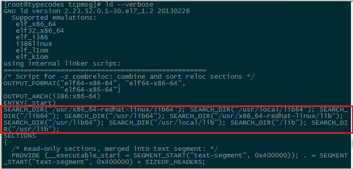

# Linux gcc鏈接動態庫出錯：LIBRARY_PATH和LD_LIBRARY_PATH的區別


昨天在自己的CentOs7.1上寫makefile的時候，發現在一個C程序在編譯並鏈接一個已生成好的lib動態庫的時候出錯。鏈接命令大概是這樣的：


```sh
[root@typecodes tcpmsg]# gcc -o hello main.c -lmyhello
/usr/bin/ld: cannot find -lmyhello
collect2: error: ld returned 1 exit status
```


##1 gcc鏈接動態庫時的搜索路徑

自以為在當前工程中設置好了環境變量`LD_LIBRARY_PATH`包含了工程中的lib庫路徑，並且還在`/etc/ld.so.conf/apphome.conf`中配置了lib庫的路徑。那麼在調用動態庫的時候，gcc就應該能自動去搜索該目錄。


很遺憾ld鏈接器報瞭如上的錯誤，但是如果在上面的gcc命令中添加上-L /root/gcc_test/tcp_msg/lib/參數，即明確動態庫的絕對路徑，是能夠鏈接成功的。


##2 Google上查找 /usr/bin/ld: cannot find -l* 的出錯原因

gg了很久gcc ld鏈接動態庫出錯的原因，結果還是沒找到理想的答案。後來猜想是不是在CentOs7中LD_LIBRARY_PATH不起作用的緣故，但是也不應該，因為自己用的GCC（version 4.8.3）跟操作系統沒關係。於是重新搜索了gcc LD_LIBRARY_PATH的作用，竟然發現
`gcc在編譯鏈接時鏈接的動態庫跟LIBRARY_PATH有關`而跟`  `LD_LIBRARY_PATH沒關係`！

## 3 關於Linux gcc中的LIBRARY_PATH和LD_LIBRARY_PATH參數說明

下面摘取了兩篇較權威的說明資料：

### 1、GNU上關於LIBRARY_PATH的說明：

```sh
LIBRARY_PATH
The value of LIBRARY_PATH is a colon-separated list of directories, much like PATH.
When configured as a native compiler, GCC tries the directories thus specified when searching for special linker files, if it can't find them using GCC_EXEC_PREFIX.
Linking using GCC also uses these directories when searching for ordinary libraries for the -l option (but directories specified with -L come first).
```

### 2、man7上關於LD_LIBRARY_PATH的說明：

```sh
LD_LIBRARY_PATH
A colon-separated list of directories in which to search for
ELF libraries at execution-time.  Similar to the PATH
environment variable.  Ignored in set-user-ID and set-group-ID
programs.
```

後面發現StackOverflow上關於`LIBRARY_PATH`和`LD_LIBRARY_PATH`的解釋更直白：
```sh
LIBRARY_PATH is used by gcc before compilation to search for directories containing libraries that need to be linked to your program.

LD_LIBRARY_PATH is used by your program to search for directories containing the libraries after it has been successfully compiled and linked.

EDIT: As pointed below, your libraries can be static or shared.
If it is static then the code is copied over into your program and you don't need to search for the library after your program is compiled and linked.
If your library is shared then it needs to be dynamically linked to your program and that's when LD_LIBRARY_PATH comes into play.
```

通過這三篇資料的說明，很快明白了`LIBRARY_PATH`和`LD_LIBRARY_PATH`的作用。於是，自己在項目配置文件中添加`export LIBRARY_PATH=${LIBRARY_PATH}:${APPHOME}/lib`。接著將這個配置文件加載到CentOs的環境變量中，這樣就在gcc編譯不用加-L參數生成目標文件CommuTcp了。


## 4 總結

關於`LIBRARY_PATH`和`LD_LIBRARY_PATH`的關係，這裡自己再總結一下。

###4.1 Linux gcc編譯鏈接時的動態庫搜索路徑

GCC編譯、鏈接生成可執行文件時，動態庫的搜索路徑順序如下（注意不會遞歸性地在其子目錄下搜索）：

```sh
1、gcc編譯、鏈接命令中的-L選項；
2、gcc的環境變量的LIBRARY_PATH（多個路徑用冒號分割）；
3、gcc默認動態庫目錄：/lib:/usr/lib:usr/lib64:/usr/local/lib。
```

###4.2 執行二進制文件時的動態庫搜索路徑

鏈接生成二進制可執行文件後，在運行程序加載動態庫文件時，搜索的路徑順序如下：


```sh
1、編譯目標代碼時指定的動態庫搜索路徑：用選項-Wl,rpath和include指定的動態庫的搜索路徑，比如gcc -Wl,-rpath,include -L. -ldltest hello.c，在執行文件時會搜索路徑`./include`；
2、環境變量LD_LIBRARY_PATH（多個路徑用冒號分割）；
3、在 /etc/ld.so.conf.d/ 目錄下的配置文件指定的動態庫絕對路徑（通過ldconfig生效，一般是非root用戶時使用）；
4、gcc默認動態庫目錄：/lib:/usr/lib:usr/lib64:/usr/local/lib等。
```

其中，Linux GCC默認的動態庫搜索路徑可以通過`ld --verbose`命令查看：

```sh
[root@typecodes tcpmsg]# ld --verbose
    ............
    SEARCH_DIR("/usr/x86_64-redhat-linux/lib64");
    SEARCH_DIR("/usr/local/lib64");
    SEARCH_DIR("/lib64");
    SEARCH_DIR("/usr/lib64");               ##### 64位系統
    SEARCH_DIR("/usr/x86_64-redhat-linux/lib");
    SEARCH_DIR("/usr/local/lib");
    SEARCH_DIR("/lib");
    SEARCH_DIR("/usr/lib");
    
```



