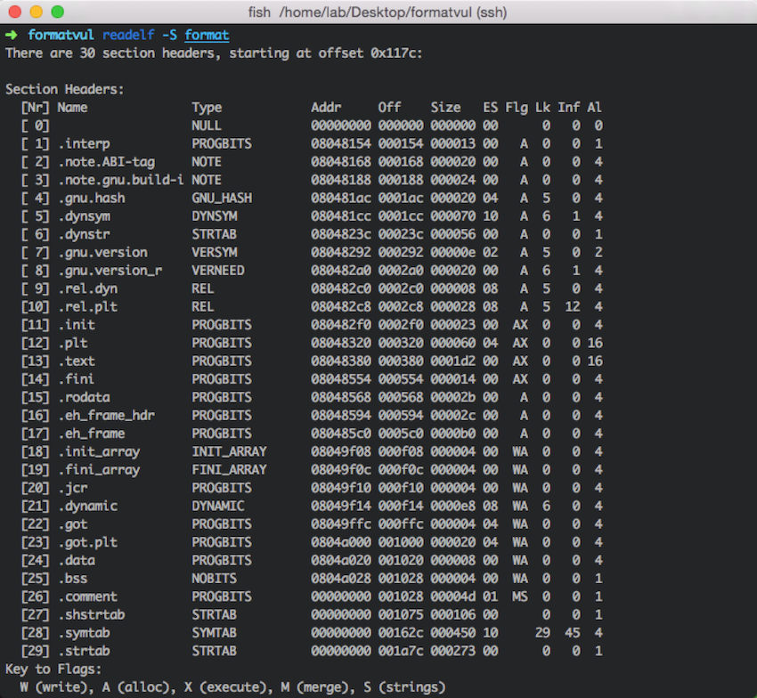
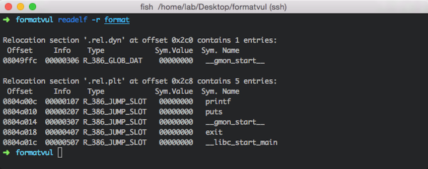
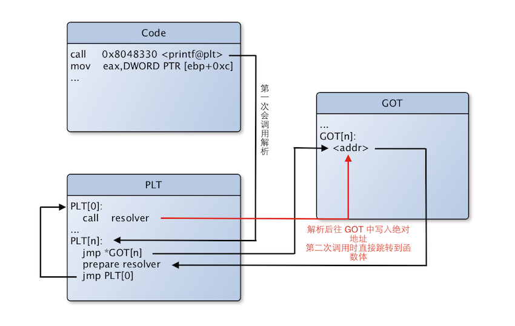

# 通過 GDB 調試理解 GOT/PLT


關於 Linux 中 ELF 文件格式可參考詳細文檔《ELF_Format》，本文僅記錄筆者理解GOT/PLT的過程。

GOT（Global Offset Table）：全局偏移表用於記錄在 ELF 文件中所用到的共享庫中符號的絕對地址。在程序剛開始運行時，GOT 表項是空的，當符號第一次被調用時會動態解析符號的絕對地址然後轉去執行，並將被解析符號的絕對地址記錄在 GOT 中，第二次調用同一符號時，由於 GOT 中已經記錄了其絕對地址，直接轉去執行即可（不用重新解析）。

PLT（Procedure Linkage Table）：過程鏈接表的作用是將位置無關的符號轉移到絕對地址。當一個外部符號被調用時，PLT 去引用 GOT 中的其符號對應的絕對地址，然後轉入並執行。

GOT 位於 `.got.plt` section 中，而 PLT 位於 `.plt` section中。下面給出一示例程序：

```c
#include <stdio.h>
#include <stdlib.h>

int main(int argc, char* argv[])
{
    if(argc < 2)
    {
        printf("argv[1] required!\n");
        exit(0);
    }
    printf("You input: ");
    printf(argv[1]);
    printf("Down\n");

    return 0;
}
```

編譯該程序：

```sh
gcc -o format format.c
```

然後我們通過 `readelf` 命令來查看 `format` 程序的 sectioin 信息，並檢查 GOT：




從上圖可看到，該 ELF 文件共包含29個 section，有關 GOT 的重定向：





`.rel.dyn` 記錄了加載時需要重定位的變量，`.rel.plt` 記錄的是需要重定位的函數。

接下來，我們使用 `gdb` 來對程序進行調試，觀察程序在調用 `printf()` 函數時，GOT 的變化情況。

因為程序邏輯需要輸入參數，設置好參數後，在主函數處下斷點，然後運行，單步調試來到 `printf()` 函數調用的地方：


這裡可以看到在 `0x080484ab` 處指令為：
```sh
call 0x8048330 <printf@plt>
```
然後查看一下 `0x8048330` 處的代碼：


可以看到流程會跳轉到 `ds[0x804a00c]` 處，而 `0x804a00c` 是 `printf()` 重定位偏移（查看上面 GOT 信息圖），接著看一下後面的流程都做了什麼：


根據上面的流程分析，進行單步調試，當動態解析（_dl_runtime_resolve）完成後，流程會直接跳轉到 `printf()` 函數主體：


上面我們說過，當第一次調用符號時會動態解析其絕對地址並寫到 GOT 中，下次調用的時候就不用再次解析了，我們來看看這個時候原先 `0x804a00c` 處的指向情況：


其所指向的地址正好為第一次解析後得到的` printf() `函數的入口地址。

程序中，`printf() ` 函數的調用過程可以總結為：



總結來說就是，GOT 保存了程序中所要調用的函數的地址，運行一開時其表項為空，會在運行時實時的更新表項。一個符號調用在第一次時會解析出絕對地址更新到 GOT 中，第二次調用時就直接找到 GOT 表項所存儲的函數地址直接調用了。

（清楚上述動態解析的過程，有助於理解GOT覆寫利用）

##參考

http://blog.csdn.net/anzhsoft/article/details/18776111
http://flint.cs.yale.edu/cs422/doc/ELF_Format.pdf

