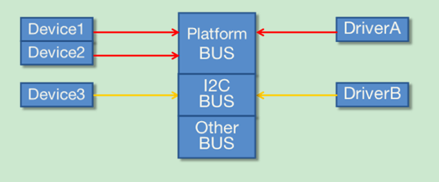

# Linux Device Model 三角關係



Linux Device Model由bus, device, driver所組成。其關係為: bus是cpu與device溝通的橋樑，而driver賦與device行為的能力。因此有人說，device是男人，driver是女人，而bus則是媒人。媒人有match的功能，讓男人與女人彼此 認識。在coldplug的時代，男人先登記後，由媒人去match女人。而後來的hotplug，則讓女人先提供資訊，讓後來有意願的男人match。 device與driver對bus而言，就沒有一定誰先誰後了。

###基礎

kobject做為LDM的最基本結構，提供了reference count (kref)、sysfs的dirent和hotplug相的的event等其他屬性。bus, device, driver都會是一個kobject，意即其struct都內含一個kobject。

```c
include/linux/kobject.h

struct kobject {
    const char        *name;
    struct list_head    entry;
    struct kobject        *parent;
    struct kset        *kset;
    struct kobj_type    *ktype;
    struct sysfs_dirent    *sd;
    struct kref        kref;
    unsigned int state_initialized:1;
    unsigned int state_in_sysfs:1;
    unsigned int state_add_uevent_sent:1;
    unsigned int state_remove_uevent_sent:1;
    unsigned int uevent_suppress:1;
};
```

kset理解為kobject的集合。可以想像為pci bus是一個kset，而掛在pci bus上的一個個device / driver的kobject為其成員。

###結構

include/linux/device.h

###先看bus

```c
struct bus_type {
    const char        *name;
    struct bus_attribute    *bus_attrs;
    struct device_attribute    *dev_attrs;
    struct driver_attribute    *drv_attrs;

    int (*match)(struct device *dev, struct device_driver *drv);
    int (*uevent)(struct device *dev, struct kobj_uevent_env *env);
    int (*probe)(struct device *dev);
    int (*remove)(struct device *dev);
    void (*shutdown)(struct device *dev);
    int (*suspend)(struct device *dev, pm_message_t state);
    int (*resume)(struct device *dev);

    const struct dev_pm_ops *pm;
    struct bus_type_private *p; //2.6.19後把device和driver包在新的struct
};

struct bus_type_private {
    struct kset subsys;  //代表自己，而kset本身也是一種kobject
    struct kset *drivers_kset; //該bus的driver集合
    struct kset *devices_kset; //該bus的 device集合
    struct klist klist_devices;
    struct klist klist_drivers;
    struct blocking_notifier_head bus_notifier;
    unsigned int drivers_autoprobe:1;
    struct bus_type *bus;
};
```

###再來是device
```c
struct device {
    struct device        *parent;
    struct device_private    *p;
    struct kobject kobj;
    const char        *init_name; /* initial name of the device */
    struct device_type    *type;
    struct mutex        mutex;    /* mutex to synchronize calls to its driver.*/
    struct bus_type    *bus;        /* type of bus device is on */ //指定要掛在哪條bus
    struct device_driver *driver;    /* which driver has allocated this  //該device所 bind的driver device */
    void        *platform_data;    /* Platform specific data, device core doesn't touch it */
    struct dev_pm_info    power;
/*...............*/
};
````

###最後是driver
```c
struct device_driver {
    const char        *name;
    struct bus_type        *bus;  //一樣是用來指定要去哪條bus做 match
    struct module        *owner;
    const char        *mod_name;    /* used for built-in modules */
    bool suppress_bind_attrs;    /* disables bind/unbind via sysfs */

#if defined(CONFIG_OF)
    const struct of_device_id    *of_match_table;
#endif

    int (*probe) (struct device *dev);
    int (*remove) (struct device *dev);
    void (*shutdown) (struct device *dev);
    int (*suspend) (struct device *dev, pm_message_t state);
    int (*resume) (struct device *dev);
    const struct attribute_group **groups;

    const struct dev_pm_ops *pm;
    struct driver_private *p; //kobject在這
};

struct driver_private {
    struct kobject kobj;
    struct klist klist_devices;  //該driver能支援的device列表
    struct klist_node knode_bus;
    struct module_kobject *mkobj;
    struct device_driver *driver;
};
```

基本上這就是LDM三個主角的結構。拿pci driver當例子

drivers/pci/pci-driver.c

###bus的部分
```c
struct bus_type pci_bus_type = {
    .name        = "pci",
    .match        = pci_bus_match,
    .uevent        = pci_uevent,
    .probe        = pci_device_probe,
    .remove        = pci_device_remove,
    .shutdown    = pci_device_shutdown,
    .dev_attrs    = pci_dev_attrs,
    .bus_attrs    = pci_bus_attrs,
    .pm        = PCI_PM_OPS_PTR,
};
```
宣告了pci bus及其屬性。

```c
static int __init pci_driver_init(void)
{
    return bus_register(&pci_bus_type);
}

postcore_initcall(pci_driver_init);
```
__init macro表示在開機時會作初始化，即do_basic_setup時，其level是在postcore，細節可參考include/linux /init.h


```c
#define pure_initcall(fn)        __define_initcall("0",fn,0)
#define core_initcall(fn)        __define_initcall("1",fn,1)
#define core_initcall_sync(fn)        __define_initcall("1s",fn,1s)
#define postcore_initcall(fn)        __define_initcall("2",fn,2)
#define postcore_initcall_sync(fn)    __define_initcall("2s",fn,2s)
#define arch_initcall(fn)        __define_initcall("3",fn,3)
#define arch_initcall_sync(fn)        __define_initcall("3s",fn,3s)
#define subsys_initcall(fn)        __define_initcall("4",fn,4)
#define subsys_initcall_sync(fn)    __define_initcall("4s",fn,4s)
#define fs_initcall(fn)            __define_initcall("5",fn,5)
#define fs_initcall_sync(fn)        __define_initcall("5s",fn,5s)
#define rootfs_initcall(fn)        __define_initcall("rootfs",fn,rootfs)
#define device_initcall(fn)        __define_initcall("6",fn,6)
#define device_initcall_sync(fn)    __define_initcall("6s",fn,6s)
#define late_initcall(fn)        __define_initcall("7",fn,7)
#define late_initcall_sync(fn)        __define_initcall("7s",fn,7s)
```

再來就是其module_init，可看到最後是執行了bus_register(&pci_bus_type)，節錄如下:

```c
int bus_register(struct bus_type *bus)
{

/*...............*/
retval = kobject_set_name(&priv->subsys.kobj, "%s", bus->name);

/*...............*/

    retval = kset_register(&priv->subsys);
    if (retval)
        goto out;

    retval = bus_create_file(bus, &bus_attr_uevent);
    if (retval)
        goto bus_uevent_fail;

    priv->devices_kset = kset_create_and_add("devices", NULL,
                         &priv->subsys.kobj);
    if (!priv->devices_kset) {retval = add_probe_files(bus);

        retval = -ENOMEM;
        goto bus_devices_fail;
    }

    priv->drivers_kset = kset_create_and_add("drivers", NULL,
                         &priv->subsys.kobj);
/*...............*/

    retval = add_probe_files(bus);
/*...............*/

}
```

這其中包括建立sysfs下的file，可看出devices及drivers兩個資料夾。而後的add_probe_files則是sysfs下更detail的部份。

這樣的結果就是在/sys/bus/下會多出一個pci的folder。之後就是kernel scan到devices/ drivers時，再加入/sys/bus/pci/devices/及/sys/bus/pci/drivers/。

###再來是device

drivers/pci/pci.h

這其實是再封裝了include/linux/device.h裡的struct device，加上了自定的其他屬性

```c
struct pci_dev {
    struct list_head bus_list;    /* node in per-bus list */
    struct pci_bus    *bus;        /* bus this device is on */
    struct pci_bus    *subordinate;    /* bus this device bridges to */

    void        *sysdata;    /* hook for sys-specific extension */
    struct proc_dir_entry *procent;    /* device entry in /proc/bus/pci */
    struct pci_slot    *slot;        /* Physical slot this device is in */

    unsigned int    devfn;        /* encoded device & function index */ //該device的id資訊，將來跟driver用來 match
    unsigned short    vendor;
    unsigned short    device;
    unsigned short    subsystem_vendor;
    unsigned short    subsystem_device;
    unsigned int    class;        /* 3 bytes: (base,sub,prog-if) */
    u8        revision;    /* PCI revision, low byte of class word */
    u8        hdr_type;    /* PCI header type (`multi' flag masked out) */
    u8        pcie_cap;    /* PCI-E capability offset */
    u8        pcie_type;    /* PCI-E device/port type */
    u8        rom_base_reg;    /* which config register controls the ROM */
    u8        pin;          /* which interrupt pin this device uses */

    struct pci_driver *driver;    /* which driver has allocated this device */  //match到則用device_bind_driver(dev)，即不為NULL
/*...............*/
    struct    device    dev;        /* Generic device interface */
    int        cfg_size;    /* Size of configuration space */

    /*
     * Instead of touching interrupt line and base address registers
     * directly, use the values stored here. They might be different!
     */
    unsigned int    irq;
    struct resource resource[DEVICE_COUNT_RESOURCE]; /* I/O and memory regions + expansion ROMs */
    resource_size_t    fw_addr[DEVICE_COUNT_RESOURCE]; /* FW-assigned addr */
    //其他自定屬性
    /* These fields are used by common fixups */
    unsigned int    transparent:1;    /* Transparent PCI bridge */
    unsigned int    multifunction:1;/* Part of multi-function device */
    /* keep track of device state */const struct pci_device_id *id_table;    /* must be non-NULL for probe to be called */

    unsigned int    is_added:1;
    unsigned int    is_busmaster:1; /* device is busmaster */
    unsigned int    no_msi:1;    /* device may not use msi */
    unsigned int    block_ucfg_access:1;    /* userspace config space access is blocked */
    /*...............*/

};
```

###最後是pci_driver

跟pci_dev一樣，再次封裝struct device_driver
```c
struct pci_driver {
    struct list_head node;
    char *name;
    const struct pci_device_id *id_table;    /* must be non-NULL for probe to be called */ //內含其支援的device id資訊，將來match時用的
    int  (*probe)  (struct pci_dev *dev, const struct pci_device_id *id);    /* New device inserted */
    void (*remove) (struct pci_dev *dev);    /* Device removed (NULL if not a hot-plug capable driver) */
    int  (*suspend) (struct pci_dev *dev, pm_message_t state);    /* Device suspended */
    int  (*suspend_late) (struct pci_dev *dev, pm_message_t state);
    int  (*resume_early) (struct pci_dev *dev);
    int  (*resume) (struct pci_dev *dev);                    /* Device woken up */
    void (*shutdown) (struct pci_dev *dev);
    struct pci_error_handlers *err_handler;
    struct device_driver    driver;
    struct pci_dynids dynids;
};
```

以上是LDM的結構，再來要看看範例以及device/driver的註冊過程。

Reference

高茂林
