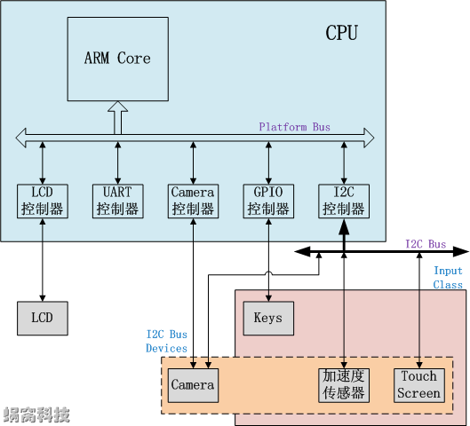

# Linux設備模型(1)_基本概念

##1. 前言

在“Linux內核的整體架構”中，蝸蝸有提到，由於Linux支持世界上幾乎所有的、不同功能的硬件設備（這是Linux的優點），導致Linux內核中有一半的代碼是設備驅動，而且隨著硬件的快速升級換代，設備驅動的代碼量也在快速增長。個人意見，這種現象打破了“簡潔就是美”的理念，是醜陋的。它導致Linux內核看上去非常臃腫、雜亂、不易維護。但蝸蝸也知道，這不是Linux的錯，Linux是一個宏內核，它必須面對設備的多樣性，並實現對應的驅動。

為了降低設備多樣性帶來的Linux驅動開發的複雜度，以及設備熱拔插處理、電源管理等，Linux內核提出了設備模型（也稱作Driver Model）的概念。設備模型將硬件設備歸納、分類，然後抽象出一套標準的數據結構和接口。驅動的開發，就簡化為對內核所規定的數據結構的填充和實現。

本文將會從設備模型的基本概念開始，通過分析內核相應的代碼，一步一步解析Linux設備模型的實現及使用方法。

##2. Linux設備模型的基本概念

###2.1 Bus, Class, Device和Device Driver的概念

下圖是嵌入式系統常見的硬件拓撲的一個示例：

硬件拓撲描述Linux設備模型中四個重要概念中三個：Bus，Class和Device（第四個為Device Driver，後面會說）。

`Bus（總線）`：Linux認為（可以參考include/linux/device.h中struct bus_type的註釋），總線是CPU和一個或多個設備之間信息交互的通道。而為了方便設備模型的抽象，所有的設備都應連接到總線上（無論是CPU內部總線、虛擬的總線還是“platform Bus”）。

`Class（分類）`：在Linux設備模型中，Class的概念非常類似面向對象程序設計中的Class（類），它主要是集合具有相似功能或屬性的設備，這樣就可以抽象出一套可以在多個設備之間共用的數據結構和接口函數。因而從屬於相同Class的設備的驅動程序，就不再需要重複定義這些公共資源，直接從Class中繼承即可。

`Device（設備）`：抽象系統中所有的硬件設備，描述它的名字、屬性、從屬的Bus、從屬的Class等信息。

`Device Driver（驅動）`：Linux設備模型用Driver抽象硬件設備的驅動程序，它包含設備初始化、電源管理相關的接口實現。而Linux內核中的驅動開發，基本都圍繞該抽象進行（實現所規定的接口函數）。

`注：什麼是Platform Bus？ `

在計算機中有這樣一類設備，它們通過各自的設備控制器，直接和CPU連接，CPU可以通過常規的尋址操作訪問它們（或者說訪問它們的控制器）。這種連接方式，並不屬於傳統意義上的總線連接。但設備模型應該具備普適性，因此Linux就虛構了一條Platform Bus，供這些設備掛靠。

###2.2 設備模型的核心思想

Linux設備模型的核心思想是（通過xxx手段，實現xxx目的）：
1. 用Device（struct device）和Device Driver（struct device_driver）兩個數據結構，分別從“有什麼用”和“怎麼用”兩個角度描述硬件設備。這樣就統一了編寫設備驅動的格式，使驅動開發從論述題變為填空體，從而簡化了設備驅動的開發。

2. 同樣使用Device和Device Driver兩個數據結構，實現硬件設備的即插即用（熱拔插）。 
在Linux內核中，只要任何Device和Device Driver具有相同的名字，內核就會執行Device Driver結構中的初始化函數（probe），該函數會初始化設備，使其為可用狀態。 
而對大多數熱拔插設備而言，它們的Device Driver一直存在內核中。當設備沒有插入時，其Device結構不存在，因而其Driver也就不執行初始化操作。當設備插入時，內核會創建一個Device結構（名稱和Driver相同），此時就會觸發Driver的執行。這就是即插即用的概念。

3. 通過"Bus-->Device”類型的樹狀結構（見2.1章節的圖例）解決設備之間的依賴，而這種依賴在開關機、電源管理等過程中尤為重要。 
試想，一個設備掛載在一條總線上，要啟動這個設備，必須先啟動它所掛載的總線。很顯然，如果系統中設備非常多、依賴關係非常複雜的時候，無論是內核還是驅動的開發人員，都無力維護這種關係。 
而設備模型中的這種樹狀結構，可以自動處理這種依賴關係。啟動某一個設備前，內核會檢查該設備是否依賴其它設備或者總線，如果依賴，則檢查所依賴的對象是否已經啟動，如果沒有，則會先啟動它們，直到啟動該設備的條件具備為止。而驅動開發人員需要做的，就是在編寫設備驅動時，告知內核該設備的依賴關係即可。

4. 使用Class結構，在設備模型中引入面向對象的概念，這樣可以最大限度地抽象共性，減少驅動開發過程中的重複勞動，降低工作量。
