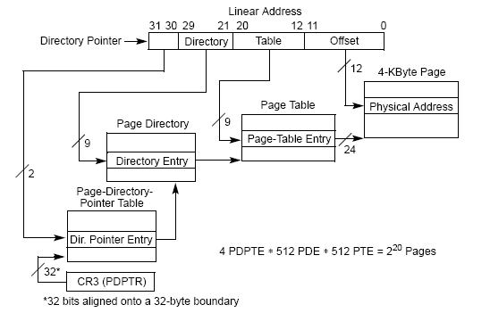

# IA32CPU內存管理機制

最近看了一些Inter32CPU的內存管理機制，做個總結，但是我畢竟是新手，對很多東西也是一知半解，希望大家指教。
1.物理內存的管理，這不考慮MMU的內存管理機制，純粹的對物理內存的管理，在電腦剛啟動時候的實模式就應該是對實際物理內存的操作了。
2.虛擬內存的管理，Inter32CPU實現了一個分頁的虛擬內存管理機制。

IA32CPU內存管理機制主要就是：分段和分頁。平時程序裡說的代碼段，數據段不完全等於這個段。分頁機制可以實現按需內存分配，虛擬地址等功能。對於分段和分頁相結合的模式，非常靈活，最簡單的情況下，採用平展段模式，禁止分頁（通過CRO寄存器的一個比特位來實現）。要是複雜起來，採用不同段管理不同進程的不同數據，採
用分頁機制實現按需分配，虛擬內存等。。。

下面這張圖顯示了IA32整個內存管理機制

這裡又來了邏輯地址，線性地址，物理地址等一大堆的概念，看看http://blog.csdn.net/firefoxbug/article/details/6911737。

上面這張圖很好的解釋了整個分段模式和分頁模式的綜合應用。下面是一些簡單的解釋。

首先是邏輯地址轉換成線性地址（上圖的左半張）

分段模式下，CPU要尋址整個地址空間，分成了很多個段。代碼段，數據段以及各個段的訪問方式（讀寫等）都存取在一個段描述表中（GDT），GDT中每一項都描述了一個特定的段，所以要找一個段的基地址需要兩個數據：GDT的初始地址+GDT內段項的偏移量。GDT的初始地址存在了GDTR寄存器中了，GDT內段項的偏移量則是由段選擇子來確定，實際上CS，DS這些就是段選擇子。通過上面兩個數據就確定了線性地址中的段部分（確切的說是確定了段基地址），要組合成實際的線性地址，還需要的段內的偏移，這個地址是一個有效地址。通過段+偏移就出來了線性地址。

出來了線性地址之後，怎麼樣轉化成物理地址呢？？

1.要是沒有分頁模式的話，直接把線性地址當作物理地址處理。這個很簡單就可以理解。

2,要是開啟了分頁模式的話，就有點複雜了。

下面解釋線性地址轉化成物理地址（第一張圖的後半張）

這就是分頁模式的圖解

（1）CPU根據CR3寄存器的值獲取頁目錄所在物理地址，從而獲取頁目錄在內存中的位置。

（2）CPU根據線性地址的前10位（22~31）形成一個索引，根據這個索引查找頁目錄，找到頁表項。

（3）CPU根據線性地址的中間10比特位（12~21）形成頁表內索引，再根據第（2）步驟找到的頁表地址找到頁框的物理地址。

（4）CPU根據最後12比特形成偏移地址，和（3）的地址相加後得到實際的物理地址。

其實上面我漏了很多細節，我覺得細節怕講錯了，而且比較難。。。下午還要大物期中考試，得看會書了。。

