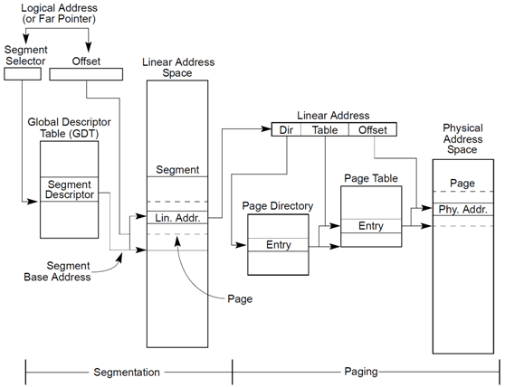

# Linux內存管理之分段機制

邏輯地址就是我們普通的段+偏移的表現方式，而線性地址就是段+偏移之後算出來的一個地址，前者可以認

為是二維的地址，而後者可以理解是一維的。線性地址和虛擬地址的概念相接近，不知道其根本的區別。而

物理地址就是實際在地址總線上傳輸的地址，也就是物理內存訪問的真正地址。

如上圖，Linux在內存管理上，把邏輯地址通過分段機制變化成線性地址，線性地址也就是4G（32位系統）

的程序地址。線性地址再通過分頁機制轉化成物理地址，最後CPU去訪問物理地址。
去年寫個一篇關於IA32內存尋址的文章，現在再重溫下。下面是一張很好的內存尋址圖

採用分段機制的好處就是方便了程序員的編碼，把整個地址分成不同的數據段，代碼段，數據段，堆棧

等等。每個段都是動態調整的，在程序重定向的時候。那麼對於每一個段的基本信息：段的起始地址，

段的長度，段的訪問權限等，都會保存在段描述表中（上面的GDT），GDT是存在物理內存中的。也就說

我們普通的程序執行一條指令的時候（比如C語言中的&操作），我們操作的是一個邏輯地址，邏輯地址必須

通過段機制轉化成線性地址，而根據什麼轉化呢？就是GDT！GDT會告訴你在線性地址哪裡到哪裡是你的數

據段，哪裡到哪裡是代碼段。那麼我們怎麼找到GDT呢？GDT是在內存裡的，這就用到寄存器GDTR了，

GDTR會告訴你GDT在內存的起始位置，然後就可以去問GDT我要訪問的邏輯地址所對應的線性地址是什

麼。再深入點，上面說的了GDT裡面是描述每個段的基本信息的，其中就是每個段在線性地址裡對應的起始

位置。

GDT裡面存的是各個段的索引，叫做段選擇子（Seg.Selector），現代計算機為了減少對內存訪問的次數，

就把段選擇子存於我們平時說的CS寄存器，DS寄存器等，這樣，一個邏輯地址到線性地址的轉換就大大地

加快了。

現在完整地說一遍上面分段的整個流程，對於一個邏輯地址（段：偏移），首先通過GDTR找到GDT，GDT

裡面是段選擇子，直接從段寄存器獲得，通過段選擇子找到該段在內存裡的基地址，然後加上邏輯地址的偏

移部分，這就完整地得到了一個線性地址。

