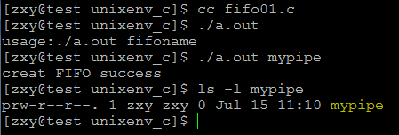

# linux系统编程之管道（三）：命令管道（FIFO)


##一，匿名管道PIPE局限性
管道的主要局限性正体现在它的特点上：

- 只支持单向数据流；
- 只能用于具有亲缘关系的进程之间；
- 没有名字；
- 管道的缓冲区是有限的（管道制存在于内存中，在管道创建时，为缓冲区分配一个页面大小）；
- 管道所传送的是无格式字节流，这就要求管道的读出方和写入方必须事先约定好数据的格式，比如多少字节算作一个消息（或命令、或记录）等等；

如果我们想在不相关的进程之间交换数据，可以使用FIFO文件来做这项工作，它经常被称为命名管道，是一种特殊类型的文件。

##二，命名管道FIFO。
###2.1 有名管道相关的关键概念
管 道应用的一个重大限制是它没有名字，因此，只能用于具有亲缘关系的进程间通信，在有名管道（named pipe或FIFO）提出后，该限制得到了克服。FIFO不同于管道之处在于它提供一个路径名与之关联，以FIFO的文件形式存在于文件系统中。这样，即 使与FIFO的创建进程不存在亲缘关系的进程，只要可以访问该路径，就能够彼此通过FIFO相互通信（能够访问该路径的进程以及FIFO的创建进程之 间），因此，通过FIFO不相关的进程也能交换数据。值得注意的是，FIFO严格遵循先进先出（first in first out），对管道及FIFO的读总是从开始处返回数据，对它们的写则把数据添加到末尾。它们不支持诸如lseek()等文件定位操作。

###2.2有名管道的创建
命名管道可以从命令行上创建，命令行方法是使用下面这个命令：

$ mkfifo filename

命名管道也可以从程序里创建，相关函数有：

```c
#include <sys/types.h>
#include <sys/stat.h>
int mkfifo(const char * pathname, mode_t mode)
```

该函数的第一个参数是一个普通的路径名，也就是创建 后FIFO的名字。第二个参数与打开普通文件的open()函数中的mode 参数相同。 如果mkfifo的第一个参数是一个已经存在的路径名时，会返回EEXIST错误，所以一般典型的调用代码首先会检查是否返回该错误，如果确实返回该错 误，那么只要调用打开FIFO的函数就可以了。一般文件的I/O函数都可以用于FIFO，如close、read、write等等。

man帮助说明：

```c
DESCRIPTION        
       mkfifo() makes a FIFO special file with name pathname.  mode
       specifies the FIFO's permissions.  It is modified by the process's
       umask in the usual way: the permissions of the created file are (mode
       & ~umask).

       A FIFO special file is similar to a pipe, except that it is created
       in a different way.  Instead of being an anonymous communications
       channel, a FIFO special file is entered into the file system by
       calling mkfifo().

       Once you have created a FIFO special file in this way, any process
       can open it for reading or writing, in the same way as an ordinary
       file.  However, it has to be open at both ends simultaneously before
       you can proceed to do any input or output operations on it.  Opening
       a FIFO for reading normally blocks until some other process opens the
       same FIFO for writing, and vice versa.  See fifo(7) for nonblocking
       handling of FIFO special files.
RETURN VALUE        
       On success mkfifo() returns 0.  In the case of an error, -1 is
       returned (in which case, errno is set appropriately).
 
```

###2.3有名管道的打开规则（与匿名管道一样）

FIFO（命名管道）与pipe（匿名管道）之间唯一的区别在它们创建与打开的方式不同，一量这些工作完成之后，它们具有相同的语义。

man帮助说明：The only difference between pipes and FIFOs is the manner in which they are created and opened. Once these tasks have been accomplished, I/O on pipes and FIFOs has exactly the same semantics。

有名管道比管道多了一个打开操作：open。

FIFO的打开规则：

`如果当前打开操作是为读而打开FIFO时，若已经有相应进程为写而打开该FIFO，则当前打开操作将成功返回；否则，可能阻塞直到有相应进程为写而打开该FIFO（当前打开操作设置了阻塞标志）；或者，成功返回（当前打开操作没有设置阻塞标志）。`

`如果当前打开操作是为写而打开FIFO时，如果已经有相应进程为读而打开该FIFO，则当前打开操作将成功返回；否则，可能阻塞直到有相应进程为读而打开该FIFO（当前打开操作设置了阻塞标志）；或者，返回ENXIO错误（当前打开操作没有设置阻塞标志）。`

###2.4有名管道的读写规则
####从FIFO中读取数据：

约定：如果一个进程为了从FIFO中读取数据而阻塞打开FIFO，那么称该进程内的读操作为设置了阻塞标志的读操作。

- 如果有进程写打开FIFO，且当前FIFO内没有数据，则对于设置了阻塞标志的读操作来说，将一直阻塞。对于没有设置阻塞标志读操作来说则返回-1，当前errno值为EAGAIN，提醒以后再试。

- 对于设置了阻塞标志的读操作说，造成阻塞的原因有两种：当前FIFO内有数据，但有其它进程在读这些数据；另外就是FIFO内没有数据。解阻塞的原因则是FIFO中有新的数据写入，不论信写入数据量的大小，也不论读操作请求多少数据量。

- 读打开的阻塞标志只对本进程第一个读操作施加作用，如果本进程内有多个读操作序列，则在第一个读操作被唤醒并完成读操作后，其它将要执行的读操作将不再阻塞，即使在执行读操作时，FIFO中没有数据也一样（此时，读操作返回0）。

- 如果没有进程写打开FIFO，则设置了阻塞标志的读操作会阻塞。
注：如果FIFO中有数据，则设置了阻塞标志的读操作不会因为FIFO中的字节数小于请求读的字节数而阻塞，此时，读操作会返回FIFO中现有的数据量。

####向FIFO中写入数据：

约定：如果一个进程为了向FIFO中写入数据而阻塞打开FIFO，那么称该进程内的写操作为设置了阻塞标志的写操作。

对于设置了阻塞标志的写操作：

- 当要写入的数据量不大于PIPE_BUF时，linux将保证写入的原子性。如果此时管道空闲缓冲区不足以容纳要写入的字节数，则进入睡眠，直到当缓冲区中能够容纳要写入的字节数时，才开始进行一次性写操作。

- 当要写入的数据量大于PIPE_BUF时，linux将不再保证写入的原子性。FIFO缓冲区一有空闲区域，写进程就会试图向管道写入数据，写操作在写完所有请求写的数据后返回。
对于没有设置阻塞标志的写操作：

- 当要写入的数据量大于PIPE_BUF时，linux将不再保证写入的原子性。在写满所有FIFO空闲缓冲区后，写操作返回。

- 当要写入的数据量不大于PIPE_BUF时，linux将保证写入的原子性。如果当前FIFO空闲缓冲区能够容纳请求写入的字节数，写完后成功返回；如果当前FIFO空闲缓冲区不能够容纳请求写入的字节数，则返回EAGAIN错误，提醒以后再写；

## 三，FIFO使用
示例一：创建FIFO文件

```c
#include <stdio.h>
#include <unistd.h>
#include <stdlib.h>
#include <sys/stat.h>
#include <sys/types.h>

int main(int argc, char **argv)
{
    if(argc != 2){
        fprintf(stderr,"usage:%s fifoname\n",argv[0]);
        exit(EXIT_FAILURE);
    }
    if(mkfifo(argv[1],0644) == -1){
        perror("mkfifo error");
        exit(EXIT_FAILURE);
    }
    printf("creat FIFO success\n");
    return 0;
}
```




示例二：`如果当前打开操作是为读而打开FIFO时，若已经有相应进程为写而打开该FIFO，则当前打开操作将成功返回；否则，可能阻塞直到有相应进程为写而打开该FIFO（当前打开操作设置了阻塞标志）；或者，成功返回（当前打开操作没有设置阻塞标志）。`

```c
#include <stdio.h>
#include <unistd.h>
#include <stdlib.h>
#include <sys/stat.h>
#include <sys/types.h>
#include <fcntl.h>

int main(int argc, char **argv)
{

    int fd;
    
    //fd = open("mypipe",O_RDONLY| O_NONBLOCK);//非阻塞模式打开
    fd = open("mypipe",O_RDONLY);//默认是阻塞模式打开
    if(fd == -1){
        perror("open error");
        exit(EXIT_FAILURE);
    }
    printf("read open  FIFO success\n");
    return 0;
}
```

结果：


第一次以非阻塞打开

第二次以阻塞模式打开

示例三：`如果当前打开操作是为写而打开FIFO时，如果已经有相应进程为读而打开该FIFO，则当前打开操作将成功返回；否则，可能阻塞直到有相应进程为读而打开该FIFO（当前打开操作设置了阻塞标志）；或者，返回ENXIO错误（当前打开操作没有设置阻塞标志）。`

```c
#include <stdio.h>
#include <unistd.h>
#include <stdlib.h>
#include <sys/stat.h>
#include <sys/types.h>
#include <fcntl.h>

int main(int argc, char **argv)
{

    int fd;
    
    //fd = open("mypipe",O_WRONLY| O_NONBLOCK);//非阻塞模式打开
    fd = open("mypipe",O_WRONLY);//默认是阻塞模式打开
    if(fd == -1){
        perror("open error");
        exit(EXIT_FAILURE);
    }
    printf("read open  FIFO success\n");
    return 0;
}
```
结果：


第一次以非阻塞模式打开

第二次以阻塞模式打开

示例四：不同进程间利用命名管道实现文件复制

#### 写管道进程：

```c
#include <stdio.h>
#include <unistd.h>
#include <stdlib.h>
#include <sys/stat.h>
#include <sys/types.h>
#include <fcntl.h>

int main(int argc, char **argv)
{
    if(argc != 2){
        fprintf(stderr,"usage:%s srcfile\n",argv[0]);
        exit(EXIT_FAILURE);
    }
    int infd;
    infd = open(argv[1],O_RDONLY);
    if(infd == -1){
        perror("open error");
        exit(EXIT_FAILURE);
    }

    if(mkfifo("tmpfifo",0644) == -1){
        perror("mkfifo error");
        exit(EXIT_FAILURE);
    }
    int fd ;
    fd = open("tmpfifo",O_WRONLY);
    if(fd == -1){
        perror("open error");
        exit(EXIT_FAILURE);
    }
    char buf[1024*4];
    int n = 0;
    while((n = read(infd,buf,1024*4))){
        write(fd,buf,n);
    }
    close(infd);
    close(fd);
    printf("write success\n");
    return 0;
}
```

#### 读进程：

```c
#include <stdio.h>
#include <unistd.h>
#include <stdlib.h>
#include <sys/stat.h>
#include <sys/types.h>
#include <fcntl.h>

int main(int argc, char **argv)
{
    if(argc != 2){
        fprintf(stderr,"usage:%s desfile\n",argv[0]);
        exit(EXIT_FAILURE);
    }
    int outfd;
    outfd = open(argv[1],O_WRONLY|O_CREAT|O_TRUNC);
    if(outfd == -1){
        perror("open error");
        exit(EXIT_FAILURE);
    }

    int fd ;
    fd = open("tmpfifo",O_RDONLY);
    if(fd == -1){
        perror("open error");
        exit(EXIT_FAILURE);
    }
    char buf[1024*4];
    int n = 0;
    while((n = read(fd,buf,1024*4))){
        write(outfd,buf,n);
    }
    close(fd);
    close(outfd);
    unlink("tmpfifo");
    printf("read success\n");
    return 0;
}
```

结果：


复制成功！
