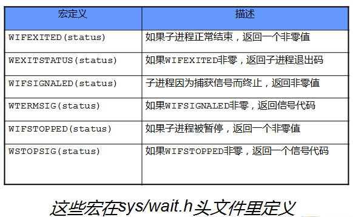

# linux系統編程之進程（六）：父進程查詢子進程的退出,wait,waitpid


- 本節目標：
    - 僵進程
    - SIGCHLD
    - wait
    - waitpid


##一，殭屍進程
當一個子進程先於父進程結束運行時，它與其父進程之間的關聯還會保持到父進程也正常地結束運行，或者父進程調用了wait才告終止。

子進程退出時，內核將子進程置為殭屍狀態，這個進程稱為殭屍進程，它只保留最小的一些內核數據結構，以便父進程查詢子進程的退出狀態。

進程表中代表子進程的數據項是不會立刻釋放的，雖然不再活躍了，可子進程還停留在系統裡，因為它的退出碼還需要保存起來以備父進程中後續的wait調用使用。它將稱為一個“僵進程”。

##二，如何避免殭屍進程
調用wait或者waitpid函數查詢子進程退出狀態，此方法父進程會被掛起。
如果不想讓父進程掛起，可以在父進程中加入一條語句：signal(SIGCHLD,SIG_IGN);表示父進程忽略SIGCHLD信號，該信號是子進程退出的時候向父進程發送的。

## 三，SIGCHLD信號
當子進程退出的時候，內核會向父進程發送SIGCHLD信號，子進程的退出是個異步事件（子進程可以在父進程運行的任何時刻終止）

如果不想讓子進程編程殭屍進程可在父進程中加入：signal(SIGCHLD,SIG_IGN);

如果將此信號的處理方式設為忽略，可讓內核把殭屍子進程轉交給init進程去處理，省去了大量殭屍進程佔用系統資源。

示例：

```c
#include <stdio.h>
#include <unistd.h>
#include <signal.h>
#include <stdlib.h>

int main(void)
{
    pid_t pid;
    if(signal(SIGCHLD,SIG_IGN) == SIG_ERR)
    {
        perror("signal error");
        exit(EXIT_FAILURE);
    }
    pid = fork();
    if(pid == -1)
    {
        perror("fork error");
        exit(EXIT_FAILURE);
    }
    if(pid == 0)
    {
        printf("this is child process\n");
        exit(0);
    }
    if(pid > 0)
    {
        sleep(100);
        printf("this is parent process\n");
    }
    return 0;
}
```


可知，雖然子進程先退出了，但進程表中已經不存在子進程的殭屍狀態

##四，wait()函數

```c
#include <sys/types.h> 
#include <sys/wait.h>

pid_t wait(int *status);
```

進程一旦調用了wait，就立即阻塞自己，由wait自動分析是否當前進程的某個子進程已經退出，如果讓它找到了這樣一個已經變成殭屍的子進程，wait就會收集這個子進程的信息，並把它徹底銷燬後返回；如果沒有找到這樣一個子進程，wait就會一直阻塞在這裡，直到有一個出現為止。 
參數status用來保存被收集進程退出時的一些狀態，它是一個指向int類型的指針。但如果我們對這個子進程是如何死掉的毫不在意，只想把這個殭屍進程消滅掉，（事實上絕大多數情況下，我們都會這樣想），我們就可以設定這個參數為NULL，就象下面這樣：
```c
pid = wait(NULL);
```
	
如果成功，wait會返回被收集的子進程的進程ID，如果調用進程沒有子進程，調用就會失敗，此時wait返回-1，同時errno被置為ECHILD。

man幫助：

```c
DESCRIPTION 
       All of these system calls are used to wait for state changes in a child 
       of the calling process, and obtain information about  the  child  whose 
       state  has changed.  A state change is considered to be: the child ter- 
       minated; the child was stopped by a signal; or the child was resumed by 
       a  signal.  In the case of a terminated child, performing a wait allows 
       the system to release the resources associated with  the  child;  if  a 
       wait  is not performed, then the terminated child remains in a "zombie" 
       state (see NOTES below).

       If a child has already changed state, then these calls  return  immedi- 
       ately.   Otherwise  they  block until either a child changes state or a 
       signal handler interrupts the call (assuming that system calls are  not 
       automatically restarted using the SA_RESTART flag of sigaction(2)).  In 
       the remainder of this page, a child whose state has changed  and  which 
       has  not  yet  been  waited upon by one of these system calls is termed 
       waitable. 

wait() ： 
    The wait() system call suspends execution of the calling process  until 
    one  of  its children terminates.  The call wait(&status) is equivalent 
    to:

        waitpid(-1, &status, 0);

If status is not NULL, wait() and waitpid() store status information in 
      the  int  to  which  it points.  This integer can be inspected with the 
      following macros (which take the integer itself as an argument,  not  a 
      pointer to it, as is done in wait() and waitpid()!):

      WIFEXITED(status) 
             returns true if the child terminated normally, that is, by call- 
             ing exit(3) or _exit(2), or by returning from main().

      WEXITSTATUS(status) 
             returns the exit status of the  child.   This  consists  of  the 
             least  significant  8 bits of the status argument that the child 
             specified in a call to exit(3) or _exit(2) or  as  the  argument 
             for  a  return  statement  in main().  This macro should only be 
             employed if WIFEXITED returned true.

      WIFSIGNALED(status) 
             returns true if the child process was terminated by a signal.

    WTERMSIG(status) 
             returns the number of the signal that caused the  child  process 
             to terminate.  This macro should only be employed if WIFSIGNALED 
             returned true.

      WCOREDUMP(status) 
             returns true if the child produced  a  core  dump.   This  macro 
             should  only  be  employed  if  WIFSIGNALED returned true.  This 
             macro is not specified in POSIX.1-2001 and is not  available  on 
             some  Unix  implementations  (e.g.,  AIX, SunOS).  Only use this 
             enclosed in #ifdef WCOREDUMP ... #endif.

      WIFSTOPPED(status) 
             returns true if the child process was stopped by delivery  of  a 
             signal;  this  is  only possible if the call was done using WUN- 
             TRACED or when the child is being traced (see ptrace(2)).

      WSTOPSIG(status) 
             returns the number of the signal which caused the child to stop. 
             This  macro should only be employed if WIFSTOPPED returned true.


   WIFCONTINUED(status) 
       (since Linux 2.6.10) returns  true  if  the  child  process  was 
       resumed by delivery of SIGCONT.

```

- wait系統調用會使父進程暫停執行，直到它的一個子進程結束為止。
- 返回的是子進程的PID，它通常是結束的子進程
- 狀態信息允許父進程判定子進程的退出狀態，即從子進程的main函數返回的值或子進程中exit語句的退出碼。
- 如果status不是一個空指針，狀態信息將被寫入它指向的位置

可以上述的一些宏判斷子進程的退出情況：




示例程序：

```c
#include <stdio.h>
#include <sys/wait.h>
#include <stdlib.h>
#include <unistd.h>

int main(void)
{
    pid_t pid;
    pid = fork();
    if(pid < 0){
        perror("fork error");
        exit(EXIT_FAILURE);
    }
    if(pid == 0){
        printf("this is child process\n");
        exit(100);
    }
    
    int status;
    pid_t ret;
    ret = wait(&status);
    if(ret <0){
        perror("wait error");
        exit(EXIT_FAILURE);
    }
        printf("ret = %d pid = %d\n", ret, pid);
    if (WIFEXITED(status))
        printf("child exited normal exit status=%d\n", WEXITSTATUS(status));

    else if (WIFSIGNALED(status))
        printf("child exited abnormal signal number=%d\n", WTERMSIG(status));
    else if (WIFSTOPPED(status))
        printf("child stoped signal number=%d\n", WSTOPSIG(status));
    return 0;
}
```
結果：


當子進程正常退出時wait返回子進程pid，且WIFEXITED(status)驗證為真，可以WEXITSTATUS(status）獲得返回狀態碼

示例2：

```c
#include <stdio.h>
#include <sys/wait.h>
#include <stdlib.h>
#include <unistd.h>

int main(void)
{
    pid_t pid;
    pid = fork();
    if(pid < 0){
        perror("fork error");
        exit(EXIT_FAILURE);
    }
    if(pid == 0){
        printf("this is child process\n");
        //exit(100);
        abort();
    }
    
    int status;
    pid_t ret;
    ret = wait(&status);
    if(ret <0){
        perror("wait error");
        exit(EXIT_FAILURE);
    }
        printf("ret = %d pid = %d\n", ret, pid);
    if (WIFEXITED(status))
        printf("child exited normal exit status=%d\n", WEXITSTATUS(status));

    else if (WIFSIGNALED(status))
        printf("child exited abnormal signal number=%d\n", WTERMSIG(status));
    else if (WIFSTOPPED(status))
        printf("child stoped signal number=%d\n", WSTOPSIG(status));
    return 0;
}
```
結果：


當子進程異常退出時，WIFSIGNALED(status）為真，可用WTERMSIG(status)獲得信號

五，waitpid()函數

```c
#include <sys/types.h> 
#include <sys/wait.h>

pid_t waitpid(pid_t pid, int *status, int options);
```

參數:

status:如果不是空，會把狀態信息寫到它指向的位置，與wait一樣

options：允許改變waitpid的行為，最有用的一個選項是WNOHANG,它的作用是防止waitpid把調用者的執行掛起

```c
The value of options is an OR of zero or more  of  the  following  con- 
stants:

WNOHANG     return immediately if no child has exited.

WUNTRACED   also  return  if  a  child  has stopped (but not traced via 
            ptrace(2)).  Status for traced children which have  stopped 
            is provided even if this option is not specified.

WCONTINUED (since Linux 2.6.10) 
            also return if a stopped child has been resumed by delivery 
            of SIGCONT.

```

返回值：如果成功返回等待子進程的ID，失敗返回-1

- `對於waitpid的pid參數的解釋與其值有關：`
    - pid == -1 等待任一子進程。於是在這一功能方面waitpid與wait等效。
    
    - pid > 0 等待其進程I D與p i d相等的子進程。
    
    - pid == 0 等待其組I D等於調用進程的組I D的任一子進程。換句話說是與調用者進程同在一個組的進程。

    - pid < -1 等待其組I D等於p i d的絕對值的任一子進程


- `wait與waitpid區別：`
    - 在一個子進程終止前， wait 使其調用者阻塞，而waitpid 有一選擇項，可使調用者不阻塞。
    - waitpid並不等待第一個終止的子進程—它有若干個選擇項，可以控制它所等待的特定進程。
    - 實際上wait函數是waitpid函數的一個特例。waitpid(-1, &status, 0);

示例：

```c
#include <stdio.h>
#include <sys/wait.h>
#include <stdlib.h>
#include <unistd.h>

int main(void)
{
    pid_t pid;
    pid = fork();
    if(pid < 0){
        perror("fork error");
        exit(EXIT_FAILURE);
    }
    if(pid == 0){
        printf("this is child process\n");
        sleep(5);
        exit(100);

    }
    
    int status;
    pid_t ret;
    ret = waitpid(pid,&status,WNOHANG);
    if(ret <0){
        perror("wait error");
        exit(EXIT_FAILURE);
    }
        printf("ret = %d pid = %d\n", ret, pid);
    if (WIFEXITED(status))
        printf("child exited normal exit status=%d\n", WEXITSTATUS(status));

    else if (WIFSIGNALED(status))
        printf("child exited abnormal signal number=%d\n", WTERMSIG(status));
    else if (WIFSTOPPED(status))
        printf("child stoped signal number=%d\n", WSTOPSIG(status));
    return 0;
}
```


可知，option設為WNOHANG，父進程不會等到子進程的退出，即不會阻塞，如果沒有子進程退出則立即返回-1

