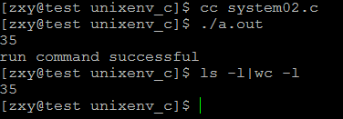

# linux系統編程之進程（七）：system()函數使用


## 一，system()理解
功能：`system()函數調用“/bin/sh -c command”執行特定的命令，阻塞當前進程直到command命令執行完畢`

原型：

int system(const char *command);

返回值：

如果無法啟動shell運行命令，system將返回127；出現不能執行system調用的其他錯誤時返回-1。如果system能夠順利執行，返回那個命令的退出碼。

說明：

man幫助：
```c
#include <stdlib.h>

int system(const char *command);
```

```c
DESCRIPTION 
       system()  executes a command specified in command by calling /bin/sh -c 
       command, and returns after the command has been completed.  During exe- 
       cution  of the command, SIGCHLD will be blocked, and SIGINT and SIGQUIT 
       will be ignored.

RETURN VALUE 
       The value returned is -1 on  error  (e.g.   fork(2)  failed),  and  the 
       return  status  of the command otherwise.  This latter return status is 
       in the format specified in wait(2).  Thus, the exit code of the command 
       will  be  WEXITSTATUS(status).   In case /bin/sh could not be executed, 
       the exit status will be that of a command that does exit(127).

       If the value of command is NULL, system() returns non-zero if the shell 
       is available, and zero if not.

       system() does not affect the wait status of any other children.

```

## 二，system()函數原理
system函數執行時，會調用fork、execve、waitpid等函數。

linux版system函數的源碼：

```c
int system(const char * cmdstring)
{
    pid_t pid;
    int status;
    if(cmdstring == NULL){        
         return (1);
    }
    if((pid = fork())<0){
            status = -1;
    }
    else if(pid == 0){
        execl("/bin/sh", "sh", "-c", cmdstring, (char *)0);
        _exit(127); //子進程正常執行則不會執行此語句
       }
    else{
            while(waitpid(pid, &status, 0) < 0){
                if(errno != EINTER){
                    status = -1;
                    break;
                }
            }
        }
        return status;
}
```
 
- 函數說明 
    - system()會調用fork()產生子進程，由子進程來調用/bin/sh-c string來執行參數string字符串所代表的命令，此命>令執行完後隨即返回原調用的進程。 
    - 在調用system()期間SIGCHLD 信號會被暫時擱置，SIGINT和SIGQUIT 信號則會被忽略。 

- 返回值 
    - =-1:出現錯誤  
    - =0:調用成功但是沒有出現子進程  
    - `>0`:成功退出的子進程的id 
    - 如果system()在調用/bin/sh時失敗則返回127，其他失敗原因返回-1。若參數string為空指針(NULL)，則返回非零值>。如果system()調用成功則最後會返回 
    - 執行shell命令後的返回值，但是此返回值也有可能為 system()調用/bin/sh失敗所返回的127，因此最好能再檢查errno 來確認執行成功。 


- 附加說明 
    - 在編寫具有SUID/SGID權限的程序時請勿使用system()，system()會繼承環境變量，通過環境變量可能會造成系統安全的問題。

- system函數對返回值的處理，涉及3個階段：
    - 階段1：創建子進程等準備工作。如果失敗，返回-1。 
    - 階段2：調用/bin/sh拉起shell腳本，如果拉起失敗或者shell未正常執行結束（參見備註1），原因值被寫入到status的低8~15比特位中。system的man中只說明瞭會寫了127這個值，但實測發現還會寫126等值。 
    - 階段3：如果shell腳本正常執行結束，將shell返回值填到status的低8~15比特位中。 
- 備註1： 
    - 只要能夠調用到/bin/sh，並且執行shell過程中沒有被其他信號異常中斷，都算正常結束。 
    - 比如：不管shell腳本中返回什麼原因值，是0還是非0，都算正常執行結束。即使shell腳本不存在或沒有執行權限，也都算正常執行結束。 
如果shell腳本執行過程中被強制kill掉等情況則算異常結束。
    - 如何判斷階段2中，shell腳本子進程是否正常執行結束呢？系統提供了宏：WIFEXITED(status)。如果WIFEXITED(status)為真，則說明正常結束。 
    - 如何取得階段3中的shell返回值？你可以直接通過右移8bit來實現，但安全的做法是使用系統提供的宏：WEXITSTATUS(status)。

由於我們一般在shell腳本中會通過返回值判斷本腳本是否正常執行，如果成功返回0，失敗返回正數。 
所以綜上，判斷一個system函數調用shell腳本是否正常結束的方法應該是如下3個條件同時成立： 
- （1）-1 != status 
- （2）WIFEXITED(status)為真 
- （3）0 == WEXITSTATUS(status) 

注意： 
根據以上分析，當shell腳本不存在、沒有執行權限等場景下時，以上前2個條件仍會成立，此時WEXITSTATUS(status)為127，126等數值。 
所以，我們在shell腳本中不能將127，126等數值定義為返回值，否則無法區分中是shell的返回值，還是調用shell腳本異常的原因值。shell腳本中的返回值最好多1開始遞增。

示例程序：
```c
#include <stdio.h>
#include <unistd.h>
#include <stdlib.h>

#define EXIT_ERR(m) \
do\
{\
    perror(m);\
    exit(EXIT_FAILURE);\
}\
while (0);\

int main(void)
{
    int status ;
    status = system("ls -l|wc -l");

    if(status == -1){
        EXIT_ERR("system error");
    }

    else{
        if(WIFEXITED(status))
        {
            if(WEXITSTATUS(status) == 0)
                printf("run command successful\n");
            else
                printf("run command fail and exit code is %d\n",WEXITSTATUS(status));
        }
        else
            printf("exit status = %d\n",WEXITSTATUS(status));
    }
    return 0;
}
```
結果：

