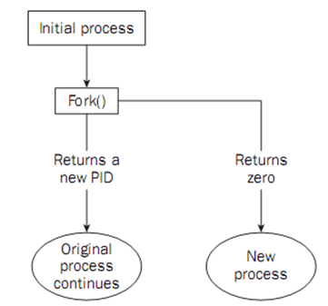
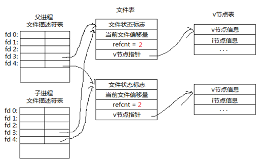

# linux系統編程之進程（三）：進程複製fork，孤兒進程，殭屍進程


- 本節目標：
    - 複製進程映像
    - fork系統調用
    - 孤兒進程、殭屍進程
    - 寫時複製


## 一，進程複製（或產生）

使用fork函數得到的子進程從父進程的繼承了整個進程的地址空間，包括：進程上下文、進程堆棧、內存信息、打開的文件描述符、信號控制設置、進程優先級、進程組號、當前工作目錄、根目錄、資源限制、控制終端等。

子進程與父進程的區別在於：
- 父進程設置的鎖，子進程不繼承（因為如果是排它鎖，被繼承的話，矛盾了）
- 各自的進程ID和父進程ID不同
- 子進程的未決告警被清除；
- 子進程的未決信號集設置為空集。

## 二，fork系統調用


包含頭文件 `<sys/types.h> 和 <unistd.h>`
函數功能:創建一個子進程<br>
函數原型<br>
```c
pid_t fork(void);  //一次調用兩次返回值，是在各自的地址空間返回，意味著現在有兩個
```
基本一樣的進程在執行<br>
參數：無參數。<br>
返回值:<br>
如果成功創建一個子進程，對於父進程來說返回子進程ID<br>
如果成功創建一個子進程，對於子進程來說返回值為0<br>
如果為-1表示創建失敗<br>

流程圖：



父進程調用fork（）系統調用，然後陷入內核，進行進程複製，如果成功：

1，則對調用進程即父進程來說返回值為剛產生的子進程pid，因為進程PCB沒有子進程信息，父進程只能通過這樣獲得。

2，對子進程（剛產生的新進程），則返回0，

這時就有兩個進程在接著向下執行

如果失敗，則返回0，調用進程繼續向下執行

注：fork英文意思：分支，fork系統調用複製產生的子進程與父進程（調用進程）基本一樣：代碼段+數據段+堆棧段+PCB，當前的運行環境基本一樣，所以子進程在fork之後開始向下執行，而不會從頭開始執行。

示例程序：

```c
#include <stdio.h>
#include <unistd.h>
#include <stdlib.h>

#define ERR_EXIT(m) \
    do\
    {\
        perror(m);\
        exit(EXIT_FAILURE);\
    }\
    while (0)\

int main(void)
{
    pid_t pid;
    printf("before calling fork,calling process pid = %d\n",getpid());
    pid = fork();
    if(pid == -1)
        ERR_EXIT("fork error");
    if(pid == 0){
        printf("this is child process and child's pid = %d,parent's pid = %d\n",getpid(),getppid());
    }
    if(pid > 0){
        //sleep(1);
        printf("this is parent process and pid =%d ,child's pid = %d\n",getpid(),pid);
    }

    return 0;
}
```
運行結果：


當沒給父進程沒加sleep時，由於父進程先執行完，子進程成了孤兒進程，系統將其託孤給了1（init）進程，

所以ppid =1。

當加上sleep後，子進程先執行完：


這次可以正確看到想要的結果。

## 三，孤兒進程、殭屍進程

fork系統調用之後，父子進程將交替執行，執行順序不定。

如果父進程先退出，子進程還沒退出那麼子進程的父進程將變為init進程（託孤給了init進程）。（注：任何一個進程都必須有父進程）

如果子進程先退出，父進程還沒退出，那麼子進程必須等到父進程捕獲到了子進程的退出狀態才真正結束，否則這個時候子進程就成為僵進程（殭屍進程：只保留一些退出信息供父進程查詢）

示例：

```c
#include <stdio.h>
#include <unistd.h>
#include <stdlib.h>

#define ERR_EXIT(m) \
    do\
    {\
        perror(m);\
        exit(EXIT_FAILURE);\
    }\
    while (0)\

int main(void)
{
    pid_t pid;
    printf("before calling fork,calling process pid = %d\n",getpid());
    pid = fork();
    if(pid == -1)
        ERR_EXIT("fork error");
    if(pid == 0){
        printf("this is child process and child's pid = %d,parent's pid = %d\n",getpid(),getppid());
    }
    if(pid > 0){
        sleep(100);
        printf("this is parent process and pid =%d ,child's pid = %d\n",getpid(),pid);
    }

    return 0;
}
```

以上程序跟前面那個基本一致，就是讓父進程睡眠100秒，好讓子進程先退出

運行結果：


從上可以看到，子進程先退出，但進程列表中還可以查看到子進程，[a.out] `<defunct>`，死的意思，即殭屍進程，如果系統中存在過多的殭屍進程，將會使得新的進程不能產生。<br>

## 四，寫時複製

linux系統為了提高系統性能和資源利用率，在fork出一個新進程時，系統並沒有真正複製一個副本。

如果多個進程要讀取它們自己的那部分資源的副本，那麼複製是不必要的。

每個進程只要保存一個指向這個資源的指針就可以了。

如果一個進程要修改自己的那份資源的“副本”，那麼就會複製那份資源。這就是寫時複製的含義

fork 和vfork：
在fork還沒實現copy on write之前。Unix設計者很關心fork之後立刻執行exec所造成的地址空間浪費，所以引入了vfork系統調用。

`vfork有個限制，子進程必須立刻執行_exit或者exec函數。`

即使fork實現了copy on write，效率也沒有vfork高，但是我們不推薦使用vfork，因為幾乎每一個vfork的實現，都或多或少存在一定的問題

```c
vfork：

Linux Description 
    vfork(), just like fork(2), creates a child process of the calling pro- 
    cess.  For details and return value and errors, see fork(2).

    vfork()  is  a special case of clone(2).  It is used to create new pro- 
    cesses without copying the page tables of the parent process.   It  may 
    be  useful  in performance-sensitive applications where a child will be 
    created which then immediately issues an execve(2).

    vfork() differs from fork(2) in that the parent is suspended until  the 
    child  terminates (either normally, by calling _exit(2), or abnormally, 
    after delivery of a fatal signal), or it makes  a  call  to  execve(2). 
    Until  that point, the child shares all memory with its parent, includ- 
    ing the stack. The child must not return from the current function  or 
    call exit(3), but may call _exit(2).

    Signal  handlers  are inherited, but not shared.  Signals to the parent 
    arrive after the child releases the parent’s memory  (i.e.,  after  the 
    child terminates or calls execve(2)).

```

示例程序：

```c
#include <stdio.h>
#include <unistd.h>
#include <stdlib.h>

#define ERR_EXIT(m) \
    do\
    {\
        perror(m);\
        exit(EXIT_FAILURE);\
    }\
    while (0)\

int main(void)
{
    pid_t pid;
    int val = 1;
    printf("before calling fork, val = %d\n",val);
    
    //pid = fork();
    pid = vfork();
    if(pid == -1)
        ERR_EXIT("fork error");
    if(pid == 0){
        printf("chile process,before change val, val = %d\n",val);
        val++;
        //sleep(1);
        printf("this is child process and val = %d\n",val);
        _exit(0);

    }
    if(pid > 0){
        sleep(1);
        //val++;
        printf("this is parent process and val = %d\n",val);
    }

    return 0;
}
```

當調用fork時:

運行結果：


可知寫時複製

當使用vfork但子進程沒使用exit退出時：


結果出錯了，

使用vfork且exit退出：


結果正常，父子進程共享


`fork之後父子進程共享文件：`




fork產生的子進程與父進程相同的文件文件描述符指向相同的文件表，引用計數增加，共享文件文件偏移指針

示例程序：

```c
#include <stdio.h>
#include <unistd.h>
#include <stdlib.h>
#include <fcntl.h>

#define ERR_EXIT(m) \
    do\
    {\
        perror(m);\
        exit(EXIT_FAILURE);\
    }\
    while (0)\

int main(void)
{
    pid_t pid;
    int fd;
    fd = open("test.txt",O_WRONLY);
    if(fd == -1)
        ERR_EXIT("OPEN ERROR");
    pid = fork();
    if(pid == -1)
        ERR_EXIT("fork error");
    if(pid == 0){
        write(fd,"child",5);
    }
    if(pid > 0){
        //sleep(1);
        write(fd,"parent",6);
    }

    return 0;
}
```


可知父子進程共享文件偏移指針，父進程寫完後文件偏移到parent後子進程開始接著寫。
