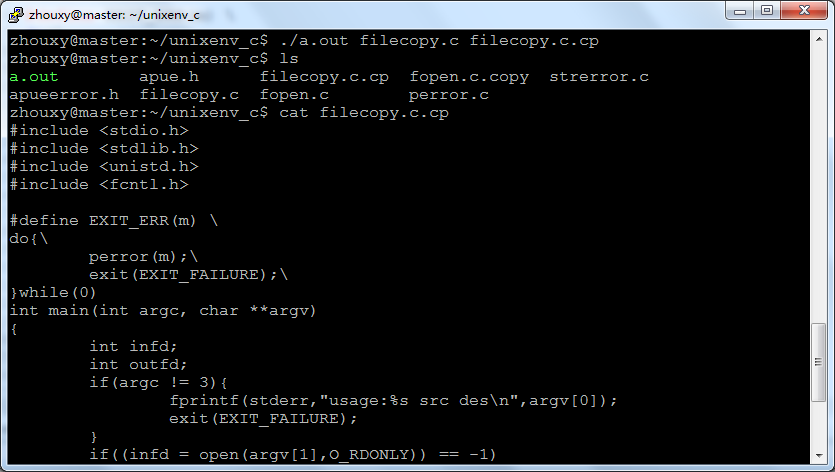

# linux系统编程之文件与IO（二）：系统调用read和write


- read系统调用

一旦有了与一个打开文件描述相连的文件描述符，只要该文件是用O_RDONLY或O_RDWR标志打开的，就可以用read()系统调用从该文件中读取字节

函数原型：

```c
#include <unistd.h>

ssize_t read(int fd, void *buf, size_t count);
```

参数

fd ：想要读的文件的文件描述符

buf ： 指向内存块的指针，从文件中读取来的字节放到这个内存块中

count ： 从该文件复制到buf中的字节个数

返回值

如果出现错误，返回-1

读文件结束，返回0

否则返回从该文件复制到规定的缓冲区中的字节数

否则返回从该文件复制到规定的缓冲区中的字节数


- write系统调用


用write()系统调用将数据写到一个文件中

函数原型：

```c
#include <unistd.h>

ssize_t write(int fd, const void *buf, size_t count);
```
函数参数：

-fd：要写入的文件的文件描述符

-buf：指向内存块的指针，从这个内存块中读取数据写入 到文件中

-count：要写入文件的字节个数

返回值

如果出现错误，返回-1

注:write并非真正写入磁盘,而是先写入内存缓冲区,待缓冲区满或进行刷新操作后才真正写入磁盘,若想实时写入磁盘可调用

int fsync(int fd);或在open时flags加上O_SYNC


利用read和write进行文件拷贝

程序代码:

```c
#include <stdio.h>
#include <stdlib.h>
#include <unistd.h>
#include <fcntl.h>

#define EXIT_ERR(m) \
do{\
    perror(m);\
    exit(EXIT_FAILURE);\
}while(0)
int main(int argc, char **argv)
{
    int infd;
    int outfd;
    if(argc != 3){
        fprintf(stderr,"usage:%s src des\n",argv[0]);
        exit(EXIT_FAILURE);
    }
    if((infd = open(argv[1],O_RDONLY)) == -1)
        EXIT_ERR("open error");
    if((outfd = open(argv[2],O_WRONLY|O_CREAT|O_TRUNC,0644)) == -1)
        EXIT_ERR("OPEN ERROR");
    char buf[1024];
    int n;
    while((n = read(infd, buf, 1024)) > 0 ){
        write(outfd, buf, n);
    }
    close(infd);
    close(outfd);
    return 0;
}
```
测试结果:


