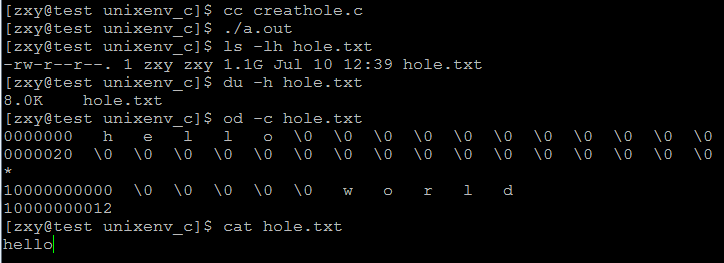

# linux系统编程之文件与IO（三）：利用lseek()创建空洞文件


一、lseek（）系统调用

功能说明：

通过指定相对于开始位置、当前位置或末尾位置的字节数来重定位 curp，这取决于 lseek() 函数中指定的位置

函数原型：
```c
#include <sys/types.h> 
#include <unistd.h>
```

off_t lseek(int fd, off_t offset, int whence);

参数说明：

fd：文件描述符

offset：偏移量，该值可正可负，负值为向前移

whence：搜索的起始位置，有三个选项：

(1).SEEK_SET: 当前位置为文件的开头，新位置为偏移量大小 
(2).SEEK_CUR: 当前位置为文件指针位置，新位置为当前位置加上偏移量大小 
(3).SEEK_END: 当前位置为文件结尾，新位置为偏移量大小

返回值：文件新的偏移值

二、利用lseek（）产生空洞文件（hole）

说明：

The lseek() function allows the file offset to be set beyond the end of the file (but this does not change the size of the file).  If  data  is later written at this point, subsequent  reads of the data in the gap (a "hole") return null bytes ('\0') until data is  actually  written  into the gap.

程序代码：

```c
#include <stdio.h>
#include <unistd.h>
#include <fcntl.h>
#include <stdlib.h>

#define ERR_EXIT(m) \
    do \
    { \
        perror(m); \
        exit(EXIT_FAILURE); \
    } while(0)

int main(void)
{
    int fd;
    int ret;
    fd = open("hole.txt",O_WRONLY|O_CREAT|O_TRUNC,0644);
    if(fd == -1)
        ERR_EXIT("open error");
    write(fd,"hello",5);
    ret = lseek(fd,1024*1024*1024,SEEK_CUR);
    if(ret == -1)
        ERR_EXIT("lseek error");
    write(fd,"world",5);
    close(fd);
    return 0;
}
```
测试结果：

