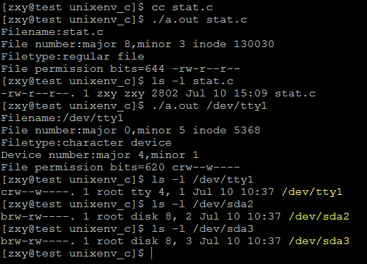

# linux系统编程之文件与IO（五）：stat（）系统调用获取文件信息


一、stat()获取文件元数据
```c
stat系统调用原型： 
#include <sys/stat.h>

int stat(const char *path, struct stat *buf); 
int fstat(int fd, struct stat *buf); 
int lstat(const char *path, struct stat *buf);

帮助信息可通过：man 2 stat 查看

DESCRIPTION 
       These  functions  return  information about a file.  No permissions are 
       required on the file itself, but — in the case of stat() and lstat()  — 
       execute  (search)  permission  is required on all of the directories in 
       path that lead to the file.

       stat() stats the file pointed to by path and fills in buf.

       lstat() is identical to stat(), except that if path is a symbolic link, 
       then the link itself is stat-ed, not the file that it refers to.

       fstat()  is  identical to stat(), except that the file to be stat-ed is 
       specified by the file descriptor fd.

       All of these system calls return a stat structure, which  contains  the 
       following fields:


struct stat { 
    dev_t     st_dev;     /* ID of device containing file ：该文件所属设备的设备号，设备号包括主设备和和次设备号，dev_t是16位整数，高8位表示主设备号，低8位表示次设备号*/ 
    ino_t     st_ino;     /* inode number */ 
    mode_t    st_mode;    /* protection ：包含文件访问权限信息及文件类型*/ 
    nlink_t   st_nlink;   /* number of hard links */ 
    uid_t     st_uid;     /* user ID of owner */ 
    gid_t     st_gid;     /* group ID of owner */ 
    dev_t     st_rdev;    /* device ID (if special file)：如果该文件是特殊文件即设备文件，则表示设备号 */ 
    off_t     st_size;    /* total size, in bytes */ 
    blksize_t st_blksize; /* blocksize for file system I/O */ 
    blkcnt_t  st_blocks;  /* number of 512B blocks allocated ：分配的块数量*/ 
    time_t    st_atime;   /* time of last access */ 
    time_t    st_mtime;   /* time of last modification */ 
    time_t    st_ctime;   /* time of last status change：如修改文件的权限 */ 
};

文件类型有两种方式获得：

1.通过以下的一些宏进行验证：m为struct stat中得st_mode字段

    S_ISREG(m)  is it a regular file?

    S_ISDIR(m)  directory?

    S_ISCHR(m)  character device?

    S_ISBLK(m)  block device?

    S_ISFIFO(m) FIFO (named pipe)?

    S_ISLNK(m)  symbolic link? (Not in POSIX.1-1996.)

    S_ISSOCK(m) socket? (Not in POSIX.1-1996.)

2.利用struct stat中得st_mode字段与S_IFMT进行与运算：mode&S_IFMT，然后将得到的结果与下列的常量比较，相等就是

The following flags are defined for the st_mode field:

   S_IFMT     0170000   bit mask for the file type bit fields 
    S_IFSOCK   0140000   socket 
    S_IFLNK    0120000   symbolic link 
    S_IFREG    0100000   regular file 
    S_IFBLK    0060000   block device 
    S_IFDIR    0040000   directory 
    S_IFCHR    0020000   character device 
    S_IFIFO    0010000   FIFO

文件访问权限获得：利用struct stat中得st_mode字段与S_IFMT进行与运算：mode&S_IFMT，然后将得到的结果与下列的常量比较，相等就是

S_IFMT     0170000   bit mask for the file type bit fields 

S_ISUID    0004000   set UID bit 
S_ISGID    0002000   set-group-ID bit (see below) 
S_ISVTX    0001000   sticky bit (see below) 
S_IRWXU    00700     mask for file owner permissions 
S_IRUSR    00400     owner has read permission 
S_IWUSR    00200     owner has write permission 
S_IXUSR    00100     owner has execute permission 
S_IRWXG    00070     mask for group permissions 
S_IRGRP    00040     group has read permission 
S_IWGRP    00020     group has write permission 
S_IXGRP    00010     group has execute permission 
S_IRWXO    00007     mask for permissions for others (not in group) 
S_IROTH    00004     others have read permission 
S_IWOTH    00002     others have write permission 
S_IXOTH    00001     others have execute permission
```


示例程序：


```c
#include <unistd.h>
#include <sys/stat.h>
#include <sys/types.h>
#include <sys/stat.h>
#include <fcntl.h>

#include <stdlib.h>
#include <stdio.h>
#include <errno.h>
#include <string.h>


#define ERR_EXIT(m) \
    do \
    { \
        perror(m); \
        exit(EXIT_FAILURE); \
    } while(0)

#define MAJOR(a) (int)((unsigned short)a >> 8) //高8位：主设备号
#define MINOR(a) (int)((unsigned short)a & 0xFF)//低8位：次设备号

int filetype(struct stat *buf);
void fileperm(struct stat *buf, char *perm);

int main(int argc, char *argv[])
{
    if (argc != 2)
    {
        fprintf(stderr, "Usage %s file\n", argv[0]);
        exit(EXIT_FAILURE);
    }

    struct stat sbuf;
    printf("Filename:%s\n", argv[1]);
    if (lstat(argv[1], &sbuf) == -1)
        ERR_EXIT("stat error");

    printf("File number:major %d,minor %d inode %d\n", MAJOR(sbuf.st_dev), MINOR(sbuf.st_dev), (int)sbuf.st_ino);
    if (filetype(&sbuf))
    {
        printf("Device number:major %d,minor %d\n", MAJOR(sbuf.st_rdev), MINOR(sbuf.st_rdev));
    }
    
    char perm[11] = {0};
    fileperm(&sbuf, perm);
    printf("File permission bits=%o %s\n", sbuf.st_mode & 07777, perm);
    

    return 0;
}


int filetype(struct stat *buf)
{
    int flag = 0;
    printf("Filetype:");
    mode_t mode;
    mode = buf->st_mode;
    switch (mode & S_IFMT)
    {
    case S_IFSOCK:
        printf("socket\n");
        break;
    case S_IFLNK:
        printf("symbolic link\n");
        break;
    case S_IFREG:
        printf("regular file\n");
        break;
    case S_IFBLK:
        printf("block device\n");
        flag = 1; //该文件为设备文件
        break;
    case S_IFDIR:
        printf("directory\n");
        break;
    case S_IFCHR:
        printf("character device\n");
        flag = 1;
        break;
    case S_IFIFO:
        printf("FIFO\n");
        break;
    default:
        printf("unknown file type\n");
        break;
    }

    return flag;
}

void fileperm(struct stat *buf, char *perm)
{
    strcpy(perm, "----------");
    perm[0] = '?';
    mode_t mode;
        mode = buf->st_mode;
        switch (mode & S_IFMT)
        {
        case S_IFSOCK:
        perm[0] = 's';
                break;
        case S_IFLNK:
        perm[0] = 'l';
                break;
        case S_IFREG:
        perm[0] = '-';
                break;
        case S_IFBLK:
        perm[0] = 'b';
                break;
        case S_IFDIR:
        perm[0] = 'd';
                break;
        case S_IFCHR:
        perm[0] = 'c';
                break;
        case S_IFIFO:
        perm[0] = 'p';
                break;
    }

    if (mode & S_IRUSR)
        perm[1] = 'r';
    if (mode & S_IWUSR)
        perm[2] = 'w';
    if (mode & S_IXUSR)
        perm[3] = 'x';
    if (mode & S_IRGRP)
        perm[4] = 'r';
    if (mode & S_IWGRP)
        perm[5] = 'w';
    if (mode & S_IXGRP)
        perm[6] = 'x';
    if (mode & S_IROTH)
        perm[7] = 'r';
    if (mode & S_IWOTH)
        perm[8] = 'w';
    if (mode & S_IXOTH)
        perm[9] = 'x';
    perm[10] = '\0';
}
```
运行结果：



