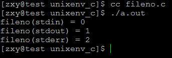
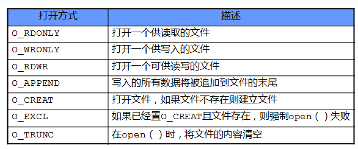

# linux系統編程之文件與IO（一）：文件描述符、open，close


## 1. 什麼是IO？
- 輸入/輸出是主存和外部設備之間拷貝數據的過程
    - 設備->內存（輸入操作）
    - 內存->設備（輸出操作）

- 高級I/O
    - ANSI C提供的標準I/O庫稱為高級I/O，通常也稱為帶緩衝的I/O

- 低級I/O
    - 通常也稱為不帶緩衝的I/O

## 2. 文件描述符：fd

- 對於Linux而言，所有對設備或文件的操作都是通過文件描述符進行的。
- 當打開或者創建一個文件的時候，內核向進程返回一個文件描述符（非負整數）。後續對文件的操作只需通過該文件描述符，內核記錄有關這個打開文件的信息。
- 一個進程啟動時，默認打開了3個文件，標準輸入、標準輸出、標準錯誤，對應文件描述符是0（STDIN_FILENO）、1（STDOUT_FILENO）、2（STDERR_FILENO）,這些常量定義在unistd.h頭文件中。C庫函數中與之對應的是：stdin,stdout,stderr,不過這三個是FILE指針類型。

## 3.文件描述符與文件指針相互轉換

可以通過以下兩個函數實現：

- fileno：將文件指針轉換為文件描述符

```c
#include <stdio.h>
int fileno(FILE *stream)
```
測試程序：

```c
#include <stdlib.h>
#include <stdio.h>

int main(void)
{
    printf("fileno(stdin) = %d\n", fileno(stdin));
    printf("fileno(stdout) = %d\n", fileno(stdout));
    printf("fileno(stderr) = %d\n", fileno(stderr));
    return 0;
}
```
測試結果：




- fdopen：將文件描述符轉換為文件指針

```c
#include <stdio.h>
FILE *fdopen(int fd, const char *mode)    //mode :r,w,r+,w+,a,a+
``` 


- open系統調用

有幾種方法可以獲得允許訪問文件的文件描述符。最常用的是使用open（）（打開）系統調用

函數原型
```c
#include <sys/types.h> 
#include <sys/stat.h> 
#include <fcntl.h>

int open(const char *pathname, int flags); 
int open(const char *pathname, int flags, mode_t mode);
```
參數

path ：文件的名稱，可以包含（絕對和相對）路徑

flags：文件打開模式

mode：用來規定對該文件的所有者，文件的用戶組及系 統中其他用戶的訪問權限

返回值

打開成功，返回文件描述符；

打開失敗，返回－1

文件打開方式：




O_EXCL表示：當O_EXCL|O_CREAT時，若文件存在，則打開失敗，不存在，則打開成功


訪問權限：

open系統調用的幾點說明：

可以利用按位邏輯加(bitwise-OR)(|)對打開方式的標誌值進行組合。

如打開一個新文件：
```c
＃define NEWFILE  (O_WRONLY|O_CREAT|O_TRUNC)
```
對訪問權限位進行訪問所用到的標識符，均可以通過
```c
＃include <sys/stat.h> 
```

訪問到,同樣可以通過|運算來對訪問權限進行組合也可以直接給出數字表示如0655
```c
#define MODE755 (S_IRWXU|S_IRGRP|S_IXGRP|S_IROTH|S_IXOTH)
```

注：文件的訪問權限是根據：umask&~mode得出來的，例如umask=0022,mode = 0655 則訪問權限為：644

測試程序：
```c
#include <unistd.h>
#include <sys/types.h>
#include <sys/stat.h>
#include <fcntl.h>
#include <stdlib.h>
#include <stdio.h>
#include <errno.h>
#include <string.h>


#define ERR_EXIT(m) \
    do \
    { \
        perror(m); \
        exit(EXIT_FAILURE); \
    } while(0)

int main(void)
{
    umask(0);
    int fd;
    fd = open("test.txt", O_WRONLY | O_CREAT, 0666);
    if (fd == -1)
        ERR_EXIT("open error");

    printf("open succ\n");
    return 0;
}
```
測試結果一：採用默認的umask值


測試結果二：重新設置umask值


- close系統調用

為了重新利用文件描述符，用close()系統調用釋放打開的文件描述符

函數原型：
```c
#include <unistd.h>

int close(int fd);
```

函數參數：

- fd ：要關閉的文件的文件描述符

返回值

如果出現錯誤，返回-1

調用成功返回0

注：若沒有顯示調用close（），當程序退出時也會關閉文件

- creat系統調用

為了維持與早期的UNIX系統的向後兼容性，Linux也提供可選的創建文件的系統調用，它稱為creat()。現代的linux內核很少採用creat創建文件，因為open可以完成創建功能

函數原型：

```c
int creat(const char *path, mode_t mode)；
```

參數

path ：文件的名稱，可以包含（絕對和相對）路徑

mode: 用來規定對該文件的所有者，文件的用戶組及系 統中其他用戶的訪問權限

返回值

打開成功，返回文件描述符；

打開失敗，返回－1

 

在UNIX的早期版本中，open()系統調用僅僅存在兩個參數的形式。如文件不存在，它就不能打開這些文件。文件的創建則由單獨的系統調用creat()完成。在Linux及所有UNIX的近代版本中，creat()系統調用是多餘的。

creat()調用

```c
fd = creat(file, mode)；
```

完全等價於近代的open()調用

```c
fd = open(file, O_WRONLY | O_CREAT | O_TRUNC, mode)；
```
