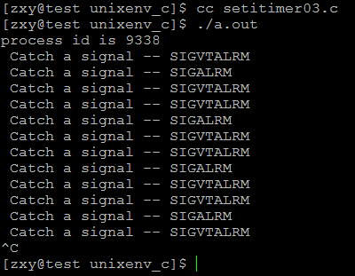

# linux系统编程之信号（八）：三种时间结构及定时器setitimer()详解


##一，三种时间结构

```c
time_t://seconds

struct timeval {
    long tv_sec; /* seconds */
    long tv_usec; /* microseconds */
};

struct timespec {
    time_t tv_sec; /* seconds */
    long tv_nsec; /* nanoseconds */
};

```

##二，setitimer()

现在的系统中很多程序不再使用alarm调用，而是使用setitimer调用来设置定时器，用getitimer来得到定时器的状态，

这两个调用的声明格式如下：
```c
#include <sys/time.h>

int getitimer(int which, struct itimerval *curr_value); 
int setitimer(int which, const struct itimerval *new_value,struct itimerval *old_value);
```

参数:

- 第一个参数which指定定时器类型
- 第二个参数是结构itimerval的一个实例，结构itimerval形式
- 第三个参数可不做处理。

返回值:成功返回0失败返回-1

该系统调用给进程提供了三个定时器，它们各自有其独有的计时域，当其中任何一个到达，就发送一个相应的信号给进程，并使得计时器重新开始。三个计时器由参数which指定，如下所示：

TIMER_REAL：按实际时间计时，计时到达将给进程发送`SIGALRM`信号。

ITIMER_VIRTUAL：仅当进程执行时才进行计时。计时到达将发送`SIGVTALRM`信号给进程。

ITIMER_PROF：当进程执行时和系统为该进程执行动作时都计时。与ITIMER_VIR-TUAL是一对，该定时器经常用来统计进程在用户态和内核态花费的时间。计时到达将发送`SIGPROF`信号给进程。

定时器中的参数value用来指明定时器的时间，其结构如下：

```c
struct itimerval {
    struct timeval it_interval; /* 第一次之后每隔多长时间 */
    struct timeval it_value; /* 第一次调用要多长时间 */
};
```

该结构中timeval结构定义如下：

```c
truct timeval {
    long tv_sec; /* 秒 */
    long tv_usec; /* 微秒，1秒 = 1000000 微秒*/
};
```

在setitimer 调用中，参数ovalue如果不为空，则其中保留的是上次调用设定的值。定时器将it_value递减到0时，产生一个信号，并将it_value的值设定为it_interval的值，然后重新开始计时，如此往复。当it_value设定为0时，计时器停止，或者当它计时到期，而it_interval 为0时停止。调用成功时，返回0；错误时，返回-1，并设置相应的错误代码errno：

EFAULT：参数value或ovalue是无效的指针。

EINVAL：参数which不是ITIMER_REAL、ITIMER_VIRT或ITIMER_PROF中的一个。

示例一：

```c
#include <unistd.h>
#include <sys/stat.h>
#include <sys/wait.h>
#include <sys/types.h>
#include <fcntl.h>

#include <stdlib.h>
#include <stdio.h>
#include <errno.h>
#include <string.h>
#include <signal.h>
#include <sys/time.h>


#define ERR_EXIT(m) \
    do \
    { \
        perror(m); \
        exit(EXIT_FAILURE); \
    } while(0)

void handler(int sig)
{
    printf("recv a sig=%d\n", sig);
}

int main(int argc, char *argv[])
{
    if (signal(SIGALRM, handler) == SIG_ERR)
        ERR_EXIT("signal error");

    struct timeval tv_interval = {1, 0};
    struct timeval tv_value = {5, 0};
    struct itimerval it;
    it.it_interval = tv_interval;
    it.it_value = tv_value;
    setitimer(ITIMER_REAL, &it, NULL);

    for (;;)
        pause();
    return 0;
}
```

结果：


可以看到第一次发送信号是在5s以后，之后每隔一秒发送一次信号

示例二：获得产生时钟信号的剩余时间


```c
#include <unistd.h>
#include <sys/stat.h>
#include <sys/wait.h>
#include <sys/types.h>
#include <fcntl.h>

#include <stdlib.h>
#include <stdio.h>
#include <errno.h>
#include <string.h>
#include <signal.h>
#include <sys/time.h>


#define ERR_EXIT(m) \
    do \
    { \
        perror(m); \
        exit(EXIT_FAILURE); \
    } while(0)


int main(int argc, char *argv[])
{
    struct timeval tv_interval = {1, 0};
    struct timeval tv_value = {1, 0};
    struct itimerval it;
    it.it_interval = tv_interval;
    it.it_value = tv_value;
    setitimer(ITIMER_REAL, &it, NULL);

    int i;
    for (i=0; i<10000; i++);

//第一种方式获得剩余时间
    struct itimerval oit;
    setitimer(ITIMER_REAL, &it, &oit);//利用oit获得剩余时间产生时钟信号
    printf("%d %d %d %d\n", (int)oit.it_interval.tv_sec, (int)oit.it_interval.tv_usec, (int)oit.it_value.tv_sec, (int)oit.it_value.tv_usec);
//第二种方式获得剩余时间
    //getitimer(ITIMER_REAL, &it);
    //printf("%d %d %d %d\n", (int)it.it_interval.tv_sec, (int)it.it_interval.tv_usec, (int)it.it_value.tv_sec, (int)it.it_value.tv_usec);

    return 0;
}
```

结果：

用第一种方式：


用第二种方式：利用getitimer在不重新设置时钟的情况下获取剩余时间


剩余时间是指：距离下一次调用定时器产生信号所需时间，这里由于for循环不到一秒就执行完，定时器还来不及产生时钟信号，所以有剩余时间

示例三：每隔一秒发出一个SIGALRM，每隔0.5秒发出一个SIGVTALRM信号

```c
#include <signal.h>
#include <unistd.h>
#include <stdio.h>
#include <sys/time.h>

void sigroutine(int signo)
{
    switch (signo) {
    case SIGALRM:
        printf("Catch a signal -- SIGALRM\n ");
        break;

    case SIGVTALRM:
        printf("Catch a signal -- SIGVTALRM\n ");
        break;
    }

    return;
}

int main()
{
    struct itimerval value, value2;

    printf("process id is %d\n ", getpid());
    signal(SIGALRM, sigroutine);
    signal(SIGVTALRM, sigroutine);
    value.it_value.tv_sec = 1;
    value.it_value.tv_usec = 0;
    value.it_interval.tv_sec = 1;
    value.it_interval.tv_usec = 0;
    setitimer(ITIMER_REAL, &value, NULL);

    value2.it_value.tv_sec = 0;
    value2.it_value.tv_usec = 500000;
    value2.it_interval.tv_sec = 0;
    value2.it_interval.tv_usec = 500000;
    setitimer(ITIMER_VIRTUAL, &value2, NULL);
    for (;;) ;
}
```

结果：




可知确实是没两次SIGVTALRM一次SIGALRM