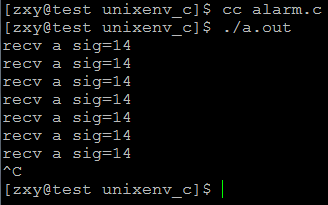

# linux系统编程之信号（四）：alarm和可重入函数


### 一，alarm()
在将可重入函数之前我们先来了解下alarm()函数使用：

```c
#include <unistd.h>

unsigned int alarm(unsigned int seconds)
```

系统调用alarm安排内核为调用进程在指定的seconds秒后发出一个SIGALRM的信号。如果指定的参数seconds为0，则不再发送 SIGALRM信号。后一次设定将取消前一次的设定。该调用返回值为上次定时调用到发送之间剩余的时间，或者因为没有前一次定时调用而返回0。

注意，在使用时，alarm只设定为发送一次信号，如果要多次发送，就要多次使用alarm调用。

man帮助说明：

```c
DESCRIPTION 
       alarm()  arranges  for  a SIGALRM signal to be delivered to the calling 
       process in seconds seconds.

       If seconds is zero, no new alarm() is scheduled.

       In any event any previously set alarm() is canceled.

RETURN VALUE 
       alarm() returns the number of seconds remaining  until  any  previously 
       scheduled alarm was due to be delivered, or zero if there was no previ- 
       ously scheduled alarm. 
```

示例：

```c
#include <unistd.h>
#include <sys/stat.h>
#include <sys/wait.h>
#include <sys/types.h>
#include <fcntl.h>

#include <stdlib.h>
#include <stdio.h>
#include <errno.h>
#include <string.h>
#include <signal.h>


#define ERR_EXIT(m) \
    do \
    { \
        perror(m); \
        exit(EXIT_FAILURE); \
    } while(0)

void handler(int sig);
int main(int argc, char *argv[])
{
    if (signal(SIGALRM, handler) == SIG_ERR)
        ERR_EXIT("signal error");

    alarm(1);
    for (;;)
        pause();
    return 0;
}

void handler(int sig)
{
    printf("recv a sig=%d\n", sig);
    alarm(1);
}
```
结果：



因为在使用时，alarm只设定为发送一次信号，如果要多次发送，就要多次使用alarm调用，所以可在信号处理函数中调用alarm()实现每隔指点秒受发送SIGALRM信号。


##二，可重入函数
为了增强程序的稳定性，在信号处理函数中应使用可重入函数。

信号处理程序中应当使用可再入（可重入）函数（注：所谓可重入函数是指一个可以被多个任务调用的过程，任务在调用时不必担心数据是否会出错）。因为进程在收到信号后，就将跳转到信号处理函数去接着执行。如果信号处理函数中使用了不可重入函数，那么信号处理函数可能会修改原来进程中不应该被修改的数据，这样进程从信号处理函数中返回接着执行时，可能会出现不可预料的后果。不可再入函数在信号处理函数中被视为不安全函数。

满足下列条件的函数多数是不可再入的：（1）使用静态的数据结构，如getlogin()，gmtime()，getgrgid()，getgrnam()，getpwuid()以及getpwnam()等等；（2）函数实现时，调用了malloc（）或者free()函数；（3）实现时使用了标准I/O函数的。

The Open Group视下列函数为可再入的：

_exit（）、access（）、alarm（）、cfgetispeed（）、cfgetospeed（）、cfsetispeed（）、cfsetospeed（）、chdir（）、chmod（）、chown（） 、close（）、creat（）、dup（）、dup2（）、execle（）、execve（）、fcntl（）、fork（）、fpathconf（）、fstat（）、fsync（）、getegid（）、 geteuid（）、getgid（）、getgroups（）、getpgrp（）、getpid（）、getppid（）、getuid（）、kill（）、link（）、lseek（）、mkdir（）、mkfifo（）、 open（）、pathconf（）、pause（）、pipe（）、raise（）、read（）、rename（）、rmdir（）、setgid（）、setpgid（）、setsid（）、setuid（）、 sigaction（）、sigaddset（）、sigdelset（）、sigemptyset（）、sigfillset（）、sigismember（）、signal（）、sigpending（）、sigprocmask（）、sigsuspend（）、sleep（）、stat（）、sysconf（）、tcdrain（）、tcflow（）、tcflush（）、tcgetattr（）、tcgetpgrp（）、tcsendbreak（）、tcsetattr（）、tcsetpgrp（）、time（）、times（）、 umask（）、uname（）、unlink（）、utime（）、wait（）、waitpid（）、write（）。

即使信号处理函数使用的都是"安全函数"，同样要注意进入处理函数时，首先要保存errno的值，结束时，再恢复原值。因为，信号处理过程中，errno值随时可能被改变。另外，longjmp()以及siglongjmp()没有被列为可再入函数，因为不能保证紧接着两个函数的其它调用是安全的。

示例程序：

```c
#include <unistd.h>
#include <sys/stat.h>
#include <sys/wait.h>
#include <sys/types.h>
#include <fcntl.h>
#include <stdlib.h>
#include <stdio.h>
#include <errno.h>
#include <string.h>
#include <signal.h>


#define ERR_EXIT(m) \
    do \
    { \
        perror(m); \
        exit(EXIT_FAILURE); \
    } while(0)


typedef struct
{
    int a;
    int b;
} TEST;

TEST g_data;

void handler(int sig);
int main(int argc, char *argv[])
{
    TEST zeros = {0, 0};
    TEST ones = {1, 1};
    if (signal(SIGALRM, handler) == SIG_ERR)
        ERR_EXIT("signal error");

    g_data = zeros;
    alarm(1);
    for (;;)
    {
        g_data = zeros;
        g_data = ones;
    }
    return 0;
}

void unsafe_fun()
{
    printf("%d %d\n", g_data.a, g_data.b);
}

void handler(int sig)
{
    unsafe_fun();
    alarm(1);
}
```

结果：


