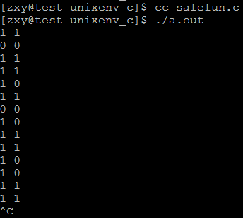

# linux系統編程之信號（四）：alarm和可重入函數


### 一，alarm()
在將可重入函數之前我們先來瞭解下alarm()函數使用：

```c
#include <unistd.h>

unsigned int alarm(unsigned int seconds)
```

系統調用alarm安排內核為調用進程在指定的seconds秒後發出一個SIGALRM的信號。如果指定的參數seconds為0，則不再發送 SIGALRM信號。後一次設定將取消前一次的設定。該調用返回值為上次定時調用到發送之間剩餘的時間，或者因為沒有前一次定時調用而返回0。

注意，在使用時，alarm只設定為發送一次信號，如果要多次發送，就要多次使用alarm調用。

man幫助說明：

```c
DESCRIPTION 
       alarm()  arranges  for  a SIGALRM signal to be delivered to the calling 
       process in seconds seconds.

       If seconds is zero, no new alarm() is scheduled.

       In any event any previously set alarm() is canceled.

RETURN VALUE 
       alarm() returns the number of seconds remaining  until  any  previously 
       scheduled alarm was due to be delivered, or zero if there was no previ- 
       ously scheduled alarm. 
```

示例：

```c
#include <unistd.h>
#include <sys/stat.h>
#include <sys/wait.h>
#include <sys/types.h>
#include <fcntl.h>

#include <stdlib.h>
#include <stdio.h>
#include <errno.h>
#include <string.h>
#include <signal.h>


#define ERR_EXIT(m) \
    do \
    { \
        perror(m); \
        exit(EXIT_FAILURE); \
    } while(0)

void handler(int sig);
int main(int argc, char *argv[])
{
    if (signal(SIGALRM, handler) == SIG_ERR)
        ERR_EXIT("signal error");

    alarm(1);
    for (;;)
        pause();
    return 0;
}

void handler(int sig)
{
    printf("recv a sig=%d\n", sig);
    alarm(1);
}
```
結果：


因為在使用時，alarm只設定為發送一次信號，如果要多次發送，就要多次使用alarm調用，所以可在信號處理函數中調用alarm()實現每隔指點秒受發送SIGALRM信號。


##二，可重入函數
為了增強程序的穩定性，在信號處理函數中應使用可重入函數。

信號處理程序中應當使用可再入（可重入）函數（注：所謂可重入函數是指一個可以被多個任務調用的過程，任務在調用時不必擔心數據是否會出錯）。因為進程在收到信號後，就將跳轉到信號處理函數去接著執行。如果信號處理函數中使用了不可重入函數，那麼信號處理函數可能會修改原來進程中不應該被修改的數據，這樣進程從信號處理函數中返回接著執行時，可能會出現不可預料的後果。不可再入函數在信號處理函數中被視為不安全函數。

滿足下列條件的函數多數是不可再入的：（1）使用靜態的數據結構，如getlogin()，gmtime()，getgrgid()，getgrnam()，getpwuid()以及getpwnam()等等；（2）函數實現時，調用了malloc（）或者free()函數；（3）實現時使用了標準I/O函數的。

The Open Group視下列函數為可再入的：

_exit（）、access（）、alarm（）、cfgetispeed（）、cfgetospeed（）、cfsetispeed（）、cfsetospeed（）、chdir（）、chmod（）、chown（） 、close（）、creat（）、dup（）、dup2（）、execle（）、execve（）、fcntl（）、fork（）、fpathconf（）、fstat（）、fsync（）、getegid（）、 geteuid（）、getgid（）、getgroups（）、getpgrp（）、getpid（）、getppid（）、getuid（）、kill（）、link（）、lseek（）、mkdir（）、mkfifo（）、 open（）、pathconf（）、pause（）、pipe（）、raise（）、read（）、rename（）、rmdir（）、setgid（）、setpgid（）、setsid（）、setuid（）、 sigaction（）、sigaddset（）、sigdelset（）、sigemptyset（）、sigfillset（）、sigismember（）、signal（）、sigpending（）、sigprocmask（）、sigsuspend（）、sleep（）、stat（）、sysconf（）、tcdrain（）、tcflow（）、tcflush（）、tcgetattr（）、tcgetpgrp（）、tcsendbreak（）、tcsetattr（）、tcsetpgrp（）、time（）、times（）、 umask（）、uname（）、unlink（）、utime（）、wait（）、waitpid（）、write（）。

即使信號處理函數使用的都是"安全函數"，同樣要注意進入處理函數時，首先要保存errno的值，結束時，再恢復原值。因為，信號處理過程中，errno值隨時可能被改變。另外，longjmp()以及siglongjmp()沒有被列為可再入函數，因為不能保證緊接著兩個函數的其它調用是安全的。

示例程序：

```c
#include <unistd.h>
#include <sys/stat.h>
#include <sys/wait.h>
#include <sys/types.h>
#include <fcntl.h>
#include <stdlib.h>
#include <stdio.h>
#include <errno.h>
#include <string.h>
#include <signal.h>


#define ERR_EXIT(m) \
    do \
    { \
        perror(m); \
        exit(EXIT_FAILURE); \
    } while(0)


typedef struct
{
    int a;
    int b;
} TEST;

TEST g_data;

void handler(int sig);
int main(int argc, char *argv[])
{
    TEST zeros = {0, 0};
    TEST ones = {1, 1};
    if (signal(SIGALRM, handler) == SIG_ERR)
        ERR_EXIT("signal error");

    g_data = zeros;
    alarm(1);
    for (;;)
    {
        g_data = zeros;
        g_data = ones;
    }
    return 0;
}

void unsafe_fun()
{
    printf("%d %d\n", g_data.a, g_data.b);
}

void handler(int sig)
{
    unsafe_fun();
    alarm(1);
}
```

結果：





也是程序創建了一個結構體，設置一個全局變量，然後在main函數中利用兩個局部變量分別給全局變量賦值，由於這個賦值操作是可被中斷的，如以上每一次結構體的賦值可視為兩步：

g_data.a=zeros.a;

g_data.b=zeros.b;

所以當g_data.a=one.a;做完然後被中斷，跑去執行處理函數，在處理函數中調用unsafe_fun（）打印全局變量值，可知結果是全局變量a值變了，b值還是之前的沒來的及改變，所以出現了1,0

所以結果不確定
