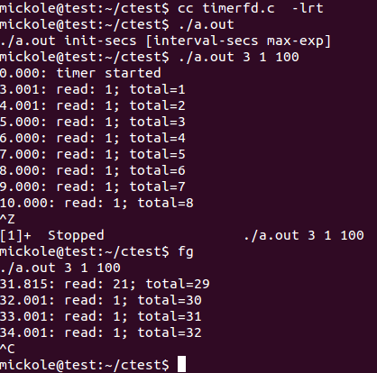

# linux新定时器：timefd及相关操作函数


timerfd是Linux为用户程序提供的一个定时器接口。这个接口基于文件描述符，通过文件描述符的可读事件进行超时通知，所以能够被用于select/poll的应用场景。

##一，相关操作函数

```c
#include <sys/timerfd.h>

int timerfd_create(int clockid, int flags);
int timerfd_settime(int fd, int flags, const struct itimerspec *new_value, struct itimerspec *old_value);
int timerfd_gettime(int fd, struct itimerspec *curr_value);
```

##二，timerfd_create
int timerfd_create(int clockid, int flags);

它是用来创建一个定时器描述符timerfd

第一个参数：clockid指定时间类型，有两个值：

CLOCK_REALTIME :Systemwide realtime clock. 系统范围内的实时时钟

CLOCK_MONOTONIC:以固定的速率运行，从不进行调整和复位 ,它不受任何系统time-of-day时钟修改的影响

第二个参数：flags可以是0或者O_CLOEXEC/O_NONBLOCK。

返回值：timerfd（文件描述符）

##三，timerfd_settime
在讲解该函数前，先理解两个相关结构体：

```c
struct timespec {
    time_t tv_sec;                /* Seconds */
    long   tv_nsec;               /* Nanoseconds */
};

struct itimerspec {
    struct timespec it_interval;  /* Interval for periodic timer */
    struct timespec it_value;     /* Initial expiration */
};
```

第二个结构体itimerspec就是timerfd要设置的超时结构体，它的成员it_value表示定时器第一次超时时间，it_interval表示之后的超时时间即每隔多长时间超时

```c
int timerfd_settime(int fd, int flags, const struct itimerspec *new_value, struct itimerspec *old_value);
```

作用：用来启动或关闭有fd指定的定时器

参数：

fd：timerfd，有timerfd_create函数返回

fnew_value:指定新的超时时间，设定new_value.it_value非零则启动定时器，否则关闭定时器，如果new_value.it_interval为0，则定时器只定时一次，即初始那次，否则之后每隔设定时间超时一次

old_value：不为null，则返回定时器这次设置之前的超时时间

flags：1代表设置的是绝对时间；为0代表相对时间。

## 四，timerfd_gettime

```c
int timerfd_gettime(int fd, struct itimerspec *curr_value);
```

此函数用于获得定时器距离下次超时还剩下的时间。如果调用时定时器已经到期，并且该定时器处于循环模式（设置超时时间时struct itimerspec::it_interval不为0），那么调用此函数之后定时器重新开始计时。

The it_value field returns the amount of time until the timer will next expire. If both fields of this structure are zero, then the timer is currently disarmed. This field always contains a relative value, regardless of whether the TFD_TIMER_ABSTIME flag was specified when setting the timer.

The it_interval field returns the interval of the timer. If both fields of this structure are zero, then the timer is set to expire just once, at the time specified by curr_value.it_value.

## 五，read读取timefd超时事件通知

read(2) If the timer has already expired one or more times since its settings were last modified using `timerfd_settime()`, or since the last successful read(2), then the buffer given to read(2) returns an unsigned 8-byte integer (uint64_t) containing the number of expirations that have occurred. (The returned value is in host byte order, i.e., the native byte order for integers on the host machine.)

If no timer expirations have occurred at the time of the read(2), then the call either blocks until the next timer expiration, or fails with the error `EAGAIN` if the file descriptor has been made nonblocking (via the use of the fcntl(2) F_SETFL operation to set the `O_NONBLOCK` flag).

A read(2) will fail with the error `EINVAL` if the size of the supplied buffer is less than 8 bytes.

当定时器超时，read读事件发生即可读，返回超时次数（从上次调用timerfd_settime()启动开始或上次read成功读取开始），它是一个8字节的unit64_t类型整数，如果定时器没有发生超时事件，则read将阻塞若timerfd为阻塞模式，否则返回EAGAIN 错误（O_NONBLOCK模式），如果read时提供的缓冲区小于8字节将以EINVAL错误返回。


## 六，示例代码

man手册中示例：

The following program creates a timer and then monitors its progress. The program accepts up to three command-line arguments. The first argument specifies the number of seconds for the initial expiration of the timer. The second argument specifies the interval for the timer, in seconds. The third argument specifies the number of times the program should allow the timer to expire before terminating. The second and third command-line arguments are optional.


```c
#include <sys/timerfd.h>
#include <time.h>
#include <unistd.h>
#include <stdlib.h>
#include <stdio.h>
#include <stdint.h>        /* Definition of uint64_t */

#define handle_error(msg) \
    do { perror(msg); exit(EXIT_FAILURE); } while (0)

static void
print_elapsed_time(void)
{
    static struct timespec start;
    struct timespec curr;
    static int first_call = 1;
    int secs, nsecs;

    if (first_call) {
        first_call = 0;

        if (clock_gettime(CLOCK_MONOTONIC, &start) == -1) {
            handle_error("clock_gettime");
        }
    }

    if (clock_gettime(CLOCK_MONOTONIC, &curr) == -1) {
        handle_error("clock_gettime");
    }

    secs = curr.tv_sec - start.tv_sec;
    nsecs = curr.tv_nsec - start.tv_nsec;

    if (nsecs < 0) {
        secs--;
        nsecs += 1000000000;
    }

    printf("%d.%03d: ", secs, (nsecs + 500000) / 1000000);
}

int
main(int argc, char* argv[])
{
    struct itimerspec new_value;
    int max_exp, fd;
    struct timespec now;
    uint64_t exp, tot_exp;
    ssize_t s;

    if ((argc != 2) && (argc != 4)) {
        fprintf(stderr, "%s init-secs [interval-secs max-exp]\n",
                argv[0]);
        exit(EXIT_FAILURE);
    }

    if (clock_gettime(CLOCK_REALTIME, &now) == -1) {
        handle_error("clock_gettime");
    }

    /* Create a CLOCK_REALTIME absolute timer with initial
       expiration and interval as specified in command line */

    new_value.it_value.tv_sec = now.tv_sec + atoi(argv[1]);
    new_value.it_value.tv_nsec = now.tv_nsec;

    if (argc == 2) {
        new_value.it_interval.tv_sec = 0;
        max_exp = 1;
    } else {
        new_value.it_interval.tv_sec = atoi(argv[2]);
        max_exp = atoi(argv[3]);
    }

    new_value.it_interval.tv_nsec = 0;

    fd = timerfd_create(CLOCK_REALTIME, 0);

    if (fd == -1) {
        handle_error("timerfd_create");
    }

    if (timerfd_settime(fd, TFD_TIMER_ABSTIME, &new_value, NULL) == -1) {
        handle_error("timerfd_settime");
    }

    print_elapsed_time();
    printf("timer started\n");

    for (tot_exp = 0; tot_exp < max_exp;) {
        s = read(fd, &exp, sizeof(uint64_t));

        if (s != sizeof(uint64_t)) {
            handle_error("read");
        }

        tot_exp += exp;
        print_elapsed_time();
        printf("read: %llu; total=%llu\n",
               (unsigned long long) exp,
               (unsigned long long) tot_exp);
    }

    exit(EXIT_SUCCESS);
}
```

运行结果：

