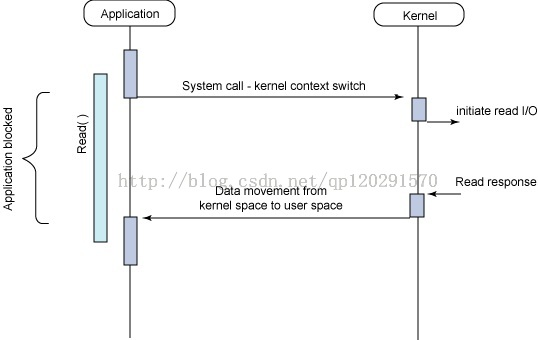

# 破解Linux操作系統的奧祕

## 存儲程序計算機的概念

現代計算機的基本結構是由美藉匈牙利科學家馮· 諾依於1946年提出的。迄今為止所有進入實用的電子計算機都是按馮· 諾依曼的提出的結構體系和工作原理設計製造的，故又統稱為“馮·諾依曼型計算機”。其要點為：
1.計算機完成任務是由事先編號的程序完成的；

```sh
2.計算機的程序被事先輸入到存儲器中，程序運算的結果，也被存放在存儲器中。
3.計算機能自動連續地完成程序。
4.程序運行的所需要的信息和結果可以通輸入\輸出設備完成。
5.計算機由運算器、控制器、存儲器、輸入設備、輸出設備所組成；
```

其工作原理如下圖：


### 堆棧（函數調用堆棧）機制

CPU通過總線從存儲器中讀取指令和數據進行處理，採用的主要機制是函數調用推棧機制。在不發生中斷、異常以及系統調用的過程中，每個進程的執行都符合函數調用堆棧機制。

在內存中，棧是往低（小）地址方向擴展的，而esp指向當前棧頂處的元素。通過使用push和pop指令我們可以把數據壓入棧中或從棧中彈出。對於沒有指定初始值的數據所需要的存儲空間，我們可以通過把棧指針遞減適當的值來做到。類似地，通過增加棧指針值我們可以回收棧中已分配的空間。棧用來傳遞函數參數、存儲返回信息、臨時保存寄存器原有值以用於回覆以及存儲局部數據。棧幀結構的兩端由兩個指針來指定。寄存器ebp通常用作棧幀的指針、esp用作棧的指針。esp隨著數據的入棧和出棧。因此對於函數中大部分數據的訪問都是通過基於幀幀指針ebp來實現。函數調用時，調用者首先會將參數以及返回地址（下一條指令的EIP）壓入棧中，並將當前EIP修改為被調用函數的起始地址；被調用者開始執行後先將原棧基址EBP保存在棧中，並修改EBP和ESP的值，初始化一個新棧。返回時，被調用者恢復EBP和ESP，並且將EIP修改為棧中存儲的返回地址。

### 中斷機制

中斷是指在CPU正常運行期間，由於內外部事件或由程序預先安排的事件引起的CPU暫時停止正在運行的程序，轉而為該內部或外部事件或預先安排的事件服務的程序中去，服務完畢後再返回去繼續運行被暫時中斷的程序。Linux中通常分為外部中斷（又叫硬件中斷）和內部中斷（又叫異常）。

CPU執行完一條指令後，下一條指令的邏輯地址存放在cs和eip這對寄存器中。在執行新指令前，控制單元會檢查在執行前一條指令的過程中是否有中斷或異常發生。如果有，控制單元就會拋下指令，進入下面的流程：

```sh
1.確定與中斷或異常關聯的向量i (0<i<255)
2.尋找向量對應的處理程序
3.保存當前的“工作現場”，執行中斷或異常的處理程序
4.處理程序執行完畢後，把控制權交還給控制單元
5.控制單元恢復現場，返回繼續執行原程序
```

Linux是個什麼玩意？
讓我們從一個比較高的高度來審視一下 GNU/Linux 操作系統的體系結構。您可以從兩個層次上來考慮操作系統，如圖所示：


最上面是用戶（或應用程序）空間。這是用戶應用程序執行的地方。用戶空間之下是內核空間，Linux 內核正是位於這裡。
GNU C Library （glibc）也在這裡。它提供了連接內核的系統調用接口，還提供了在用戶空間應用程序和內核之間進行轉換的機制。這點非常重要，因為內核和用戶空間的應用程序使用的是不同的保護地址空間。每個用戶空間的進程都使用自己的虛擬地址空間，而內核則佔用單獨的地址空間。

Linux 內核可以進一步劃分成 3 層。最上面是系統調用接口，它實現了一些基本的功能，例如 read 和 write。系統調用接口之下是內核代碼，可以更精確地定義為獨立於體系結構的內核代碼。這些代碼是 Linux 所支持的所有處理器體系結構所通用的。在這些代碼之下是依賴於體系結構的代碼，構成了通常稱為` BSP（Board Support Package）的部分`。這些代碼用作給定體系結構的處理器和特定於平臺的代碼。

### switch_to宏解析

首先要理解的是進程切換（process switch），作為搶佔式多任務OS中重要的一個功能，其實質就是OS內核掛起正在運行的進程A，然後將先前被掛起的另一個進程B恢復運行。

每個進程都有自己的地址空間，但是所有進程在物理上共享著CPU的寄存器，因此，當恢復一個進程執行前，OS內核必須要將掛起該進程時寄存器的值裝入CPU寄存器。進程恢復執行前必須裝入寄存器的一組數據就叫做“硬件上下文”（hardware context），它是進程執行上下文的子集，後者是進程執行時需要的所有信息（如地址空間中的數據等）。

Linux中，TSS保存著部分的進程的硬件上下文（如ss、esp等寄存器的值），剩餘部分保存在內核堆棧中（如eax、ebx等通用數據寄存器的值）。

進程切換隻發生在內核態，在進程切換之前，用戶態使用的寄存器內容都已保存在內核堆棧上，如ss、esp等。

下面來看一下switch_to 宏的代碼，其中，prev是即將要被換出CPU的進程的描述符，next是即將得到CPU的進程的描述符。

```c
#define switch_to(prev,next,last) do {                    \
        unsigned long esi,edi;                        \
        asm volatile("pushfl\n\t"                    \
                     "pushl %%ebp\n\t"                    \
                     "movl %%esp,%0\n\t"    /* save ESP */        \
                     "movl %5,%%esp\n\t"    /* restore ESP */    \
                     "movl $1f,%1\n\t"        /* save EIP */        \
                     "pushl %6\n\t"        /* restore EIP */    \
                     "jmp __switch_to\n"                \
                     "1:\t"                        \
                     "popl %%ebp\n\t"                    \
                     "popfl"                        \
                     :"=m" (prev->thread.esp),"=m" (prev->thread.eip),    \
                     "=a" (last),"=S" (esi),"=D" (edi)            \
                     :"m" (next->thread.esp),"m" (next->thread.eip),    \
                     "2" (prev), "d" (next));                \
    } while (0)
```
該宏的工作步驟大致如下：

prev的值送入eax，next的值送入edx（這裡我從代碼中沒有看出來，原著上如是寫，可能是從調用switch_to宏的switch_context或schedule函數中處理的）。

保護prev進程的eflags和ebp寄存器內容，這些內容保存在prev進程的內核堆棧中。
將prev的esp寄存器中的數據保存在prev->thread.esp中，即將prev進程的內核堆棧保存起來。

將next->thread.esp中的數據存入esp寄存器中，這是加載next進程的內核堆棧。
將數值1保存到prev->thread.eip中，該數值1其實就是代碼中"1:\t"這行中的1。為了恢復prev進程執行時用。

將next->thread.eip壓入next進程的內核堆棧中。這個值往往是數值1。
跳轉到__switch_to函數處執行。

執行到這裡，prev進程重新獲得CPU，恢復prev進程的ebp和eflags內容。
將eax的內容存入last參數（這裡我也沒看出來，原著上如是寫，只是在__switch_to函數中返回prev，該值是放在eax中的）。

##總結：內核的工作機制

通過上面非常重要的三個點的分析：存儲式計算機，堆棧機制，中斷機制的分析，我們對Linux內核的機制有了一個大致的瞭解，下面來總結一下。

進程是正在運行的程序的一種抽象，進程工作在從用戶態到內核態，從內核態在到用戶態之間的轉換。用戶態的進程不能直接使用硬件資源，通過中斷來切換到內核態來完成。內核態通過分析中斷請求，確定中斷向量表，然後轉向相應的中斷出倆函數，完成中斷服務。然後在轉到用戶態，繼續執行原先程序,以I/O中斷為例，如下圖：

        
