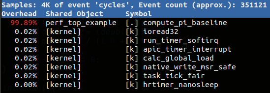

# Linux 效能分析工具: Perf - NCKU 2015


###安裝相關開發工具
```sh
$ sudo apt-get update
$ sudo apt-get install build-essential
$ sudo apt-get install linux-tools-common linux-tools-generic
$ sudo apt-get install astyle colordiff
```

## Linux 效能分析工具: Perf

Perf 全名是 Performance Event，是在 Linux 2.6.31 以後內建的系統效能分析工具，它隨著核心一併釋出。藉由 perf，應用程式可以利用 PMU (Performance Monitoring Unit), tracepoint 和核心內部的特殊計數器 (counter) 來進行統計，另外還能同時分析運行中的核心程式碼，從而更全面瞭解應用程式中的效能瓶頸。

相較於 OProfile 和 GProf ，perf 的優勢在於與 Linux 核心緊密結合，並可受益於最先納入核心的新特徵。perf 基本原理是對目標進行取樣，紀錄特定的條件下所偵測的事件Branch Prediction是否發生以及發生的次數。例如根據 tick 中斷進行取樣，即在 tick 中斷內觸發取樣點，在取樣點裡判斷行程 (process) 當時的 context。假如一個行程 90% 的時間都花費在函式 foo() 上，那麼 90% 的取樣點都應該落在函式 foo() 的上下文中。

Perf 可取樣的事件非常多，可以分析 Hardware event，如 cpu-cycles、instructions 、cache-misses、branch-misses …等等。可以分析 Software event，如 page-faults、context-switches …等等，另外一種就是 Tracepoint event。知道了 cpu-cycles、instructions 我們可以瞭解 Instruction per cycle 是多少，進而判斷程式碼有沒有好好利用 CPU，cache-misses 可以曉得是否有善用 Locality of reference ，branch-misses 多了是否導致嚴重的 pipeline hazard ？另外 Perf 還可以對函式進行採樣，瞭解效能卡在哪邊。

###Perf 安裝

首先利用以下指令查看目前的 Linux 核心組態是否啟用 perf。如果電腦已安裝常見 GNU/Linux 發行版本，預設值應該都有開啟。

```sh
＄ cat "/boot/config-`uname -r`" | grep "PERF_EVENT"
```

參考的環境是 Ubuntu 14.04 輸入$ perf list 或 $ sudo perf top 檢查一下 perf 可不可以使用。

如果出現以下的訊息，表示還漏了些東西。(下方的核心版本可能和你不一樣，根據指示安裝起來即可。不放心的話可以使用 ＄ uname -r 確認)

```sh
WARNING: perf not found for kernel 3.16.0-50
You may need to install the following packages for this specific kernel:
    linux-tools-3.16.0-50-generic
    linux-cloud-tools-3.16.0-50-generic
```

於是執行以下指令:
```sh
$ sudo apt-get install linux-tools-3.16.0-50-generic linux-cloud-tools-3.16.0-50-generic
```

到這裡 perf 的安裝就完成了。

如果你不是切換到 root 的情況下輸入 $ perf top，會出現以下錯誤畫面：


`kernel.perf_event_paranoid` 是用來決定你在沒有 root 權限下 (Normal User) 使用 perf 時，你可以取得哪些 event data。預設值是 kernel.perf_event_paranoid＝1，你可以輸入 

```sh
$ cat /proc/sys/kernel/perf_event_paranoid 
```

來查看權限值。一共有四種權限值:

- 2 : 不允許任何量測。但部份用來查看或分析已存在的紀錄的指令仍可使用，如 perf ls、perf report、perf timechart、 perf trace。
- 1 : 不允許 CPU events data。但可以使用 perf stat、perf record 並取得 Kernel profiling data。
- 0 : 不允許 raw tracepoint access。但可以使用 perf stat、perf record 並取得 CPU events data。
- -1: 權限全開
最後如果要檢測 cache miss event ，需要先取消 kernel pointer 的限制。

```sh
$ sudo sh -c " echo 0 > /proc/sys/kernel/kptr_restrict"
```

先來個範例暖身吧！

一開始，我們先使用第一次作業 `計算圓周率` 的程式來體會一下 perf 使用。


```c
#include <stdio.h>
#include <unistd.h>

double compute_pi_baseline(size_t N) {
    double pi = 0.0;
    double dt = 1.0 / N;
    for (size_t i = 0; i < N; i++) {
        double x = (double) i / N;
        pi += dt / (1.0 + x * x);
    }
    return pi * 4.0;
}
int main() {
    printf("pid: %d\n", getpid());
    sleep(10);
    compute_pi_baseline(50000000);
    return 0;
}
```

執行上述程式後，會看到 pid: 顯示數字，然後開啟新的終端機畫面，設定 pid 的值 $ export pid=，後方加上剛看到的數字。之後再執行 perf:

```sh
perf top -p $pid
```

應該會得到類似下面的結果：



預設的 performance event 是 “cycles”，所以這條指令可以分析出消耗 CPU 週期最多的部份，結果顯示函式 compute_pi_baseline() 佔了近 99.9％，跟預期一樣，此函式是程式中的「熱點」！

##作業要求

- 詳細閱讀 Week #3 課程的 案例分析: Phone Book，研究降低 cache miss 的方法
- 在 GitHub 上 fork phonebook，然後適度修改 phonebook_opt.c 和 phonebook_opt.h 兩個檔案，使得這兩者執行時期的 cache miss 降低。請用 perf 驗證，而且改進的過程中，不能有功能方面的減損。
    - phonebook_orig.[ch] 不需要修改，我們關注的是 phonebook_opt.[ch]，當然要修改 main.c 也是允許的
    - findName() 的時間必須比 Week #3 課程 列出的數據，來得更快
    - append() 的時間可以比原始版本稍久，但不應該增加太多
    - main.c 應該只有一份，不要建立新的 main()，善用 Makefile 定義對應的 CFLAGS
    - 在執行程式(phonebook_orig 和 phonebook_opt) 前，先清空 cache:
    ```sh
    $ echo "echo 1 > /proc/sys/vm/drop_caches" | sudo sh
    ```

- 除了修改程式，也要編輯 Hackpad 下方「作業區」，增添開發紀錄和 GitHub 連結
    - 至少要列出效能分析，以及充份說明你如何改善效能。請使用 gnuplot 建立圖表

- 務必使用 astyle 排版，詳細使用方式見 README.md
    - 可能的效能改進方向：
    - 改寫 struct __PHONE_BOOK_ENTRY 的成員，搬動到新的結構中
    - 使用 hash function 來加速查詢
    - 既然 first name, last name, address 都是合法的英文 (可假設成立)，使用字串壓縮的演算法，降低資料表示的成本
    - 使用 binary search tree 改寫演算法
- 截止日期：
    - Oct 12, 2015 (含) 之前
    - 越早在 GitHub 上有動態、越早接受 code review，評分越高

###挑戰題

- 除了降低 findName() 的 cache miss 與執行成本，append() 也該想辦法縮減時間
    - 建立 phone book 時，既然 lastName - 是索引值，可以優先建立搜尋表格，其他資料可稍後再補上
    - 用 PThread 建立 manager/worker thread model
- 支援 fuzzy search，允許搜尋 lastName 時，不用精準打出正確的寫法
    - 比方說電話簿有一筆資料是 McDonald，但若使用者輸入 MacDonald 或 McDonalds，也一併檢索出來
- 改善電話簿的效能分析，透過大量的重複執行，找出 95% 信賴區間，而且允許動態新增資料 (較符合現實) 和查詢

