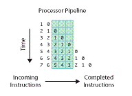
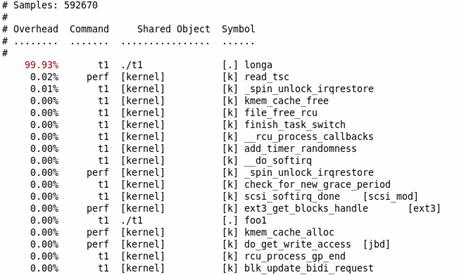
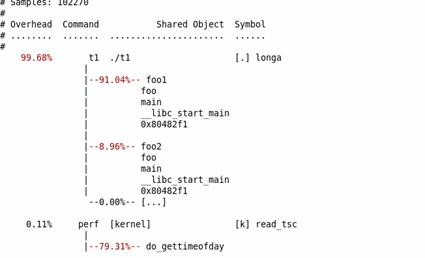

# Perf -- Linux下的系統性能調優工具，第 1 部分


Perf Event 是一款隨 Linux 內核代碼一同發佈和維護的性能診斷工具，由內核社區維護和發展。Perf 不僅可以用於應用程序的性能統計分析，也可以應用於內核代碼的性能統計和分析。得益於其優秀的體系結構設計，越來越多的新功能被加入 Perf，使其已經成為一個多功能的性能統計工具集 。在第一部分，將介紹 Perf 在應用程序開發上的應用。


##Perf 簡介
Perf 是用來進行軟件性能分析的工具。
通過它，應用程序可以利用 PMU，tracepoint 和內核中的特殊計數器來進行性能統計。它不但可以分析指定應用程序的性能問題 (per thread)，也可以用來分析內核的性能問題，當然也可以同時分析應用代碼和內核，從而全面理解應用程序中的性能瓶頸。

最初的時候，它叫做 Performance counter，在 2.6.31 中第一次亮相。此後他成為內核開發最為活躍的一個領域。在 2.6.32 中它正式改名為 Performance Event，因為 perf 已不再僅僅作為 PMU 的抽象，而是能夠處理所有的性能相關的事件。
使用 perf，您可以分析程序運行期間發生的硬件事件，比如 instructions retired ，processor clock cycles 等；您也可以分析軟件事件，比如 Page Fault 和進程切換。

這使得 Perf 擁有了眾多的性能分析能力，舉例來說，使用 Perf 可以計算每個時鐘週期內的指令數，稱為 IPC，IPC 偏低表明代碼沒有很好地利用 CPU。Perf 還可以對程序進行函數級別的採樣，從而瞭解程序的性能瓶頸究竟在哪裡等等。Perf 還可以替代 strace，可以添加動態內核 probe 點，還可以做 benchmark 衡量調度器的好壞。。。

人們或許會稱它為進行性能分析的“瑞士軍刀”，但我不喜歡這個比喻，我覺得 perf 應該是一把世間少有的倚天劍。
金庸筆下的很多人都有對寶刀的癖好，即便本領低微不配擁有，但是喜歡，便無可奈何。我恐怕正如這些人一樣，因此進了酒館客棧，見到相熟或者不相熟的人，就要興沖沖地要講講那倚天劍的故事。


###背景知識
有些背景知識是分析性能問題時需要了解的。比如硬件 cache；再比如操作系統內核。應用程序的行為細節往往是和這些東西互相牽扯的，這些底層的東西會以意想不到的方式影響應用程序的性能，比如某些程序無法充分利用 cache，從而導致性能下降。比如不必要地調用過多的系統調用，造成頻繁的內核 / 用戶切換。等等。方方面面，這裡只是為本文的後續內容做一些鋪墊，關於調優還有很多東西，我所不知道的比知道的要多的多。


###性能相關的處理器硬件特性，PMU 簡介
當算法已經優化，代碼不斷精簡，人們調到最後，便需要斤斤計較了。cache 啊，流水線啊一類平時不大注意的東西也必須精打細算了。

###硬件特性之 cache
內存讀寫是很快的，但還是無法和處理器的指令執行速度相比。為了從內存中讀取指令和數據，處理器需要等待，用處理器的時間來衡量，這種等待非常漫長。Cache 是一種 SRAM，它的讀寫速率非常快，能和處理器處理速度相匹配。因此將常用的數據保存在 cache 中，處理器便無須等待，從而提高性能。Cache 的尺寸一般都很小，充分利用 cache 是軟件調優非常重要的部分。

###硬件特性之流水線，超標量體系結構，亂序執行
提高性能最有效的方式之一就是並行。處理器在硬件設計時也儘可能地並行，比如流水線，超標量體系結構以及亂序執行。
處理器處理一條指令需要分多個步驟完成，比如先取指令，然後完成運算，最後將計算結果輸出到總線上。在處理器內部，這可以看作一個三級流水線，如下圖所示：
圖 1. 處理器流水線



指令從左邊進入處理器，上圖中的流水線有三級，一個時鐘週期內可以同時處理三條指令，分別被流水線的不同部分處理。
超標量（superscalar）指一個時鐘週期發射多條指令的流水線機器架構，比如 Intel 的 Pentium 處理器，內部有兩個執行單元，在一個時鐘週期內允許執行兩條指令。
此外，在處理器內部，不同指令所需要的處理步驟和時鐘週期是不同的，如果嚴格按照程序的執行順序執行，那麼就無法充分利用處理器的流水線。因此指令有可能被亂序執行。
上述三種並行技術對所執行的指令有一個基本要求，即相鄰的指令相互沒有依賴關係。假如某條指令需要依賴前面一條指令的執行結果數據，那麼 pipeline 便失去作用，因為第二條指令必須等待第一條指令完成。因此好的軟件必須儘量避免這種代碼的生成。


### 硬件特性之分支預測


分支指令對軟件性能有比較大的影響。尤其是當處理器採用流水線設計之後，假設流水線有三級，當前進入流水的第一條指令為分支指令。假設處理器順序讀取指令，那麼如果分支的結果是跳轉到其他指令，那麼被處理器流水線預取的後續兩條指令都將被放棄，從而影響性能。為此，很多處理器都提供了分支預測功能，根據同一條指令的歷史執行記錄進行預測，讀取最可能的下一條指令，而並非順序讀取指令。

分支預測對軟件結構有一些要求，對於重複性的分支指令序列，分支預測硬件能得到較好的預測結果，而對於類似 switch case 一類的程序結構，則往往無法得到理想的預測結果

上面介紹的幾種處理器特性對軟件的性能有很大的影響，然而依賴時鐘進行定期採樣的 profiler 模式無法揭示程序對這些處理器硬件特性的使用情況。處理器廠商針對這種情況，在硬件中加入了 PMU 單元，即 performance monitor unit。
PMU 允許軟件針對某種硬件事件設置 counter，此後處理器便開始統計該事件的發生次數，當發生的次數超過 counter 內設置的值後，便產生中斷。比如 cache miss 達到某個值後，PMU 便能產生相應的中斷。

捕獲這些中斷，便可以考察程序對這些硬件特性的利用效率了。


### Tracepoints

Tracepoint 是散落在內核源代碼中的一些 hook，一旦使能，它們便可以在特定的代碼被運行到時被觸發，這一特性可以被各種 trace/debug 工具所使用。Perf 就是該特性的用戶之一。

假如您想知道在應用程序運行期間，內核內存管理模塊的行為，便可以利用潛伏在 slab 分配器中的 tracepoint。當內核運行到這些 tracepoint 時，便會通知 perf。

Perf 將 tracepoint 產生的事件記錄下來，生成報告，通過分析這些報告，調優人員便可以瞭解程序運行時期內核的種種細節，對性能症狀作出更準確的診斷。


### perf 的基本使用
說明一個工具的最佳途徑是列舉一個例子。
考查下面這個例子程序。其中函數 longa() 是個很長的循環，比較浪費時間。函數 foo1 和 foo2 將分別調用該函數 10 次，以及 100 次。

####清單 1. 測試程序 t1

```c
//test.c
void longa()
{
    int i, j;

    for (i = 0; i < 1000000; i++) {
        j = i;    //am I silly or crazy? I feel boring and desperate.
    }
}

void foo2()
{
    int i;

    for (i = 0 ; i < 10; i++) {
        longa();
    }
}

void foo1()
{
    int i;

    for (i = 0; i < 100; i++) {
        longa();
    }
}

int main(void)
{
    foo1();
    foo2();
}
```
找到這個程序的性能瓶頸無需任何工具，肉眼的閱讀便可以完成。Longa() 是這個程序的關鍵，只要提高它的速度，就可以極大地提高整個程序的運行效率。

但，因為其簡單，卻正好可以用來演示 perf 的基本使用。假如 perf 告訴您這個程序的瓶頸在別處，您就不必再浪費寶貴時間閱讀本文了。


```sh
 make 
 make install
 ```
 
 性能調優工具如 perf，Oprofile 等的基本原理都是對被監測對象進行採樣，最簡單的情形是根據 tick 中斷進行採樣，即在 tick 中斷內觸發採樣點，在採樣點裡判斷程序當時的上下文。假如一個程序 90% 的時間都花費在函數 foo() 上，那麼 90% 的採樣點都應該落在函數 foo() 的上下文中。運氣不可捉摸，但我想只要採樣頻率足夠高，採樣時間足夠長，那麼以上推論就比較可靠。因此，通過 tick 觸發採樣，我們便可以瞭解程序中哪些地方最耗時間，從而重點分析。
 
 
稍微擴展一下思路，就可以發現改變採樣的觸發條件使得我們可以獲得不同的統計數據：
以時間點 ( 如 tick) 作為事件觸發採樣便可以獲知程序運行時間的分佈。
以 cache miss 事件觸發採樣便可以知道 cache miss 的分佈，即 cache 失效經常發生在哪些程序代碼中。如此等等。


因此讓我們先來瞭解一下 perf 中能夠觸發採樣的事件有哪些。

####Perf list，perf 事件
使用 perf list 命令可以列出所有能夠觸發 perf 採樣點的事件。比如

```sh
 $ perf list 
 List of pre-defined events (to be used in -e): 
 cpu-cycles OR cycles [Hardware event] 
 instructions [Hardware event] 
…
 cpu-clock [Software event] 
 task-clock [Software event] 
 context-switches OR cs [Software event] 
…
 ext4:ext4_allocate_inode [Tracepoint event] 
 kmem:kmalloc [Tracepoint event] 
 module:module_load [Tracepoint event] 
 workqueue:workqueue_execution [Tracepoint event] 
 sched:sched_{wakeup,switch} [Tracepoint event] 
 syscalls:sys_{enter,exit}_epoll_wait [Tracepoint event] 
…
```


不同的系統會列出不同的結果，在 2.6.35 版本的內核中，該列表已經相當的長，但無論有多少，我們可以將它們劃分為三類：
Hardware Event 是由 PMU 硬件產生的事件，比如 cache 命中，當您需要了解程序對硬件特性的使用情況時，便需要對這些事件進行採樣；
Software Event 是內核軟件產生的事件，比如進程切換，tick 數等 ;

Tracepoint event 是內核中的靜態 tracepoint 所觸發的事件，這些 tracepoint 用來判斷程序運行期間內核的行為細節，比如 slab 分配器的分配次數等。

上述每一個事件都可以用於採樣，並生成一項統計數據，時至今日，尚沒有文檔對每一個 event 的含義進行詳細解釋。我希望能和大家一起努力，以弄明白更多的 event 為目標。。。

####Perf stat
做任何事都最好有條有理。老手往往能夠做到不慌不忙，循序漸進，而新手則往往東一下，西一下，不知所措。

面對一個問題程序，最好採用自頂向下的策略。先整體看看該程序運行時各種統計事件的大概，再針對某些方向深入細節。而不要一下子扎進瑣碎細節，會一葉障目的。

有些程序慢是因為計算量太大，其多數時間都應該在使用 CPU 進行計算，這叫做 CPU bound 型；有些程序慢是因為過多的 IO，這種時候其 CPU 利用率應該不高，這叫做 IO bound 型；對於 CPU bound 程序的調優和 IO bound 的調優是不同的。

如果您認同這些說法的話，Perf stat 應該是您最先使用的一個工具。它通過概括精簡的方式提供被調試程序運行的整體情況和彙總數據。

還記得我們前面準備的那個例子程序麼？現在將它編譯為可執行文件 t1

```sh
 gcc – o t1 – g test.c
 ```
 下面演示了 perf stat 針對程序 t1 的輸出：
 
 ```sh
 $perf stat ./t1 
 Performance counter stats for './t1': 

 262.738415 task-clock-msecs # 0.991 CPUs 
 2 context-switches # 0.000 M/sec 
 1 CPU-migrations # 0.000 M/sec 
 81 page-faults # 0.000 M/sec 
 9478851 cycles # 36.077 M/sec (scaled from 98.24%) 
 6771 instructions # 0.001 IPC (scaled from 98.99%) 
 111114049 branches # 422.908 M/sec (scaled from 99.37%) 
 8495 branch-misses # 0.008 % (scaled from 95.91%) 
 12152161 cache-references # 46.252 M/sec (scaled from 96.16%) 
 7245338 cache-misses # 27.576 M/sec (scaled from 95.49%) 

  0.265238069 seconds time elapsed 
 ```
 

上面告訴我們，程序 t1 是一個 CPU bound 型，因為 task-clock-msecs 接近 1。

對 t1 進行調優應該要找到熱點 ( 即最耗時的代碼片段 )，再看看是否能夠提高熱點代碼的效率。
缺省情況下，除了 task-clock-msecs 之外，perf stat 還給出了其他幾個最常用的統計信息：
- Task-clock-msecs：CPU 利用率，該值高，說明程序的多數時間花費在 CPU 計算上而非 IO。
- Context-switches：進程切換次數，記錄了程序運行過程中發生了多少次進程切換，頻繁的進程切換是應該避免的。
- Cache-misses：程序運行過程中總體的 cache 利用情況，如果該值過高，說明程序的 cache 利用不好
- CPU-migrations：表示進程 t1 運行過程中發生了多少次 CPU 遷移，即被調度器從一個 CPU 轉移到另外一個 CPU 上運行。
- Cycles：處理器時鐘，一條機器指令可能需要多個 cycles，
- Instructions: 機器指令數目。
- IPC：是 Instructions/Cycles 的比值，該值越大越好，說明程序充分利用了處理器的特性。
- Cache-references: cache 命中的次數
- Cache-misses: cache 失效的次數。

通過指定 -e 選項，您可以改變 perf stat 的缺省事件 ( 關於事件，在上一小節已經說明，可以通過 perf list 來查看 )。


假如您已經有很多的調優經驗，可能會使用 -e 選項來查看您所感興趣的特殊的事件。

### perf Top

使用 perf stat 的時候，往往您已經有一個調優的目標。比如我剛才寫的那個無聊程序 t1。

也有些時候，您只是發現系統性能無端下降，並不清楚究竟哪個進程成為了貪吃的 hog。

此時需要一個類似 top 的命令，列出所有值得懷疑的進程，從中找到需要進一步審查的傢伙。類似法制節目中辦案民警常常做的那樣，通過查看監控錄像從茫茫人海中找到行為古怪的那些人，而不是到大街上抓住每一個人來審問。

Perf top 用於實時顯示當前系統的性能統計信息。該命令主要用來觀察整個系統當前的狀態，比如可以通過查看該命令的輸出來查看當前系統最耗時的內核函數或某個用戶進程。

讓我們再設計一個例子來演示吧。

不知道您怎麼想，反正我覺得做一件有益的事情很難，但做點兒壞事兒卻非常容易。我很快就想到了如代碼清單 2 所示的一個程序：

#### 清單 2. 一個死循環

```c
 while (1) i++;
```
我叫他 t2。啟動 t2，然後用 perf top 來觀察：
下面是 perf top 的可能輸出：

```sh
PerfTop: 705 irqs/sec kernel:60.4% [1000Hz cycles] 
 -------------------------------------------------- 
 sampl pcnt function DSO 
 1503.00 49.2% t2 
 72.00 2.2% pthread_mutex_lock /lib/libpthread-2.12.so 
 68.00 2.1% delay_tsc [kernel.kallsyms] 
 55.00 1.7% aes_dec_blk [aes_i586] 
 55.00 1.7% drm_clflush_pages [drm] 
 52.00 1.6% system_call [kernel.kallsyms] 
 49.00 1.5% __memcpy_ssse3 /lib/libc-2.12.so 
 48.00 1.4% __strstr_ia32 /lib/libc-2.12.so 
 46.00 1.4% unix_poll [kernel.kallsyms] 
 42.00 1.3% __ieee754_pow /lib/libm-2.12.so 
 41.00 1.2% do_select [kernel.kallsyms] 
 40.00 1.2% pixman_rasterize_edges libpixman-1.so.0.18.0 
 37.00 1.1% _raw_spin_lock_irqsave [kernel.kallsyms] 
 36.00 1.1% _int_malloc /lib/libc-2.12.so 
 ^C
 ```
 
 很容易便發現 t2 是需要關注的可疑程序。不過其作案手法太簡單：肆無忌憚地浪費著 CPU。所以我們不用再做什麼其他的事情便可以找到問題所在。但現實生活中，影響性能的程序一般都不會如此愚蠢，所以我們往往還需要使用其他的 perf 工具進一步分析。
 
通過添加 -e 選項，您可以列出造成其他事件的 TopN 個進程 / 函數。比如 -e cache-miss，用來看看誰造成的 cache miss 最多。

#### 3使用 perf record, 解讀 report

使用 top 和 stat 之後，您可能已經大致有數了。要進一步分析，便需要一些粒度更細的信息。比如說您已經斷定目標程序計算量較大，也許是因為有些代碼寫的不夠精簡。那麼面對長長的代碼文件，究竟哪幾行代碼需要進一步修改呢？這便需要使用 perf record 記錄單個函數級別的統計信息，並使用 perf report 來顯示統計結果。

您的調優應該將注意力集中到百分比高的熱點代碼片段上，假如一段代碼只佔用整個程序運行時間的 0.1%，即使您將其優化到僅剩一條機器指令，恐怕也只能將整體的程序性能提高 0.1%。俗話說，好鋼用在刀刃上，不必我多說了。

仍以 t1 為例。

```sh
 perf record – e cpu-clock ./t1 
 perf report
 ```
 
 結果如下圖所示：
圖 2. perf report 示例


 


不出所料，hot spot 是 longa( ) 函數。

但，代碼是非常複雜難說的，t1 程序中的 foo1() 也是一個潛在的調優對象，為什麼要調用 100 次那個無聊的 longa() 函數呢？但我們在上圖中無法發現 foo1 和 foo2，更無法瞭解他們的區別了。

我曾發現自己寫的一個程序居然有近一半的時間花費在 string 類的幾個方法上，string 是 C++ 標準，我絕不可能寫出比 STL 更好的代碼了。因此我只有找到自己程序中過多使用 string 的地方。因此我很需要按照調用關係進行顯示的統計信息。

使用 perf 的 -g 選項便可以得到需要的信息：

```sh
perf record – e cpu-clock – g ./t1 
perf report
```

結果如下圖所示：
圖 3. perf – g report 示例



通過對 calling graph 的分析，能很方便地看到 91% 的時間都花費在 foo1() 函數中，因為它調用了 100 次 longa() 函數，因此假如 longa() 是個無法優化的函數，那麼程序員就應該考慮優化 foo1，減少對 longa() 的調用次數。

###使用 PMU 的例子
例子 t1 和 t2 都較簡單。所謂魔高一尺，道才能高一丈。要想演示 perf 更加強大的能力，我也必須想出一個高明的影響性能的例子，我自己想不出，只好藉助於他人。下面這個例子 t3 參考了文章“Branch and Loop Reorganization to Prevent Mispredicts”[6]

該例子考察程序對奔騰處理器分支預測的利用率，如前所述，分支預測能夠顯著提高處理器的性能，而分支預測失敗則顯著降低處理器的性能。首先給出一個存在 BTB 失效的例子：

####清單 3. 存在 BTB 失效的例子程序

```c
//test.c
#include <stdio.h>
#include <stdlib.h>

void foo()
{
    int i, j;

    for (i = 0; i < 10; i++) {
        j += 2;
    }
}
int main(void)
{
    int i;

    for (i = 0; i < 100000000; i++) {
        foo();
    }

    return 0;
}
```

用 gcc 編譯生成測試程序 t3:
```sh
 gcc – o t3 – O0 test.c
```
用 perf stat 考察分支預測的使用情況：

```sh
 [lm@ovispoly perf]$ ./perf stat ./t3 

  Performance counter stats for './t3': 

 6240.758394 task-clock-msecs # 0.995 CPUs 
 126 context-switches # 0.000 M/sec 
 12 CPU-migrations # 0.000 M/sec 
 80 page-faults # 0.000 M/sec 
 17683221 cycles # 2.834 M/sec (scaled from 99.78%) 
 10218147 instructions # 0.578 IPC (scaled from 99.83%) 
 2491317951 branches # 399.201 M/sec (scaled from 99.88%) 
 636140932 branch-misses # 25.534 % (scaled from 99.63%) 
 126383570 cache-references # 20.251 M/sec (scaled from 99.68%) 
 942937348 cache-misses # 151.093 M/sec (scaled from 99.58%) 

  6.271917679 seconds time elapsed
 ```
 
可以看到 branche-misses 的情況比較嚴重，25% 左右。我測試使用的機器的處理器為 Pentium4，其 BTB 的大小為 16。而 test.c 中的循環迭代為 20 次，BTB 溢出，所以處理器的分支預測將不準確。
  
對於上面這句話我將簡要說明一下，但關於 BTB 的細節，請閱讀參考文獻 [6]。

for 循環編譯成為 IA 彙編後如下：
####清單 4. 循環的彙編

```c
 // C code 
 for ( i=0; i < 20; i++ ) 
 { … } 

 //Assembly code; 
 mov    esi, data 
 mov    ecx, 0 
 ForLoop: 
 cmp    ecx, 20 
 jge    
 EndForLoop 
…
 add    ecx, 1 
 jmp    ForLoop 
 EndForLoop:
```

圖 4. BTB buffer


這個 buffer 完全精確地描述了整個循環迭代的分支判定情況，因此下次運行同一個循環時，處理器便可以做出完全正確的預測。但假如迭代次數為 20，則該 BTB 隨著時間推移而不能完全準確地描述該循環的分支預測執行情況，處理器將做出錯誤的判斷。

我們將測試程序進行少許的修改，將迭代次數從 20 減少到 10，為了讓邏輯不變，j++ 變成了 j+=2；
清單 5. 沒有 BTB 失效的代碼

```c
#include <stdio.h>
#include <stdlib.h>

void foo()
{
    int i, j;

    for (i = 0; i < 10; i++) {
        j += 2;
    }
}
int main(void)
{
    int i;

    for (i = 0; i < 100000000; i++) {
        foo();
    }

    return 0;
}
```

此時再次用 perf stat 採樣得到如下結果：

```sh
 [lm@ovispoly perf]$ ./perf stat ./t3 

  Performance counter stats for './t3: 

 2784.004851 task-clock-msecs # 0.927 CPUs 
 90 context-switches # 0.000 M/sec 
 8 CPU-migrations # 0.000 M/sec 
 81 page-faults # 0.000 M/sec 
 33632545 cycles # 12.081 M/sec (scaled from 99.63%) 
 42996 instructions # 0.001 IPC (scaled from 99.71%) 
 1474321780 branches # 529.569 M/sec (scaled from 99.78%) 
 49733 branch-misses # 0.003 % (scaled from 99.35%) 
 7073107 cache-references # 2.541 M/sec (scaled from 99.42%) 
 47958540 cache-misses # 17.226 M/sec (scaled from 99.33%) 

  3.002673524 seconds time elapsed
```
Branch-misses 減少了。

本例只是為了演示 perf 對 PMU 的使用，本身並無意義，關於充分利用 processor 進行調優可以參考 Intel 公司出品的調優手冊，其他的處理器可能有不同的方法，還希望讀者明鑑。

###小結
以上介紹的這些 perf 用法主要著眼點在於對於應用程序的性能統計分析，本文的第二部分將繼續講述 perf 的一些特殊用法，並偏重於內核本身的性能統計分析。

調優是需要綜合知識的工作，要不斷地修煉自己。

Perf 雖然是一把寶劍，但寶劍配英雄，只有武功高強的大俠才能隨心所欲地使用它。以我的功力，也只能道聽途說地講述一些關於寶刀的事情。但若本文能引起您對寶刀的興趣，那麼也算是有一點兒作用了。


## 參考資料

- 2.6.34 源代碼 tools 目錄下的文檔。
- Lwn 上的文章 Perfcounters added to the mainline以及 Scripting support for perf。
- Ingo Molnar 寫的關於 sched perf的教材。
- Arjan van de Ven ’ s 關於 timechart 的 blog。
- IBM Developerworks 網站上的文章 用 OProfile 徹底瞭解性能。
- Intel 公司的 Jeff Andrews 寫的 Branch and Loop Reorganization to Prevent Mispredicts。
- 在 developerWorks Linux 專區 尋找為 Linux 開發人員（包括 Linux 新手入門）準備的更多參考資料，查閱我們 最受歡迎的文章和教程。
- 在 developerWorks 上查閱所有 Linux 技巧 和 Linux 教程。
- 隨時關注 developerWorks 技術活動和網絡廣播。
討論
- 加入 developerWorks 中文社區，developerWorks 社區是一個面向全球 IT 專業人員，可以提供博客、書籤、wiki、群組、聯繫、共享和協作等社區功能的專業社交網絡社區。
