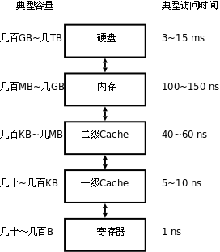

# perf 性能分析实例——使用perf优化cache利用率


##1.程序局部性

一个编写良好的计算机程序通常具有程序的局部性，它更倾向于引用最近引用过的数据项，或者这个数据周围的数据——前者是时间局部性，后者是空间局部性。现代操作系统的设计，从硬件到操作系统再到应用程序都利用了程序的局部性原理：硬件层，通过cache来缓存刚刚使用过的指令或者数据，来提交对内存的访问效率。在操作系统级别，操作系统利用主存来缓存刚刚访问过的磁盘块；在应用层，web浏览器将最近引用过的文档放在磁盘上，大量的web服务器将最近访问的文档放在前端磁盘上，这些缓存能够满足很多请求而不需要服务器的干预。本文主要将的是硬件层次的程序局部性。

##2.处理器存储体系

计算机体系的储存层次从内到外依次是寄存器、cache（从一级、二级到三级）、主存、磁盘、远程文件系统；从内到外，访问速度依次降低，存储容量依次增大。这个层次关系，可以用下面这张图来表示：





程序在执行过程中，数据最先在磁盘上，然后被取到内存之中，最后如果经过cache（也可以不经过cache）被CPU使用。如果数据不再cache之中，需要CPU到主存中存取数据，那么这就是cache miss，这将带来相当大的时间开销。


##3.perf原理与使用简介

Perf是Linux kernel自带的系统性能优化工具。Perf的优势在于与Linux Kernel的紧密结合，它可以最先应用到加入Kernel的new feature。perf可以用于查看热点函数，查看cashe miss的比率，从而帮助开发者来优化程序性能。
性能调优工具如 perf，Oprofile 等的基本原理都是对被监测对象进行采样，最简单的情形是根据 tick 中断进行采样，即在 tick 中断内触发采样点，在采样点里判断程序当时的上下文。假如一个程序 90% 的时间都花费在函数 foo() 上，那么 90% 的采样点都应该落在函数 foo() 的上下文中。运气不可捉摸，但我想只要采样频率足够高，采样时间足够长，那么以上推论就比较可靠。因此，通过 tick 触发采样，我们便可以了解程序中哪些地方最耗时间，从而重点分析。
本文，我们主要关心的是cache miss事件，那么我们只需要统计程序cache miss的次数即可。使用perf 来检测程序执行期间由此造成的cache miss的命令是perf stat -e cache-misses ./exefilename，另外，检测cache miss事件需要取消内核指针的禁用（/proc/sys/kernel/kptr_restrict设置为0）。

##4.cache 优化实例

###4.1数据合并
有两个数据A和B，访问的时候经常是一起访问的，总是会先访问A再访问B。这样A[i]和B[i]就距离很远，如果A、B是两个长度很大的数组，那么可能A[i]和B[i]无法同时存在cache之中。为了增加程序访问的局部性，需要将A[i]和B[i]尽量存放在一起。为此，我们可以定义一个结构体，包含A和B的元素各一个。这样的两个程序对比如下：

- test.c

```c
#define NUM 393216

int main()
{
    float a[NUM], b[NUM];
    int i;

    for (i = 0; i < 1000; i++) {
        add(a, b, NUM);
    }
}

int add(int* a, int* b, int num)
{
    int i = 0;

    for (i = 0; i < num; i++) {
        *a = *a + *b;
        a++;
        b++;
    }
}
```
- test2.c


```c
#define NUM 39216
typedef struct {
    float a;
    float b;
} Array;

int main()
{
    Array myarray[NUM];
    int j = 0;

    for (j = 0; j < 1000; j++) {
        add(myarray, NUM);
    }
}

int add(Array* myarray, int num)
{
    int i = 0;

    for (i = 0; i < num; i++) {
        myarray->a = myarray->a + myarray->b;
        myarray++;
    }
}

```

注：我们设置数组大小NUM为39216，因为cache大小是3072KB，这样设定可以让A数组填满cache，方便对比。
对比二者的cache miss数量：
test

```sh
[huangyk@huangyk test]$ perf stat -e cache-misses ./test  
  
  
 Performance counter stats for './test':  
  
  
           530,787 cache-misses                                                  
  
  
       2.372003220 seconds time elapsed  
```

test2

```sh
[huangyk@huangyk test]$ perf stat -e cache-misses ./test2  
  
Performance counter stats for './test2':  
  
            11,636 cache-misses                                                  
  
       0.233570690 seconds time elapsed  
```

可以看到，后者的cache miss数量相对前者有很大的下降，耗费的时间大概是前者的十分之一左右。

进一步，可以查看触发cach-miss的函数：
test程序的结果：

```sh
[huangyk@huangyk test]$ perf record -e cache-misses ./test  
[huangyk@huangyk test]$ perf report  
Samples: 7K of event 'cache-misses', Event count (approx.): 3393820  
 45.88%  test  test               [.] sub  
 44.74%  test  test               [.] add  
  0.71%  test  [kernel.kallsyms]  [k] clear_page_c  
  0.70%  test  [kernel.kallsyms]  [k] _spin_lock  
  0.43%  test  [kernel.kallsyms]  [k] run_timer_softirq  
  0.41%  test  [kernel.kallsyms]  [k] account_user_time  
  0.34%  test  [kernel.kallsyms]  [k] hrtimer_interrupt  
  0.30%  test  [kernel.kallsyms]  [k] run_posix_cpu_timers  
  0.29%  test  [kernel.kallsyms]  [k] _cond_resched  
  0.24%  test  [kernel.kallsyms]  [k] update_curr  
  0.23%  test  [kernel.kallsyms]  [k] x86_pmu_disable  
  0.22%  test  [kernel.kallsyms]  [k] __rcu_pending  
  0.20%  test  [kernel.kallsyms]  [k] task_tick_fair  
  0.19%  test  [kernel.kallsyms]  [k] account_process_tick  
  0.17%  test  [kernel.kallsyms]  [k] scheduler_tick  
  0.16%  test  [kernel.kallsyms]  [k] __perf_event_task_sched_out  

````

从perf输出的结果可以看出，程序cache miss主要是由sub和add触发的。
test2程序的结果：

```sh
perf record -e cache-misses ./test2  
perf report  
Samples: 51  of event 'cache-misses', Event count (approx.): 17438  
 39.78%  test2  [kernel.kallsyms]  [k] clear_page_c  
 15.68%  test2  [kernel.kallsyms]  [k] mem_cgroup_uncharge_start  
  7.94%  test2  [kernel.kallsyms]  [k] __alloc_pages_nodemask  
  7.28%  test2  [kernel.kallsyms]  [k] init_fpu  
  6.50%  test2  test2              [.] add  
  3.19%  test2  [kernel.kallsyms]  [k] arp_process  
  2.76%  test2  [kernel.kallsyms]  [k] account_user_time  
  2.73%  test2  [kernel.kallsyms]  [k] perf_event_mmap  
  2.02%  test2  [kernel.kallsyms]  [k] filemap_fault  
  1.62%  test2  [kernel.kallsyms]  [k] kfree  
  1.50%  test2  [kernel.kallsyms]  [k] 0xffffffffa04334b8  
  1.06%  test2  [kernel.kallsyms]  [k] _spin_lock  
  1.06%  test2  [kernel.kallsyms]  [k] raise_softirq  
  1.00%  test2  [kernel.kallsyms]  [k] acct_update_integrals  
  0.96%  test2  [kernel.kallsyms]  [k] __do_softirq  
  0.67%  test2  [kernel.kallsyms]  [k] handle_edge_irq  
  0.56%  test2  [kernel.kallsyms]  [k] __rcu_pending  
  0.40%  test2  [kernel.kallsyms]  [k] enqueue_hrtimer  
  0.39%  test2  test2              [.] sub  
  0.38%  test2  [kernel.kallsyms]  [k] _spin_lock_irq  
  0.36%  test2  [kernel.kallsyms]  [k] tick_sched_timer  

```

从perf输出的结果可以看出，add和sub触发的perf miss已经占了很小的一部分。


###4.2循环交换
C语言中，对于二维数组，同一行的数据是相邻的，同一列的数据是不相邻的。如果在循环中，让依次访问的数据尽量处在内存中相邻的位置，那么程序的局部性将会得到很大的提高。
观察下面矩阵相乘的几个函数：

- test_ijk.c

```c
void Muti(double A[][NUM], double B[][NUM], double C[][NUM], int n)
{
    int i, j, k;
    double sum = 0;

    for (i = 0; i < n; i++)
        for (j = 0; j < n; j++) {
            sum = 0.0;

            for (k = 0; k < n; k++) {
                sum += A[i][k] * B[k][j];
            }

            C[i][j] += sum;
        }
}
```

- test_jki.c

```c
void Muti(double A[][NUM], double B[][NUM], double C[][NUM], int n)
{
    int i, j, k;
    double sum = 0;

    for (j = 0; j < n; j++)
        for (k = 0; k < n; k++) {
            sum = B[k][j];

            for (i = 0; i < n; i++) {
                C[i][j] += A[i][k] * sum;
            }
        }
}
```
- test_kij.c

```c
void Muti(double A[][NUM], double B[][NUM], double C[][NUM], int n)
{
    int i, j, k;
    double sum = 0;

    for (k = 0; k < n; k++)
        for (i = 0; i < n; i++) {
            sum = A[i][k];

            for (j = 0; j < n; j++) {
                C[i][j] += B[k][j] * sum;
            }
        }
}
```

考察内层循环，可以发现，不同的循环模式，导致的cache失效比例依次是kij、ijk、jki递增。


###4.3循环合并


在很多情况下，我们可能使用两个独立的循环来访问数组a和c。由于数组很大，在第二个循环访问数组中元素的时候，第一个循环取进cache中的数据已经被替换出去，从而导致cache失效。如此情况下，可以将两个循环合并在一起。合并以后，每个数组元组在同一个循环体中被访问了两次，从而提高了程序的局部性。

##5.后记


实际情况下，一个程序的cache失效比例往往并不像我们从理论上预测的那么简单。影响cache失效比例的因素主要有：数组大小，cache映射策略，二级cache大小，Victim Cache等，同时由于cache的不同写回策略，我们也很难从理论上预估一个程序由于cache miss而导致的时间耗费。真正在进行程序设计的时候，我们在进行理论上的分析之后，只有使用perf等性能调优工具，才能更真实地观察到程序对cache的利用情况。