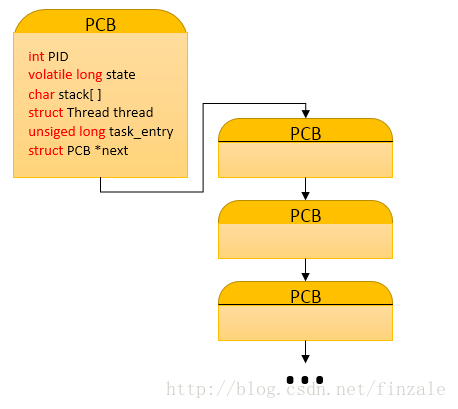
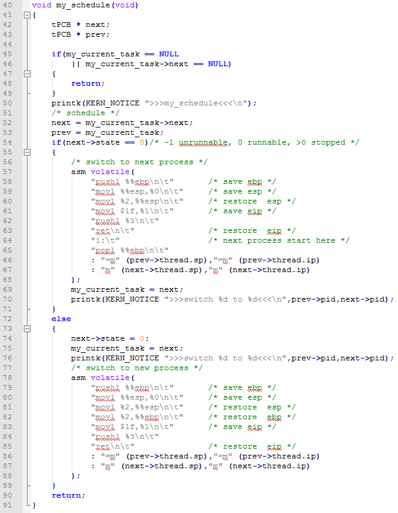
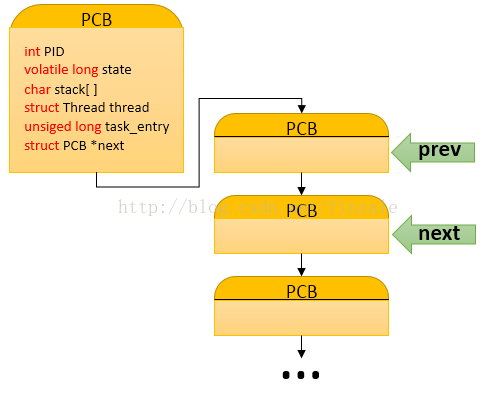
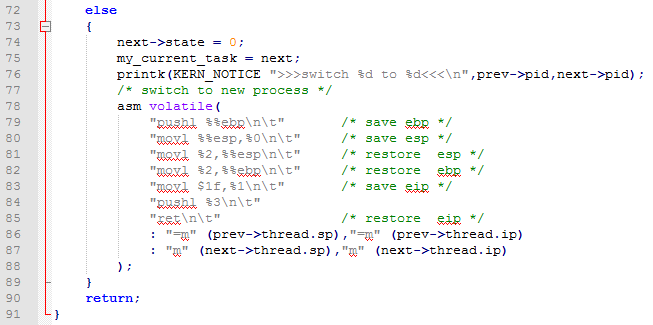
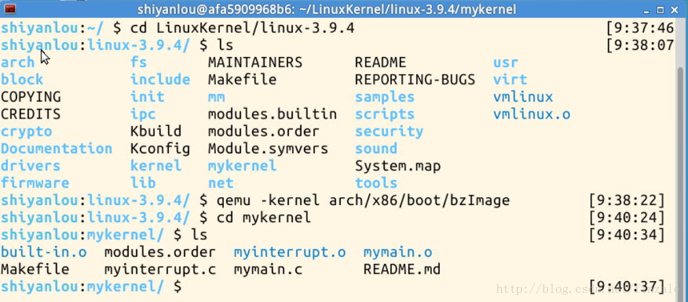
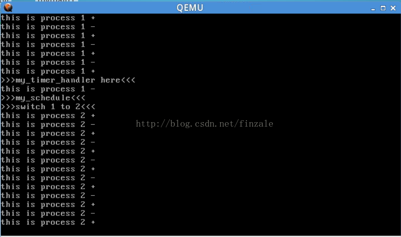

# Linux内和分析（二）操作系统是如何工作的


##一、计算机系统是怎么样工作及mykernel代码分析
（一）内容概述
本次文章的内容主要讲述了计算机系统是如何进行进程调度的，代码部分大家可以参见网易云课堂中USTC孟宁老师的第二周的实验内容。实际上我们知道计算机中对进程的定义是：进程（Process）是计算机中的程序关于某数据集合上的一次运行活动，是系统进行`资源分配和调度的基本单位`，是操作系统结构的基础。在早期面向进程设计的计算机结构中，进程是程序的基本执行实体；在当代面向线程设计的计算机结构中，进程是线程的容器。程序是指令、数据及其组织形式的描述，进程是程序的实体。

所以我们可以看出进程的一个首要的特点是系统进行资源分配及调度的一个单位。所以我们得出一个结论就是一个进程需要执行的时候操作系统是需要对他分配相应的`资源`的。这里的资源指的就是计算机的硬件和系统资源。比如这个进程需要运行的内存空间，系统中负责指向运行指令的IP指针，运算需要用到的一些寄存器，系统的调度（实际上就是系统开始运行这个进程了）等等。但是计算机不可能只有一个进程一直在运行，他会有很多进程。而CPU只有一个（假设是个单核的系统，即使是多和计算机也不可能核心数大于进程执行数量）所以系统需要给进程分配CPU这个硬件资源。最简单的方式就是大家轮流使用CPU，每个人都用一会儿之后再给别人用，这样在一段时间之后每个进程都会被计算机执行到。这就是所谓的`时间片轮转法`的调度。


`那么问题就来了`，进程之间切换的时候是如何进行的呢。我们知道不同进程运行需要的内存空间是不一样的。就像是每个函数都有自己的堆栈一样（上篇文章说过）。`所以在进程切换时候首先需要做的就是讲这个进程当前执行到的位置（一个内存的地址——CS：IP）保存起来[1]`，这样下次等到他得到CPU开始执行的时候至少系统可以知道从哪开始继续运行它。那么除了上述的这个运行位置需要保存起来还有什么东西也是需要记录并用于恢复进程的呢？

我们还是用函数作为类比，我们假设函数就是一个简单的数值运算处理，那么处理的时候也会用到很多的变量用于运算步骤中的结果或者中间值的保存，这些数值有些保存在自己的内存堆栈中，有些则是CPU的寄存器中。`那么问题又来了`，这些寄存器有的是通用寄存器大家都要用。所以计算的中间结果如果保存到这里的话，别的函数也会用到这些寄存器用于数值处理，所以上一个函数的这些数值就被覆盖了，即使是恢复到之前运行的内存地址，中间结果不对，执行结果也不会正确。`所以其次需要保存就是这些中间值，我们也可以叫他们保存现场`，这样的话在恢复的时候看起来就差不多不会出问题了（实际上可能需要保存的信息还有很多但是他们的目的都是讲这个进程可能用到的系统资源复制出来，这样即使别人篡改了这些公共资源中的一些，回来时还能恢复到执行时候的样子）。

##（二）代码分析
那么现在我们就可以开始做实验了，mykernel代码实际上就实现了一个基于时间片轮转的系统调度。我们首先来看一下他的代码结构。


上述代码中我们看到mykernel包括了三个文件，mypcb.h、mymain.c、myinterrupt.c。下面我们来分析这段代码中的以一个部分：头文件mypcb.h主要代码如下：

```c
#define MAX_TASK_NUM        4
#define KERNEL_STACK_SIZE   1024*8

/* CPU-specific state of this task */
struct Thread {
    unsigned long		ip;
    unsigned long		sp;
};

typedef struct PCB{
    int pid;
    volatile long state;	/* -1 unrunnable, 0 runnable, >0 stopped */
    char stack[KERNEL_STACK_SIZE];
    /* CPU-specific state of this task */
    struct Thread thread;
    unsigned long	task_entry;
    struct PCB *next;
}tPCB;

void my_schedule(void);
```

mypcb.h中定义了两个结构体以及声明了一个函数。首先就是Thread结构体里面存放了两个用于存放地址的变量，一个是堆栈指针，一个是指令指针。另一个结构体PCB用于存放进程的相关信息（Process Control Block）包括进程的标志ID，进程状态，进程堆栈大小，一个线程，一个任务入口地址，还有一个指向下一个PCB的指针。这里模们可以看出实际上进程在系统中是由进程控制块来控制的（PCB），并且这些控制块是一个链表结构的如下图。




下面我们分析mymain.c中的代码：


我们看到首先程序之前新建了一个任务数组，里面都是PCB结构体。在上面代码中是mymain.c中的启动代码。首先我们开始新建了一个任务（PCB或者说是进程控制块）并给里面的属性赋值（line30~line34）。然后利用一个for循环新建了一些基本一样进程（一共MAX_TASK_NUM这么多，实际上就是4个）并连接成链表（line43）。之后进入启动process0。实际上就是将它ip赋值给esp寄存器然后保存自己的sp（基地址->ebp）和ip。然后就返回即可。下面的代码就是进程执行时候的实际运行内容（打印自己是pid到控制台for的判定条件可以调控他的打印速度，被执行多少次打印一次信息，以及调用一次进程调度函数line70）


下面我们来看最重要的部分就是进程调度的代码分析，这段代码在myinterrupt.c中。首先是时间中断，my_time_handler。


这是一个产生调度时机的函数。就是所谓的产生了时间片，每当他执行的时候就是一个进程调度的时机。后面的实验截图中我们可以看到。它的运行说明进程已经用完了自己的时间片需要保存自己的运行现场信息然后让其他的进程使用CPU。下面的代码就是调度的关键代码了：my_schedule(void)。



代码中我们看到首先是两个指向PCB的指针，next和prev意思就是下一个和上一个的意思。之后有一个判断希望当前链表不是空的。然后输出打印信息说明开始进行调度了。调度的时候有两种情况，一种是调度一个已经运行过的进程，另一种情况就是调度一个新的未运行过得进程。


首先说明第一种情况：
 


上面的代码中就行我们说的首先是保存一下现场信息（实际上是它上一个进程的运行信息）然后将需要调度的进程的堆栈指针放入esp中并载入ip（sp：ip）然后将自己的ip入栈，然后将这个值在弹出给ebp这样，系统将转入这个进程的内存空间开始执行。





然后看第二周情况：





##二、实验过程

下面我们看一下实验过程，首先是将mykernel的代码不全，然后重新编译（详细步骤参见云课堂中的实验二）如下图所示首先进入我们要的内核目录：



然后进行将代码补全之后重新编译：


然后执行这个命令“qemu -kernel arch/x86/boot/bzImage”就会看到如下的实验效果：





 我们看到这里面调度的实际就是my_time_handler中的那个。然后系统执行了调度my_schedule之后进程1就会切换到进程2。
 
 ##三、总结分析
本次实验我们总结了进程是如何切换的，实际上操作系统中进程都用两个任务首先是保存上一个进程的信息然后载入自己的运行指令，只有这样进程才会得以执行。


总结一下进程切换大体上有以下工作：
```
(1)决定是否作上下文切换以及是否允许作上下文切换。这里面实际上就是有my_time_handler决定的，时间片用完之后就进行调度；
(2)保存当前执行进程的上下文。原因文章分析过了，就是当你恢复的时候得以继续执行的基础；
(3)使用进程调度算法，选择一处于就绪状态的进程。这里面就是my_schedule的工作；
(4)恢复或装配所选进程的上下文，将CPU控制权交到所选进程手中。实际上有事再次时间片用完时进行调度。
```


文中介绍了一个基于时间片轮转的建议操作系统内核代码。分析了操作系统中进程之间是如何进行调度的。通过对mykernel的源代码分析，体会进程在切换过程中操作系统对进程运行环境的管理。事实上有时候我们可以把它叫做运行框架，也可以说是上下文，现场环境等等。实际上这些东西指的都是程序运行时候的堆栈，运行内存空间的地址，寄存器值的集合。因为程序运行需要改变他们，二他们中的一些也许会被其他程序运行时改变，所以在切换进程的时候要对所有进程恢复当前状态的系统资源进行保存。这就是切换的核心意义。