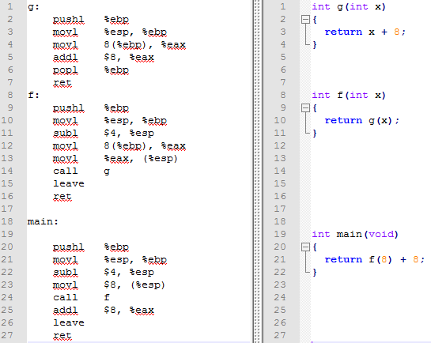

# Linux內和分析（一）計算機是如何工作的


##一、計算機是如何工作的

首先我們要明確一個概念，就是計算機本身並不知道自己要做什麼，這些要做的事情需要我們去告知計算機，這就是程序代碼。早期的時候計算機每次只能做一件事情，他需要知道的是幹什麼，怎麼幹。這就是程序代碼要體現的，程序的基礎目的在於有一個輸入（數據）然後經過處理（怎麼幹）得到我們想要的輸出。從計算機的邏輯層面來說就是處理器需要有輸入然後經過裡面的一些運算器件得到輸出。
現代計算機大都採用了一種叫做`馮諾依曼`的結構，叫什麼不重要，這種結構的意思就是我們現在所說的程序和數據都儲存在一起。所以計算機在運行的時候需要從中將數據取出，然後用程序進行處理，最後得到輸出。所以給計算機編寫程序代碼的時候也是要關心一下三件事：

```
1.程序要處理的輸入數據；
2.程序如何處理數據；
3.程序處理後的輸出；
```

所以在編寫程序時候需要做的就是告訴計算機需要處理哪些事情和如何處理以及要怎樣輸出結果。我們用以下面的代碼作為例子：

```c
int g(int x)
{
    return x + 8;
}

int f(int x)
{
    return g(x);
}

int main(void)
{
    return f(8) + 8;
}
```

我們看到，上述程序需要`處理的數據`是一些整數，`處理的過程`是調用f() 和g()連個函數進行運算，其中f(x)=g(x);g(x)=x+8;`處理的結果`就是返回f(8)+8這個值。但是高級語言是計算機不能直接看懂的，計算機智能看懂0101的機器語言，所以上述C語言代碼必須經過一個叫`編譯器`的東西翻譯成一種可以和0101機器語言直接映射的語言——`彙編語言`，這樣計算機就可以執行你寫的代碼了。

##二、X86彙編簡介（AT&T格式）

和我們使用的高級代碼一樣，彙編語言的指令也是需要知道`數據，處理，輸出`三個要素，只是這裡面我們把他們叫做`原操作數，指令碼，目的操作數`，具體的格式如下：

我們看到上述指令中要處理的數據是%esp，要輸出的數據是%ebp，要做的處理是movl這樣一種處理。意思就是將%esp寄存器中數傳送到%ebp寄存器中。上面這就是彙編語言指令的基本形式。
現在在linux系統中我們可以利用vi + [文件全程] 創建一個c代碼文件。比如在命令行中輸入vi exp01.c 進入新建文件，這時按字母i，表示開始編輯。將上述c代碼黏貼到文件中如下圖所示：

- exp01.c

```c
int g(int x)
{
    return x + 8;
}

int f(int x)
{
    return g(x);
}

int main(void)
{
    return f(8) + 8;
}
```

圖中我們看到代碼粘貼之後我們按esc按鍵退出編輯模式，再輸入「：wq」 表示保存退出。然後我們在輸入ls命令查看目錄下的文件發現已經有了我們之前插入的文件。這個時候輸入

```sh
gcc -S -o exp01.s exp01.c -m32
```

將要翻譯的exp01.c文件翻譯成上述的彙編代碼（翻譯的成32位彙編指令）用於再次翻譯成機器碼執行。


上述代碼中，我們看到有很多看不懂的以。我們將他們去掉之後和C做一下對比：




我們看到從上面的彙編代碼和C語言對比中我們可以看到一些規律，首先C語言中的函數名稱被翻譯成了一其名字開頭加“：”的一段代碼。而每段代碼的開頭我們都看到了相同的兩段彙編語句。

```as
pushl   %ebp  
movl    %esp, %ebp  
```


上面兩行實際上是對內存堆棧的一個操作，我們知道程序執行是需要內存的，所以每次有新的函數過程被調用的時候計算機也必須分配一段內存給他來運行。那麼具體是那一段內存呢。實際上就是%ebp+%esp所在的地址，為了分配方便實際上我們把%esp叫做叫做堆棧指針，而每一個函數都有自己的內存空間也就是堆棧，不同的函數堆棧是由%ebp標註的，這裡面我們把它叫做堆棧的基地址，就是一個堆棧開始的地方，然後內個堆棧中存放了函數運行需要用到的一些數據，這些數據就有堆棧指針寄存器來標定%esp。所以每個代碼段或者說函數段在運行的時候都會保存上一個運行的函數的基地址，用於它運行完之後返回到調用它的那個代碼段的地方。然後在將自己的堆棧其實地址放入到基址寄存器中之後就可以開始自己的代碼運行的了，這就是上述代碼的意思。


```as
main:
    pushl   %ebp  
    movl    %esp, %ebp  
    subl    $4, %esp  
    movl    $8, (%esp)  
    call    f  
    addl    $8, %eax  
    leave  
    ret  
```


```as
f:  
    <span style="color:#ff0000;">pushl    %ebp  
    movl    %esp, %ebp</span>  
    subl    $4, %esp  
    movl    8(%ebp), %eax  
    movl    %eax, (%esp)  
    call    g  
    leave  
    ret  
```

這段代碼中我們開到紅色的部分就是函數進入和返回時後的固定代碼，上面已經分析過他的作用。看這段代碼在做完例行工作之後首先是將%esp進行subl操作，就是將esp減4。實際上我們發現main()函數和f() 函數都進行了這個操作是因為他們都需要進行函數的調用，所以我們可以知道這個語句的意思要預留一個位置給其調用的函數傳遞參數。然後第二句話就是講8這個立即數傳入到裡面之後，運行call f 意思就是呼叫f函數，就是調用f函數這個時候我們看f函數的代碼。


除了例行公事的紅色部分我們開到f也為其調用g時候要傳遞參數預留了一個位置就是使用 subl$4, %esp，然後調用movl8(%ebp), %eax找到第一個穿進去的參數。（就是那個8——>f(8)）為什麼呢。我們來分析一下他的堆棧結構：


首先我們看到main函數中首先保存了當前的堆棧基地址（ebp-0入棧了esp-0向下移動了一個單位-4到達esp-1），然後將ebp-0移動到esp-1的位置成為ebp-1然後esp-1再向下移動一個單位到達esp-2，保留這個位置用於保存其調用函數的返回值，這個值在那個函數中用eax來傳遞後面會講到。然後將調用f函數時候需要傳入的參數8放入堆棧中esp-2指向的位置。然後調用f函數，這個時候需要先保存一下當先的ebp，也就是epb-1。
然後來到了f函數中，首先也是將ebp-1入棧然後將ebp指向當前esp-4的位置（每次伴隨入棧操作都會影響esp的值）到達ebp-2，然後esp在向下移動一個單位到達esp-5。留出一個返回值的位置然後將當前ebp+8中的值傳入eax用於返回。然後將eax中的值傳入esp，然後重複上述過程調用g函數。g函數返回16，然後到f中，f也返回16。然後回到main中執行addl $8,%eax。最後的結果是24。


## 三、函數堆棧使用與切換以及操作系統中的任務切換原理簡析

上述過程實際上演示了函數之間調用的大體過程。下面對這個過程進行簡單的總結。我們可以想象每個被調用的函數使用的內存空間都大體上先包括這麼幾個部分：
```
1.函數的運行所用參數（C語言中的函數參數列表）
2.函數的運行過程中產生的數據（運行的中間結果和返回值）
3.調用它的函數的入口地址
4.保存它調用的函數的返回值的空間
```

所以對應的調用別人函數就要傳入入口參數，就是比如f(8)中的8就是這樣的入口參數（實際還會複雜一些）。
那麼我們可以類似的退出操作系統中如何切換任務。實際上每個任務也會分配各自的運行空間，那麼在任務調用的時候，一個任務需要得到他的內存他的運行參數才能開始執行。就像函數一樣。可是現在操作系統中的任務是異步的（就是你也不能確定什麼時候會調用什麼任務）所以這個時候如過一個任務執行到一半，需要執行另一個任務的時候。就好像一個函數要調用另一個函數，這個時候我們怎麼保證它返回之後還能繼續運行呢，參照函數的做法我們至少要保存當時即將跳轉時候的運行地址，但是這是不夠的。如果函數比較發雜有很多中間結果在寄存器中，這個時候另一個函數要運行，這些結果也要保存起來，因為新的函數可能會覆蓋這些寄存器。類比我們就知道在任務切換的時候我們也要保存當前跳轉之前的運行地址，這個任務運行中產生的數據，用於恢復這個任務時候繼續剛才的狀態繼續運行。這些數據我們叫他`上下文`也好，`現場`也好。實際上就是他的所有狀態的集合，這些數據用於當系統再次調用它的時候恢復它。
