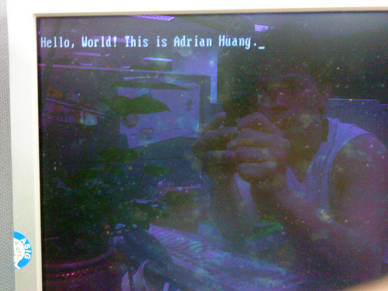

# 以GNU Assembler組合語言撰寫] (一) 開機Hello World實例


小弟最近想嘗試利用GAS(GNU Assembler)組合語言撰寫非常小型的作業系統，本篇文章說明如何利用GAS組合語言在終端機上印出Hello World.

### 簡介x86 CPU開機流程
x86 CPU開機後，首要之事會先跳至0xFFFF0執行BIOS ROM的程式，當BIOS測試程序通過後，BIOS便會把執行權交給下一個程式 (boot loader或一支小程式)，BIOS會將該程式
(通常為一個磁區[Sector]大小，即512 bytes)載入記憶體0x7C00位置，並跳至0x7C00執行該段程式碼。該磁區被稱為MBR，BIOS會檢查該磁區最後兩個位完組必須為0x55AA，否則該磁區該被視為無效的MBR。

所以，首要之事就是利用GAS撰寫一支大小為512位元組的二進位檔 (Binary File)，此檔需具備底下功能:
- 檔案系統，如: FAT12, FAT16, FAT32, NTFS等等。
- 利用BIOS中斷號碼0x10將資料寫至螢幕。
- 在最後兩個位元組寫入0x55AA以便通過BIOS識別。

底下為原始碼:


```
.code16
    .section .text
    .global main

main:
    # FAT12 file system format
    jmp       start_prog       # jmp instruction
    .byte     0x90
    .ascii    "ADRIAN  "       # OEM name (8 bytes)
    .word     512              # Bytes per sector
    .byte     1                # Sector per cluster
    .word     1                # Reserved sector count: should be 1 for FAT12
    .byte     2                # Number of file allocation tables.
    .word     224              # Maximum number of root directory entries.
    .word     2880             # Total sectors
    .byte     0xf0             # Media descriptor:
    .word     9                # Sectors per File Allocation Table
    .word     18               # Sectors per track
    .word     2                # Number of heads
    .long     0                # Count of hidden sectors
    .long     2880             # Total sectors: 18 (sectors per track) * 2 (heads) * 80 (sectors) = 2880
    .byte     0                # Physical driver number
    .byte     0                # Reserved
    .byte     0x29             # Extended boot signature
    .long     0x12345678       # Serial Number
    .ascii    "HELLO-OS   "    # Volume Label
    .ascii    "FAT12   "       # FAT file system type
    .fill     18, 1, 0         # fill 18 characters with zero

start_prog:
    movw    $0, %ax            # Initialize register
    movw    %ax, %ss
    movw    %ax, %ds
    movw    %ax, %es
    movw    $msg, %si          # move the address of msg to SI

loop:
    movb    $0xe, %ah
    movb    (%si), %al        # move the first character of msg to AL register
    cmpb    $0, %al
    je      fin
    int     $0x10             # write the specific character to console
    addw    $1, %si
    jmp     loop

fin:
# do nothing

msg:
    .ascii "Hello, World! This is Adrian Huang."
    .byte   0
    .org    0x1FE, 0x00       # fill the rest of characters with zero until the 254th character

# Boot sector signature
    .byte     0x55
    .byte     0xaa

```

### Compile and Link
以"gcc -c"將.S組合語言轉為成object file
`
```
adrian@adrian-desktop:~/working/build_os/my_ex/02day/helloos4$ ls
hello.S
adrian@adrian-desktop:~/working/build_os/my_ex/02day/helloos4$ gcc -c hello.S
adrian@adrian-desktop:~/working/build_os/my_ex/02day/helloos4$ file hello.o
hello.o: ELF 64-bit LSB relocatable, x86-64, version 1 (SYSV), not stripped
adrian@adrian-desktop:~/working/build_os/my_ex/02day/helloos4$
```

再經由ld連結器將此object轉換成plain binary file
```
$ ld -Ttext=0x7C00 hello.o -o hello.bin --oformat binary
$ file hello.bin
hello.bin: DOS floppy 1440k, x86 hard disk boot sector
```
利用xxd工具觀察helo.bin格式 (以十六進制)

```
adrian@adrian-desktop:~/working/build_os/my_ex/02day/helloos4$ xxd hello.bin

0000000: eb4e 9041 4452 4941 4e20 2000 0201 0100  .N.ADRIAN  .....

0000010: 02e0 0040 0bf0 0900 1200 0200 0000 0000  ...@............

0000020: 400b 0000 0000 2978 5634 1248 454c 4c4f  @.....)xV4.HELLO

0000030: 2d4f 5320 2020 4641 5431 3220 2020 0000  -OS   FAT12   ..

0000040: 0000 0000 0000 0000 0000 0000 0000 0000  ................

0000050: b800 008e d08e d88e c0be 6b7c b40e 8a04  ..........k|....

0000060: 3c00 7407 cd10 83c6 01eb f148 656c 6c6f  <.t........Hello

0000070: 2c20 576f 726c 6421 2054 6869 7320 6973  , World! This is

0000080: 2041 6472 6961 6e20 4875 616e 672e 0000   Adrian Huang...

0000090: 0000 0000 0000 0000 0000 0000 0000 0000  ................

00000a0: 0000 0000 0000 0000 0000 0000 0000 0000  ................

00000b0: 0000 0000 0000 0000 0000 0000 0000 0000  ................

00000c0: 0000 0000 0000 0000 0000 0000 0000 0000  ................

00000d0: 0000 0000 0000 0000 0000 0000 0000 0000  ................

00000e0: 0000 0000 0000 0000 0000 0000 0000 0000  ................

00000f0: 0000 0000 00ll
00 0000 0000 0000 0000 0000  ................

0000100: 0000 0000 0000 0000 0000 0000 0000 0000  ................

0000110: 0000 0000 0000 0000 0000 0000 0000 0000  ................

0000120: 0000 0000 0000 0000 0000 0000 0000 0000  ................

0000130: 0000 0000 0000 0000 0000 0000 0000 0000  ................

0000140: 0000 0000 0000 0000 0000 0000 0000 0000  ................

0000150: 0000 0000 0000 0000 0000 0000 0000 0000  ................

0000160: 0000 0000 0000 0000 0000 0000 0000 0000  ................

0000170: 0000 0000 0000 0000 0000 0000 0000 0000  ................

0000180: 0000 0000 0000 0000 0000 0000 0000 0000  ................

0000190: 0000 0000 0000 0000 0000 0000 0000 0000  ................

00001a0: 0000 0000 0000 0000 0000 0000 0000 0000  ................

00001b0: 0000 0000 0000 0000 0000 0000 0000 0000  ................

00001c0: 0000 0000 0000 0000 0000 0000 0000 0000  ................

00001d0: 0000 0000 0000 0000 0000 0000 0000 0000  ................

00001e0: 0000 0000 0000 0000 0000 0000 0000 0000  ................

00001f0: 0000 0000 0000 0000 0000 0000 0000 55aa  ..............U.
```
接著，使用qemu驗證hello.bin

```sh
qemu-system-i386 -hda hello.bin
```


為了讓此範例更真實，筆者有一臺機器備有CF Card，將hello.bin透過dd工具寫進此CF Card最前面的512 bytes, 命令如下:

```
adrian@adrian-mem1:~/img$ sudo dd if=./hello.bin of=/dev/sda
[sudo] password for adrian:
1+0 records in
1+0 records out
512 bytes (512 B) copied, 0.00124243 s, 412 kB/s
adrian@adrian-mem1:~/img$
```

將該系統重開並選擇CF Card開機，其畫面如下:



【Reference】
1.30天打造OS！作業系統自作入門
2. Jserv's Blog
3. X86 開機流程小記
4. Linux assemblers: A comparison of GAS and NASM

