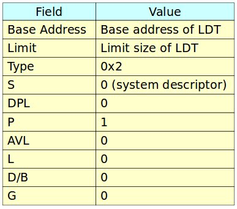
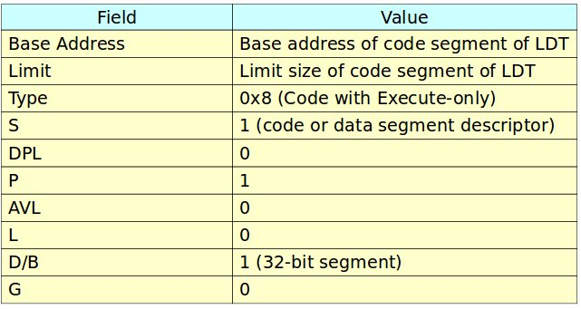
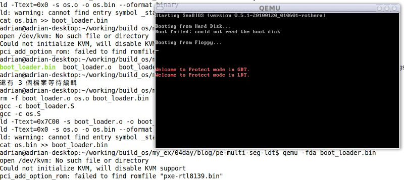

# (五) 使用Local Descriptor Table (LDT)

上篇文章使用Global Descriptor Table (GDT)儲存Code Segment (CS)與Data Segment (DS)的資訊，以便能在保護模式下成功地執行程式碼與存取資料。本篇說明如何設定LDT，以便能執行位於LDT的程式碼。

### LDT之介紹
LDT實現作業系統多個程序功能 (multiple processes)，其特色為各個程序有自己的位址空間彼此互不幹擾，每個程序會有各自的LDT，當作業系統欲執行某一程序時，作業系統會找出其對應的LDT，以便能執行該程序。詳細資料請參考Local Descriptor Table。

### LDT相關設定
LDT設定分成兩大步驟如下所述:

### 1. 在GDT表裡設定一個LDT entry (Configure a LDT Entry in GDT)
參考Figure 1，其每個欄位所應設定值如Table 1所示:


###Figure 1. Segment Descriptor



### 2. 設定LDT表
LDT表設定code segment/data segment相關資訊，其設定值如Table 2所示。



### Table 2. LDT entry configuration in LDT

### Boot Loader程式碼
請參考上篇文章的"Boot Loader 程式碼"。

### 作業系統程式碼
Figure 2為作業系統程式碼，此作業系統程式碼運行於32位元保護模式，一開始定義三個Segment Descriptor (NULL、CODE32、VIDEO與LDT)，其中VIDEO的基底位址為0xB8000，詳情請參考Printing to Screen。接著定義GDT的長度、定義Code32、Data、VIDEO與LDT的segment selector、定義輸出的字串、定義GDTPtr與定義LDT表。

```
/* os.S
*
*/

#include "pm.h"

.code16
.text
  jmp os_main

# Segment descritors for GDT
LABEL_GDT_NULL: SEG_DESC 0, 0, 0
LABEL_GDT_CODE: SEG_DESC 0, (PECode32Len - 1), (DESC_ATTR_TYPE_CD_ER | DESC_ATTR_D)
LABEL_GDT_DATA: SEG_DESC 0, (DataLen - 1), (DESC_ATTR_TYPE_CD_RW)
LABEL_GDT_VIDEO: SEG_DESC 0xB8000, 0xFFFF, (DESC_ATTR_TYPE_CD_RW)
LABEL_GDT_LDT: SEG_DESC     0, (LDTLen -1), (DESC_ATTR_TYPE_LDT)

# The length of GDT
.set GdtLen, (. - LABEL_GDT_NULL)

# Segment selectors
.set SegSelectorCode32, (LABEL_GDT_CODE - LABEL_GDT_NULL)
.set SegSelectorData,     (LABEL_GDT_DATA - LABEL_GDT_NULL)
.set SegSelectorVideo,     (LABEL_GDT_VIDEO - LABEL_GDT_NULL)
.set SegSelectorLDT,     (LABEL_GDT_LDT - LABEL_GDT_NULL)

# data segment
LABEL_DATA:
Msg1:     .ascii "Welcome to Protect mode in GDT.\0"
Msg2:     .ascii "Welcome to Protect mode in LDT.\0"
Msg3:     .ascii "This is signed by Adrian.\0"

.set     Msg1Offset, (Msg1 - LABEL_DATA)
.set     Msg2Offset, (Msg2 - LABEL_DATA)
.set     Msg3Offset, (Msg3 - LABEL_DATA)

.set DataLen, (. - LABEL_DATA)

# GDTR pointer
LABEL_GDTR:
  .2byte (GdtLen - 1)     # Limit field
  .4byte 0                 # base field

# LDT information
LABEL_LDT:
LABEL_LDT_ENTRY: SEG_DESC 0, (LDT_CODE32_LEN - 1), (DESC_ATTR_TYPE_CD_E | DESC_ATTR_D)

# length of LDT
.set LDTLen, (. - LABEL_LDT)

# LDT selector
.set SegSelectorLDTCode32,     (LABEL_LDT_ENTRY - LABEL_LDT + SA_TIL)


# real-mode OS code
os_main:
  mov %cs, %ax
  mov %ax, %ds
  mov %ax, %ss
  mov %ax, %es


  /* Set gdt for code segment */
  InitSegDescriptor LABEL_PE_CODE32, LABEL_GDT_CODE
  InitSegDescriptor LABEL_DATA, LABEL_GDT_DATA
  InitSegDescriptor LABEL_LDT, LABEL_GDT_LDT
  InitSegDescriptor LABEL_PE_LDT_CODE32, LABEL_LDT_ENTRY

  /* Set GDTR */
  xor     %ax, %ax
  mov     %cs, %ax
  shl     $4, %eax
  addl    $LABEL_GDT_NULL, %eax
  movl     %eax, (LABEL_GDTR + 2)

  /* Enable A20 line */
  xor     %ax, %ax
  in         $0x92, %al
  or         $2, %al
  out     %al, $0x92

  cli

  /* Load the GDT base address and limit from memory into the GDTR register */
  lgdt     LABEL_GDTR

   /* Enable protect mode */
  movl     %cr0, %eax
  orl     $1, %eax
  movl     %eax, %cr0

  /* Jump to protected-mode OS code */
  ljmp     $SegSelectorCode32, $0


LABEL_PE_LDT_CODE32:
.code32
  mov     $(SegSelectorData), %ax
  mov     %ax, %ds
  mov     $(SegSelectorVideo), %ax
  mov     %ax, %gs

  xorl     %esi, %esi
  xorl    %edi, %edi
  movl     $Msg2Offset, %esi
  movl     $((80 * 11 + 0) * 2), %edi
  movb     $0xC, %ah

ldt_dump_str:
  lodsb
  andb     %al, %al
  jz      ldt_fin
  mov     %ax, %gs:(%edi)
  addl     $2, %edi
  jmp     ldt_dump_str

ldt_fin:
  jmp .

.set LDT_CODE32_LEN, (. - LABEL_PE_LDT_CODE32)

# protected-mode OS code in GDT
LABEL_PE_CODE32:
.code32
  /* Load data segment selector */
  mov     $(SegSelectorData), %ax
  mov     %ax, %ds

  /* Load Video segment selector */
  mov     $(SegSelectorVideo), %ax
  mov     %ax, %gs

  /* Output the data */
  xorl     %esi, %esi
  xorl    %edi, %edi
  movl     $Msg1Offset, %esi
  movl     $((80 * 10 + 0) * 2), %edi
  movb     $0xC, %ah

dump_str:
  lodsb
  andb     %al, %al
  jz      fin
  mov     %ax, %gs:(%edi)
  addl     $2, %edi
  jmp     dump_str

fin:
  /* Load LDT selector */
  mov     $(SegSelectorLDT), %ax

  /* Load LDT selector in GDT to LDT register */
  lldt     %ax

  /* Jump to code segment in LDT */
  ljmp     $(SegSelectorLDTCode32), $0

.set PECode32Len, (. - LABEL_PE_CODE32)

os_msg:
  .ascii "Welcome to OS context!"
  .byte     0

  .org    0x200, 0x41 # fill characters with 'A'. Sector 2
```
### Figure 2. Code for Operating System


- 16位元real mode程式碼 (os_main)中，執行若干任務如下所述:
    - 設定LABEL_GDT_CODE的基底位址為PE_CODE32的起始位址
    - 設定LABEL_GDT_DATA的基底位址為LABEL_DATA的起始位址
    - 設定LABEL_GDT_LDT的基底位址為LABEL_LDT的起始位址
    - 設定LABEL_LDT_ENTRY的基底位址為LABEL_PE_LDT_CODE32的起始位址
    - 設定GDTPtr的基底位址為GDT的起始位址(也就是GDT_DESC_NULL)
    - 開啟A20線路 (A20 Line)
    - 將GDT的起始位址載入至GDTR暫存器
    - 設定cr0暫存器的bit 0以便進入保護模式
    - 使用ljmp指令跳至PE_CODE32程式碼
    - 使用lldt指令將LDT的segment selector載入至LDTR (Local Descriptor Table Register)，並跳至SegSelectorLDTCode32 segment selector執行LDT的程式碼。

32位元保護模式程式碼 (LABEL_PE_CODE32)利用Video segment selector將"Welcome to Protect mode in GDT."顯示在螢幕上，而LABEL_PE_LDT_CODE32則將"Welcome to Protect mode in LDT."顯示在螢幕上，用以驗證程式運作之正確性。

### pm.h標頭檔

```
/* pm.h
*
* Adrian Huang (adrianhuang0701@gmail.com)
*/
.macro SEG_DESC Base, Limit, Attr
   .2byte (\Limit & 0xFFFF)
  .2byte (\Base & 0xFFFF)
  .byte  ((\Base >> 16) & 0xFF)
  .2byte ((\Attr & 0xF0FF) | ((\Limit >> 8) & 0x0F00))
  .byte  ((\Base >> 24) & 0xFF)
.endm

.macro InitSegDescriptor OFFSET GDT_SEG_ADDR
  xor     %ax, %ax
  mov     %cs, %ax
  shl     $4, %eax
  addl    $(\OFFSET), %eax
  movw     %ax, (\GDT_SEG_ADDR + 2)
  shr     $16, %eax
  movb     %al, (\GDT_SEG_ADDR + 4)
  movb     %ah, (\GDT_SEG_ADDR + 7)

.endm

.set DESC_ATTR_TYPE_LDT,         0x82       /* LDT Segment         */
.set DESC_ATTR_TYPE_CD_ER,         0x9A     /* Code segment with Execute/Read */
.set DESC_ATTR_TYPE_CD_E,         0x98     /* Code segment with Execute Only */
.set DESC_ATTR_TYPE_CD_RW,         0x92    /* Data segment with R/W         */
.set DESC_ATTR_D,                 0x4000     /* 32-bit segment                 */

/* Selector Attribute */
.set SA_TIL,     0x4
.set SA_RPL0,     0x0
.set SA_RPL1,     0x1
.set SA_RPL2,     0x2
.set SA_RPL3,     0x3
```

### 編譯程式碼
請參照此篇的Makefile程式碼

其編譯訊息如下所示:
```
adrian@adrian-desktop:~/working/build_os/my_ex/04day/blog/pe-multi-seg-ldt$ make clean all
rm -f boot_loader.o os.o boot_loader.bin
gcc -c boot_loader.S
gcc -c os.S
ld -Ttext=0x7C00 -s boot_loader.o -o boot_loader.bin --oformat binary
ld -Ttext=0x0 -s os.o -o os.bin --oformat binary
ld: warning: cannot find entry symbol _start; defaulting to 0000000000000000
cat os.bin >> boot_loader.bin
adrian@adrian-desktop:~/working/build_os/my_ex/04day/blog/pe-multi-seg-ldt$
```

### QEMU測試結果



### 【Reference】
- [1] Solrex - 使用開源軟體-自己動手寫作業系統
- [2] Intel 64 and IA-32 Architectures. Software Developer's Manual. Volume 3A
- [3] 30天打造OS！作業系統自作入門
- [4] Jserv's Blog
- [5] X86 開機流程小記
- [6] Linux assemblers: A comparison of GAS and NASM
- [7] linux-source-2.6.31
