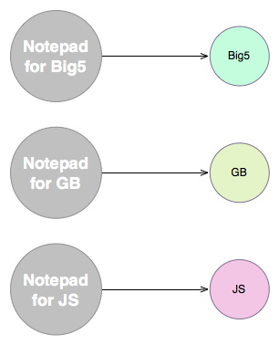
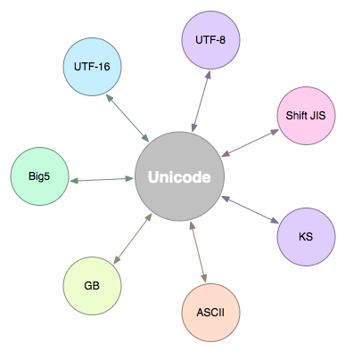
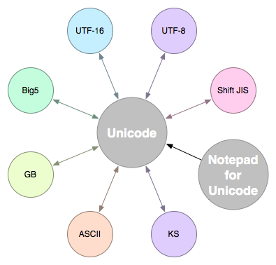
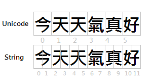
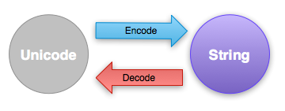

# 瞭解Unicode


在這章節我們將介紹什麼是Unicode，在我們理解Unicode之前，得先理解什麼是編碼，同時我們必需先回首過去，才能理解為什麼需要有Unicode

##什麼是編碼?
在學習程式語言時，必需理解一個很重要的觀念，那就是在電腦裡的所有東西都是使用數字來表示的，不管是電影、圖片、聲音，理所當然的，文字也一樣是由數字來表示的，而事實上電腦裡能儲存的數字範圍也不是沒有限制，每個Byte能儲存的範圍是0~255，因此在早期常見的英數文字編碼是使用一個byte來表示一個字，像是 ASCII 即是這樣的編碼，因為0~255這樣的範圍來說，對於只有英文26個字母、數字、和一些符號的英文文字表達來說已經很足夠，例如ASCII中要表達A其實是65這個數字，B則是66

```
65 -> A
66 -> B
67 -> C
...
```

```
註解 事實上ASCII只使用到7 bits，我們不打算在此太過深入，因此有興趣請自行上網搜尋相關資料
```
這類用數字來表示文字的方法即稱為編碼，雖然ASCII這類的編碼對於英文語系來說已夠用，但是隨著電腦從美國普及到世界各地，例如來到臺灣，為了能夠在電腦中表示中文，就得發明不同於 ASCII 的編碼方式

為了表示中文，在以前有幾家臺灣的電腦廠商一起討論決定出一套編碼系統就叫Big5，我們知道一個byte可以表示0~255，而中文字不像英文字母只有26個字，而是上萬個字，因此一個byte肯定不夠表示，所以 Big5 是用兩個數字來表示一個中文
```
(164, 164) -> 中
(164, 229) -> 文
(166, 72)  -> 字
```

除了臺灣以外，不同的地區都紛紛自己定出適合當地語系的文字編碼系統，例如簡體中文的 GB ，日文的 Shift-JS 等等，這樣做雖然解決了當地電腦表達文字的需求，但也帶來了另外的困擾

##不同編碼的困擾
假設在那個年代有一家軟體公司，推出了一套Notepad軟體，也就是記事本，老闆給它取了一個很酷的名稱叫”超級記事本”，但其實它確實只是一個記事本，使用者可以在上面輸入文字，只有儲檔、讀檔這類的簡單功能，而這套軟體起初只能處理 ASCII ，但是因為賣得太好了! 老闆有一天很開心的衝進你的辦公室跟你說
```
嘿! 我們打算推出中文版的超級記事本! 打入繁體中文的市場
```

身為程式設計師的你，於是開始研究了 Big5 的編碼方式，改寫了原本的超級記事本程式，讓它可以支援 Big5 編碼，不久後，超級記事本就出現在繁體中文的軟體市場上，你做夢也沒想到這樣的爛軟體居然賣得不錯，老闆也很大方地給了你不少獎金，但是沒多久，老闆又興高采烈地出現在你的辦公室，對你說

```
我們在繁體中文市場的銷售棒極了! 現在我們打算進軍日本! 推出可以處理日文的超級記事本
```

於是苦命的你就開始研究日文的 Shift-JS 編碼，經過了不少努力，終於把日文版的超級記事本也改寫出來了，還順便學了一些簡單的日文，日文市場沒有預期反應來得好，但是老闆又來到你辦公室對你說

```
我們現在打算進軍簡體中文的軟體市場! 一切就拜託你了
```


此時你在心裡咒罵著，但也只能接受並且開始研究 GB 的編碼方式，並且改寫了原本的程式，推出了能處理簡體中文的超級記事本，但這只是悲劇的開始，因為前三個版本明明都是一樣的程式，但因為編碼的不同，出現了問題你得一次修改三個版本的程式，再也沒有比這更慘的情況了，無奈的你再也受不了這些不一樣的編碼，只能提出辭程，在回家的路上，你夢想著希望可以有一天，有人來解決這該死的編碼問題

## 文字編碼的救贖 - Unicode
所以到底發生了什麼問題? 原因很簡單，沒有一個統一的編碼可以讓程式來處理，也沒有一種編碼方式可以表示所有的文字，我們看看超級記事本的情況




同樣的邏輯，同樣的程式，但因為不同編碼而得維護不同的版本，這就是在那個年代裡遇到的問題，為瞭解決這樣的難題， Unicode 便被提出來了， Unicode 可以表示不同的語言，同時，不同的編碼也都可以和 Unicode 進行轉換




因此處理文字的程式，只要能夠處理 Unicode ，就等於是可以處理各種不同的文字語系，再也不需要為了不同的編碼各別處理了



##Python的Unicode支援
Python的Unicode支援非常的優秀，簡單而且好用，如果你有寫過PHP就會發現那根本不叫支援Unicode，在Python裡的字串有兩種，一種是 str ，另一種則是 unicode，在Python表示unicode字串的方式，是在字串前面加上一個u，而且很重要的一點是，為了讓Python直譯器能正確地解析我們在程式碼裡打的中文字，我們得告訴它我們用的是什麼編碼，因此得加上

```py
# -*- coding: utf8 -*-
```

在程式碼開頭的地方，如果你用的是其它編碼來儲存Python的模組，就將utf8改成其它的編碼名稱，但通常都是預設utf8，忘記加上這一行就在程式使用中文的話，會出現下面的錯誤

```
SyntaxError: Non-ASCII character '\xe4' in file D:\example.py on line 1, but no encoding declared; see http://www.python.org/peps/pep-0263.html for details
```

以下是範例

```py
# -*- coding: utf8 -*-
msg = u'今天天氣真好'
print msg
print u'字數:', len(msg)
輸出的結果會是
```


輸出的結果會是
```
今天天氣真好
字數: 6
```

一個很常見到的錯誤是忘記加上 u ，這樣產生出來的字串是 str 而非 unicode，其文字的編碼會依照目前python檔案的文字編碼，或著是命令提示列的編碼來決定，例如

```py
# -*- coding: utf8 -*-
msg = '今天天氣真好'
print msg
print '字數:', len(msg)
```

輸出的結果會是

```py
今天天氣真好
字數: 18
```

你可能會覺得很奇怪，為什麼 “今天天氣真好” 應該是6個字，在這裡卻是18個字，原因很簡單，對於 unicode 來說，基本單位是 “字”，而且每個字的儲存空間較大，它可以容納任何的字，在 unicode 裡一個字母就只佔一個位置，但是 str 就不一樣了， str 的基本單位是 byte，而因為文字編碼是以多個 byte 來表示一個字，例如 Big5 即是以2個 byte 來表示一個中文字，因此如果 Unicode 和 Big5 編碼的中文字相比就會像這個樣子



但我們在此使用的是 UTF-8 編碼，不同於 Big5 只能編碼中文， UTF-8 能編碼任何 Unicode 支援的文字，因此所需要的數字範圍就更大，為了能夠表達足夠的文字，因此 UTF-8 採取動態長度編碼，也就是每個字會由幾個 byte 組成是不一定的

```
註解 在Python3因為字串已經全部統一成 unicode ，所以不必加上 u ，這是Python2和Python3的重要差別之一，需要特別注意
```


##與外界溝通 - decode與encode

在上面我們學到了如何表示 unicode 字串，但是事實上是， unicode 字串只能存在程式的內部，並沒有一個統一的表達方式，並沒有辦法和外界溝通，因此當我們想把字串存到檔案裡，或著透過網路傳給別人，得先將 unicode 字串編碼成成 str 字串，相對地，當我們想開啟某種編碼的檔案時，我們得進行解碼

Python編碼或解碼的方式很簡單，透過encode與decode的函數呼叫，我們可以在 unicode 和 str 兩種之間進行轉換




由於 UTF-8 可以編碼任何字集，同時還有兼容 ASCII 的優點，因此通常我們使用的編碼都是 UTF-8，編碼只要呼叫unicode的.encode函數即可，以下是編碼的簡單的範例

```py
# -*- coding: utf8 -*-
msg = u'今天天氣真好'
encoded = msg.encode('utf8')
print repr(encoded)
```

相反的，解碼一樣簡單

```py
# -*- coding: utf8 -*-
encoded = '\xe4\xbb\x8a\xe5\xa4\xa9\xe5\xa4\xa9\xe6\xb0\xa3\xe7\x9c\x9f\xe5\xa5\xbd'
msg = encoded.decode('utf8')
print msg
```


那麼，Python到底支援哪幾種編碼，其編碼的名稱又該去哪裡查呢? 請看 Python支援的標準編碼