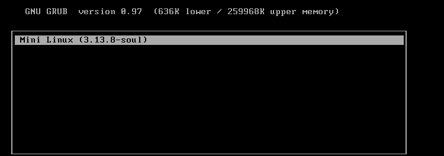
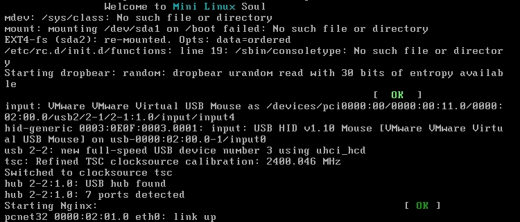

# 編譯內核+BusyBox定製一個Linux提供ssh和web服務


- 1、添加一塊空閒磁盤
- 2、下載編譯內核
- 3、並為空閒磁盤安裝grub

前提準備：

```sh
[root@soul ~]# fdisk /dev/sdb    分區
Command (m for help): p
Disk /dev/sdb: 10.7 GB, 10737418240 bytes
255 heads, 63 sectors/track, 1305 cylinders
Units = cylinders of 16065 * 512 = 8225280 bytes
Sector size (logical/physical): 512 bytes / 512 bytes
I/O size (minimum/optimal): 512 bytes / 512 bytes
Disk identifier: 0x4e977ad9
   Device Boot      Start         End      Blocks   Id  System
/dev/sdb1               1           7       56196   83  Linux
/dev/sdb2               8          73      530145   83  Linux
/dev/sdb3              74         107      273105   82  Linux swap / Solaris
#格式化操作
[root@soul ~]# mke2fs -t ext4 /dev/sdb1
[root@soul ~]# mke2fs -t ext4 /dev/sdb2
[root@soul ~]# mkswap /dev/sdb3
[root@soul ~]# mkdir -pv /mnt/{boot,sysroot}
[root@soul ~]# mount /dev/sdb1 /mnt/boot/
[root@soul ~]# mount /dev/sdb2 /mnt/sysroot/
[root@soul ~]# grub-install --root-directory=/mnt /dev/sdb    安裝grub
[root@soul ~]# ls /mnt/boot/
grub  lost+found
[root@soul ~]# 上述信息顯示安裝成功
```

其中需要一個腳本來移植命令和所依賴的庫文件：

```sh
#腳本可能不完善；不過可用
#!/bin/bash
aimDir=/mnt/sysroot
cmdInput() {
    if which $cmd &> /dev/null;then
        cmdPath=`which --skip-alias $cmd`
    else
        echo "No such command."
        return 5
    fi
}
cpCmd() {
    cmdDir=`dirname $cmdPath`
    [ -d ${aimDir}${cmdDir} ] || mkdir -p ${aimDir}${cmdDir}
    [ -f $cmdPath ] && cp $cmdPath ${aimDir}${cmdDir}
}
cpLib() {
    for libPath in `ldd $cmdPath | grep -o "/[^[:space:]]\{1,\}"`;do
        libDir=`dirname $libPath`
        [ -d ${aimDir}${libDir} ] || mkdir -p ${aimDir}${libDir}
        [ -f $libPath ] && cp $libPath ${aimDir}${libDir}
    done
}
echo "You can input [q|Q] quit."
while true;do
  read -p "Enter a command: " cmd
  if [[ "$cmd" =~ \(|q|Q|\) ]];then
    echo "You choose quit."
    exit 0
  fi
    cmdInput
    [ $? -eq 5 ] && continue
    cpCmd
    cpLib
    [ $? -eq 0 ] && echo -e "\033[36mCopy successful.\033[0m"
done
```

## 一、編譯內核

下載地址：https://www.kernel.org/
```sh
[root@soul ~]# ls
anaconda-ks.cfg  install.log  install.log.syslog  linux-3.13.8.tar.xz
[root@soul ~]# 這裡下載的是目前最新的穩定版
[root@soul ~]# tar xf linux-3.13.8.tar.xz -C /usr/src/
[root@soul ~]# ln -sv /usr/src/linux-3.13.8/ /usr/src/linux    創建鏈接
`/usr/src/linux' -> `/usr/src/linux-3.13.8/'
[root@soul ~]# cd /usr/src/linux
[root@soul linux]#
#編譯
[root@soul linux]# make allnoconfig    清除所有選擇；然後重新選擇定製
  HOSTCC  scripts/basic/fixdep
  HOSTCC  scripts/kconfig/conf.o
  SHIPPED scripts/kconfig/zconf.tab.c
  SHIPPED scripts/kconfig/zconf.lex.c
  SHIPPED scripts/kconfig/zconf.hash.c
  HOSTCC  scripts/kconfig/zconf.tab.o
  HOSTLD  scripts/kconfig/conf
scripts/kconfig/conf --allnoconfig Kconfig
#
# configuration written to .config
#
[root@soul linux]# make menuconfig
#下面的選擇沒辦法列出來；給個大概
1、選擇CPU類型
2、支持動態模塊裝載
3、PCI總線支持
4、硬盤驅動
5、文件系統
6、可執行文件格式
7、I/O驅動；USB驅動
8、devtmpfs支持
9、選擇網絡支持以及網卡驅動
#結束後備份下配置文件；然後編譯成bzImage格式
[root@soul linux]# cp .config /root/config-3.13.8-x86_64
[root@soul linux]# make bzImage
[root@soul linux]# cp arch/x86/boot/bzImage /mnt/boot/
```

## 二、安裝BusyBox

BusyBox 是一個遵循GPL協議、以自由軟件形式發佈的應用程序。Busybox在單一的可執行文件中提供了精簡的Unix工具集(例如shell、init、getty、login...)，可運行於多款POSIX環境的操作系統，例如Linux（包括Android）、Hurd、FreeBSD等等。

1、安裝；官方下載地址：http://www.busybox.net/

```sh
#因為稍後需要編譯busybox為靜態二進製程序；所以需要實現安裝glibc-static和libmcrypt-devel；
#glibc-static在安裝光盤的第二張光盤上；可以掛在安裝；也可以到網上下載
[root@soul busybox-1.22.1]# mount /dev/cdrom /media/
mount: block device /dev/sr0 is write-protected, mounting read-only
[root@soul busybox-1.22.1]# yum -y install /media/Packages/glibc-static-2.12-1.132.el6.x86_64.rpm
[root@soul ~]# ls
anaconda-ks.cfg         config-3.13.8-x86_64  install.log.syslog
busybox-1.22.1.tar.bz2  install.log           linux-3.13.8.tar.xz
[root@soul ~]#
[root@soul ~]# tar xf busybox-1.22.1.tar.bz2
[root@soul ~]# cd busybox-1.22.1    #安裝可以查看INSTALL文件說明
[root@soul busybox-1.22.1]# make menuconfig
Busybox Settings  --->
    Build Options  --->
        [*] Build BusyBox as a static binary (no shared libs) #選中這項
#其他選項都不需要改動了
                                                                                                      
[root@soul busybox-1.22.1]# make
perl: warning: Setting locale failed.
perl: warning: Please check that your locale settings:
    LANGUAGE = (unset),
    LC_ALL = (unset),
    LANG = "en"
#根據提示設置下
[root@soul busybox-1.22.1]# export LANGUAGE=en_US.UTF-8
[root@soul busybox-1.22.1]# export LANG=en_US.UTF-8
[root@soul busybox-1.22.1]# export LC_ALL=en_US.UTF-8
[root@soul busybox-1.22.1]# make    再次make通過
[root@soul busybox-1.22.1]# make install
--------------------------------------------------
You will probably need to make your busybox binary
setuid root to ensure all configured applets will
work properly.
--------------------------------------------------
[root@soul busybox-1.22.1]#
[root@soul busybox-1.22.1]# ls _install/
bin  linuxrc  sbin  usr
[root@soul busybox-1.22.1]# cp -a _install/* /mnt/sysroot/
[root@soul busybox-1.22.1]# cd /mnt/sysroot/
[root@soul sysroot]# ls
bin  linuxrc  lost+found  sbin  usr
[root@soul sysroot]# mkdir -pv etc/rc.d var/log root proc sys srv boot mnt tmp home dev lib lib64
```

2、提供一個grub.conf文件
```sh
[root@soul sysroot]# vim /mnt/boot/grub/grub.conf
default=0
timeout=5
title Mini Linux (3.13.8-soul)
        root (hd0,0)
        kernel /bzImage ro root=/dev/sda2 init=/sbin/init
#完成後sync同步下；掛起宿主機；然後創建一個新的虛擬機使用之前添加的磁盤
#即可測試啟動
```




測試基本啟動以正常。但是提示沒有腳本文件。


測試可以配置IP地址；也能ping網關。

3、提供rc腳本

```sh
[root@soul sysroot]# vim etc/fstab
/dev/sda1       /boot   ext4    defaults        0 0
proc            /proc   proc    defaults        0 0
sysfs           /sys    sysfs   defaults        0 0
/dev/sda2       /       ext4    defaults        0 0
/dev/sda3       swap    swap    defaults        0 0
[root@soul sysroot]# mkdir etc/init.d
[root@soul sysroot]# vim etc/rc.d/rc.sysinit
#!/bin/sh
#
echo -e "\tWelcome to \033[36mMini Linux\033[0m Soul"
mount -a
mdev -s
ifconfig lo 172.0.0.1
ifconfig eth0 172.16.40.2
[root@soul sysroot]# chmod +x etc/rc.d/rc.sysinit
[root@soul sysroot]# vim etc/inittab
::sysinit:/etc/rc.d/rc.sysinit
console::respawn:-/bin/sh
::ctrlaltdel:/sbin/reboot
::shutdown:/bin/umount -a -r
[root@soul sysroot]#sync
#測試啟動
```


測試啟動正常。

## 三、實現密碼登陸；且可以ssh遠程連接

1、提供虛擬終端；更改之前的inittab文件

```sh
[root@soul sysroot]# vim etc/inittab
::sysinit:/etc/rc.d/rc.sysinit
::respawn:/sbin/getty 19200 tty1
::respawn:/sbin/getty 19200 tty2
::respawn:/sbin/getty 19200 tty3
::respawn:/sbin/getty 19200 tty4
::respawn:/sbin/getty 19200 tty5
::respawn:/sbin/getty 19200 tty6
::ctrlaltdel:/sbin/reboot
::shutdown:/bin/umount -a -r
[root@soul sysroot]# sync
```

2、提供密碼文件


```sh
#這裡以原有的機器上的密碼文件追加到新的系統文件裡
[root@soul sysroot]# head -1 /etc/passwd > /mnt/sysroot/etc/passwd
[root@soul sysroot]# grep soul /etc/passwd >> /mnt/sysroot/etc/passwd
[root@soul sysroot]# vim /mnt/sysroot/etc/passwd
#更改默認shell
root:x:0:0:root:/root:/bin/sh
soul:x:500:500::/home/soul:/bin/sh
[root@soul sysroot]# head -1 /etc/group > /mnt/sysroot/etc/group
[root@soul sysroot]# grep soul /etc/group >> /mnt/sysroot/etc/group
[root@soul sysroot]# head -1 /etc/shadow > /mnt/sysroot/etc/shadow
[root@soul sysroot]# grep soul /etc/shadow >> /mnt/sysroot/etc/shadow
[root@soul sysroot]# chmod 400 /mnt/sysroot/etc/shadow
#sync後直接測試；一般tty1登陸是有問題的。
```


測試登陸成功。

3、提供主機名等信息

```sh
[root@soul sysroot]# mkdir etc/sysconfig
[root@soul sysroot]# vim etc/sysconfig/network
HOSTNAME=Soul.com
[root@soul etc]# vim profile        設置環境變量
export PS1='[\u@\h \W]\$'
export PATH=/bin:/sbin:/usr/bin:/usr/sbin:/usr/local/sbin:/usr/local/bin
[root@soul sysroot]# vim etc/rc.d/rc.sysinit
#!/bin/sh
#
echo -e "\tWelcome to \033[36mMini Linux\033[0m Soul"
[ -r /etc/sysconfig/network ] && . /etc/sysconfig/network
[ -z "$HOSTNAME" -o "$HOSTNAME" == "(none)" ] && HOSTNAME=localhost
/bin/hostname $HOSTNAME
[ -r /etc/profile ] && . /etc/profile
mdev -s
mount -a
ifconfig lo 172.0.0.1
ifconfig eth0 172.16.40.2
[root@soul sysroot]# vim etc/issue
Welcome to Mini Linux Soul
kernel \r
```
4、編譯安裝dropbear提供ssh服務

```sh
[root@soul ~]# tar xf dropbear-2013.58.tar.bz2
[root@soul ~]# cd dropbear-2013.58
[root@soul dropbear-2013.58]# ./configure
[root@soul dropbear-2013.58]# make PROGRAMS="dropbear dbclient dropbearkey dropbearconvert scp"
[root@soul dropbear-2013.58]# make PROGRAMS="dropbear dbclient dropbearkey dropbearconvert scp" install
[root@soul dropbear-2013.58]# mkdir /etc/dropbear
[root@soul dropbear-2013.58]# dropbearkey -t rsa -s 1024 -f /etc/dropbear/dropbear_rsa_host_key
[root@soul dropbear-2013.58]# dropbearkey -t dss -f /etc/dropbear/dropbear_dss_host_key
[root@soul dropbear-2013.58]# dropbear -p 2222
[root@soul dropbear-2013.58]# ss -tunl | grep 2222
tcp    LISTEN     0      20                    :::2222                 :::*
tcp    LISTEN     0      20                     *:2222                  *:*
[root@soul dropbear-2013.58]# 測試是否可以登陸
#用腳本來複製命令和依賴的庫文件到Mini系統上
[root@soul ~]# sh cp.sh
You can input [q|Q] quit.
Enter a command: dropbear
Copy successful.
Enter a command: dropbearkey
Copy successful.
Enter a command: scp
Copy successful.
Enter a command: bash
Copy successful.
Enter a command: q
You choose quit.
[root@soul ~]#
#認證庫
[root@soul ~]# cp -d /lib64/libnss_files* /mnt/sysroot/lib64/
[root@soul ~]# cp -d /usr/lib64/libnss3.so /mnt/sysroot/usr/lib64/
[root@soul ~]# cp -d /usr/lib64/libnss_files.so /mnt/sysroot/usr/lib64/
[root@soul ~]# cp /etc/nsswitch.conf /mnt/sysroot/etc/
[root@soul ~]# vim /mnt/sysroot/etc/shells
#安全shell
/bin/sh
/bin/hush
/sbin/nologin
/bin/bash
/bin/ash
#在Mini系統生成key文件
[root@soul ~]# mkdir /mnt/sysroot/etc/dropbear
[root@soul ~]# dropbearkey -t dss -f /mnt/sysroot/etc/dropbear/dropbear_dss_host_key
[root@soul ~]# dropbearkey -t rsa -s 1024 -f /mnt/sysroot/etc/dropbear/dropbear_rsa_host_key
[root@soul ~]# mkdir /mnt/sysroot/var/run    存放pid文件
```

5、掛載pts

```sh
[root@soul sysroot]# vim etc/rc.d/rc.sysinit
mdev -s    #這個下面添加一行
mkdir /dev/pts
mount -a
[root@soul sysroot]# vim etc/fstab
/dev/sda1       /boot           ext4            defaults        0 0
proc            /proc           proc            defaults        0 0
sysfs           /sys            sysfs           defaults        0 0
#下面加一行
devpts          /dev/pts        devpts          defaults        0 0
```

6、提供dropbear的啟動腳本

```sh
[root@soul sysroot]# mkdir etc/rc.d/init.d
[root@soul sysroot]# vim etc/rc.d/init.d/dropbear
#!/bin/bash
#
# description: dropbear ssh daemon
# chkconfig: 2345 66 33
#
dsskey=/etc/dropbear/dropbear_dss_host_key
rsakey=/etc/dropbear/dropbear_rsa_host_key
lockfile=/var/lock/subsys/dropbear
pidfile=/var/run/dropbear.pid
dropbear=/usr/local/sbin/dropbear
dropbearkey=/usr/local/bin/dropbearkey
[ -r /etc/rc.d/init.d/functions ] && . /etc/rc.d/init.d/functions
[ -r /etc/sysconfig/dropbear ] && . /etc/sysconfig/dropbear
keysize=1024
port=22
gendsskey() {
    [ -d /etc/dropbear ] || mkdir /etc/dropbear
    echo -n "Starting generate the dss key: "
    $dropbearkey -t dss -f $dsskey &> /dev/null
    RETVAL=$?
    if [ $RETVAL -eq 0 ]; then
        success
        echo
        return 0
    else
        failure
        echo
        return 1
    fi
}
genrsakey() {
    [ -d /etc/dropbear ] || mkdir /etc/dropbear
    echo -n "Starting generate the rsa key: "
    $dropbearkey -t rsa -s $keysize -f $rsakey &> /dev/null
    RETVAL=$?
    if [ $RETVAL -eq 0 ]; then
        success
        echo
        return 0
    else
        failure
        echo
        return 1
    fi
}
start() {
    [ -e $dsskey ] || gendsskey
    [ -e $rsakey ] || genrsakey
    if [ -e $lockfile ]; then
        echo -n "dropbear daemon is already running: "
        success
        echo
        exit 0
    fi
    echo -n "Starting dropbear: "
    daemon --pidfile="$pidfile" $dropbear -p $port -d $dsskey -r $rsakey
    RETVAL=$?
    echo
    if [ $RETVAL -eq 0 ]; then
        touch $lockfile
        return 0
    else
        rm -f $lockfile $pidfile
        return 1
    fi
}
stop() {
    if [ ! -e $lockfile ]; then
        echo -n "dropbear service is stopped: "
        success
        echo
        exit 1
    fi
    echo -n "Stopping dropbear daemon: "
    killproc dropbear
    RETVAL=$?
    echo
    if [ $RETVAL -eq 0 ]; then
        rm -f $lockfile $pidfile
        return 0
    else
        return 1
    fi
}
status() {
    if [ -e $lockfile ]; then
        echo "dropbear is running..."
    else
        echo "dropbear is stopped..."
    fi
}
usage() {
    echo "Usage: dropbear {start|stop|restart|status|gendsskey|genrsakey}"
}
case $1 in
    start)
        start ;;
    stop)
        stop ;;
    restart)
        stop
        start
        ;;
    status)
        status
        ;;
    gendsskey)
        gendsskey
        ;;
    genrsakey)
        genrsakey
        ;;
    *)
        usage
        ;;
esac                                                                                                                                                                                                                                                            
[root@soul sysroot]# chmod +x etc/rc.d/init.d/dropbear
[root@soul sysroot]# cp /etc/rc.d/init.d/functions etc/rc.d/init.d/
#做啟動腳本鏈接文件
[root@soul ~]# cd /mnt/sysroot/etc/rc.d/
[root@soul rc.d]# ln -sv init.d/dropbear dropbear.s
[root@soul rc.d]# ln -sv init.d/dropbear dropbear.k
`dropbear.k' -> `init.d/dropbear'
[root@soul rc.d]# ll
total 8
lrwxrwxrwx. 1 root root   15 Apr  2 22:09 dropbear.k -> init.d/dropbear
lrwxrwxrwx. 1 root root   15 Apr  2 22:09 dropbear.s -> init.d/dropbear
#查看是否連接成功
[root@soul etc]# vim rc.d/rc.sysinit
mkdir /dev/pts
#下面加一行
/etc/rc.d/*.s start
```
7、提供關機服務腳本

```sh
[root@soul etc]# vim rc.d/rc.sysdown
#!/bin/sh
#
sync
sleep 5
/etc/rc.d/*.k stop
/bin/umount -a -r
poweroff
[root@soul etc]# chmod +x rc.d/rc.sysdown
[root@soul etc]# vim inittab
#更改下面這行為執行腳本
::shutdown:/etc/rc.d/rc.sysdown
#測試啟動遠程連接
```


測試tty1也可以正常登陸；只是需要等待一會在登陸即可

```sh
Xshell:\> ssh 172.16.40.2
Connecting to 172.16.40.2:22...
Connection established.
To escape to local shell, press 'Ctrl+Alt+]'.
[root@Soul ~]#ifconfig
eth0      Link encap:Ethernet  HWaddr 00:0C:29:38:36:2B
          inet addr:172.16.40.2  Bcast:172.16.255.255  Mask:255.255.0.0
          UP BROADCAST RUNNING MULTICAST  MTU:1500  Metric:1
          RX packets:67 errors:0 dropped:0 overruns:0 frame:0
          TX packets:28 errors:0 dropped:0 overruns:0 carrier:0
          collisions:0 txqueuelen:1000
          RX bytes:6415 (6.2 KiB)  TX bytes:3538 (3.4 KiB)
          Interrupt:19 Base address:0x2000
#測試開機可以自動啟動dropbear；並可以遠程登陸
```

## 四、安裝nginx；提供web服務

1、安裝；下載地址：http://nginx.org/

```sh
[root@soul ~]# cd nginx-1.4.2
[root@soul nginx-1.4.2]# ./configure --prefix=/usr/local --conf-path=/etc/nginx/nginx.conf --error-log-path=/var/log/nginx/error.log --http-log-path=/var/log/nginx/access.log --user=nginx --group=nginx --without-pcre --without-http_rewrite_module --without-http_geo_module --without-http_uwsgi_module --without-http_fastcgi_module  --without-http_scgi_module --without-http_memcached_module
[root@soul nginx-1.4.2]# make && make install
[root@soul nginx-1.4.2]# useradd nginx
[root@soul nginx-1.4.2]# nginx
[root@soul nginx-1.4.2]# ss -tunl | grep 80
tcp    LISTEN     0      128                    *:80                    *:*
[root@soul nginx-1.4.2]# 在瀏覽器測試下
```

2、移植nginx

```sh
[root@soul ~]# sh cp.sh
You can input [q|Q] quit.
Enter a command: nginx
Copy successful.
Enter a command: q
You choose quit.
[root@soul ~]#
[root@soul ~]# cp /etc/nginx/ /mnt/sysroot/etc/ -r
[root@soul ~]# grep "^nginx" /etc/passwd >> /mnt/sysroot/etc/passwd
[root@soul ~]# grep "^nginx" /etc/group >> /mnt/sysroot/etc/group
[root@soul ~]# grep "^nginx" /etc/shadow >> /mnt/sysroot/etc/shadow
[root@soul ~]# mkdir /mnt/sysroot/usr/local/html
[root@soul ~]# vim /mnt/sysroot/usr/local/html/index.html
<h1>Welcome to Nginx</h1>
[root@soul ~]#
```

3、提供服務腳本

```sh
#由於nginx的腳本如調用functions函數；可能會導致依賴其他redhat系統獨有的函數；會導致開機無法自啟動；也會影響其他程序導致無法啟動；所以需要自行寫個腳本。
[root@soul ~]# vi /mnt/sysroot/etc/rc.d/nginx
#!/bin/sh
#
# Startup script for the Nginx
# chkconfig: - 88 63
# description: Nginx is a free,open-source,high-performance HTTP Server and reverse proxy.
# program:/usr/local/sbin/nginx
# config:/etc/nginx/nginx.conf
# pidfile:/usr/local/logs/nginx.pid
                                                                                                                                                                                                                                                                                                                  
# Synopsis:
#        nginx [--help] [--version] {start|stop|restart|reload|status}
                                                                                                                                                                                                                                                                                                                  
                                                                                                                                                                                                                                                                                                                  
# Define variable
nginx=/usr/local/sbin/nginx
pidfile=/usr/local/logs/nginx.pid
PROGRAM=`basename $0`
nginx_conf=/etc/nginx/nginx.conf
alog=/var/log/nginx/access.log
elog=/var/log/nginx/error.log
VERSION=1.4.2
                  
# Functions
usage(){
    echo "Usage: $PROGRAM [--help] [--version] {start|stop|restart|reload|status}"
}
                                                                                                                                                                                                                                                                                                                  
version(){
    echo "Version:$VERSION"
}
                                                                                                                                                                                                                                                                                                                  
start(){
if [ -e $pidfile ]
   then
    echo "Nginx already running..."
   else
    [ -f $alog ] || touch $alog
    [ -f $elog ] || touch $elog
    echo -e "Starting Nginx:\t\t\t\t\t\t\t\c"
    $nginx -c $nginx_conf
    touch $pidfile
    echo -e "[ \c"
    echo -e "\033[0;32mOK\033[0m\c"
    echo -e " ]\c"
    echo -e "\r"
fi
}
                                                                                                                                                                                                                                                                                                                  
stop(){
if [ -e $pidfile ]
   then
    echo -e "Stopping Nginx:\t\t\t\t\t\t\t\c"
    /usr/bin/killall $PROGRAM &> /dev/null
    rm -f $pidfile
    echo -e "[ \c"
    echo -e "\033[0;32mOK\033[0m\c"
    echo -e " ]\c"
    echo -e "\r"
   else
    echo "Nginx already stopped..."
fi
}
                                                                                                                                                                                                                                                                                                                  
reload(){
if [ -e $pidfile ]
   then
    echo -e "Reloading Nginx:\t\t\t\t\t\t\c"
    kill -HUP `pidof $PROGRAM`
    echo -e "[ \c"
    echo -e "\033[0;32mOK\033[0m\c"
    echo -e " ]\c"
    echo -e "\r"
   else
    echo "Nginx is not running..."
fi
}
                                                                                                                                                                                                                                                                                                                  
status(){
    if [ -e $pidfile ];then
        echo  "Nginx is running..."
       else
        echo  "Nginx is stopped..."
    fi
}

case $1 in
        start)
            start
            ;;
        stop)
            stop
            ;;
        restart)
            stop
        sleep2
            start
            ;;
        reload)
            reload
            ;;
        status)
            status
            ;;
        --help)
            usage
            ;;
        --version)
            version
            ;;
        *)
            usage
esac
[root@soul ~]# chmod +x /mnt/sysroot/etc/rc.d/init.d/nginx
[root@soul ~]# cd /mnt/sysroot/etc/rc.d/
[root@soul rc.d]# ls
dropbear.k  dropbear.s  init.d  rc.sysdown  rc.sysinit
[root@soul rc.d]# ln -sv init.d/nginx nginx.s
`nginx.s' -> `init.d/nginx'
[root@soul rc.d]# ln -sv init.d/nginx nginx.k
`nginx.k' -> `init.d/nginx'
```

4、開機測試

這裡可能由於沒有啟動的先後順序；如按照之前的啟動方式會導致都無法開機自動啟動；這裡更改了開機啟動腳本：

```sh
[root@soul sysroot]# vim etc/rc.d/rc.sysinit
#下面是分開啟動的；否則會啟動失敗
mdev -s
mkdir /dev/pts
mount -a
mount -n -o remount,rw /
/etc/rc.d/dropbear.s start
/etc/rc.d/nginx.s start
```




```sh
Xshell:\> ssh 172.16.40.2
Connecting to 172.16.40.2:22...
Connection established.
To escape to local shell, press 'Ctrl+Alt+]'.
[root@Soul ~]#su - soul
[soul@Soul ~]$
#測試ssh登陸和切換賬戶都是沒有問題的。
```

到此；本實驗結束；且需要的功能都以實現；關於程序的開機啟動和關機關閉的問題；這個問題也琢磨了很長時間；個人感覺應該是次順問題；所以如需實現；可能需要更改啟動/關閉腳本文件。
