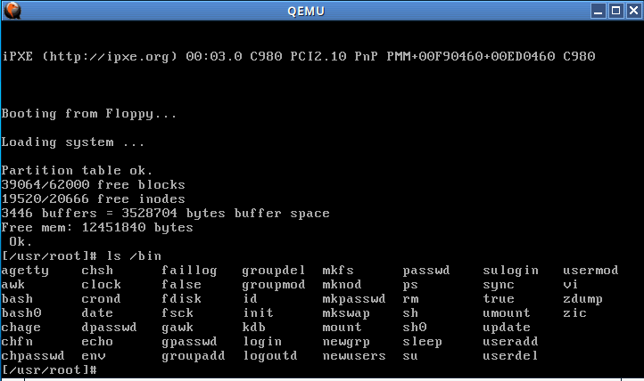

# 建構 Linux 0.11 的開發環境


參考平台 Ubuntu Linux 15.10 x86_64

安裝必要的套件
```
sudo apt-get install vim cscope exuberant-ctags build-essential qemu-system-x86
```

```
git clone https://github.com/tinyclub/linux-0.11-lab
cd linux-0.11-lab
make help
```
暫時不能用太新的 gcc 編譯:
make CC=gcc-4.8
或者改用 [jserv 的開發分支](https://github.com/jserv/linux-0.11-lab)。

用 QEMU 的 hard disk image 啟動
```
make start-hd
```
一下子就開啟了:




當然也可以用 gdb 追蹤和分析
假設目前目錄都是 `linux-0.11-lab`，先在一個終端機視窗執行以下指令:
```
$ make debug-hd // debug it via qemu & gdb, you'd start gdb to connect it.
```
接著再開啟新的終端機畫面: (粗體字為輸入)
```
gdb -q images/kernel.sym
(gdb) target remote :1234
(gdb) b main
(gdb) c
```
預期會看到以下 GDB 訊息:
```
Breakpoint 1, main () at main.c:107
107        {                        /* The startup routine assumes (well, ...) this */
(gdb)
```
這時再輸入 `c` 就可以繼續 Linux 核心的運作。
