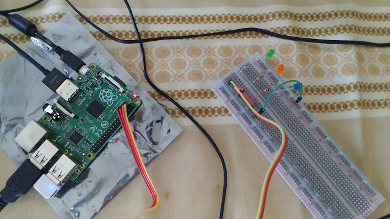

# 用 Raspberry pi 寫驅動程式 -- 範例1：LED

寫驅動程式的時候，我們要先定義他的規格(specification)：

- 透過3個gpio（General Purpose I/O）去控制3個LED，gpio的位置在載入模組(module)的時候(modprobe, insmod)可以額外設定而不需要重新編譯模組。
- 控制方法：寫入/dev/LED_n (n=0,1,2)，若是寫入1則啟動LED，寫入0則關閉。
- 每個連入系統的使用者都可以控制

接起來就像這樣：




模組就先從最簡單的Hello World開始：
hello.c

```c
#include 
#include 
int hello_init(void)
{
    printk("hello world!\n");
    return 0;
}
void hello_exit(void)
{
    printk("goodbye world!\n");
}
MODULE_LICENSE("GPL");
module_init(hello_init);
module_exit(hello_exit);
```

用以下的Makefile編譯：

```sh
obj-m += hello.o

EXTRA_CFLAGS += -I$(PWD)

all:
        make -C /lib/modules/$(shell uname -r)/build M=$(PWD) modules

clean:
        make -C /lib/modules/$(shell uname -r)/build M=$(PWD) clean

```

用insmod或modprobe載入後，module_init會呼叫hello_init函式，然後在dmesg(display message/driver message)顯示"hello

world!"。用rmmod卸載的話，module_exit會呼叫hello_exit函式，然後在dmesg(display message/driver message)顯示"goodbye world!"。

現在進入寫LED驅動程式的部份。
現在linux kernel已經有支援gpio控制的部份，記得加入標頭檔`<linux/gpio.h>`就好，這樣就不用像參考資料一樣還要查記憶體位址。(雖然現在kernel也有支援LED控制的部份，不過這個以後有空再說)

一個能控制gpio的模組，在載入(init)的時候大概要做這些事：


- 要求系統使用指定的gpio
使用gpio_request(還不知道要用input或output的時候)或gpio_request_one(只需要一個gpio的時候) 或gpio_request_array(要使用多個gpio時)

- 要求系統給予一個裝置號碼(device number)或自己提供一個裝置號碼要求系統登錄
使用alloc_chrdev_region(動態配置裝置號碼)或register_chrdev_region(自己提供裝置號碼)

- 分配(allocate)並初始(initial)一個字元裝置(character device)並加入系統
cdev_alloc, cdev_init(在此步驟要定義裝置使用者嘗試開啟關閉或讀寫裝置檔案時的動作), 與cdev_add

- 在/dev下新增裝置檔案(device file)以便讓使用者進行系統呼叫
class_create與device_create

卸載(exit)的時候，就把載入的步驟反過來做就好：

- 把在/dev下新增的裝置檔案移除
class_destroy

- 把加入系統的字元裝置移除
cdev_del

- 把登錄的裝置號碼取消
unregister_chrdev_region

- 取消指定使用的gpio
gpio_free或gpio_free_array

以下是整個模組內需要用到的自訂變數跟巨集(macro)

```c
#define LED_DRIVER_NAME "LED"        // 驅動程式名稱
#define BUF_SIZE 5           // 用來讀取使用者寫入設備檔案的buffer

static dev_t driverno ;               // 裝置編號
static struct cdev *gpio_cdev;        // 字元裝置設備
static struct class *gpio_class;      // 裝置群組

static struct gpio leds[] = {                  //3個欄位依序是gpio號碼、
    {  2, GPIOF_OUT_INIT_LOW, "LED_0" },       //輸入輸出模式(這裡GPIOF_OUT_INIT_LOW代表輸出但值為0)、
    {  3, GPIOF_OUT_INIT_LOW, "LED_1" },       //在/dev 內顯示的裝置名稱
    {  4, GPIOF_OUT_INIT_LOW, "LED_2" },
};

// 三個gpio的預設值
static int gpio0 = 2;           
static int gpio1 = 3;
static int gpio2 = 4;

// gpio的值是可以在insmod的時候更改的
module_param(gpio0, int, S_IRUGO);
MODULE_PARM_DESC(gpio0, "GPIO-0 pin to use");
module_param(gpio1, int, S_IRUGO);
MODULE_PARM_DESC(gpio1, "GPIO-1 pin to use");
module_param(gpio2, int, S_IRUGO);
MODULE_PARM_DESC(gpio2, "GPIO-2 pin to use");

// Forward declarations
static ssize_t write_LED( struct file *, const char *,size_t,loff_t *);
//Operations that can be performed on the device

// struct file_operations 決定怎麼跟設備檔案溝通的方式
// 在規格中我們希望只透過"寫入"來開關LED，所以只需定義.write
static struct file_operations fops = {
 .owner = THIS_MODULE,    // 這是指定當前模組是這個結構的擁有者，這樣可以避免使用中的模組被卸載
 .write = write_LED       // 當使用者寫入檔案時，執行write_LED
};
```

write_LED長這樣： 

```c
// 這四個引數會被module使用，
// struct file *filp : 設備檔案
// const char *buf : 使用者輸入的字串
// size_t count : 使用者輸入字串數
// loff_t *f_pos : 使用者輸入的值要從第幾個字元開始算
static ssize_t write_LED( struct file *filp, const char *buf,size_t count,loff_t *f_pos){
    char kbuf[BUF_SIZE];                                    
    unsigned int len=1, gpio;
    // f_path 是路徑，dentry是entry的位置，d_inode是那個entry的設備號碼(有major和minor)
    // 會這麼麻煩是因為我們有3個gpio
    gpio = iminor(filp->f_path.dentry->d_inode);    
    printk(KERN_INFO LED_DRIVER_NAME " GPIO: LED_%d is modified. \n", gpio);
    len = count < BUF_SIZE ? count-1 : BUF_SIZE-1; 
    // copy_from_user 是把使用者輸入的值(buf) copy "len"個字元到指定的buffer(kbuf)裡做後續處理
    if(copy_from_user(kbuf, buf, len) != 0) return -EFAULT;
    kbuf[len] = '\0';
    printk(KERN_INFO LED_DRIVER_NAME " Request from user: %s\n", kbuf);
    // 如果輸入1就打開，是0就關上
    if (strcmp(kbuf, "1") == 0) {
        printk(KERN_ALERT LED_DRIVER_NAME " LED_%d switch On \n", gpio);
        gpio_set_value(leds[gpio].gpio, 1);
    } else if (strcmp(kbuf, "0") == 0) {
        printk(KERN_ALERT LED_DRIVER_NAME " LED_%d switch Off \n", gpio);
        gpio_set_value(leds[gpio].gpio, 0);
    }
    // 這邊是停頓100 毫秒，注意"sleep"表示停頓期間cpu可以去做其他的事
    // 如果用mdelay也是停頓100毫秒，可是cpu在停頓期必須待命不能做其他事，這會降低系統效能
    msleep(100);
    return count;
}
```

再來就是module_init的部份(code prettyprint不知道為何在這一直出問題，所以就不用了)：

```c
static int __init LED_init_module(void)
{
    int ret, i;
    // Set gpio according to the parameters you give
    printk(KERN_INFO LED_DRIVER_NAME " %s\n", __func__);
    modify_gpio();              // 把gpio_pin0(1,2)代入leds中的gpio setting
    printk(KERN_INFO LED_DRIVER_NAME " gpio_request_array \n");
    ret = gpio_request_array(leds, ARRAY_SIZE(leds));    // 向系統要求gpio

    if (ret < 0) {
        printk(KERN_ERR LED_DRIVER_NAME " Unable to request GPIOs: %d\n", ret);
        goto exit_gpio_request;
    }

    // Get driver number 向系統調用driver number
    printk(KERN_INFO LED_DRIVER_NAME " alloc_chrdev_region \n");
    ret = alloc_chrdev_region(&driverno, 0, ARRAY_SIZE(leds), LED_DRIVER_NAME);

    if (ret) {
        printk(KERN_EMERG LED_DRIVER_NAME " alloc_chrdev_region failed\n");
        goto exit_gpio_request;
    }

    printk(KERN_INFO LED_DRIVER_NAME " DRIVER No. of %s is %d\n", LED_DRIVER_NAME,
           MAJOR(driverno));

    printk(KERN_INFO LED_DRIVER_NAME " cdev_alloc\n");
    // 配備cdev
    gpio_cdev = cdev_alloc();

    if (gpio_cdev == NULL) {
        printk(KERN_EMERG LED_DRIVER_NAME " Cannot alloc cdev\n");
        ret = -ENOMEM;
        goto exit_unregister_chrdev;
    }

    printk(KERN_INFO LED_DRIVER_NAME " cdev_init\n");

    // 初始cdev並跟 file_operations連結
    cdev_init(gpio_cdev, &fops);
    gpio_cdev->owner = THIS_MODULE;

    printk(KERN_INFO LED_DRIVER_NAME " cdev_add\n");

    // 新增cdev並跟獲得的配備編號連結(leds有三個元件)
    ret = cdev_add(gpio_cdev, driverno, ARRAY_SIZE(leds));

    if (ret) {
        printk(KERN_EMERG LED_DRIVER_NAME " cdev_add failed!\n");
        goto exit_cdev;
    }

    printk(KERN_INFO LED_DRIVER_NAME " Play blink\n");
    blink();    // 自己寫的小程式，確定gpio有起來

    printk(KERN_INFO LED_DRIVER_NAME " Create class \n");

    // 在/sys/class 內新增class
    gpio_class = class_create(THIS_MODULE, LED_DRIVER_NAME);

    if (IS_ERR(gpio_class)) {
        printk(KERN_ERR LED_DRIVER_NAME " class_create failed\n");
        ret = PTR_ERR(gpio_class);
        goto exit_cdev;
    }

    // 新增node到 /dev/ 跟/sys/class/LED_DRIVER_NAME 下
    printk(KERN_INFO LED_DRIVER_NAME " Create device \n");

    for (i = 0; i < ARRAY_SIZE(leds); ++i) {
        if (device_create(gpio_class, NULL, MKDEV(MAJOR(driverno), MINOR(driverno) + i),
                          NULL, leds[i].label) == NULL) {
            printk(KERN_ERR LED_DRIVER_NAME " device_create failed\n");
            ret = -1;
            goto exit_cdev;
        }
    }

    return 0;

exit_cdev:
    cdev_del(gpio_cdev);

exit_unregister_chrdev:
    unregister_chrdev_region(driverno, ARRAY_SIZE(leds));

exit_gpio_request:
    gpio_free_array(leds, ARRAY_SIZE(leds));
    return ret;
}
```

module_exit就是把module_init初始的東西都取消就好

```c
static void __exit LED_exit_module(void)
{
    int i;
    printk(KERN_INFO LED_DRIVER_NAME " %s\n", __func__);

    // turn all off
    for (i = 0; i < ARRAY_SIZE(leds); i++) {
        gpio_set_value(leds[i].gpio, 0);
        device_destroy(gpio_class, MKDEV(MAJOR(driverno),
                                         MINOR(driverno) + i));  // 把node移掉
    }

    class_destroy(gpio_class);  // 取消class
    cdev_del(gpio_cdev);  // 移除cdev
    unregister_chrdev_region(driverno, ARRAY_SIZE(leds));  // 解登錄driverno
    gpio_free_array(leds, ARRAY_SIZE(leds));   // 釋放gpio
}
```

完整的程式碼在此(包含測試檔案)
https://gist.github.com/gnitnaw/b116f358fa688897fe00

insmod完，/dev/下就會出現節點

```sh
pi@raspberrypi ~/work/driver/LED3 $ ls -l /dev/LED*
crw------- 1 root root 246, 0 juin  23 12:47 /dev/LED_0
crw------- 1 root root 246, 1 juin  23 12:47 /dev/LED_1
crw------- 1 root root 246, 2 juin  23 12:47 /dev/LED_2
```

權限這時還沒開，需要使用sudo 把/dev/LED_0(1,2)權限改成666

```sh
pi@raspberrypi ~/work/driver/LED3 $ ls -l /dev/LED*
crw-rw-rw- 1 root root 246, 0 juin  23 12:41 /dev/LED_0
crw-rw-rw- 1 root root 246, 1 juin  23 12:41 /dev/LED_1
```

這樣就能開始使用了。

##參考資料：

臺灣樹莓派 -- 用Raspberry Pi學Linux驅動程式

http://fr.slideshare.net/raspberrypi-tw/write-adevicedriveronraspberrypihowto
https://github.com/wendlers/rpi-kmod-samples
