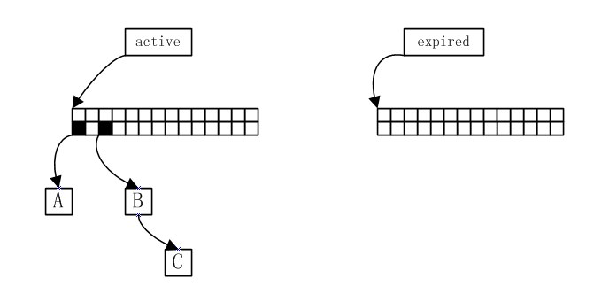
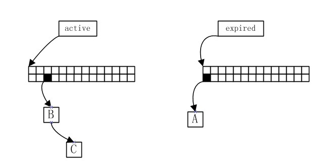
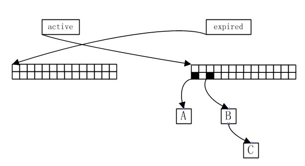

<h1 align="center">linux2.6.XX进程切换和时间片再生
</h1>

　　上一篇中介绍了linux0.01的进程切换的时间复杂度是O(n)级的，
这对linux0.01来说不会有什么问题，
因为linux0.01最多只能有64个进程。
可是现在的linux操作系统可能有几百上千个进程并发执行，
而且为了更智能地调度进程，其分配时间片的算法也越来越复杂，
如果仍然采用O(n)的切换算法，那就有点危险了。

　　从上一篇中可以看出时间主要消耗在两个地方：

1. 选择合适的进程进行切换O(n)
2. 时间片再生O(n)

<b>linux2.6.XX中成功的把它们降到了O(1)</b>

---

# 选择进程进行切换

　　linux2.6.XX 中有个封装了进程信息的结构体：
优先级数组(struct prio_array)。这个结构体内有3个成员：

1. 进程个数
2. 优先级位图
3. 优先级队列的数组

<b>位图中每一位对应一个优先级队列，
如果队列非空，那对应的那一位就是1</b>：

　　linux2.6.XX 的进程有140个优先级，
所以对应的位图应该有140比特，而实际上它是5个unsigned long
构成，共160比特。与linux0.01不同的是2.6的优先级
值越小优先级越高。而且2.6不是优先执行剩余时间片最多的进程，
而是优先执行优先级最高的进程。
<b>所以调度的时候只要找出第1个被设置为1的位，
然后从该位对应的队列中出队一个进程就可以了。</b>
寻找第一个被设置为1的位可以用bsfl指令，
它一次可以找4个字节，所以无论存在多少进程这条指令最多被执行5次，
这点开销可以说微不足道。

　　如果当前位图是上面这种情况，那么现在可运行的进程
的最高优先级是7，只要第7个队列出队一个进程，切换到它就行了。

---

# 再生时间片

　　<b>当当前进程的时间片耗光了之后会立即重新分配时间片</b>，
时间片分配好后不能再放置到原来的优先级数组中
（否则低优先级的进程就得等高优先级的进程死掉了才能投入运行，
这就不是多任务了），
其实还有一个优先级数组（名为expired，
而之前谈论的一直是active优先级数组），
这种再分配时间片的进程都放置到expired之中。

　　这样一段时间后，
active中的进程一个个都被转移到了expired之中，
这时schedule会交换一下active和expired
（简单地交换一下指针就好了），
然后又可以从active中挑选进程了。

　　还是图文并茂吧：

1. 假设原来有3个进程：A、B、C，它们的优先级分别是14、16、16

	

2. 按照优先级A会被挑出来执行，等A的时间片耗完了，
A会被重新分配时间片并放置到expired中：

	

3. 接着B和C都是优先级最高的，出队B（假设靠近位图的是队头，
队列其实是双向链表，这里我就不关心了），B执行完后：

	

4. 接着又是C：

	

5. 现在active中已经没有进程了，交换指针：

	

<b>每一步都是那么的简单，
进程的切换的时间开销已经跟进程的数量没有太大的关系了。</b>

---

　　其实时间片再分配变O(1)是个假象，
因为n个进程再分配时间片的总开销还是O(n)的。
这里其实是将分配时间片的工作分摊到每个进程了，
而每个进程都有几十ms的时间去运行，
也不在乎花费几个us的时间给自己补充一下时间片。
而linux0.01的设计就不合理了，
如果几百个进程都憋到一个切换进程的间隔来领取时间片，
进程切换就有点迟钝了。

　　而挑选进程来运行变O(1)就真是一个壮举了，
而这跟我上一篇中提到的排序由O(nlog(n))变O(n)
的原理是一样的：

* 排序
	* 归并排序、快排(最好情况) -> 计数排序
	* O(nlog(n)) -> O(n)
	* 比较 -> 非比较
* 切换
	* 0.01 -> 2.6.XX
	* O(n) -> O(1)
	* 比较 -> 非比较

都是从n个进程中挑选一个进程：
0.01使用遍历比较剩余时间片的数量，找出最大的；
2.6.XX从自然有序的优先级位图中找出第一个被设置为1的位
，没有比较。
