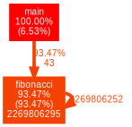
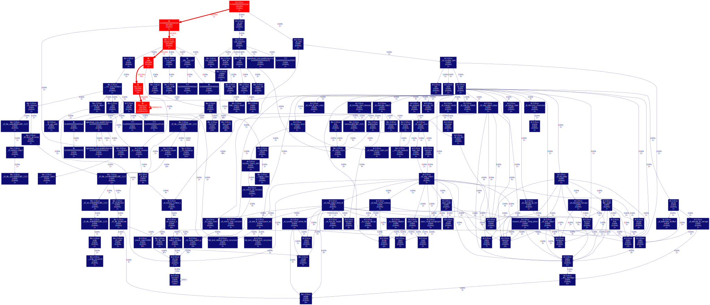
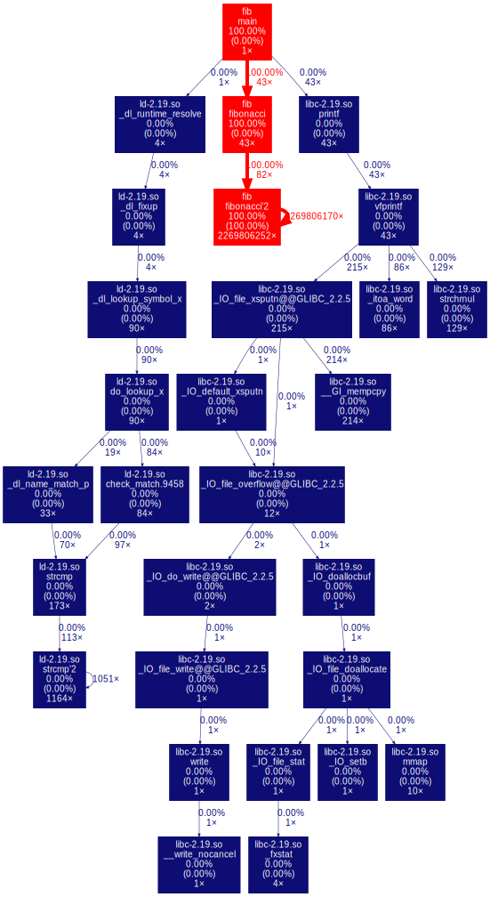

# 動態分析 C 程序函數調用關係

  - Callgrind
  - Gprof
  - Gprof2dot
  - Kcachegrind
  - Valgrind
categories:
  - C
  - 源碼分析
  - Gprof
  - Valgrind
---

## 緣由

源碼分析是程序員離不開的話題。無論是研究開源項目，還是平時做各類移植、開發，都避免不了對源碼的深入解讀。

工欲善其事，必先利其器。

之前已經介紹了[如何通過 Callgraph 靜態分析源代碼][2]，這裡介紹如何分析程序運行時的實際函數執行情況，考慮到應用部分和內核部分有比較大的差異，該篇先介紹應用部分。

主要介紹三款工具，一款是 `gprof`，另外一款是 `valgrind`，再一款則是能夠把前兩款的結果導出為 dot 圖形的工具，叫 `gprof2dot`，它的功能有點類似於我們[上次][2]介紹的 `tree2dotx`。

## 準備

需要事先準備好幾個相關的工具。

  * [gprof2dot][3]: converts the output from many profilers into a dot graph

        $ sudo apt-get install python python-pip
        $ sudo pip install gprof2dot

  * graphviz: dot 格式處理

        $ sudo apt-get install graphviz

  * gprof: display call graph profile data

        $ sudo apt-get install gprof

  * valgrind: a suite of tools for debugging and profiling programs

        $ sudo apt-get install valgrind

工具好了，再來一個典型的 C 程序，保存為：fib.c

    #include <stdio.h>

    int fibonacci(int n);

    int main(int argc, char **argv)
    {
        int fib;
        int n;

        for (n = 0; n <= 42; n++) {
            fib = fibonacci(n);
            printf("fibonnaci(%d) = %dn", n, fib);
        }

        return 0;
    }

    int fibonacci(int n)
    {
        int fib;

        if (n <= 0) {
            fib = 0;
        } else if (n == 1) {
            fib = 1;
        } else {
            fib = fibonacci(n -1) + fibonacci(n - 2);
        }

        return fib;
    }

## gprof

Gprof 用於對某次應用的運行時代碼執行情況進行分析。

它需要對源代碼採用 `-pg` 編譯，然後運行：

    $ gcc -pg -o fib fib.c
    $ ./fib

運行完以後，會生成一份日誌文件：

    $ ls gmon.out
    gmon.out

可以分析之：

    $ gprof -b ./fib | gprof2dot | dot -Tsvg -o fib-gprof.svg

查看 `fib-gprof.svg` 如下：

可以觀察到，這個圖表除了調用關係，還有每個函數的執行次數以及百分比。

## Valgrind s callgrind

Valgrind 是開源的性能分析利器。它不僅可以用來檢查內存洩漏等問題，還可以用來生成函數的調用圖。

Valgrind 不依賴 `-pg` 編譯選項，可以直接編譯運行：

    $ gcc -o fib fib.c
    $ valgrind --tool=callgrind ./fib

然後會看到一份日誌文件：

    $ ls callgrind*
    callgrind.out.22737

然後用 `gprof2dot` 分析：

    $ gprof2dot -f callgrind ./callgrind.out.22737 | dot -Tsvg -o fib-callgrind.svg

查看 `fib-callgrind.svg` 如下：

需要提到的是 Valgrind 提取出了比 gprof 更多的信息，包括 main 函數的父函數。

不過 Valgrind 實際提供了更多的信息，用 `-n0 -e0` 把執行百分比限制去掉，所有執行過的全部展示出來：

    $ gprof2dot -f callgrind -n0 -e0 ./callgrind.out.22737 | dot -Tsvg -o fib-callgrind-all.svg

結果如下：

所有的調用情況都展示出來了。熱點調用分支用紅色標記了出來。因為實際上一個程序運行時背後做了很多其他的事情，比如動態符號鏈接，還有比如 `main` 實際代碼裡頭也調用到 `printf`，雖然佔比很低。

考慮到上述結果太多，不便於分析，如果只想關心某個函數的調用情況，以 `main` 為例，則可以：

    $ gprof2dot -f callgrind -n0 -e0 ./callgrind.out.22737 --root=main | dot -Tsvg -o fib-callgrind-main.svg

需要提到的是，實際上除了 `gprof2dot`，`kcachegrind` 也可以用來展示 `Valgrind's callgrind` 的數據：

    $ sudo apt-get install kcachegrind
    $ kcachegrind ./callgrind.out.22737

通過 `File --> Export Graph` 可以導出調用圖。只不過一個是圖形工具，一個是命令行，而且 `kcachegrind` 不能一次展示所有分支，不過它可以靈活逐個節點查看。

## What&#8217;s more?

上文我們展示了從運行時角度來分析源碼的實際執行路徑，目前只是深入到了函數層次。

結果上跟上次的靜態分析稍微有些差異。

  * 實際運行時，不同分支的調用次數有差異，甚至有些分支可能根本就執行不到。這些數據為我們進行性能優化提供了可以切入的熱點。
  * 實際運行時，我們觀察到除了代碼中有的函數外，還有關於 `main` 的父函數，甚至還有庫函數如 `printf`的內部調用細節，給我們提供了一種途徑去理解程序背後運行的細節。

本文只是介紹到了應用程序部分（實際上是程序運行時的用戶空間），下回我們將分析，當某個應用程序執行時，哪些內核接口（系統調用）被調用到，那些接口的執行情況以及深入到內核空間的函數調用情況。

 [1]: http://tinylab.org
 [2]: /callgraph-draw-the-calltree-of-c-functions/
 [3]: https://github.com/jrfonseca/gprof2dot
 [4]: /wp-content/uploads/2015/04/callgraph/fib-gprof.svg
 [5]: /wp-content/uploads/2015/04/callgraph//fib-callgrind.svg
 [6]: /wp-content/uploads/2015/04/callgraph/fib-callgrind-all.svg
 [7]: /wp-content/uploads/2015/04/callgraph//fib-callgrind-main.svg
