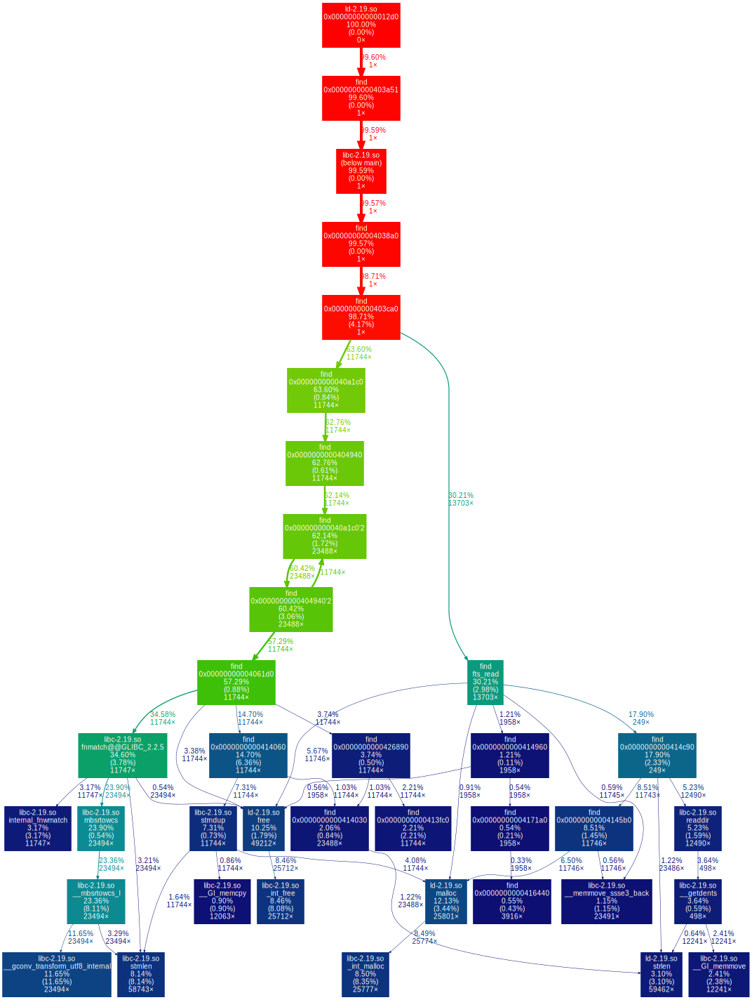

# 動態分析 Linux 內核函數調用關係

  - 函數調用
  - 源碼分析
categories:
  - C
  - 源碼分析 
  - FlameGraph
  - Ftrace
  - Perf
---

## 緣由

源碼分析是程序員離不開的話題。

無論是研究開源項目，還是平時做各類移植、開發，都避免不了對源碼的深入解讀。

工欲善其事，必先利其器。

前兩篇介紹了靜態分析和應用程序部分的動態分析。這裡開始討論如何動態分析 Linux 內核部分。

## 準備工作

### Ftrace

類似於用戶態的 `gprof`，在跟蹤內核函數之前，需要對內核做額外的一些配置，在內核相關函數插入一些代碼，以便獲取必要信息，比如調用時間，調用次數，父函數等。

早期的內核函數跟蹤支持有 KFT，它基於 `-finstrument-functions`，在每個函數的出口、入口插入特定調用以便截獲上面提到的各類信息。早期筆者就曾經維護過 KFT，並且成功移植到了 Loongson/MIPS 平臺，相關郵件記錄見：[kernel function tracing support for linux-mips][2]。不過 Linux 官方社區最終採用的卻是 `Ftrace`，為什麼呢？雖然是類似的思路，但是 `Ftrace` 有重大的創新：

  * Ftrace 只需要在函數入口插入一個外部調用：mcount，而 KFT 在入口和出口都要加
  * Ftrace 巧妙的攔截了函數返回的地址，從而可以在運行時先跳到一個事先準備好的統一出口，記錄各類信息，然後再返回原來的地址
  * Ftrace 在鏈接完成以後，把所有插入點地址都記錄到一張表中，然後默認把所有插入點都替換成為空指令（nop），因此默認情況下 Ftrace 的開銷幾乎是 0
  * Ftrace 可以在運行時根據需要通過 Sysfs 接口使能和使用，即使在沒有第三方工具的情況下也可以方便使用

所以，本文只介紹 `Ftrace`，關於其詳細用法，推薦看 `Ftrace` 作者 Steven 在 [LWN][3] 寫的序列文章，例如：

  * Debugging the kernel using Ftrace: [1][4], [2][5]
  * [Secrets of the Ftrace function tracer][6]
  * [trace-cmd: A front-end for Ftrace][7]

對於本文要介紹的內容，大家只要使能 `Ftrace` 內核配置就可以，我們不會直接使用它的底層接口：

    CONFIG_FUNCTION_TRACER
    CONFIG_DYNAMIC_FTRACE
    CONFIG_FUNCTION_GRAPH_TRACER

除此之外，還需要把內核函數的符號表編譯進去：

    CONFIG_KALLSYMS=y
    CONFIG_KALLSYMS_ALL=y

如果要直接使用 `Ftrace` 的話，可以安裝下述工具，不過本文不做進一步介紹：

    $ sudo apt-get install trace-cmd kernelshark pytimerchart

### Perf

`Perf` 最早是為取代 `Oprofile` 而生，從 2009 年開始只是增加了一個新的系統調用，如今強大到幾乎把 `Oprofile` 逼退歷史舞臺。因為它不僅支持硬件性能計數器，還支持各種軟件計數器，為 Linux 世界提供了一套完美的性能 Profiling 工具，當然，內核底層部分的函數 Profiling 離不開 `Ftrace` 支持。

關於 `Perf` 的詳細用法，可以參考：[Perf Wiki][8]。

Ok，同樣需要使能如下內核配置：

    CONFIG_HAVE_PERF_EVENTS=y
    CONFIG_PERF_EVENTS=y

客戶端安裝：

    $ sudo apt-get install linux-tools-`uname -r`

### FlameGraph

[FlameGraph][9] 是 Profiling 數據展示領域的一大創新，傳統的樹狀結構佔用的視覺面積很大，而且無法精準地找到熱點，而 `FlameGraph` 通過火焰狀的數據展示，採用層疊結構，佔用頁面空間小，可以快速清晰地展示出每條路徑的佔比，而且基於 SVG 可以自由縮放，基於 Javascript 可以動態地展示每個函數的具體樣本和佔比。

Ok，把 `FlameGraph` 準備好：

    $ git clone https://github.com/brendangregg/FlameGraph.git
    $ sudo cp FlameGraph/flamegraph.pl /usr/local/bin/
    $ sudo cp FlameGraph/stackcollapse-perf.pl /usr/local/bin/

在使用 `FlameGraph` 前，我們簡單介紹一個例子以便更好地理解它的獨到之處。

> a;b;c;d 90 e; 10

這個數據有三個信息：

  * 函數調用關係：a 依次調用 b, c, d
  * 調用次數佔比：a 分支 90 次，e 分支 10 次
  * 主要有兩個大的分支：a 和 e

要渲染這個數據，如果用之前的 `dot` 描述語言，相對比較複雜一些，特別是當函數節點特別多的時候，幾乎會沒法查看，但是 `FlameGraph` 處理得很好，把上面的信息保存為 calls.log 並處理如下：

    $ cd FlameGraph
    $ cat calls.log | flamegraph.pl > calls-flame.svg

效果如下：

## 更多準備

日常程序開發時我們基本都只是關心用戶態的情況，在系統級的優化中，則會兼顧系統庫甚至內核部分，因為日常應用運行時的蠻多工作除了應用本身的各類操作外，還有蠻大一部分會訪問到各類系統庫，然後通過庫訪問到各類底層系統調用，進而訪問到 Linux 內核空間。

我們回到上篇文章的例子：`fib.c`，可以通過 `ltrace` 和 `strace` 查看庫函數和系統調用的情況：

    $ ltrace -f -T -ttt -c ./fib 2>&1 > /dev/null
    % time     seconds  usecs/call     calls      function
    ------ ----------- ----------- --------- --------------------
    100.00    0.006063         141        43 printf
    ------ ----------- ----------- --------- --------------------
    100.00    0.006063                    43 total

    $ strace -f -T -ttt -c ./fib 2>&1 > /dev/null
    % time     seconds  usecs/call     calls    errors syscall
    ------ ----------- ----------- --------- --------- ----------------
     22.77    0.000051           6         8           mmap
     15.18    0.000034           9         4           mprotect
     11.61    0.000026           9         3         3 access
      9.82    0.000022          22         1           munmap
      9.38    0.000021          21         1           execve
      8.93    0.000020          10         2           open
      7.14    0.000016           5         3           fstat
      4.46    0.000010           5         2           close
      3.12    0.000007           7         1           read
      3.12    0.000007           7         1           brk
      2.68    0.000006           6         1         1 ioctl
      1.79    0.000004           4         1           arch_prctl
      0.00    0.000000           0         1           write
    ------ ----------- ----------- --------- --------- ----------------
    100.00    0.000224                    29         4 total

上面文章可以看到應用本身的 `fibonnaci()` 佔用了幾乎 `100%` 的時間開銷，但實際上在一個應用程序運行時，庫函數和內核都有開銷。上述 `ltrace` 反應了庫函數的調用情況，`strace` 則反應了系統調用的情況，內核開銷則是通過系統調用觸發的，當然，還有一部分是內核本身調度，正文切換，內存分配等開銷。大概的時間佔比可以通過 `time` 命令查看：

    $ time ./fib 2>&1 > /dev/null
    real        0m5.887s
    user        0m5.881s
    sys         0m0.004s

接下來，咱們切入正題。通過基於 `Ftrace` 的 `Perf` 來綜合看看一個應用程序運行時用戶空間和內核空間兩部分的調用情況並通過 `FlameGraph` 繪製出來。

## 內核函數調用

在使用 `Perf` 之前，除了上述內核配置外，還需要使能一個符號獲取權限，否則結果會是一大堆 16 進制數字，看不到函數符號：

    $ echo 0 > /proc/sys/kernel/kptr_restrict

咱們先分開來看看用戶空間，庫函數和系統調用的情況，以該命令為例：

    find /proc/ -maxdepth 2 -name "vm" 2>&1 >/dev/null

### 用戶空間

    $ valgrind --tool=callgrind find /proc/ -maxdepth 2 -name "vm" 2>&1 >/dev/null
    $ gprof2dot -f callgrind ./callgrind.out.24273 | dot -Tsvg -o find-callgrind.svg

效果如下：

### 庫函數

    $ ltrace -f -ttt -c find /proc/ -maxdepth 2 -name "vm" 2>&1 >/dev/null
    % time     seconds  usecs/call     calls      function
    ------ ----------- ----------- --------- --------------------
     30.75    2.939452          62     47175 strlen
     16.71    1.597174          62     25560 free
     15.38    1.469654          62     23589 memmove
      9.18    0.877211          63     13773 malloc
      8.55    0.817158          65     12542 readdir
      7.65    0.731476          62     11796 fnmatch
      7.56    0.722771          61     11793 __strndup
      1.73    0.165002          83      1966 __fxstatat
      0.41    0.039644          78       503 fchdir
      0.23    0.022348          54       408 memcmp
      0.23    0.022276          89       250 closedir
      0.23    0.021551          86       250 opendir
      0.22    0.021419          85       250 close
      0.22    0.021144          84       251 open
      0.21    0.019795          79       249 __fxstat
      0.21    0.019790       19790         1 qsort
      0.17    0.016417          65       250 dirfd
      0.16    0.015680          98       159 strcmp
      0.16    0.015218          60       252 __errno_location
      0.00    0.000417         417         1 dcgettext
      0.00    0.000404         404         1 setlocale
      0.00    0.000266         133         2 isatty
      0.00    0.000213         106         2 getenv
      0.00    0.000158         158         1 __fprintf_chk
      0.00    0.000158          79         2 fclose
      0.00    0.000135         135         1 uname
      0.00    0.000120         120         1 strtod
      0.00    0.000113          56         2 __fpending
      0.00    0.000110         110         1 bindtextdomain
      0.00    0.000107         107         1 gettimeofday
      0.00    0.000107         107         1 textdomain
      0.00    0.000107         107         1 fileno
      0.00    0.000106         106         1 strchr
      0.00    0.000106         106         1 memcpy
      0.00    0.000105         105         1 __cxa_atexit
      0.00    0.000102          51         2 ferror
      0.00    0.000092          92         1 fflush
      0.00    0.000079          79         1 realloc
      0.00    0.000076          76         1 strspn
      0.00    0.000072          72         1 strtol
      0.00    0.000052          52         1 calloc
      0.00    0.000051          51         1 strrchr
    ------ ----------- ----------- --------- --------------------
    100.00    9.558436                151045 total

### 系統調用

    $ strace -f -ttt -c find /proc/ -maxdepth 2 -name "vm" 2>&1 >/dev/null
    % time     seconds  usecs/call     calls    errors syscall
    ------ ----------- ----------- --------- --------- ----------------
     39.93    0.007072           4      1966           newfstatat
     22.44    0.003974           8       500           getdents
     10.53    0.001865           4       508           close
      8.27    0.001464           3       503           fchdir
      6.09    0.001079           4       261         4 open
      5.72    0.001013           4       250           openat
      4.68    0.000829           3       256           fstat
      0.68    0.000120           9        13           mmap
      0.36    0.000064          11         6           mprotect
      0.33    0.000058          12         5           brk
      0.27    0.000048          16         3           munmap
      0.20    0.000036           9         4         4 access
      0.19    0.000034           9         4           read
      0.11    0.000020           7         3         2 ioctl
      0.07    0.000012          12         1           write
      0.05    0.000009           9         1           execve
      0.03    0.000006           6         1           uname
      0.03    0.000006           6         1           arch_prctl
    ------ ----------- ----------- --------- --------- ----------------
    100.00    0.017709                  4286        10 total

接下來，通過 `perf` 來看看內核部分：

### 內核空間

    $ perf record -g find /proc -maxdepth 2 -name "vm" 2>&1 >/dev/null
    $ perf report -g --stdio
    $ perf script | stackcollapse-perf.pl > find.perf-outfolded
    $ flamegraph.pl find.perf-outfolded > find-flame.svg

上述幾條命令大體意思如下：

  * `perf record -g` 記錄後面跟著命令當次執行時的函數調用關係
  * `perf report -g --stdio` 在控制檯打印出獲取到的函數關係數據（輸出結果有點類似於樹狀圖）
  * `perf script | stackcollapse-perf.pl > find.perf-outfolded` 轉換為 FlameGraph 支持的格式
  * `flamegraph.pl find.perf-outfolded > find-flame.svg` 生成火焰圖

效果如下： 

## 小結

通過上述過程，咱們演示瞭如何分析一個應用程序執行時的內核空間部分函數調用情況，進而對前面兩篇文章進行了較好的補充。

整個序列到目前為止主要都是函數調用關係的分析。對於源碼的分析也好，對於性能的優化也好，都是完全不夠的：

  * 一方面，這個只能輔助理解到函數級別，無法理解到代碼級別。要做進一步，得 `gcov` 和 `kgcov` 的支持。
  * 如果要做性能分析，除了函數調用關係跟蹤熱點區域外，其實還缺少一些信息，比如整個調用時序，當前的處理器頻率，內核調度情況等，並不能在這個序列體現。

接下來，針對該源碼分析系列，我們會再補充三篇文章：

  * 函數調用關係（流程圖）繪圖方法介紹，將在現有的基礎上再介紹幾種新方法並分析優點和缺點。
  * 代碼級別的源碼分析，通過 `gcov` 和 `kgcov` 進行分析。

除此之外，我們會新開另外一個性能優化系列，來介紹各種性能優化的實例，包括應用程序與內核兩個方面。

## 倡議

最後，筆者想對那些開源工具的開發者和貢獻者們致敬！

Linux 領域聚攏了太多的天才，創意如泉湧般不斷滋潤 IT 世界，本文用到的三大工具的原創作者都是這類天才的代表，敬仰之情無以言表。

跟 Steven 有過一面之緣，而且在筆者 2009 年往官方社區提交 [Ftrace For MIPS][13] 時，他提供了諸多指導和幫助，感激之情化作無限專研的動力。

在這裡，誠邀更多的一線工程師們匯聚到[泰曉科技][1]，一起協作，分享學習的心得，交流研發的經驗，協同開發開源工具，一起致力於促進業界的交流與繁榮。目前已經有 15 個一線工程師參與進來，我們一同通過 `worktile` 協作，一起探討，一起創作。如果樂意加入，可通過[聯繫我們][14]獲得邀請。

 [1]: http://tinylab.org
 [2]: http://www.linux-mips.org/archives/linux-mips/2009-04/msg00244.html
 [3]: http://lwn.net
 [4]: https://lwn.net/Articles/365835/
 [5]: https://lwn.net/Articles/366796/
 [6]: https://lwn.net/Articles/370423/
 [7]: https://lwn.net/Articles/410200/
 [8]: https://perf.wiki.kernel.org/index.php/Tutorial
 [9]: http://www.brendangregg.com/FlameGraphs/cpuflamegraphs.html
 [10]: /wp-content/uploads/2015/04/callgraph/calls-flame.svg
 [11]: /wp-content/uploads/2015/04/callgraph/find-callgrind.svg
 [12]: /wp-content/uploads/2015/04/callgraph/find-flame.svg
 [13]: http://lwn.net/Articles/361128/
 [14]: /about/#Join_TinyLab

