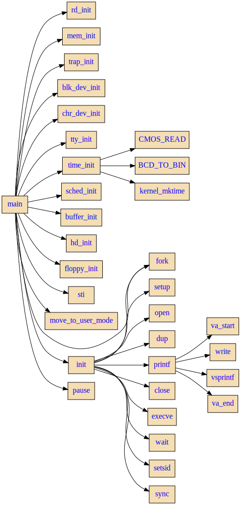
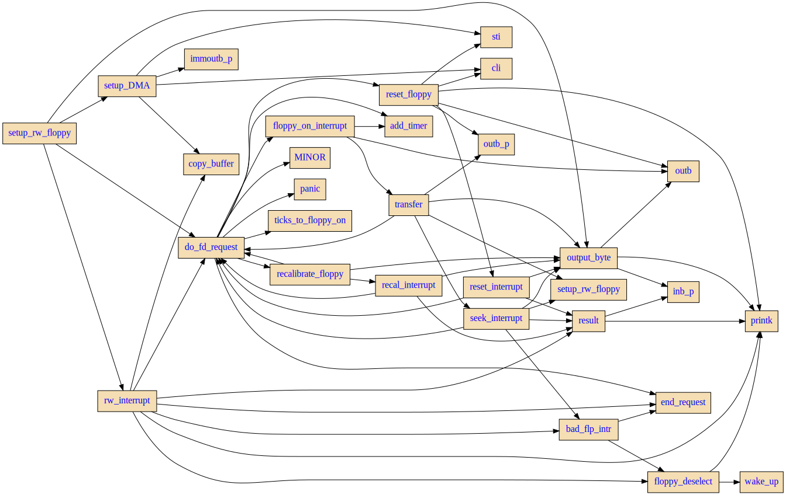
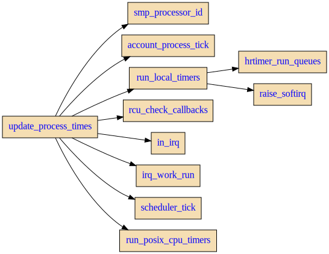

# 靜態分析 C 程序函數調用關係圖

  - Callgraph
  - dot
  - graphviz
  - Linux
  - Linux 0.11
  - tree2dotx
categories:
  - C
  - 源碼分析
---

## 故事緣由

源碼分析是程序員離不開的話題。無論是研究開源項目，還是平時做各類移植、開發，都避免不了對源碼的深入解讀。

工欲善其事，必先利其器。今天我們來玩轉一個小工具，叫 Callgraph，它可以把 C 語言的函數調用樹（或者說流程圖）畫出來。

傳統的命令行工具 Cscope, Ctags 可以結合 vim 等工具提供高效快捷的跳轉，但是無法清晰的展示函數內部的邏輯關係。

至於圖形化的IDE，如 QtCreator, Source Insight, Eclipse, Android Studio 等，卻顯得笨重，而且不一定支持導出調用關係圖。

在[開源軟件在線代碼交叉檢索][2] 一文中我們也介紹到了諸如 LXR, OpenGrok 之類的工具，它們避免了本地代碼庫而且提供了方便的 Web 展示，不過也無法提供函數關係的清晰展示。

下面開始 Callgraph 之旅。

## 安裝 Callgraph

Callgraph 實際由三個工具組合而成。

  * 一個是用於生成 C 函數調用樹的 cflow 或者 calltree，下文主要介紹 cflow。
  * 一個處理 dot 文本圖形語言的工具，由 graphviz 提升。建議初步瞭解下：[DOT 語言][3]。
  * 一個用於把 C 函數調用樹轉換為 dot 格式的腳本：tree2dotx

以 Ubuntu 為例，分別安裝它們：

    $ sudo apt-get install cflow graphviz

如果確實要用 calltree，請通過如下方式下載。不過 calltree 已經年久失修了，建議不用。

    $ wget -c https://github.com/tinyclub/linux-0.11-lab/raw/master/tools/calltree

接下來安裝 tree2dotx 和 Callgraph，這裡都默認安裝到 `/usr/local/bin`。

    $ wget -c https://github.com/tinyclub/linux-0.11-lab/raw/master/tools/tree2dotx
    $ wget -c https://github.com/tinyclub/linux-0.11-lab/raw/master/tools/callgraph
    $ sudo cp tree2dotx callgraph /usr/local/bin
    $ sudo chmod +x /usr/local/bin/{tree2dotx,callgraph}

**注**：部分同學反饋，`tree2dotx`輸出結果有異常，經過分析，發現用了 `mawk`，所以請提交安裝下`gawk`：

    $ sudo apt-get install gawk

## 分析 Linux 0.11

### 準備

先下載泰曉科技提供的五分鐘 Linux 0.11 實驗環境：[Linux-0.11-Lab][4]。

    $ git clone https://github.com/tinyclub/linux-0.11-lab.git && cd linux-0.11-lab

### 初玩

回到之前在 [Linux-0.11-Lab][4] 展示的一副圖：

它展示了 Linux 0.11 的主函數 main 的調用層次關係，清晰的展示了內核的基本架構。那這樣一副圖是如何生成的呢？非常簡單：

    $ make cg f=main
    Func: main
    Match: 3
    File:
         1    ./init/main.c: * main() use the stack at all after fork(). Thus, no function
         2    ./init/main.c: * won't be any messing with the stack from main(), but we define
         3    ./init/main.c:void main(void)        /* This really IS void, no error here. */
    Select: 1 ~ 3 ? 3
    File: ./init/main.c
    Target: ./init/main.c: main -> callgraph/main.__init_main_c.svg

需要注意的是，上面提供了三個選項用於選擇需要展示的圖片，原因是這個 callgraph 目前的函數識別能力還不夠智能，可以看出 3 就是我們需要的函數，所以，上面選擇序號 3。

生成的函數調用關係圖默認保存為 callgraph/main._\_init\_main_c.svg。

圖片導出後，默認會調用 chromium-browser 展示圖片，如果不存在該瀏覽器，可以指定其他圖片瀏覽工具，例如：

    $ make cg b=firefox

上面的 `make cg` 實際調用 `callgraph`：

    $ callgraph -f main -b firefox

### 玩轉它

類似 `main` 函數，實際也可渲染其他函數，例如：

    $ callgraph -f setup_rw_floppy
    Func: setup_rw_floppy
    File: ./kernel/blk_drv/floppy.c
    Target: ./kernel/blk_drv/floppy.c: setup_rw_floppy -> callgraph/setup_rw_floppy.__kernel_blk_drv_floppy_c.svg

因為只匹配到一個 `setup_rw_floppy`，無需選擇，直接就畫出了函數調用關係圖，而且函數名自動包含了函數所在文件的路徑信息。

  * 模糊匹配

    例如，如果只記得函數名的一部分，比如 `setup`，則可以：

        $ callgraph -f setup
        Func: setup
        Match: 4
        File:
             1    ./kernel/blk_drv/floppy.c:static void setup_DMA(void)
             2    ./kernel/blk_drv/floppy.c:inline void setup_rw_floppy(void)
             3    ./kernel/blk_drv/hd.c:int sys_setup(void * BIOS)
             4    ./include/linux/sys.h:extern int sys_setup();
        Select: 1 ~ 4 ?

    因為 `setup_rw_floppy` 函數是第 2 個被匹配到的，選擇 2 就可以得到相同的結果。

  * 指定函數所在文件（或者文件所在的目錄）

        $ callgraph -f setup -d ./kernel/blk_drv/hd.c

    類似的， `make cg` 可以這麼用：

        $ make cg f=setup d=./kernel/blk_drv/hd.c

    看看效果：
    

## 分析新版 Linux

### 初玩

先來一份新版的 Linux，如果手頭沒有，就到 www.kernel.org 搞一份吧：

    $ wget -c https://www.kernel.org/pub/linux/kernel/v3.x/linux-3.10.73.tar.xz
    $ tar Jxf linux-3.10.73.tar.xz && cd linux-3.10.73

玩起來：

    $ callgraph -f start_kernel -d init/main.c

### 酷玩

  * 砍掉不感興趣的函數分支

    上面生成的圖，有沒有覺得 `printk` 之類的調用太多，覺得很繁瑣。沒關係，用 `-F` 砍掉。

        $ callgraph -f start_kernel -d init/main.c -F printk

    如果要砍掉很多函數，則可以指定一個函數列表：

        $ callgraph -f start_kernel -d init/main.c -F "printk boot_cpu_init rest_init"

  * 指定函數調用深度：

    用 `-D` 命令可以指定：

        $ callgraph -f start_kernel -d init/main.c -F "printk boot_cpu_init rest_init" -D 2

  * 指定函數搜索路徑

    我們來看看 `update_process_times` 的定義，用 `-d` 指定搜索路徑：

        $ callgraph -f update_process_times -d kernel/

    它會自動搜索 `kernel/` 目錄並生成一副圖，效果如下：

    考慮到 `callgraph` 本身的檢索效率比較低（採用grep），如果不能明確函數所在的目錄，則可以先用 `cscope` 之類的建立索引，先通過這些索引快速找到函數所在的文件，然後用 `-d` 指定文件。

    例如，假設我們通過 `cs find g update_process_times` 找到該函數在 `kernel/timer.c` 中定義，則可以：

        $ callgraph -f update_process_times -d kernel/timer.c

## 原理分析

`callgraph` 實際上只是靈活組裝了三個工具，一個是 cflow，一個是 tree2dotx，另外一個是 dot。

### cflow：拿到函數調用關係

    $ cflow -b -m start_kernel init/main.c > start_kernel.txt

### tree2dotx: 把函數調用樹轉換成 dot 格式

    $ cat start_kernel.txt | tree2dotx > start_kernel.dot

### 用 dot 工具生成可以渲染的圖片格式

這裡僅以 svg 格式為例：

    $ cat start_kernel.dot | dot -Tsvg -o start_kernel.svg

實際上 dot 支持非常多的圖片格式，請參考它的手冊：`man dot`。

## 趣玩 tree2dotx

關於 `tree2dotx`，需要多說幾句，它最早是筆者 2007 年左右所寫，當時就是為了直接用圖文展示樹狀信息。該工具其實支持任意類似如下結構的樹狀圖：

    a
      b
      c
        d
        x
          y
      e
      f

所以，我們也可以把某個目錄結構展示出來，以 Linux 0.11 為例：

    $ cd linux-0.11
    $ tree -L 2 | tree2dotx | dot -Tsvg -o tree.svg

如果覺得一張圖顯示的內容太多，則可以指定某個當前正在研讀的內核目錄，例如 `kernel` 部分：

    $ tree -L 2 kernel | tree2dotx -f Makefile | dot -Tsvg -o tree.svg

看下效果：

## What&#8217;s more?

上文展示瞭如何把源碼的調用關係用圖文的方式渲染出來。好處顯而易見：

  * 不僅可以清晰的理解源碼結構，從而避免直接陷入細節，進而提高源碼分析的效率。
  * 也可以基於這個結果構建流程圖，然後用 `inkscape` 之類的工具做自己的調整和擴充，方便做後續展示。
  * 還可以把這些圖文用到文檔甚至書籍中，以增加可讀性。

`Callgraph` 的圖文展示基於 `cflow` 或者 `calltree`，它們都只是靜態源碼分析的範疇。

後續我們將從從運行時角度來動態分析源碼的實際執行路徑。我們計劃分開展示應用部分和內核部分。

 [1]: http://tinylab.org
 [2]: /online-cross-references-of-open-source-code-softwares/
 [3]: http://zh.wikipedia.org/wiki/DOT%E8%AF%AD%E8%A8%80
 [4]: /linux-0-11-lab/
 [5]: /wp-content/uploads/2015/04/callgraph/linux-0.11-main.svg
 [6]: /wp-content/uploads/2015/04/callgraph/linux-0.11-setup_rw_floppy.svg
 [7]: /wp-content/uploads/2015/04/callgraph/linux-update_process_times.svg
 [8]: /wp-content/uploads/2015/04/callgraph/linux-0.11-kernel-tree.svg
