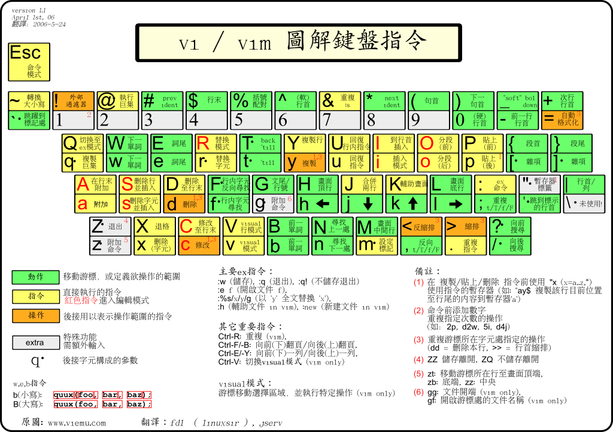

# HOWTO - vi, vim


##Introduction


Vim 是從 vi 發展出來的 `純文字編輯器`。vi 是功能很陽春的的純文字編輯器，而 vim 就像是 vi 的加強版，和程式設計相關的功能特別豐富，被廣大的程式設計師們使用。vim 和 Emacs 並列成為 Unix-like system 使用者最喜歡的編輯器。
vim 很大的特色是他的學習曲線非常陡，初學者來說 vim 的使用習慣是非常詭異難懂並難以掌握的，但是一旦熟悉一些基本操作之後，vim 能大幅度提高編輯效率。就像在 windows 環境中使用 記事本或是 Code::Blocks 一般，對於編輯的操作，都是靠滑鼠點擊、移動、選取等，vim 的思維就是把這些編輯功能設計成鍵盤上的按鍵組合，如果熟悉了這些按鍵，會大量減少使用滑鼠 (和手移動到滑鼠的時間)。
一開始學習 vi/vim 並不需要記下太多的操作指令，只求夠用就好，而慢慢學習 vim 的過程中，自然而然會學習到更多的進階功能，最重要的是邊做邊學，只有一邊操作一般學習才能真正的學好 vim
很多前輩都說過：直到用過了 vim，才知道什麼叫作真正的編輯器

更多有趣的介紹可以參考 c9s 前輩的 [vim hacks ](http://www.slideshare.net/c9s/vim-hacks)投影片


vi 是 Bill Joy 開發的可視化(visual)編輯器，源於更古老的 ex 編輯器的 visual 模式

##vi mode

vi 有三個 mode，command mode 與 insert mode，和 line mode (ex mode)。
vi 的 mode 有點像是開車一樣，切換排檔的概念，不同 mode 底下能完成不同的事
比較常用的會是 command mode 和 insert mode，分別能輸入指令和直接輸入文字，Line mode 則是指用 ex 指令
直接進入 vi 會先進到 command mode 底下，mode 之間透過 ESC 回到 command mode


vi 已成為 UNIX 底下必備的標準編輯器，幾乎所有的 UNIX 都可以找到 vi 或是其衍生產品 (Gentoo Linux 預設只有 nano 編輯器是個例外)
##insert mode
由 command mode 進入 insert mode 有六個常用的按鍵： `i I a A o O`
```
i     Insert text before the cursor

I     Insert text Before the first non-blank in the line

a     Append text after the cursor

A     Append text at the end of the line

o     Begin a new line below the cursor and insert text

O     Begin a new line above the cursor and insert text (並把文字往下推一行)
```
PS. 結束 insert mode 可以用 ESC 來回到 command mode  ，接下來可以繼續執行移動，刪除，複製，搜尋等編輯指令。


##command mode
vi 的移動一般用鍵盤上的方向鍵就可以，但是學習透過指令移動可以達到非常高效率的編輯速度


```
         ^
         k              提示︰ h 的鍵位於左邊，每次按下就會向左移動。
   < h       l >              l 的鍵位於右邊，每次按下就會向右移動。
         j                    j 鍵看起來很象一支尖端方向朝下的箭頭。
         v
```

## 常見移動指令

```
# 註 : C-f 表示先按著 Ctrl 鍵不放，接著再按下 f

0     移至行首
^     移至行首第一個非空白處
$     移至行尾
w     向前一個 word
e     向前一個 word (的結尾)
b     向後一個 word
gg    檔案開頭
G     檔案結尾
:n    移動到 line n                 # nG 也可以
C-f   Page Down (C for Ctrl)       # 記法 =>  Forward
C-b   Page Up                      # 記法 =>  Backward
C-u   half Page Up                 # 記法 =>    Upward
C-d   half Page Down               # 記法 =>  Downward
```

```
%     相匹配的括號 () {} [] 等
```

## 刪除指令
```
x    Delete characters under and after the cursor   # 就是 delete
X    Delete characters before the cursor            # 就是 Backspace
dd   delete one line
dw   delete 到遊標所在的 word 結尾
d0   delete 到 0 (行首)
d$   delete 到 $ (行尾)                               # 大寫 D 也是一樣的功能
```

## 修改指令

(change => delete and insert)

```
cw    change a word
cc    change a line
C     change to the end of the line
J     串接相鄰行
u     復原                                  # 記法 => undo
C-r   Redo changes which were undone
:e    完全改爛了的時候，重新讀取檔案              # 記法 => edit
.     (一個點) 重複上一個步驟
```

##複製貼上

vi 的複製是 y (yank), 貼上是 p (put)，所以 vi 裡面複製貼上會說 yank and put
最常見的用法：
```
yy 將遊標所在行 yank 起來 => 然後將遊標移至所要貼的行之處按 p ( P 則會出現在遊標之上 )
```

##"指令 + 數字"
在指令模式中，你可以在任何前面提到的動作前面加上數字 n，則你所做的動做將會被重覆n次，

```
如要刪除十行可以按 10dd ，要複製十行可以用 10yy，

要將同樣的文字重覆寫十次可以用 10i  (離開 insert mode 之後，剩下的九次會自動重複)
```

## 檔案操作

```
vi filename     打開 filename 這個檔案，如果缺省 filename 的話會開一個新的檔案

:q              quit vi

:wq             write and quit

:x              類似 :wq 不過只有檔案有更動時才會寫入

:q!             force to quit

:n,mw filename  將 n 到 m 行寫到 filename 裡面
```


## 搜尋

```
/string         向下尋找 string
?string         向上尋找 string

n               找下一個 string 的位置           # 記法 => next
N               找上一個 string 的位置
*               Search  forward for the word nearest to the cursor.
#               Search backward for the word nearest to the cursor.
```

## ex mode

vi 在 command mode 下輸入 : （冒號） 可以開啟 ex mode
常見的用法：
```
:n,m d                       ：刪除自第 n 行至第 m 行的文字
:n,m w                       ：刪除自第 n 行至第 m 行的文字

:n,m s/patern1/patern2/[g][c]   ：將自第 n 行至第 m 行的文字中，把 patern1 substitute 成 patern2
# g flag 是指要不要全部都換
# c flag 是在替換前可以確認
```

## 編碼設定

vi 對編碼的支援比較不完善，可以透過 locale 或是 screen 來調整
請參考: [Setting - 工作站編碼設定(UTF-8)](http://help.cs.nctu.edu.tw/help/index.php/Setting_-_%E5%B7%A5%E4%BD%9C%E7%AB%99%E7%B7%A8%E7%A2%BC%E8%A8%AD%E5%AE%9A(UTF-8))


## vim

[vim](http://www.vim.org/) - Vi IMproved,` a programmers text editor  `是由 Bram Moolenaar 所開發，當年他買了一臺新機器，上面卻剛好沒有他愛用的 vi editor，於是，Moolenaar 只好自己在這臺機器上面實作一個與 vi 相似的編輯器

vim 承襲了 vi 的特性，並加入了許多強大的功能，vim 的設定檔 vimrc 具有高度拓展性，可以自由調整自己的使用習慣，使得 vim 在 UNIX 界受到眾多 hackers 的喜愛
[vim script ](http://www.vim.org/scripts/index.php)讓大家可以自由的替 vim 開發 plugins ，完成更強大的功能

其實 vim 最基本的功能上面 vi 的介紹已經提過了，這邊補充一下 vim 裡面更多好用的功能

vim 有內建精美的一份 user manual，裡面非常詳細的說明 Vim 各種神奇功能，使用 :h {主題} 來閱讀，例如，:h motion.txt 可以看跟移動相關的介紹，可以透過 tab 切換

## 移動

參考 :h motion.txt

```
# 移動遊標到螢幕某處
H    To Home (top) line
M    To Middle line
L    To Last line


# 移動遊標到某個字元
find / to + {char}
f    向右找到 {char} 在本行的位置然後把遊標移過去
t    跟 f 一樣，但是是移動到 {char} 的前一格
F    向左找
T    向左找


# 移動到某個句子或段落
{    向前一個段落
}    向後一個段落
(    向前一個句子
)    向後一個句子


# 捲動螢幕到某處
zt   把現在的這行捲到螢幕的最上方  # 記法 =>  top
zz   把現在的這行捲到螢幕的中央
zb   把現在的這行捲到螢幕的底部    # 記法 =>  bottom
C-y  往上捲一行
C-e  往下捲一行                # 記法 =>  extra lines

```

##對於遊標上的字元或是該行操作

參考 :h change.txt


```
r{char}     把遊標上的字元替換成替換 {char}      # 記法 => Replace the character

# 重複操作就是改變整行
~           改變大小寫
g~~         改變整行的大小寫


gU          uppercase
gUU         整行 uppercase


gu          lowercase
guu         整行 lowercase


g?          作 ROT13 encode
g??         整行 ROT13


C-a         將目前遊標上的數字加 1               # 記法 => add
C-x         將目前遊標上的數字減 1               # 記法 => x 掉就是減少


>>          縮排                             # 記法 => 往內推一層縮排
<<          反縮排                           # 記法 => 往外推一層縮排
```

## Visual Mode

如果你想對某段文字做一些操作 (像是 delete, yank...等) ，那麼你要先選取一段文字。
visual mode 就是選取一段文字，接著可以對選取的文字操作


```
v          進入 visual mode
V          行模式的   visual mode
C-v        區塊模式的 visual mode
C-v I      選取某個區塊，然後對於每行選取的位置插入文字
```


## Split Window
參考 :h windows.txt
vim split 是 vim 其中一項非常強大的殺手級功能，能讓 programmer 同時編輯、對照多個檔案 （以下用 ^ 代表 Ctrl 按鍵）

###開啟分割視窗編輯檔案
```
:sp[lit] filename                split 水平分割
:vs[plit] filename              vsplit 垂直分割
```

### 開啟空 split window
```
:new (^wn)                      跟 sp 和 vs 一樣，只是是開空的 buffer
:vnew
```

## 移動遊標到某視窗

```
# hint: 跟 vim 的遊標移動一樣
^w[jkhl]           下上左右

^wp                往返切換
^ww                循環切換


# 更快的移動
^wt (or ^w^t 也可)     Move cursor to top-left window.
^wb (or ^w^b)         Move cursor to bottom-right window.
^w[JKHL]              Move the current window to be at the very bottom/top/left/right window


^wr / ^wR             將左右(或上下) 視窗對調           # Rotate windows
```

## 調整視窗大小

```
^w>   ^w<      邊界往右往左移             # 也可以搭配數字，像是 ^w3>  代表邊界向右邊移動 3 格
^w+   ^w-      邊界上下移動
^w_   ^w|      放大視窗至底部/最右邊
^w=            復原到原本的一半大小


# 也可以用 resize 來完成
:res[ize] +/-N
:vertical res[ize] [N]

# 打開滑鼠模式可以直接用滑鼠調整大小
:set mouse=a
```

###Tab

參考 :h tabpage.txt

tab 是另一個在 vim 裡面編輯多個檔案的方法，跟 split window 的差別在於 tab 是全螢幕的編輯區，不會把 code 都擠在一起

###tab 多檔案編輯
```
# vim 的 -p 選項可以把參數的檔案分別開啟一個 tab

vim -p file1 file2 file3          file1 file2 file3 分別開啟三個分頁
vim -p *                          目錄底下所有檔案都用 tab 開啟
```

##常用 tab 指令

```
:tabnew [filename]                tabnew 或是 tabe[dit] 都是打開一個新的 tab 開始編輯
:tabe   [filename]

:tabc                             close a tab


# 切換 tab (通常用　gt 跟 gT 比較快，記憶 => goto tab)
:tabn                             next tab
gt

:tabp                             previous tab
:tabN
gT

:tabr                            (tabrewind) 到  第一個 tab
:tabl                            (tablast)   到最後一個 tab

:tabs                            現在開啟的 tab 列表
```

## text object

參考 :h text-object
text object 是 vim 裡面一個特殊的概念，用來說明一項操作的作用對象
```
"a" 代表 an    object
"i" 代表 inner object
```
簡單來說

```
aw  =>     a word
iw  => inner word
as  =>     a sentence
is  => inner sentence
ap  =>     a paragraph
ip  => inner paragraph
ab  =>     a () block
ib  => inner () block
aB  =>     a {} block
iB  => inner {} block
```

用 delete 為例

```
"dl"    delete character (alias: "x")
"diw"   delete inner word
"daw"   delete a word
"dd"    delete one line
"dis"   delete inner sentence
"das"   delete a sentence
"dib"   delete inner '(' ')' block
"dab"   delete a '(' ')' block
"dip"   delete inner paragraph
"dap"   delete a paragraph
"diB"   delete inner '{' '}' block
"daB"   delete a '{' '}' block
```

## Folding

參考 :h fold.txt
Folding (代碼折疊) 是很多 IDE 俱備的功能，當 code 體積變得很龐雜時，folding 把一段程式、一段函數等實現細節折疊起來可以方便瀏覽整體並把握程式的邏輯
vim folding 指令都是由 z 開頭，簡單的記憶法是 zip the code


##folding method
vim 有六種 folding 模式，可以依照不同的情形使用
```
manual          manually define folds
indent          more indent means a higher fold level
expr            specify an expression to define folds
syntax          folds defined by syntax highlighting
diff            folds for unchanged text
marker          folds defined by markers in the text
```

## folding command
```
zA                 open a closed fold or close an open fold recursively
zC                 close folds recursively
zD                 delete folds recursively
zE                 eliminate all folds
zF                 create a fold for N lines
zO                 open folds recursively
za                 open a closed fold, close an open fold
zc                 close a fold
zd                 delete a fold
zf{motion}         create a fold for Nmove text
zj                 move to the start of the next fold
zk                 move to the end of the previous fold
```

## 舉例說明
最常用的是 zf + {motion} ，像是 zf2j 可以向下折疊兩行 (zip folding 2 j)
```
normal mode 下 :N, M fold ，N M 是行數，把  N, M 行之間的 code 折起來

{Visual}zf 也就是用 visual 模式下選取要 folding 的區域，然後再用 zf 幫你折起來

搭配 vim 的 text object，像是 zfa} 或是 zfa{ 可以向下或向上折疊一段落

搭配 searching，zf/pattern 就是折疊到第一個你找到的 pattern


zo / zc 則是拿來 open/close folding 的

zO / zC 可以 打開/關閉 底下的子 folding

za / zA 可以把 folding 當成電燈開關一樣，打開 folded 的區塊， fold 被打開的區塊

zr / zm 是將 fold level 開啟和關閉一層

zR / zM 是對所有的 fold level 作，也就是打開 / 關閉整個檔案裡所以的 folding


在被 folded 的 code 間移動有很快的作法， zj / zk ，如同你所想的，移動到 上 / 下個 folded 的 code


zd delete 掉遊標所在的 folding

zE delete 所有的 folding
```

PS. vim 在處理被 folding 起來的區塊時，會把他當成像是一行文一樣，也就是說，可以對他做一行的操作，像是 dd 和 yy 等

## Auto Completion
vim 支持多數 IDE 的自動補完功能，方便寫程式時少打一些字
不過預設只有基本的單字補全，可以透過 plugins 來支持更強大的補全功能或是 vimrc 設定來調整

```
# 在 insert mode
Ctrl+n Ctrl+p             補完字
Ctrl+x Ctrl+l             補完整行
```
## vimrc

vimrc 是 vim 最重要的一份設定檔，在 vim 開起時會載入，通常位於使用者家目錄底下的 ~/.vimrc
自訂自己喜歡的 vimrc 可以調整各種偏好設定，讓對於 vim 的使用更加順手
以下列出幾份參考資源

[open vimrc file ](http://vim.wikia.com/wiki/Open_vimrc_file)vim 官方 wiki 文件的 vimrc 說明

[The Ultimate vimrc ](https://github.com/amix/vimrc)地表上最強的 vimrc

[vgod's vimrc ](https://github.com/vgod/vimrc)強者 vgod 使用的 vim


##幾個簡單的設定
###statusline
目前檔案的狀態列，參考 :h 'statusline'

```
# in vimrc
set laststatus=2
set statusline=\ %F%m%r%h%w%=[%l,%3v]\ --%p%%--\ \
hi  statusline ctermbg=darkblue
```

### cursorline
highlight the screen line of the cursor with CursorLine

```
# in vimrc
set cursorline
hi CursorLine term=none cterm=none ctermbg=none ctermbg=none
au InsertEnter * hi CursorLine term=none cterm=underline
au InsertLeave * hi CursorLine term=none cterm=none ctermbg=none
```

##替換 tab
愈來愈多 programmer 建議用四格空白替換 [tab] 字元
```
# in vimrc
set expandtab
set tabstop=4
set shiftwidth=4
```
##search
高亮搜尋結果跟忽略大小寫搜尋
```
# in vimrc
set hlsearch
set ignorecase
set incsearch
```
##匹配項目
make < and > as a pair, useful in C++
```
# in vimrc
set matchpairs+=<:>
```

##indent
方便寫程式的自動縮排
```
# in vimrc
set autoindent
set smartindent
filetype plugin indent on
```
##Misc

vim 的小技巧很多，官方有 [Vim tips wiki ](http://vim.wikia.com/wiki/Vim_Tips_Wiki)收錄各式各樣的小 tips


以下列舉幾個好用的小技巧
```
ga                                       # 察看目前遊標所在處的 ascii code 資訊

==                                       # 對於單行的自動排版 (也可以先用 virtual mode 選起來後在按 ==)

gg=G                                     # 全文重新排版

line mode tab / ctrl-D complete          # 在 : 要打指令時可以用 tab 補完，C-D 可以列出所有可補完的選項


:!command                                # 透過 ! 暫時回到 shell 輸入指令


:colo [tab]                              # 更改配色主題 (colorscheme)  # 多按幾次 tab 可以替換選擇


:set paste                               # 如果有打開 autoindent 的話可以暫時關掉，避免貼上 code 時排版亂掉

vim scp://user@host/path                 # Editing remote files via scp

:e {dir}                                 # 檔案瀏覽器打開 dir 資料夾

:Sex {dir}                               # Sexplore (Split & Explore)

:Vex {dir}                               # Vexplore (VSplit & Explore)   (這個比較方便)

:syntax on                               # 語法上色
```

##encoding
提供簡單的 vimrc 設定，自動從 LANG 環境變數判斷應該用的編碼方式

```
if has("multi_byte")
    "set bomb
    set fileencodings=ucs-bom,utf-8,cp936,big5,euc-jp,euc-kr,latin1

    " CJK environment detection and corresponding setting
    if v:lang =~ "^zh_CN"
    " Use cp936 to support GBK, euc-cn == gb2312
        set encoding=cp936
        set termencoding=cp936
        set fileencoding=cp936
    elseif v:lang =~ "^zh_TW"
        " cp950, big5 or euc-tw
        " Are they equal to each other?
        set encoding=big5
        set termencoding=big5
        set fileencoding=big5
    elseif v:lang =~ "^ko"
        " Copied from someone's dotfile, untested
        set encoding=euc-kr
        set termencoding=euc-kr
        set fileencoding=euc-kr
    elseif v:lang =~ "^ja_JP"
        " Copied from someone's dotfile, untested
        set encoding=euc-jp
        set termencoding=euc-jp
        set fileencoding=euc-jp
    endif

    " Detect UTF-8 locale, and replace CJK setting if needed
    if v:lang =~ "utf8$" || v:lang =~ "UTF-8$"
        set encoding=utf-8
        set termencoding=utf-8
        set fileencoding=utf-8
    endif
else
    echoerr "Sorry, this version of (g)vim was not compiled with multi_byte"
endif
```

##fun
這邊有幾個和 vim 相關的經典趣味圖和笑話

```
http://i.imgur.com/h7H4k.png
http://i.imgur.com/6zG2r.jpg
http://i.imgur.com/SXl5R.jpg
http://i.imgur.com/9alme.png
http://i.imgur.com/3zXqY.png
http://www.gnu.org/fun/jokes/vim-songs.html
http://xkcd.com/378/
http://of-vim-and-vigor.blogspot.tw/p/vim-vigor-comic.html
```

###Reference

提供以下資源，看完(並實際動手練習)可以學會更多的 vim 操作


###Links
<pre><a rel="nofollow" class="external text" href="http://yannesposito.com/Scratch/en/blog/Learn-Vim-Progressively/">Learn Vim Progressively</a> 一份很好的 vim 入門教學

<a rel="nofollow" class="external text" href="http://cle.linux.org.tw/~edt1023/vim/index.html">大家來學 Vim</a> 一個歷久彌新的編輯器

<a rel="nofollow" class="external text" href="http://www.oualline.com/vim-cook.html">Vim Cookbook</a> by Steve Oualline

<a rel="nofollow" class="external text" href="http://vim.runpaint.org/vim-recipes.pdf">Vim Recipes</a>

<a rel="nofollow" class="external text" href="https://www.google.com/">全世界最大的 vim 學習資源</a>
</pre>


對於有時間的人，可以去翻翻去看官方的精美 vim 教學
<pre><a rel="nofollow" class="external text" href="ftp://ftp.vim.org/pub/vim/doc/book/vimbook-OPL.pdf">vim book, the tutorial</a>

<a rel="nofollow" class="external text" href="http://vimcdoc.sourceforge.net/">Chinese vim documentation 計劃</a>

<a rel="nofollow" class="external text" href="http://vim.wikia.com/wiki/Vim_Tips_Wiki">vim Tips wiki</a>
</pre>
對於沒時間的人，可以玩玩看 vim 的簡單教學 (強烈建議去玩看看！！)
```
在工作站上打 vimtutor 指令，花 20 分鐘親身體驗 vim 的有趣世界
```

## Cheat sheet




